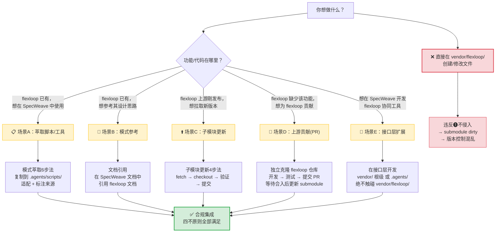
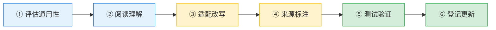
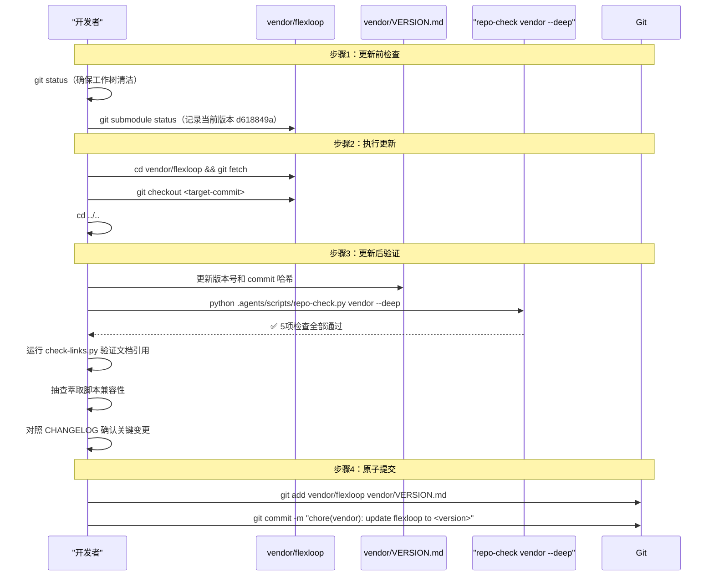
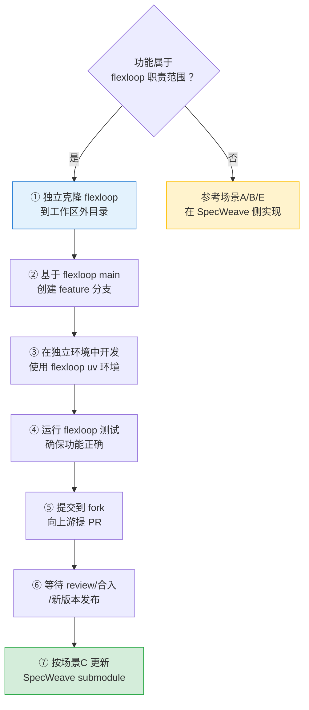

# vendor/flexloop 功能集成方案决策指南

## 背景

SpecWeave 通过 git submodule 引入 flexloop（AgentForge）作为规范参考实现，当前锁定版本为 `v0.7.1-270-gd618849 (d618849a)`。在日常开发中，经常会遇到需要"新增 flexloop 功能"的需求，但根据[三区域边界模型](../../retrospective/patterns/methodology-patterns/governance-strategy/three-zone-boundary-model.md)和[外部依赖四不原则](../../retrospective/patterns/methodology-patterns/governance-strategy/four-negatives-external-dependency.md)，**直接在 `vendor/flexloop/` 内部新增或修改文件是严格禁止的**（违反"不侵入"原则，会导致 submodule permanent dirty，版本控制混乱）。

本文档提供一份决策指南，帮助开发者根据功能类型选择正确的合规集成路径。

## 核心铁律

在做任何与 vendor/flexloop 相关的操作前，必须确认：

> ❌ **绝对禁止**：在 `vendor/flexloop/` 目录内创建、修改、删除任何文件
> ❌ **绝对禁止**：通过 `import vendor.flexloop.xxx` 或 `sys.path.insert` 直接引入运行时依赖
> ❌ **绝对禁止**：`git submodule update --remote` 自动跟踪上游分支
> ❌ **绝对禁止**：仅靠文档约定而无自动化验证

## 方案决策树



## 五种场景的详细操作方案

### 场景 A：萃取脚本/工具（最常用）

**适用场景**：flexloop 里有现成的脚本（如检查器、验证器、工具函数），想在 SpecWeave 中直接调用。

**典型来源**：`vendor/flexloop/apps/chaos/.agents/scripts/` 下的 25+ 验证脚本，如 `check_git_status.py`、`check_py_syntax.py`、`validate_roles.py`、`check_doc_links.py` 等。

**操作流程**（6 步萃取法）：



| 步骤 | 操作要点 |
|------|---------|
| **1. 评估通用性** | 判断脚本是否仅适用于 flexloop 特定场景？是否对 SpecWeave 有跨项目复用价值？仅萃取有普遍价值的内容。 |
| **2. 阅读理解** | 完整阅读原始实现，理解其依赖关系、前置假设、输入输出约定、边界条件处理。确认是否导入 flexloop 特有模块？路径是否硬编码？ |
| **3. 适配改写** | 复制到 [`.agents/scripts/`](../../../.agents/scripts/)，调整命名符合 SpecWeave 风格；修改路径处理使用 [`.agents/scripts/lib/`](../../../.agents/scripts/lib/) 共享库（如 `lib.cli` 输出规范、`lib.project` 路径工具）；移除 flexloop 特有约束和依赖。 |
| **4. 来源标注** | Python 文件头添加 `# Source: vendor/flexloop/apps/chaos/.agents/scripts/xxx.py`；Markdown frontmatter 添加 `source = "..."`；如有重大适配修改，简要说明。 |
| **5. 测试验证** | 在 [`.agents/scripts/tests/`](../../../.agents/scripts/tests/) 编写适配测试；运行测试确认在 SpecWeave 环境中正常工作；确保不依赖 flexloop 特有路径。 |
| **6. 登记更新** | 更新 [`.agents/scripts/README.md`](../../../.agents/scripts/README.md) 索引；运行 `python .agents/scripts/check-duplication.py` 确认无重复代码；如适用更新案例文档。 |

**禁止行为**：
- ❌ `sys.path.insert(0, "vendor/flexloop/...")` 后直接 import
- ❌ `from vendor.flexloop.xxx import yyy`
- ❌ 在 SpecWeave 根目录直接执行 `python vendor/flexloop/.../script.py`（应 cd 到 flexloop 目录用其 uv 环境运行，但仅用于参考测试）
- ❌ 复制脚本后不做适配，保留 flexloop 特有的路径和导入

---

### 场景 B：模式参考（文档级引用）

**适用场景**：想学习 flexloop 的角色设计、规则体系、工作流、架构模式等设计思路，但不需要直接运行其代码。

**典型参考**：`vendor/flexloop/apps/chaos/.agents/rules/`、`vendor/flexloop/apps/chaos/.agents/roles/`、`vendor/flexloop/apps/chaos/.agents/workflows/` 下的规范文件。

**操作方式**：

1. **文档引用**：在 SpecWeave 文档中使用**相对路径**引用 flexloop 文档作为参考：
   ```markdown
   flexloop 的 Python 工程规则详见
   [flexloop Python 规则](../../../vendor/flexloop/apps/chaos/.agents/rules/python.md)
   ```

2. **案例对照**：在 [`.agents/cases/agentforge-adoption.md`](../../../.agents/cases/agentforge-adoption.md) 中添加对照分析表格，说明本体系与 AgentForge 的对应关系。

3. **模式固化**：如果需要将参考模式转化为 SpecWeave 的强制规则，在 SpecWeave 主权区（如 [`.agents/rules/`](../../../.agents/rules/)）新建/修改规则文件，**标注参考来源**。

**关键约束**：
- 使用相对路径，禁止 `file:///` 绝对路径（跨机器/克隆位置会断链）
- 禁止在 flexloop 文档内添加反向链接（保持单向依赖：SpecWeave → flexloop）
- 禁止无标注地整块复制 flexloop 规则文本（信息失同步风险）
- 禁止将 flexloop 的特定实现作为 SpecWeave 的强制标准（两个项目独立演进）

---

### 场景 C：子模块更新（拉取上游新功能）

**适用场景**：flexloop 上游发布了新版本（有新脚本、新特性、重要 bugfix），想将这些更新拉取到 SpecWeave。

**操作流程**（4 步法）：



**关键约束**：
- 采用**固定 commit 锁定策略**，禁止 `branch = main` 配置和 `git submodule update --remote`
- 更新前必须查看 flexloop `CHANGELOG.md`，评估 breaking changes（目录结构变化、脚本接口变更）
- 提交必须**同时包含** gitlink 变更和 [vendor/VERSION.md](../../../vendor/VERSION.md) 更新，保持元数据一致
- 更新后必须运行 `repo-check.py vendor --deep` 执行 5 项深度检查

**版本标识格式**：`v0.7.1-270-gd618849 (d618849a)`（tag + commit 数 + 短哈希 + 完整哈希前缀）

---

### 场景 D：为 flexloop 贡献新功能（上游 PR）

**适用场景**：你发现 flexloop 缺少某个功能，且这个功能**属于 flexloop 的职责范围**（如 AgentForge 框架本身的能力、chaos 应用特有功能），应该贡献给上游而非在 SpecWeave 侧实现。

**操作流程**：



**绝对禁止**：在 `vendor/flexloop/` 内直接修改后提交到 SpecWeave 仓库（这会导致 submodule modified content 永久 dirty，且你的修改无法被 flexloop 上游接受）。

---

### 场景 E：在 SpecWeave 接口层扩展协同工具

**适用场景**：你想在 SpecWeave 中开发与 flexloop 协同的工具或增强现有集成能力，例如：

- 为 `repo-check.py vendor --deep` 增加新的检查项
- 开发批量校验萃取脚本来源标注的工具
- 构建 flexloop 和 SpecWeave 之间的模式同步工具
- 为 flexloop 功能构建 SpecWeave 侧的包装器/适配器

**操作位置**：必须在**接口层**（SpecWeave 主权区内），不得触碰 vendor/flexloop/。

| 工具类型 | 建议存放位置 |
|---------|------------|
| vendor 验证检查项扩展 | [`.agents/scripts/lib/checks/vendor.py`](../../../.agents/scripts/lib/checks/vendor.py) |
| 新增独立验证脚本 | [`.agents/scripts/`](../../../.agents/scripts/) |
| 协同协议/操作指南 | [docs/knowledge/](../) 新增文档 |
| 萃取脚本包装器 | [`.agents/scripts/`](../../../.agents/scripts/)，标注 flexloop 来源 |
| vendor 元数据配置 | [vendor/](../../../vendor/) 根级（README.md、VERSION.md 扩展） |

**示例**：如果要给 `repo-check.py vendor --deep` 增加第6项检查（如"检测过期萃取脚本"），应该修改 [vendor.py](../../../.agents/scripts/lib/checks/vendor.py)，在现有 `_check_*` 函数族中新增 `_check_outdated_extractions()` 方法，而不是修改 vendor/flexloop/ 内的任何文件。

## 快速检查清单

执行任何与 vendor/flexloop 相关的操作前，快速过一遍：

- [ ] 我是否在 vendor/flexloop/ 内创建/修改/删除了文件？（**不应如此**）
- [ ] 我是否直接 import 了 vendor/ 内的 Python 模块？（**不应如此**）
- [ ] 我是否将 vendor/ 路径加入了 sys.path 或 PYTHONPATH？（**不应如此**）
- [ ] 我的 pytest 是否排除了 vendor/ 目录？（**必须排除**）
- [ ] 更新 submodule 后，我是否同步更新了 vendor/VERSION.md？（**必须更新**）
- [ ] `git status vendor/flexloop` 是否显示 clean（无 modified content）？（**必须 clean**）
- [ ] 所有 Markdown 文档引用是否使用相对路径？（**必须使用相对路径**）
- [ ] 萃取的脚本是否标注了 source 来源？（**必须标注**）
- [ ] 我是否在 SpecWeave 环境中运行了 flexloop 测试？（**不应如此**，应在 flexloop 目录和 uv 环境中运行）

## 常见误操作与快速修复

| 误操作 | 后果 | 修复方法 |
|-------|------|---------|
| 在 vendor/flexloop/ 内误创建文件 | submodule dirty | `cd vendor/flexloop && git checkout . && git clean -fd` |
| 萃取脚本保留 flexloop 特有导入 | 运行时 ImportError | 重写导入，使用 `.agents/scripts/lib/` 共享库 |
| 文档引用使用绝对路径 | 跨机器断链 | 替换为 `../../../vendor/flexloop/...` 相对路径 |
| 忘记更新 VERSION.md | 元数据与 gitlink 不一致 | 手动更新版本号和 commit 哈希后重新提交 |
| pytest 收集 vendor/ 测试 | 测试失败/环境污染 | 在 pytest.ini 添加 `norecursedirs = vendor` |

## 参考

- [VENDOR-INTEGRATION.md](../VENDOR-INTEGRATION.md) — flexloop 子模块协同规范（完整版）
- [三区域边界模型](../../retrospective/patterns/methodology-patterns/governance-strategy/three-zone-boundary-model.md) — 外部代码依赖的主权划分模型
- [外部依赖四不原则](../../retrospective/patterns/methodology-patterns/governance-strategy/four-negatives-external-dependency.md) — submodule 管理铁律
- [临时依赖管理协议](../../../.agents/protocols/dependency-management.md) — 依赖管理的协议定义
- [submodule-modified-content 故障排查](../troubleshooting/submodule-modified-content.md) — submodule dirty 状态的根因分析与修复
