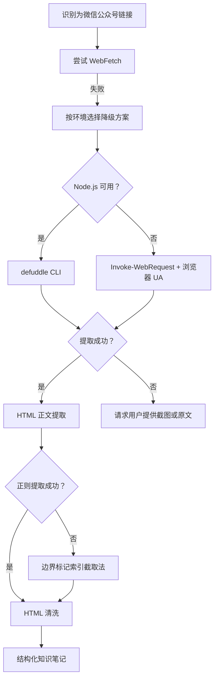

# 微信公众号文章内容提取操作指南

> **适用场景**：需要通过 URL 提取微信公众号文章完整内容的场景，含正文、图片和结构信息。

## 一、核心结论

微信公众号文章因反爬机制限制，**WebFetch 通常无法获取有效内容**。本指南提供**双路径决策模型**——优先按环境选择 `defuddle` CLI（Node.js 可用）或 PowerShell `Invoke-WebRequest + 浏览器 UA`（Windows 原生），两条路径互为兜底；HTML 正文提取阶段以"边界标记索引截取法"作为正则失败时的兜底方案。

两轮独立实践验证：
- **ian-xiaohei（2026-06-25）**：`defuddle` CLI 直接成功，输出 2200+ 字 Markdown
- **claude-tag（2026-06-29）**：`Invoke-WebRequest + 浏览器 UA` 成功获取 3MB HTML，索引截取法提取 47016 字符正文

## 二、决策流程



## 三、工具使用方法

### 3.1 路径 A：defuddle CLI（Node.js 环境）

适用条件：环境支持 Node.js / npx。

```bash
# 基本用法
npx defuddle <微信公众号文章URL>

# 输出为 Markdown 格式
npx defuddle <URL> --format markdown

# 保存到文件
npx defuddle <URL> > output.md
```

**典型调用示例**：

```bash
npx defuddle "https://mp.weixin.qq.com/s/5Hwn3et9k-XtEATC-SDR6A" > article.md
```

**优势**：直接输出 Markdown，自动剥离噪声，对微信公众号页面有优化解析能力。
**劣势**：依赖 Node.js / npx 环境。

### 3.2 路径 B：PowerShell Invoke-WebRequest + 浏览器 UA（Windows 原生）

适用条件：Windows 原生环境，Node.js 不可用或 defuddle 失败时。

```powershell
# 模拟 Chrome 浏览器 UA 绕过反爬
$ua = "Mozilla/5.0 (Windows NT 10.0; Win64; x64) AppleWebKit/537.36 (KHTML, like Gecko) Chrome/120.0.0.0 Safari/537.36"
$response = Invoke-WebRequest -UseBasicParsing -UserAgent $ua -Uri "https://mp.weixin.qq.com/s/<文章ID>"

# 获取原始 HTML（约 3MB）
$html = $response.Content
```

**典型调用示例**（claude-tag 任务实战）：

```powershell
$ua = "Mozilla/5.0 (Windows NT 10.0; Win64; x64) AppleWebKit/537.36 (KHTML, like Gecko) Chrome/120.0.0.0 Safari/537.36"
$response = Invoke-WebRequest -UseBasicParsing -UserAgent $ua -Uri "https://mp.weixin.qq.com/s/ornmjhjRvi7K5TluCDfrsA"
# 状态码 200，返回 3075942 字节 HTML
```

**优势**：无需 Node.js 依赖，Windows 原生 PowerShell 即可运行。
**劣势**：仅返回原始 HTML，需自行处理正文提取与清洗（见第四节）。

### 3.3 各方法对比

| 方法 | 成功率 | 耗时 | 环境依赖 | 说明 |
|------|--------|------|---------|------|
| WebFetch | 低（几乎为 0） | 快速 | 无 | 微信公众号反爬机制拦截，返回空或报错 |
| WebSearch（ID 搜索） | 低 | 中速 | 无 | 文章 ID 通常未被搜索引擎索引 |
| WebSearch（关键词搜索） | 中 | 中速 | 无 | 需要已知文章标题，否则无法构造搜索词 |
| defuddle CLI | 高 | 中速 | Node.js / npx | 对微信公众号页面有优化解析能力，直接输出 Markdown |
| PowerShell `Invoke-WebRequest + 浏览器 UA` | 高 | 中速 | Windows 原生 | 模拟浏览器 UA 绕过反爬，返回原始 HTML 需自行清洗 |
| 用户提供截图/原文 | 高 | 慢 | 无 | 降级方案，依赖用户配合 |

## 四、HTML 正文提取（路径 B 后续处理）

当使用路径 B（Invoke-WebRequest）获取原始 HTML 后，需进行正文提取与清洗。

### 4.1 正则提取（首选，简单场景）

```powershell
# 简单正则提取 id=js_content 的 div 内容
$pattern = '<div[^>]*id="js_content"[^>]*>([\s\S]*?)</div>'
if ($html -match $pattern) {
    $content = $Matches[1]
}
```

**适用场景**：HTML 结构简单，style 属性不含复杂引号嵌套。

**失败场景**：微信公众号正文容器的 `style` 属性可能极其复杂——包含数十条 CSS 规则、大量引号（嵌套引号）、分号、`url()` 函数等，导致正则的 `[^>]*` 部分意外提前闭合，无法正确匹配到容器结束位置。

### 4.2 边界标记索引截取法（正则失败时兜底）

放弃正则，改用基于字符串索引的精确截取法：

```powershell
# 1. 起始边界定位
$startMarker = 'id="js_content"'
$startIdx = $html.IndexOf($startMarker)
if ($startIdx -lt 0) { throw "未找到 js_content 容器" }

# 2. 从起始位置向后找第一个 '>'（容器开始标签结束）
$tagStart = $html.IndexOf('>', $startIdx)
# 3. 结束边界定位：从 tagStart 向后找下一个独立的 </div>
$endIdx = $html.IndexOf('</div>', $tagStart)

# 4. 字符截取
$content = $html.Substring($tagStart + 1, $endIdx - $tagStart - 1)
```

**优势**：对 HTML 结构复杂性完全免疫，仅依赖两个稳定的边界标记（属性名 `id="js_content"` 与闭合标签 `</div>`），适用于任何 style 属性异常的容器节点。

**实战数据**：claude-tag 任务中成功提取 47016 字符正文 HTML。

> 完整流程见 [html-body-extraction.md](html-body-extraction.md)。

### 4.3 HTML 清洗六步流程

| 步骤 | 操作 | 输入 | 输出 |
|------|------|------|------|
| 1 | 段落转换 | `<p>` 标签 | `\n` |
| 2 | 标题转换 | `<h1>` ~ `<h6>` 标签 | `## ` 加标题文本 |
| 3 | 图片占位 | `` 标签 | `[图片]` |
| 4 | 标签剥离 | 所有剩余 HTML 标签 | 纯文本 |
| 5 | 实体解码 | `&nbsp;` 等 HTML 实体 | Unicode 字符 |
| 6 | 空白规整 | 连续换行 | 单一换行 |

**实战数据**：claude-tag 任务中 47016 字符正文 HTML → 4646 字符纯文本。

## 五、失败降级策略

1. **defuddle 返回错误或空内容**：
   - 检查 URL 是否完整有效
   - 确认网络连通性
   - 尝试 `npx defuddle@latest` 使用最新版本
   - 切换至路径 B（Invoke-WebRequest）

2. **Invoke-WebRequest 返回错误或被拦截**：
   - 更换 User-Agent 字符串（尝试不同浏览器 UA）
   - 添加 `Referer` 头模拟来源
   - 切换至路径 A（defuddle CLI）

3. **正则提取失败**：
   - 切换至边界标记索引截取法（见 4.2）

4. **所有自动方法均失败**：
   - 向用户说明情况
   - 请求用户提供以下任一形式的内容：
     - 文章截图
     - 复制粘贴的全文
     - 其他可访问的转载链接

## 六、实战案例

| 项目 | URL | 方法路径 | 结果 |
|------|-----|---------|------|
| Ian Xiaohei Illustrations 学习 | `https://mp.weixin.qq.com/s/5Hwn3et9k-XtEATC-SDR6A` | 路径 A（defuddle CLI） | 提取 2200+ 字完整 Markdown 内容 |
| Claude Tag 文章学习 | `https://mp.weixin.qq.com/s/ornmjhjRvi7K5TluCDfrsA` | 路径 B（Invoke-WebRequest + 索引截取法） | 3MB HTML → 47016 字符正文 → 4646 字符纯文本 |

## 七、关联资源

- [html-body-extraction.md](html-body-extraction.md) — HTML 正文提取操作指南（边界标记索引截取法）
- [defuddle 官方文档](https://github.com/anthropics/defuddle)
- [ian-xiaohei 执行复盘](../../retrospective/reports/competitive-analysis/retrospective-ian-xiaohei-illustrations-learning-20260625/execution-retrospective.md)
- [claude-tag 执行复盘](../../retrospective/reports/competitive-analysis/retrospective-claude-tag-article-learning-20260629/execution-retrospective.md)
