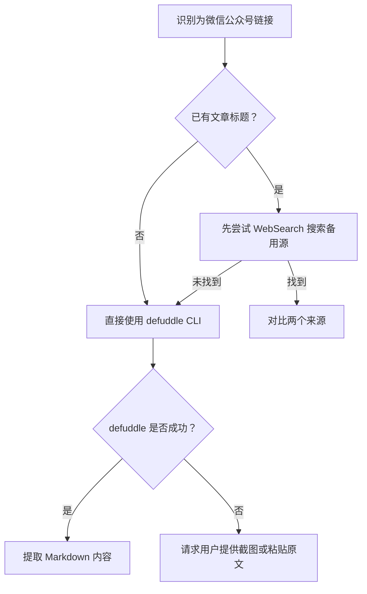

+++
id = "wechat-mp-content-extraction"
date = "2026-06-25"
type = "operations-guide"
source = "docs/retrospective/reports/competitive-analysis/retrospective-ian-xiaohei-illustrations-learning-20260625/execution-retrospective.md#内容获取路径分析"
+++

# 微信公众号文章内容提取操作指南

> **适用场景**：需要通过 URL 提取微信公众号文章完整内容的场景，含正文、图片和结构信息。

## 一、核心结论

微信公众号文章因反爬机制限制，**WebFetch 通常无法获取有效内容**。优先使用 `defuddle` CLI 工具进行内容提取，成功率显著高于其他方法。

## 二、决策流程



## 三、工具使用方法

### 3.1 defuddle CLI

```bash
# 基本用法
npx defuddle <微信公众号文章URL>

# 输出为 Markdown 格式
npx defuddle <URL> --format markdown

# 保存到文件
npx defuddle <URL> > output.md
```

### 3.2 典型调用示例

```bash
npx defuddle "https://mp.weixin.qq.com/s/5Hwn3et9k-XtEATC-SDR6A" > article.md
```

### 3.3 各方法对比

| 方法 | 成功率 | 耗时 | 说明 |
|------|--------|------|------|
| WebFetch | 低（几乎为 0） | 快速 | 微信公众号反爬机制拦截，返回空或报错 |
| WebSearch（ID 搜索） | 低 | 中速 | 文章 ID 通常未被搜索引擎索引 |
| WebSearch（关键词搜索） | 中 | 中速 | 需要已知文章标题，否则无法构造搜索词 |
| defuddle CLI | 高 | 中速 | 对微信公众号页面有优化解析能力 |
| 用户提供截图/原文 | 高 | 慢 | 降级方案，依赖用户配合 |

## 四、失败降级策略

1. **defuddle 返回错误或空内容**：
   - 检查 URL 是否完整有效
   - 确认网络连通性
   - 尝试 `npx defuddle@latest` 使用最新版本

2. **所有自动方法均失败**：
   - 向用户说明情况
   - 请求用户提供以下任一形式的内容：
     - 文章截图
     - 复制粘贴的全文
     - 其他可访问的转载链接

## 五、实战案例

| 项目 | URL | 方法 | 结果 |
|------|-----|------|------|
| Ian Xiaohei Illustrations 学习 | `https://mp.weixin.qq.com/s/5Hwn3et9k-XtEATC-SDR6A` | WebFetch → 失败；defuddle CLI → 成功 | 提取 2200+ 字完整 Markdown 内容 |

## 六、关联资源

- [defuddle 官方文档](https://github.com/anthropics/defuddle)
- [执行过程复盘](../../retrospective/reports/competitive-analysis/retrospective-ian-xiaohei-illustrations-learning-20260625/execution-retrospective.md)
