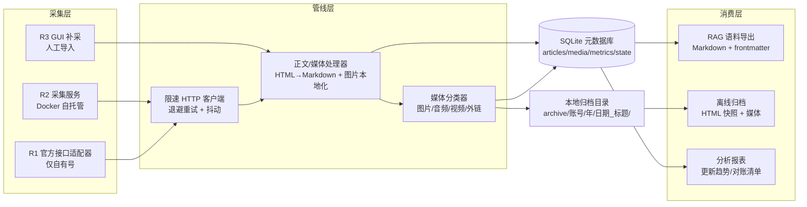

# 微信公众号全量内容归档技术方案与选型

> **适用场景**：需要获取一个或多个指定微信公众号（自有或第三方）的**全部历史文章**，含正文、图片、音视频等富媒体，并支持按周期增量更新，最终以离线归档、RAG 语料、分析报表三种形态消费。
>
> 若你只需要提取**已知单篇 URL** 的正文，请改用 [微信公众号文章内容提取操作指南](wechat-mp-content-extraction.md)；本文解决的是「如何拿到一个号的全部文章清单并持续归档」这一更高层级的问题。

## 一、核心结论

| 决策 | 结论 |
|---|---|
| 主路线 | **R2：私有部署开源采集工具 + Python 薄管线**（Docker 自托管，浏览器扫码授权，数据完全落地本地/NAS） |
| 兜底/交叉验证 | **R3：`wechatDownload` GUI 工具**（富媒体下载能力强，用于补采与对账） |
| 条件补充 | **R1：微信官方「获取已发布文章」接口**，仅对拥有 AppID/AppSecret 且配置了 IP 白名单的**自有认证订阅号/服务号**启用 |
| 本期不采用 | **R4：商业 SaaS/数据服务**（持续付费、数据过第三方、条款风险） |
| 承载工具裁决 | R2 路线内有两个强候选（见第四节），在环境自检（doctor）阶段以「能否扫码登录 + 能否取到目标号文章列表」实测裁决 |

路线级选型已于 2026-09-24 由用户在 Spec 审批门确认。选型依据与完整验收标准见仓库内规格文档 `.trae/specs/wechat-mp-content-archiver/spec.md`。

## 二、问题边界与平台技术约束

### 2.1 采集对象

- **文章**：标题、作者、发布时间、原文链接、正文 HTML/Markdown、封面与正文图片；
- **富媒体**：图片（必选）、音频 `mpvoice`、视频（含已迁移到「视频号」的内容）、附件与外链（条件性）；
- **互动数据**：阅读量、点赞、评论等（**条件性**，见 2.3）；
- **持续更新**：按周期增量抓取新文章，并对采集失败项重试对账。

### 2.2 微信平台的关键技术事实（2026-09 核实）

1. **公众号的唯一标识是 `__biz`**（Base64 编码串）。文章链接形如 `https://mp.weixin.qq.com/s?__biz=xxx&mid=yyy&idx=zzz&sn=...` 或短链 `/s/<sn>`；文章在公众号后台侧的唯一键为 `__biz + mid + idx`，公开侧可用 `sn`。
2. **单篇文章页是公开可读的**：携带浏览器 User-Agent 直接请求 `/s/<sn>` 可拿到完整 HTML（正文容器为 `id="js_content"`），无需登录。这是所有归档管线「下载正文」环节的基础，单篇提取的工程经验见 [wechat-mp-content-extraction.md](wechat-mp-content-extraction.md)。
3. **历史文章列表不是公开资源**：获取一个号的历史发文列表必须调用微信公众平台网页端接口，请求中需要短期凭证 `key`、`pass_ticket`、`uin` 等参数。这些参数来自「登录微信公众平台网页版后的会话」或「微信客户端内打开公众号主页」的网络请求，**有效期短（社区实测约数小时至数天，网页扫码授权通常约 4 天）**，过期需重新扫码，无法用固定 API Key 一劳永逸。
4. **微信官方开放接口（服务端 API）路径**：
   - 接口为 `freepublish/batchget`（获取已发布文章），凭 AppID/AppSecret 换取 access_token 调用；
   - **只能获取「授权该接口的那个公众号自己」的已发布内容**，不能用来拉取任意第三方公众号；
   - 个人/未认证主体的订阅号在 2025 年后进一步收紧，部分历史接口不再可用；调用受额度限制（社区资料：每日调用上限与每次返回条数均有配额，具体以官方「接口调用频次/限额说明」页为准）；
   - 调用端出口 IP 必须加入公众号后台的 **IP 白名单**。
5. **互动数据无公开接口**：阅读量、在看、评论数不出现在官方发布接口中，只能通过带登录态请求文章页或专用接口拿到，属于灰色地带且登录态更容易触发风控（见 [反爬虫策略手册](../anti-crawler-strategy-playbook.md)）。

> 含义：「全量归档第三方公众号」在工程上必然依赖**短期登录态 + 网页端接口**，任何方案都绕不开「周期性扫码续期」这一动作；区别只在于这一动作被封装得多深、配套的限速与重试做得多稳。

## 三、四条技术路线对比

### 3.1 对比矩阵

| 维度 | R1 官方发布接口 | R2 私有部署开源工具（主路线） | R3 GUI 工具（兜底） | R4 商业 SaaS/数据服务 |
|---|---|---|---|---|
| 典型代表 | `freepublish/batchget` | wechat-article-exporter、wechat-download-api | wechatDownload | 各类公众号数据/导出 API 服务商 |
| 适用对象 | **仅自有认证号** | 自有 + 第三方任意号 | 自有 + 第三方任意号 | 任意号（服务商声称） |
| 历史全量 | 受接口开放范围/时间点限制 | 支持（网页端翻页） | 支持 | 视服务商库存 |
| 富媒体 | 仅素材接口范围内 | 图片完善；音视频按工具能力分类处理 | 音视频下载能力强 | 多数仅文本/图片 |
| 互动数据 | 无 | 条件性（需额外凭证） | 部分支持 | 部分服务商提供 |
| 增量更新 | access_token 自动刷新，可全自动 | 凭证约 4 天过期，**需周期扫码续期** | 手工触发为主 | 服务商托管 |
| 部署成本 | 低（HTTP 调用） | 中（Docker + 一次扫码） | 低（桌面安装） | 零（注册付费） |
| 数据归属 | 本地 | **完全本地**（核心诉求） | 本地 | 过第三方服务器 |
| 金钱成本 | 免费 | 免费 | 免费 | 订阅费/按次计费 |
| 主要风险 | 用错对象导致期望落空 | 凭证过期、接口变动、风控 | 人工操作、难以规模化 | 条款变动、数据合规、长期支出 |
| 本期定位 | 条件补充 | **主路线** | 兜底/对账 | 不采用 |

### 3.2 各路线操作门槛、凭证续期与失效模式

#### R1：官方「获取已发布文章」接口

- **门槛**：拥有认证订阅号/服务号；后台「设置与开发 → 基本配置」取得 AppID/AppSecret；将采集机出口 IP 加入 IP 白名单。
- **凭证时效与续期**：access_token 有效期 2 小时，可用 `token` 接口程序化刷新并集中缓存，可实现全自动。
- **典型失效模式**：① 误以为可拉取第三方号（实际只能拉本号）；② 出口 IP 变动导致白名单校验失败（错误码 40164 一类）；③ 个人号/未认证号接口不可用；④ 超出每日调用配额。
- **结论**：对自有号是最稳的补充数据源，可与 R2 结果交叉对账；不承担第三方号采集职责。

#### R2：私有部署开源工具（主路线）

- **门槛**：本机/NAS 可运行 Docker（或 Node.js/Python 运行时）；一个**可登录微信公众平台网页版的个人微信或公众号管理员微信**用于扫码；网络可访问微信域名。
- **凭证时效与续期**：扫码后获得网页端会话凭证（`cookie`/`token`/`key`/`pass_ticket` 一类），社区与工具文档实测有效期**约 4 天**，过期需重新扫码。工程缓解：工具提供登录态本地持久化、过期前 Webhook 提醒；归档管线将「凭证状态」纳入 `doctor` 自检，过期时只阻断「取列表」，**已入库文章的正文/媒体补采不受影响**。
- **典型失效模式**：① 凭证过期未续期 → 列表接口 401/重定向（表现为抓不到新文，历史数据不丢）；② 微信调整网页端接口参数或加密 → 依赖工具发版跟进；③ 高频请求触发风控（验证码/临时封禁）→ 必须保守限速、抖动、可选代理；④ 图片/视频 CDN 防盗链 → 需带 Referer 或经图片代理；⑤ 部分视频已迁移视频号 → 只能登记外链，无法直接拿到媒体文件。
- **合规**：私有部署、仅调用自己授权的会话、数据不出本机；仍须遵守仅个人归档使用、不二次分发的自律边界（见第六节）。

#### R3：GUI 工具（兜底/交叉验证）

- **门槛**：桌面环境安装；同样需要登录态获取（部分工具内置扫码或从微信客户端抓包）。
- **凭证时效与续期**：跟随工具内置会话，多为人工重新登录。
- **典型失效模式**：① 批量/无人值守能力弱；② 版本跟进不及时时接口失效；③ 输出目录/命名固定，需二次清洗。
- **价值**：在 R2 某个富媒体类型（音频、视频）下载失败时做单点补采；用其导出结果与主库做篇数/文件对账。

#### R4：商业 SaaS/数据服务

- **门槛**：注册、付费，部分要求提交目标清单等待交付。
- **失效模式**：服务商接口/价格/条款随时变动；归档内容经第三方存储；部分货源本身游走在爬取灰色地带，企业使用存在合规瑕疵。
- **结论**：与「数据完全本地化、NAS 长期归档」的核心诉求冲突，本期不采用；仅在 R1–R3 全部不可用且有预算时作为一次性历史补全手段重新评估。

## 四、R2 承载工具候选（doctor 阶段实测裁决）

两个候选原理相同（都基于微信公众平台网页端接口 + 扫码会话），同属 R2 路线，**不改变路线级决策**；差异在工程形态。以下事实来自工具公开文档，核实日期 2026-09-24，部署后以本地实测为准。

### 4.1 候选 A：wechat-article-exporter

- 仓库：`https://github.com/wechat-article/wechat-article-exporter`（社区资料星标约 6.8K；旧路径 `jooooock/wechat-article-exporter` 已迁移至该组织）。
- 形态：Nuxt/Vue 全栈应用，浏览器 UI 为主，服务端转发微信接口并附带图片代理；支持 Docker 部署；可导出 HTML/JSON/Excel/TXT，支持公众号搜索（biz 搜索）、合集/专辑；评论等互动数据需提供额外凭证；具备开放接口可供程序调用。
- 适配点：成熟度高、文档与教程丰富、用户量大；偏「人用 UI 操作」，自动化管线需对接其开放接口或导出文件。

### 4.2 候选 B：wechat-download-api（2026-09 新证据，API-first）

- 仓库：`https://github.com/tmwgsicp/wechat-download-api`（文档更新于 2026-09-21，许可证 AGPL-3.0；另有 SaaS 托管版，自用选择私有部署即可）。
- 形态：**API 优先的服务端应用**（端口 5000，Swagger/ReDoc 在线文档），Docker 镜像支持 `linux/amd64` 与 `linux/arm64`（对树莓派/NAS 友好）。
- 公开文档声明的关键能力：扫码登录（凭证自动保存、约 4 天有效，过期前 24h/6h Webhook 预警）、获取任意公众号历史文章列表（分页/关键词）、公众号搜索取 FakeID、正文与图片列表、**Markdown 导出（带 YAML frontmatter，图片走代理可直接渲染）**、**按时间游标增量同步全部文章**、图片代理、RSS 输出、内置 MCP 工具、反风控（TLS 指纹模拟 + SOCKS5 代理池轮转 + 三层限频）。
- 适配点：与「Python 薄管线 + 增量同步 + RAG 语料」诉求高度重合，几乎是为程序化归档设计；AGPL-3.0 对**自用私有部署无影响**，但若未来对外提供服务需履行开源义务。
- 使用前提与 R2 一致：需要拥有一个微信公众号（订阅号/服务号均可），由公众号管理员微信扫码登录公众平台网页版。

### 4.3 候选 C（兜底）：wechatDownload

- 仓库：`https://gitee.com/sniffervip/WechatDownload`（v4.x，活跃，文档完善）。
- 形态：桌面 GUI（.NET），音频/视频/PDF/逐篇批量下载与命名模板能力强；作为 R3 承载，负责富媒体补采与导出对账。

### 4.4 裁决标准（Task `mp-archiver doctor`）

私有部署后依次验证：① 服务健康检查通过；② 扫码登录成功并持久化凭证；③ 能用公众号名称/`__biz` 取到**目标号**的历史文章列表（条数与 UI 端肉眼计数一致）；④ 可取单篇正文与图片；⑤ 增量游标/翻页可用。候选 B 通过则优先作为管线主适配；候选 A 作为交叉验证；两者任一通过即满足 R2 可用性，接口差异封装在采集器适配层内。

## 五、目标归档架构（摘要）

- **元数据库**：SQLite 五表（articles / media / comments / metrics / sync_state），文章唯一键 `__biz+mid+idx`（缺失时退化为 `sn`）；采集状态枚举 `pending / downloaded / failed / skipped / skipped_no_credential / external_ref`。
- **目录约定**：`archive/<account_alias>/<YYYY>/<YYYY-MM-DD_title>/`，媒体入子目录，正文同时保留原始 HTML 快照与转换后的 Markdown。
- **韧性**：全量可断点续采（状态机驱动）、失败可重试、凭证缺失只影响列表获取不影响存量补采；保守限速参数全部可配置。
- **安全**：凭证只走环境变量/`.env`（`.gitignore`），日志对 token/cookie/key 脱敏；禁止把凭证写入仓库或报表。

实现代码落位 `apps/wechat-mp-archiver/`，任务拆解见 `.trae/specs/wechat-mp-content-archiver/tasks.md`。

## 六、合规与安全边界

1. **用途自律**：归档内容仅限个人学习、研究与本地 RAG 使用；不公开再分发、不商用转载、不重建替代性公众号内容服务。
2. **尊重版权**：正文与媒体的著作权归原作者/公众号主体所有；对外引用遵循合理使用并标注出处与链接。
3. **访问克制**：仅使用自己授权获得的登录态，不共享账号、不转售凭证、不扩散抓取数据；默认保守限速，避免对平台造成压力。
4. **数据最小化**：默认不采集评论者个人信息；确需互动数据时只存公开计数与必要内容，并在报表中脱敏。
5. **凭证安全**：AppSecret、cookie、token 等只存环境变量或本地受控文件，日志脱敏，不进入版本库。
6. **工具许可证**：以 R2 候选 B（AGPL-3.0）为承载时，私有自用无开源义务；一旦改造后对外提供网络服务，须按 AGPL 履行相应开源义务。

## 七、信源清单与核实记录

| 事实 | 信源 | 核实日期 |
|---|---|---|
| 官方已发布文章接口 `freepublish/batchget` 的参数、返回结构与适用对象 | 微信官方文档 `developers.weixin.qq.com/doc/offiaccount/...`（发布能力/获取已发布文章页） | 2026-09-24 |
| 接口调用频次限制、access_token 机制 | 微信官方文档「接口调用频次/限额说明」「获取 access_token」页 | 2026-09-24 |
| 第三方号历史列表依赖 `__biz`/`key`/`pass_ticket` 短期凭证 | 公开技术原理拆解文章（lijinma.com，2026-03）与多份实测教程交叉印证 | 2026-09-24 |
| exporter 功能、导出格式、登录与代理机制 | 项目仓库 README（GitHub 组织页及 Gitee 镜像）+ 2026-09 实测教程 | 2026-09-24 |
| wechat-download-api 部署、增量游标、MD 导出、凭证 4 天与 Webhook 预警 | 项目公开文档（经 LobeHub 收录页核对），更新日期 2026-09-21 | 2026-09-24 |
| wechatDownload 富媒体与批量能力 | Gitee 仓库 README 与版本说明 | 2026-09-24 |
| 单篇文章页公开可读、正文容器 `js_content` 与双路径提取法 | 本库两轮实战复盘，见 [wechat-mp-content-extraction.md](wechat-mp-content-extraction.md) | 2026-06 |

> 平台接口与开源工具均会变动；正式开发前以私有部署版本的实际行为为准（doctor 自检输出留档），文档随 Task 3 实测结果回填修订。

## 八、关联资源

- [微信公众号文章内容提取操作指南](wechat-mp-content-extraction.md) — 已知单篇 URL 的正文提取（defuddle / Invoke-WebRequest 双路径 + 边界截取法）
- [反爬虫策略手册](../anti-crawler-strategy-playbook.md) — 限速、退避、代理与风控应对原则
- [HTML 正文提取操作指南](html-body-extraction.md) — 边界标记索引截取法
- 项目规格与任务：`.trae/specs/wechat-mp-content-archiver/spec.md`、`tasks.md`
