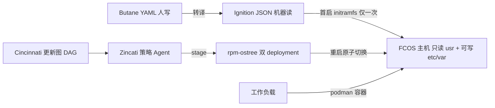

# Fedora CoreOS 系统性知识分析

> 一句话摘要：Fedora CoreOS 把主机重构为「只读镜像 + 一次性置备契约 + 协议化灰度更新」的容器专用 OS；本文按方法论编排 **R（事实）→ G1 → I（洞察）→ E（模式）→ V（对抗）→ G2/G3** 的链路产出，所有结论可回溯到一手信源。

- **编排 session**：`sc-20260915-fedora-coreos`
- **场景与链路**：场景 4 知识沉淀，`R→I→E→V→C（入库）`，depth=deep（V 执行两轮）
- **信源访问日**：2026-09-15；采集时点三条流均基于 Fedora 44，stable 最新发布 `44.20260817.3.2`

---

## 1. 一分钟画像

Fedora CoreOS（FCOS）是 Fedora Project 下的**自动更新、最小化、单体式、面向容器的操作系统**，为集群设计、亦可单机运行 [S01]。它是 CoreOS Container Linux 与 Fedora Atomic Host 两者的官方继任者：继承前者的置备工具（Ignition）与自动更新模型、后者的打包技术（rpm-ostree/OSTree）与 SELinux 机制 [S42]。FCOS 是 RHEL CoreOS 的上游基座，OKD 默认以 FCOS 为控制面/工作节点 OS，Podman Machine、Typhoon、Magnum、Quay.io 等亦在使用 [S06][S21]。



---

## 2. R 阶段：客观事实清单（F-001 ~ F-077）

> G1 已通过：纯客观陈述、无因果词、每条附信源编号（信源 URL 见 [§9 信源清单](#9-信源清单)）；信源未给出精确值的点显式标注。

### 2.1 A 组：定位与血统

| 编号 | 事实 | 来源 |
|---|---|---|
| F-001 | 官方自我定位为「automatically updating, minimal, monolithic, container-focused operating system, designed for clusters but also operable standalone」，属 Fedora Project 开源项目 | [S01][S06] |
| F-002 | GA 公告声明 FCOS 同时是 Fedora Atomic Host 与 CoreOS Container Linux 的继任者，组合 Container Linux 的置备工具与自动更新模型、Atomic Host 的打包技术/OCI 支持/SELinux | [S42] |
| F-003 | 首个 preview release 于 2019-07-24 在 Fedora Magazine 宣布 | [S41] |
| F-004 | 2020-01-17 宣布 available for general use；首个正式版本基于 Fedora 31（Linux 5.4、systemd 243、Ignition 2.1、Podman 1.7、Moby 18.09），当时 cgroups v1 默认 | [S42] |
| F-005 | 官方迁移文档称 FCOS 为 Container Linux 的 official successor；Container Linux 于 2020-05-26 EOL | [S18] |
| F-006 | Fedora Atomic Host 已 EOL；FAH 用 cloud-init 置备、FCOS 用 Ignition，两者无自动转换工具 | [S19] |
| F-007 | FCOS 是自由社区发行版、RHEL CoreOS 的 upstream basis；RHCOS 面向 OpenShift、随 OpenShift 发布与生命周期管理 | [S06] |
| F-008 | OKD 默认以 FCOS 作为 control plane 与 worker 节点 OS；OKD 的 Machine Config Operator 负责集群内 FCOS 节点更新 | [S21][S06] |
| F-009 | Podman Machine（含 Windows/macOS 本地容器场景）、Typhoon、OpenStack Magnum、oVirt、Quay.io 均在使用 FCOS | [S21] |
| F-010 | rpm-ostree 是 FCOS 及 RHEL CoreOS 的底层更新机制，亦用于 Fedora IoT 与 Fedora Silverblue，前身为 Project Atomic 组件 | [S22] |
| F-011 | rpm-ostree 手册 NOTE：上游开发重心已转向 bootc、dnf5 及周边；rpm-ostree 在多项目/产品中广泛使用并继续受支持，可启动容器新主功能落在 bootc/dnf 生态 | [S22] |
| F-012 | FAQ：Fedora Bootc 面向 bootable containers，目标是 FCOS 最终在技术与生态层面构建于 Fedora Bootc 之上，路线图登记在 tracker issue #1726 | [S06][S33] |
| F-013 | FCOS 与 CentOS Stream CoreOS（SCOS）关系、PlumbingOS：限定的五类信源中**未检索到** FCOS 团队的专门陈述（信源未给出） | — |

### 2.2 B 组：版本与更新流

| 编号 | 事实 | 来源 |
|---|---|---|
| F-014 | 三条生产流：`stable`（内容经 testing 停留后进入）、`testing`（代表下一个 stable，定期更新）、`next`（试验新特性与下一个 Fedora 大版本 rebase） | [S03] |
| F-015 | 更新沿 `next → testing → stable` 流动；官方建议少量节点运行 testing/next 以提前暴露回归 | [S03] |
| F-016 | 切换流的官方方式：停 zincati.service 后 `rpm-ostree rebase "ostree-image-signed:docker://quay.io/fedora/fedora-coreos:${STREAM}"`，重启后跟随新流 | [S03] |
| F-017 | tracker Design.md：流节奏「not contractual, but will initially have two weeks between releases」；stable 软件包最多可能滞后四周；紧急修复可 out-of-cycle 入流 | [S32] |
| F-018 | Fedora 大版本 rebase 固定编排：Beta 时 next 切新版本；Final Freeze 时 next 改每周发布；GA 当周（Week 0）stable 仍基于 N-1；Week 2 stable 完成 rebase，testing 与 next 同步 | [S32] |
| F-019 | 版本号 `X.Y.Z.A`：X=Fedora 主版本，Y=包集日期戳，Z=构建代码（1=next/2=testing/3=stable），A=同参数构建修订号 | [S06] |
| F-020 | 每条流有 JSON stream metadata 规范 URL（如 `https://builds.coreos.fedoraproject.org/streams/stable.json`），自动化安装应与 metadata 交互，官方提供 stream-metadata-go 库 | [S08][S02] |
| F-021 | 采集日 stable metadata（last-modified 2026-09-04T18:44:22Z）当前发布 44.20260817.3.2；下载页并列 testing 44.20260817.2.1、next 44.20260817.1.1 | [S36][S40] |
| F-022 | 支持四种处理器架构：x86_64、aarch64、s390x、ppc64le | [S40] |

### 2.3 C 组：OSTree / rpm-ostree 机制

| 编号 | 事实 | 来源 |
|---|---|---|
| F-023 | FCOS 通过 OSTree deployments 提供原子更新与回滚；rpm-ostree 管理磁盘上多个 deployment 并在启动时切换；Zincati 负责检查并应用更新 | [S04] |
| F-024 | rpm-ostree 是 hybrid image/package system：以 libostree 为镜像格式、同时接受 RPM（共享 libdnf 代码）；事务化/后台/校验和升级；rollback 作用于 `/usr`，不涉及 `/etc`、`/var`；RPM 数据库在 `/usr/share/rpm` | [S22] |
| F-025 | `/etc`、`/var` 以读写挂载；deployment 变更不覆盖用户对 `/etc` 的修改，升级/回滚不动 `/var`；出厂默认配置在 `/usr/etc/` | [S06][S11] |
| F-026 | `rpm-ostree install` 做客户端包分层，写入新 deployment、重启生效；官方定位为 OS「extensions」（驱动、VPN 等），总体优先用容器 | [S12] |
| F-027 | 更新后上一 deployment 保留；临时回滚=启动时 Shift 进 GRUB 选旧条目；永久回滚=先停 zincati 再 `rpm-ostree rollback -r` | [S13] |
| F-028 | 默认文件系统 XFS；裸金属与云镜像用同一套固定分区布局；x86_64 双 EFI/BIOS；单一根分区；不用 Anaconda；Ignition 首启改布局；LVM 支持但默认不启用 | [S32][S10] |
| F-029 | 根文件系统至少 8 GiB；2021 年 6 月起，小于 8 GiB 且其后另有分区时系统拒绝启动 | [S10] |
| F-030 | bootupd 包含在 FCOS 中；`bootloader-update.service` 默认自动更新 bootloader（ESP 与 BIOS MBR），亦可 `bootupctl status/update` 手动操作 | [S14] |
| F-031 | 自 Fedora 42 起更新内容传输从 OSTree repo 切换为经 Quay.io 分发的 OCI 镜像：next 42.20250316.1.0（2025-03-18）、testing 42.20250705.2.0（2025-07-06）、stable 42.20250803.3.0（2025-08-19）；存量机器经一次 barrier release 迁移 | [S05] |

### 2.4 D 组：Zincati 自动更新

| 编号 | 事实 | 来源 |
|---|---|---|
| F-032 | Zincati 是 FCOS 主机 auto-update agent，作为 Cincinnati 与 rpm-ostree 客户端自动更新/重启；支持分阶段 rollout、TOML dropin、多种策略、每周维护窗口、Prometheus 指标、rollout wariness/barriers/dead-ends | [S23] |
| F-033 | Cincinnati 向客户端提供 update hints（经验来自 Google Omaha）；更新路径为 DAG（节点=发布，边=合法转换）；客户端 `GET /v1/graph`（`Accept: application/json`），须带 basearch、stream，可带 node_uuid/os_version/group/rollout_wariness/platform | [S27] |
| F-034 | Zincati 周期轮询 Cincinnati，发现更新后经 rpm-ostree 暂存并重启原子生效；phased rollout 由后端随时间调整可见比例，默认动态分配 rollout score | [S24] |
| F-035 | `rollout_wariness` 为 0.0（最积极）~1.0（最谨慎）；可配少量 canary 节点取 0.0 最先接收；默认/推荐不设静态值、交后端决定 | [S24] |
| F-036 | 重启最终化策略三种：`immediate`（默认，暂存后立即重启）、`fleet_lock`（重启前经 FleetLock HTTP 协议取递归锁，重启后 unlock；官方实现 airlock 基于 etcd3）、`periodic`（仅允许在按周 UTC 维护窗口内重启） | [S25] |
| F-037 | 官方策略名仅上列三种，**无**「Permissive/Sticker」命名（信源无记载）；维护窗口属性为 days/start_time(hh:mm)/length_minutes，可跨日跨周 | [S25] |
| F-038 | 更新有按发布时间严格升序的 age index，多目标时优先较新者，并默认阻止自动降级；`[updates] allow_downgrade = true` 可显式开启 | [S24] |
| F-039 | 禁用自动更新：`/etc/zincati/config.d/90-disable-auto-updates.toml` 写 `[updates] enabled = false`（服务保持 idle 供观察）；亦可 stop/disable zincati.service | [S24][S13] |
| F-040 | Zincati 配置为 TOML dropin 按文件名合并：`/usr/lib/zincati/config.d/`（发行版只读）→ `/etc/zincati/config.d/`（管理员）→ `/run/zincati/config.d/`（运行时不持久），后序覆盖前序 | [S26] |
| F-041 | 全部二进制产物/ostree commit/OS 镜像 GPG 签名；每个 Fedora 大版本周期生成新密钥；换密钥时更新图设置 update barrier，旧实例必须先升到带新密钥的中间 barrier 版本（示例 32.20200907.3.0）才能继续 | [S17] |
| F-042 | 跳过更新流（rebase）可能因跳过 barrier 引入回归，出现回归时应人工 rollback | [S03] |
| F-043 | Live ISO/PXE 内存环境不运行 Zincati，不支持原地自动更新，建议定期刷新 PXE/ISO 镜像并重启实例 | [S16] |
| F-044 | greenboot 与部署健康门控：FCOS 文档站与 Zincati 手册中**无** greenboot 条目/健康门控说明（信源未给出）；失败处理路径为保留并人工选择旧 deployment；`rpm-ostree pin` 命令在已采集官方页面未出现 | [S13][S25] |

### 2.5 E 组：Ignition / Butane 置备

| 编号 | 事实 | 来源 |
|---|---|---|
| F-045 | Ignition 在 initramfs 阶段操作磁盘（分区/格式化/写文件与 systemd unit/配置用户）；官方原文「runs only once during the first boot of the system (while in the initramfs)」 | [S07][S28] |
| F-046 | Ignition 当前同时接受 Ignition JSON 与 Butane YAML（启动时自动转译）；已知使用者：FCOS、RHCOS、Flatcar、openSUSE MicroOS、SLE Micro | [S28] |
| F-047 | Butane（前身 FCCT，Fedora CoreOS Config Transpiler）把 YAML 转为 Ignition JSON；`fcos` variant 稳定 spec 为 v1.0.0–v1.7.0，另有 v1.8.0-experimental | [S29][S31] |
| F-048 | Butane 与 Ignition spec 一一对应：1.0.0→3.0.0 … 1.6.0→3.5.0、1.7.0→3.6.0、1.8.0-experimental→3.7.0-experimental（1.3.0→3.2.0） | [S31] |
| F-049 | FCOS 仅支持 Ignition spec 3.0.0 及以上，与 2.x.y 不兼容（多数配置仅需小改） | [S32] |
| F-050 | FCOS 用 Ignition 置备、不支持既有 cloud-init 配置；无独立安装盘，实例从通用磁盘镜像启动、首启经 Ignition 定制；云经 user-data、裸金属经磁盘或远程源取配置 | [S06][S02] |
| F-051 | 默认用户 `core`；官方称「no hard-coded default credentials」；默认禁用 SSH 密码登录、推荐注入公钥；console 密码登录可单独配置 | [S02][S19] |
| F-052 | Butane 分发：容器镜像 `quay.io/coreos/butane:release`（推荐，release 跟踪最新正式版）、Fedora 仓库 dnf、Homebrew/MacPorts/Scoop/winget、GitHub releases（附分离 GPG 签名） | [S07][S30] |
| F-053 | 平台元数据组件为 Afterburn（Container Linux 时期称 coreos-metadata），变量前缀 `COREOS_`→`AFTERBURN_`；平台标识经内核参数 `ignition.platform.id` 传入（aws/metal/qemu 等） | [S18][S09] |

### 2.6 F 组：运行时与安全

| 编号 | 事实 | 来源 |
|---|---|---|
| F-054 | SELinux 自带并以 enforcing 启用；不支持禁用、不建议整系统 permissive，可对单应用加载 CIL permissive 策略；系统不含 `semanage` | [S11] |
| F-055 | 默认同时装 docker CLI（Moby 提供）与 podman；Podman 是推荐运行时，rkt 不随附；不应同时用 docker 与 podman 跑容器；docker.service 默认 disabled、docker.socket 默认激活 | [S15][S06][S18] |
| F-056 | Podman v4→v5 随 Fedora 40 rebase 入流（next 2024-03-24 / testing 2024-04-22 / stable 2024-05-07）；CNI 移除，Netavark 唯一支持，Pasta 为 rootless 默认网络后端 | [S05] |
| F-057 | systemd v256 禁用 cgroups v1，随 Fedora 41 入流（next 2024-09-16 / testing 2024-10-28 / stable 2024-11-08）；曾显式 opt-out cgroups v2 的系统升级后无法启动，需先 `rpm-ostree kargs --delete=systemd.unified_cgroup_hierarchy` | [S05][S34] |
| F-058 | 相对 Container Linux：网络用 NetworkManager（非 systemd-networkd）、时间同步 chronyd（非 ntpd/timesyncd）、默认文件系统 ext4→XFS；etcd/flannel/rkt/locksmith 不随附（重启协调并入 Zincati、回滚归 rpm-ostree+GRUB）；sshd 默认开机而非 socket activation | [S18] |
| F-059 | 镜像按最小化维护、默认不含全部排障工具，官方建议用 Toolbx 容器排障；基础 OS 之外软件以容器安装，包分层保留但不鼓励 | [S06] |
| F-060 | 默认在存在漏洞的处理器上配置内核自动禁用 SMT；默认不在串口/VGA 控制台启用 autologin | [S32] |
| F-061 | `systemd-repart.service` 默认被 mask（仅支持 Ignition 创建分区/文件系统/挂载）；`dnsmasq.service` 默认被 mask（包保留给 NetworkManager/podman 内部使用） | [S06] |
| F-062 | 自 Fedora 36 rebase 起迁移到 iptables 的 nft 后端；iptables-legacy 后端在 Fedora CoreOS 43 及以后已移除 | [S05][S20] |
| F-063 | `/etc/os-release` 以 `ID=fedora` 与 `VARIANT_ID=coreos` 标识自身 | [S32] |

### 2.7 G 组：平台与镜像

| 编号 | 事实 | 来源 |
|---|---|---|
| F-064 | x86_64 平台含 aliyun/aws/azure/azurestack/digitalocean/exoscale/gcp/hetzner/hyperv/ibmcloud/kubevirt/libvirt/metal/nutanix/applehv/openstack/oraclecloud/proxmoxve/qemu/virtualbox/vmware/vultr；aarch64 含 aws/metal/qemu/openstack；s390x 含 ibmcloud/metal/qemu/openstack | [S09] |
| F-065 | VMware 镜像 hardware version 17（ESXi 7.0+/Fusion 12+/Workstation 16+）；裸金属支持 BIOS、UEFI、网络引导及标准/4K Native 磁盘 | [S09] |
| F-066 | x86_64 磁盘镜像为混合 BIOS/UEFI 结构；例外 metal4k 不含 BIOS boot 分区、仅 UEFI | [S06] |
| F-067 | 提供完整 live 环境可从 RAM 运行，支持 ISO/PXE/iPXE；PXE 三件套 live-kernel/live-initramfs.img/live-rootfs.img；用 `coreos.live.rootfs_url` 时至少 2 GiB RAM，否则至少 4 GiB；ISO 可 `coreos-installer iso customize` 嵌入 Ignition | [S16] |
| F-068 | live 环境默认无状态、每次启动从零置备，Ignition 每次启动都运行；不执行原地自动更新 | [S16] |
| F-069 | 2026-09 stable 产物含 raw.xz/raw.gz、qcow2.xz、vmdk.xz、vhd.xz、vhdx.zip、tar.gz、live ISO 与 PXE 三件套；云另有区域镜像（如 AMI）；均附 .sig 分离签名与 sha256 | [S36][S02] |
| F-070 | libvirt qcow2 默认磁盘 10 GiB；下载/安装用 coreos-installer（二进制或容器 `quay.io/coreos/coreos-installer:release`） | [S02] |

### 2.8 H 组：时间线与可验证事件

| 编号 | 事实 | 来源 |
|---|---|---|
| F-071 | CoreOS 在 Red Hat 2018-01 收购后与 Project Atomic 合并，FCOS 取代既有 Container Linux（Wikipedia 仅作时间线交叉验证） | [S43] |
| F-072 | 关键时间点：2019-07-24 首个 preview；2020-01-17 GA；2020-05-26 Container Linux EOL；GA 时 Atomic Host 已 EOL | [S41][S42][S18][S19] |
| F-073 | 2022 年 Fedora 36 rebase：Podman v3→v4、iptables-nft（next 2022-03-15、testing 2022-04-19）；x86_64 bare metal 新装置默认串口控制台取消随 next 37.20221003.1.0 进入 | [S05] |
| F-074 | CVE-2024-3094（xz-utils 后门）披露时点，经官方构建物 commitmeta.json 逐包核实：stable 39.20240322.3.0 与 testing 39.20240322.2.0 内 xz/xz-libs 均为 5.4.4-1.fc39，next 40.20240322.1.0 为 5.4.6-1.fc40；三流发布均不含受影响的 5.6.0/5.6.1 | [S37][S38][S39] |
| F-075 | 2024 年 Podman v5（Fedora 40）、cgroups v1 禁用（Fedora 41）各流日期见 F-056/F-057 | [S05] |
| F-076 | 2025 年传输层切换 OCI：next 2025-03-18、testing 2025-07-06、stable 2025-08-19；官方说明仅切换内容传输方式，代理环境下节点访问地址变为 Quay.io | [S05] |
| F-077 | 2026-09 采集时点：三流均基于 Fedora 44，stable=44.20260817.3.2（metadata 时间戳 2026-09-04）；iptables-legacy 已在 FCOS 43+ 移除 | [S36][S20] |

---

## 3. I 阶段：核心洞察（四元组）

> G2 已通过：每条含 **陈述 / 证据（F 编号）/ 反常识 / 行动**，维度互不重叠。

### I-1　不可变基座：把「运维漂移」从默认状态改成例外

- **陈述**：FCOS 把主机从「可累积变更的状态体」重构为「镜像版本 + 一次性置备契约」。进入机器的变更只有三个合法通道——**新版本镜像、首启契约（重建）、容器**；登录上手工改系统被设计为例外而非常态。
- **证据**：F-023/F-024/F-025（OSTree deployment、`/usr` 只读、`/etc`+`/var` 语义）、F-026（包分层仅称 extensions 且不鼓励）、F-045/F-050（Ignition 首启一次、无 cloud-init）、F-059（软件走容器、Toolbx 排障）、F-040（配置 dropin 三层合并：发行版/管理员/运行时）。
- **反常识**：传统发行版把「SSH 上去改」当默认操作路径；FCOS 把同构行为（`rpm-ostree install`）显式标注为扩展例外，并通过只读 `/usr` 让大多数手改在物理上无法发生在系统层。
- **行动**：评估任何主机/基座时用「漂移面三问」——系统目录可写吗？配置变更有声明式唯一来源吗？自定义软件在容器里还是包管理器里？本仓容器镜像（devcontainer-base、jupyter-podman-rootless）继续坚持「镜像内声明 + `.env`/bind mount 注入配置」，不把容器内手改固化为镜像。

### I-2　图控更新：自动更新是协议系统，不是定时包管理

- **陈述**：FCOS 的自动更新 = 「客户端策略 Agent（Zincati）+ 服务端更新图（Cincinnati DAG）」。灰度比例、必经关卡、坏版本死路、禁止降级、群控重启都是**图拓扑的属性**，而非脚本逻辑。
- **证据**：F-032/F-033（DAG、`/v1/graph` 参数集）、F-034/F-035（phased rollout 与 wariness）、F-038（age index 单向、默认禁降级）、F-041/F-042（密钥轮换编码为 barrier release、跳流有回归风险）、F-036（immediate/fleet_lock/periodic 三策略）、F-031（内容传输 OCI 化与更新图语义正交）。
- **反常识**：直觉上「自动更新 = 定时 dnf upgrade」；FCOS 把它拆成四个可独立替换的机制——**能不能更（图）、何时可见（灰度比例）、何时生效（重启策略）、坏了怎么退（双 deployment）**；连 GPG 密钥轮换这种治理事件都是图上的必经节点。
- **行动**：设计任何集群级自动更新（Agent 二进制、固件、CI 工具链）时，先交付四元组设计：内容源 / 更新图（含 barrier、dead-end）/ 灰度算法 / 生效策略；不要用单个 cron 脚本承担全部职责。

### I-3　出生契约：Ignition 只管「出生」，day-2 调谐另有其主

- **陈述**：Ignition 只在首启 initramfs 运行一次，机器配置被左移为构建期/启动期契约；「持续配置调谐」与「首次置备」在 FCOS 里是两个显式分离的问题。
- **证据**：F-045（only once 原文）、F-047/F-048（Butane YAML→Ignition JSON 的版本映射）、F-050（不支持 cloud-init）、F-051（core 用户/无硬编码凭据/禁密码登录）、F-068（live 环境反而是每次重跑）、F-008（OKD 场景 day-2 由 MCO 负责）。
- **反常识**：cloud-init 心智模型是「每次启动喂一段脚本持续调谐」；FCOS 模型是「配置是首启一次性事实」——day-2 想改配置，正道是**带着新契约重建实例**（cattle），或交给集群层调谐器（MCO），而不是让置备工具再跑一次。
- **行动**：写 Butane 时把它当机器的「出生证明」而非启动脚本；需要持续调谐的逻辑写进 systemd unit 或容器编排；实例改不动时优先重建而非就地修补（pet→cattle）。

### I-4　方向性押注：OS 分发正在与容器镜像分发合流（带证据边界）

- **陈述（含置信度标注）**：OS 内容分发与容器镜像分发正在合流——FCOS 已于 2025 年在三条流完成 OSTree→**Quay.io OCI 镜像**传输切换；rpm-ostree 上游手册自述开发重心转向 **bootc/dnf5**；FAQ 与 tracker #1726 登记「FCOS 最终构建于 Fedora Bootc 之上」。**边界**：#1726 仍是开放 issue，无完成时间承诺；rpm-ostree 手册同时明确其继续受支持。故本条是**有一手证据支持的方向性押注，不是已完成的事实**。
- **证据**：F-031/F-076（切换版本与日期）、F-011（重心转移 + 继续支持的双重表述）、F-012（FAQ 表述 + #1726）。
- **反常识**：容易以为「学会 OSTree/rpm-ostree 就是终态」；证据显示当前专有分发格式更可能是通往「通用 OCI 制品 + bootc 启动」的过渡层——届时 OS 可由 Containerfile 构建、复用容器仓库的签名/扫描/复制流水线。
- **行动**：新学习投入按「OS as a container image」心智布局（bootc、可启动容器、Quay 分发），但生产决策以 FCOS 当前稳定机制为准；每季度复查 #1726 与 bootc 生态状态再调整。

---

## 4. E 阶段：可迁移模式（G3）

### 模式 P1：镜像基座契约（Immutable Base & Birth-Time Contract）

- **成熟度**：**L1**（单技术多机制证据；跨域迁移为类比，待独立验证）
- **适用于**：集群节点、边缘/ appliance 设备、批量同构机器、要求可复现的沙箱基座；变更主要随版本发布、实例可随时销毁重建的场景。
- **不适用于**（V 阶段补充）：有状态 pet 机；依赖第三方安装器持续写系统目录的软件；需要现场手工加载特殊硬件驱动且无容器化方案的主机；没有镜像构建/实例重建流水线的极小团队。

**核心步骤**：

1. **系统目录只读化**：`/usr` 镜像化，配置三层分治——厂商默认（`/usr`、只读）、管理员（`/etc`，drop-in 合并）、运行时（`/run`，不持久）（F-024/F-025/F-040）。
2. **双 deployment A/B**：更新写新槽位、重启切槽、旧槽保留可退（F-023/F-027）。
3. **置备声明式化**：人写 YAML（Butane）、转译为机器 JSON（Ignition）、首启 initramfs 单次执行（F-045/F-047）。
4. **默认可凭据为零**：无硬编码账号、禁密码登录、密钥经 user-data 注入（F-051）。
5. **工作负载全部容器化**；系统扩展走受限分层通道且产生新 deployment（F-026/F-055）。
6. **排障工具不进基座**，用临时工具容器（Toolbx）（F-059）。
7. **变更通道收敛为三个**：新版本镜像、首启契约（重建实例）、容器。

**检验标准**：随机抽机，`rpm-ostree status` 与同批次镜像 commit 一致；`/usr` 无人工写入；同一 Butane 销毁重建后行为一致；每份生效配置在 Git 中有唯一来源。

**反模式**（均有事实来源或 V 阶段修正）：

1. 把 Ignition 当 cloud-init，写每次启动都要执行的脚本（违反 F-045/F-050）。
2. SSH 手改 `/etc` 当常态，形成无来源的配置漂移（违反 F-025 三层语义）。
3. 大量 `rpm-ostree install` 分层业务软件，拖慢更新、制造 deployment 分叉（F-026/F-059）。
4. 在 live/PXE 无状态环境写持久数据（F-068）。
5. **无头远程机只把「Shift 选 GRUB」当回滚预案**——回滚是人工操作且官方无健康门控（F-027/F-044，V 采纳 V-04）；必须配带外控制台或外部干预手段。

**跨域迁移**：① 本仓 `apps/containers` rootless 镜像栈——镜像声明依赖、`.env`/bind mount 注入配置、不手改容器内系统，已具步骤 1/3/5/7 的同构实践，但无双 deployment 自动切槽（镜像 tag 回滚靠人工）；② 非 IT 域：Android/ChromeOS 的 A/B OTA、银行终端与考试 kiosk 的「重启即出厂」。

### 模式 P2：图控灰度更新（DAG-Gated Fleet Rollout）

- **成熟度**：**L1**（同 P1）
- **适用于**：无中心调度器的大规模同构机群自动更新；需要密钥轮换强制关卡、坏版本拦截、分批次重启协调的场景。
- **不适用于**：单机或三五台机器（cron 足够）；已有强中心编排器内置滚动更新的 K8s 集群；纯离线且未自建镜像 Cincinnati/制品镜像的环境。

**核心步骤**：

1. **发布建模为 DAG**：节点=版本、边=合法转换；显式标注 barrier（必经版本，如密钥轮换 F-041）与 dead-end（坏版本拦截）。
2. **客户端拉取更新图**：带身份参数（basearch/stream/platform/uuid）查询 `/v1/graph`（F-033）。
3. **服务端比例灰度**：客户端持 rollout score/wariness；canary 显式 0.0，其余交后端动态分配（F-034/F-035）。
4. **版本单向流动**：age index 严格升序，默认禁止降级（F-038）。
5. **下载与生效解耦**：immediate / fleet_lock 递归锁 / periodic 维护窗口三选一（F-036）。
6. **先 stage 后重启原子切换**，旧 deployment 保留（F-023/F-027）。
7. **内容传输与策略正交**：OSTree repo→OCI/Quay 切换不改变更新图语义（F-031）。

**检验标准**：能回答四问——坏版本怎么拦（dead-end）？新签名密钥怎么铺（barrier 节点）？1% 灰度如何定义（wariness 分位）？千台同时重启如何防（FleetLock/窗口）？

**反模式**：

1. `cron apt-get upgrade` 一把梭：无灰度、无关卡、无重启协调（F-032 对照）。
2. 全员静态 `wariness=0.0`：canary 群与普通群失去区分（F-035）。
3. 允许跨大版本直跳，绕过签名密钥 barrier（F-041/F-042）。
4. 自动更新无重启协调，集群同时重启（F-036 针对的问题）。
5. **空气隔离只镜像内容仓库、不镜像更新图元数据**——客户端无图可查；OCI 切换后还需放行/镜像 Quay.io 地址（F-076，V 采纳 V-06）。
6. **把「有 A/B 分区」等同于「更新安全」**：官方文档无健康门控（F-044），坏版本可能在无人值守下重复生效，无头机需外部健康干预（V 采纳 V-04）。

**跨域迁移**：移动 App 的强制最低版本/灰度发布图、IoT 固件 OTA（Mender 类 DAG）、CI 工具链与 AI Agent 二进制自更新；本仓 `inv` 工具链发版可借用「canary 节点 + barrier 版本」概念组织灰度。

---

## 5. V 阶段：4 视角对抗审查（deep，两轮）

### 第一轮：审查意见（8 条，全部具体攻击点）

| 编号 | 视角 | 攻击点 | 裁定 |
|---|---|---|---|
| V-01 | 魔鬼代言人 | I-4 把「bootc 终局」写得像既定事实，但 #1726 开放、rpm-ostree 手册同时声明继续支持（F-011），存在用路线图愿景冒充结论的风险 | **采纳** → I-4 改写为带证据边界的方向性押注 |
| V-02 | 魔鬼代言人 | 全部信源为官方，存在幸存者偏差：因 Ignition-only、无 cloud-init、8 GiB 限制、驱动分层摩擦而**弃用** FCOS 的案例不在信源内 | **部分采纳** → 两个模式补「不适用边界」；局限声明中登记信源偏差（见 §7） |
| V-03 | 魔鬼代言人 | F-057 记载曾 opt-out cgroups v2 的机器自动升级后**无法启动**——这是自动更新本身致砖的一手反例，与「A/B 回滚很安全」的叙事直接冲突 | **采纳** → 并入 V-04 处理 |
| V-04 | 魔鬼代言人 | 回滚路径是人工 GRUB 操作（F-027），官方无 greenboot/健康门控（F-044）；云上无头节点无法按 Shift，远程机群更新失败的闭环并不成立 | **采纳** → P1 反模式 5、P2 反模式 6 新增「健康门控缺口」；I-2 不把回滚描述为自动 |
| V-05 | 新人 | 全文 9 个新名词（OSTree/rpm-ostree/Ignition/Butane/Zincati/Cincinnati/FleetLock/Afterburn/bootupd）无术语表；无 Hello World；「首启一次」直接引出 day-2 怎么改配置未回答 | **采纳** → 补 §6 术语表、最小 Butane 示例与 day-2 路径 |
| V-06 | 老板 | 空气隔离/企业代理环境的成本漏算：OCI 切换后更新访问目标变为 Quay.io（F-076），防火墙白名单与镜像仓库治理是实际迁移项；小团队学习 Butane/Ignition 的 ROI 也未提 | **采纳** → P2 反模式 5 补 Quay 放行；模式补「不适用」；行动项不强制采用 |
| V-07 | 未来 | 二阶效应：自动更新主机把「容忍节点重启」的责任推给应用层——FCOS 自称「为集群设计」（F-001），单机用户必须显式选择 periodic 窗口，文档应点明这一前提 | **采纳** → §6「适用前提」段落点明 |
| V-08 | 未来 | 若 image-mode OS 普及，Zincati/Cincinnati 是否被 K8s 式 GitOps（如 MachineConfig、bootc fleet 管理）替代？当前知识有效期应标注复审触发器 | **采纳** → I-4 行动项设「每季度复查 #1726」；frontmatter last_updated 已登记 |

### 第二轮：回归对抗（修正后复审）

- V-01 关闭：I-4 已含置信度标注与「开放 issue、无时间承诺」边界 ✔
- V-04 关闭：P1/P2 反模式已补健康门控缺口；I-1/I-2 行文无「自动安全回滚」表述 ✔
- V-05 关闭：术语表/Hello World/day-2 三路径已补（§6）✔
- V-06 关闭：Quay.io 代理成本、小团队不适用边界已入档 ✔
- V-02/V-07/V-08 残留登记：失败案例属信源结构性缺失（官方信源不含），以「不适用边界 + 局限声明」缓释而非伪造二手案例；重启容忍前提与复审触发器已显式化。

**V 门裁定**：意见 8 条 ≥ 5，采纳/部分采纳 8 条（≥2），两轮完成，**通过**。

---

## 6. 新人入口：术语表、Hello World 与 day-2

### 6.1 术语表

| 术语 | 一句话 |
|---|---|
| OSTree/libostree | 镜像式系统的底层格式与引导管理：整个 `/usr` 是一个带校验和的版本化提交 |
| rpm-ostree | FCOS 的 hybrid 镜像/包系统：在 OSTree 镜像上做部署、升级、回滚与少量包分层 |
| deployment | 磁盘上一份可引导的 OS 版本；默认保留两份（当前 + 上一版）实现 A/B |
| Ignition | 首启 initramfs 运行一次的置备器，吃 JSON |
| Butane | 人写的 YAML，带版本 spec，转译成 Ignition JSON |
| Zincati | 主机上的自动更新 Agent，串起 Cincinnati 与 rpm-ostree |
| Cincinnati | 更新图服务：以 DAG 描述版本间合法转换与灰度/关卡 |
| FleetLock/airlock | 重启前群锁协议/其官方实现（etcd3），防止机群同时重启 |
| Afterburn | 平台元数据组件（取云厂商 metadata、注入变量） |
| bootupd/bootupctl | bootloader（ESP/MBR）更新器，独立于 OS 内容更新 |
| bootc | 上游新重心：以容器镜像构建/更新可启动系统的工具链 |

### 6.2 最小 Hello World（概念演示，版本号以官方手册为准）

`hello.bu`（Butane YAML，fcos 稳定 spec 至 v1.7.0，对应 Ignition 3.6.0——F-047/F-048）：

```yaml
variant: fcos
version: "1.7.0"
passwd:
  users:
    - name: core
      ssh_authorized_keys:
        - ssh-ed25519 AAAA...  # 替换为你的公钥
systemd:
  units:
    - name: hello.service
      enabled: true
      contents: |
        [Unit]
        Description=hello fcos
        [Service]
        ExecStart=/usr/bin/podman run --rm quay.io/fedora/fedora:44 echo hello
        [Install]
        WantedBy=multi-user.target
```

用官方容器转译（F-052 的推荐分发方式）：

```bash
podman run --interactive --rm --security-opt label=disable \
  --volume ${PWD}:/pwd --workdir /pwd \
  quay.io/coreos/butane:release --pretty --strict < hello.bu > hello.ign
```

随后以 `coreos-installer`/云 user-data 提供 `hello.ign` 启动实例（F-050/F-070）。

### 6.3 day-2 配置变更的三条正路

1. **重建实例（推荐，cattle 模型）**：改 Butane → 转译 → 用新 Ignition 启动替换实例。
2. **集群层调谐**：OKD/OpenShift 下由 Machine Config Operator 负责（F-008）。
3. **运行态手改 `/etc`**：合法但属个案，升级不覆盖用户修改（F-025），无 Git 来源即技术债；禁用/调整自动更新用 `/etc/zincati/config.d/` dropin（F-039/F-040）。

### 6.4 适用前提（V-07）

FCOS 的自动更新默认 `immediate` 重启（F-036），其设计前提是**工作负载能容忍节点随时重启**（集群、有迁移能力的容器）。单机/有状态场景必须显式改用 `periodic` 维护窗口或 `fleet_lock`，并自备带外回滚手段。

---

## 7. 与本仓当前栈的关系

- **Podman Machine ≠ 本机 WSL 发行版**：官方 Podman Machine（Windows/macOS `podman machine init` 得到的虚机）使用 FCOS（F-009）；本机 `podman-machine-default` WSL 发行版是**自建 rootless Podman 环境**（源自 `apps/containers/jupyter-podman-rootless` 的自定义构建），不是 Fedora CoreOS。两者共享 Podman/Netavark 用户态，不共享 OSTree/Zincati/Ignition 机制。
- **可直接借鉴的同构点**：本仓 compose 三栈（xmnn/quant/monetize）的「镜像声明依赖 + `.env` 注入 + bind mount 配置」与 P1 的步骤 1/3/5/7 同构；差距在无 A/B 双 deployment、无更新图——这在单机开发基座场景属合理裁剪，不建议照搬 Zincati。
- **概念排雷**：记忆中「2223 粘滞端口 / 残留容器自愈」是 WSL2 + rootlessport 的运维问题，与 FCOS 无涉；F-056（Pasta 成为 rootless 默认网络后端）仅对真实 FCOS/新版 Podman 网络排障有参考价值。

### 本分析的局限

1. 信源全部为官方/一手，**未含弃用与失败案例**（V-02），采用前应结合自身场景做小流量验证。
2. 采集时 docs.fedoraproject.org 对自动化访问启用 Anubis 校验，文档原文改从 `coreos/fedora-coreos-docs` 仓库 AsciiDoc 取证；关键数字以原文与构建物 metadata 双重核对。
3. tracker #1726 仅引用 FAQ 层表述，未逐条核实 issue 内讨论（V-01），不对其时间表做任何推断。

---

## 8. 原子行动项（G4）

| # | 行动项 | Owner | 验收标准 |
|---|---|---|---|
| A1 | 在 client 容器栈相关文档中登记一条事实关联：「Podman Machine 官方虚机 = FCOS；本机 WSL 发行版 = 自建环境」，防止后续排障张冠李戴 | 仓库维护者（可选） | 文档中可检索到该区分；不改动任何运行配置 |
| A2 | 对 compose 三栈镜像 tag 做一次「回滚演练（纸面）」：旧 tag 是否保留、配置注入是否版本化、回滚是否需要重建容器，输出是否需要双槽的结论 | 维护者 | 产出一页结论（做/不做 + 理由），无代码变更 |
| A3 | 学习项：在 libvirt/qemu 用 coreos-installer + Butane 完成一次 FCOS 部署，实操 zincati 禁用与 periodic 窗口（F-039/F-070），沉淀为程序性知识 | 读者 | 可复现的命令记录；实例成功首启并 SSH 登录 |
| A4 | 跟踪项：每季度复查 tracker #1726 与 bootc 生态，若 FCOS 宣布 bootc 迁移日期则新开「image-mode OS」知识包 | 维护者 | 下次复查日 ≤ 2026-12-15 |
| A5 | 本文档为公开知识入库，不触发任何代码/配置变更；不做 git 提交（除非用户明确要求） | — | 文件入 `docs/knowledge/tech/fedora-coreos/` 且链接检查通过 |

---

## 9. 信源清单

> 访问日期均为 2026-09-15。一类原文取 `coreos/fedora-coreos-docs` 仓库 AsciiDoc（docs 站对自动化访问启用 Anubis）。

| 键 | 信源 | URL |
|---|---|---|
| S01 | FCOS Documentation 首页 | https://docs.fedoraproject.org/en-US/fedora-coreos/ |
| S02 | Getting Started | https://docs.fedoraproject.org/en-US/fedora-coreos/getting-started/ |
| S03 | Update Streams | https://docs.fedoraproject.org/en-US/fedora-coreos/update-streams/ |
| S04 | Auto-Updates and Manual Rollbacks | https://docs.fedoraproject.org/en-US/fedora-coreos/auto-updates/ |
| S05 | Major Changes | https://docs.fedoraproject.org/en-US/fedora-coreos/major-changes/ |
| S06 | FAQ | https://docs.fedoraproject.org/en-US/fedora-coreos/faq/ |
| S07 | Producing an Ignition File | https://docs.fedoraproject.org/en-US/fedora-coreos/producing-ign/ |
| S08 | Stream Metadata | https://docs.fedoraproject.org/en-US/fedora-coreos/stream-metadata/ |
| S09 | Supported Platforms | https://docs.fedoraproject.org/en-US/fedora-coreos/platforms/ |
| S10 | Configuring Storage | https://docs.fedoraproject.org/en-US/fedora-coreos/storage/ |
| S11 | SELinux | https://docs.fedoraproject.org/en-US/fedora-coreos/selinux/ |
| S12 | Adding OS extensions | https://docs.fedoraproject.org/en-US/fedora-coreos/os-extensions/ |
| S13 | Manual Rollbacks | https://docs.fedoraproject.org/en-US/fedora-coreos/manual-rollbacks/ |
| S14 | Updating the bootloader | https://docs.fedoraproject.org/en-US/fedora-coreos/bootloader-updates/ |
| S15 | Running Containers | https://docs.fedoraproject.org/en-US/fedora-coreos/running-containers/ |
| S16 | Live ISO/PXE/iPXE | https://docs.fedoraproject.org/en-US/fedora-coreos/live-booting/ |
| S17 | Signing keys and updates | https://docs.fedoraproject.org/en-US/fedora-coreos/update-barrier-signing-keys/ |
| S18 | Migrating from Container Linux | https://docs.fedoraproject.org/en-US/fedora-coreos/migrate-cl/ |
| S19 | Migrating from Atomic Host | https://docs.fedoraproject.org/en-US/fedora-coreos/migrate-ah/ |
| S20 | Setting alternatives | https://docs.fedoraproject.org/en-US/fedora-coreos/alternatives/ |
| S21 | Projects Using Fedora CoreOS | https://docs.fedoraproject.org/en-US/fedora-coreos/fcos-projects/ |
| S22 | rpm-ostree 手册 | https://coreos.github.io/rpm-ostree/ |
| S23 | Zincati 手册 | https://coreos.github.io/zincati/ |
| S24 | Zincati Auto-updates | https://coreos.github.io/zincati/usage/auto-updates/ |
| S25 | Zincati Updates strategy | https://coreos.github.io/zincati/usage/updates-strategy/ |
| S26 | Zincati Configuration | https://coreos.github.io/zincati/usage/configuration/ |
| S27 | Cincinnati 协议 | https://coreos.github.io/zincati/development/cincinnati/protocol/ |
| S28 | Ignition 手册 | https://coreos.github.io/ignition/ |
| S29 | Butane 手册 | https://coreos.github.io/butane/ |
| S30 | Butane Getting started | https://coreos.github.io/butane/getting-started/ |
| S31 | Butane specs | https://coreos.github.io/butane/specs/ |
| S32 | fedora-coreos-tracker Design.md | https://github.com/coreos/fedora-coreos-tracker/blob/main/Design.md |
| S33 | tracker #1726（Fedora Bootc 路线图） | https://github.com/coreos/fedora-coreos-tracker/issues/1726 |
| S34 | tracker #1715（cgroups v1） | https://github.com/coreos/fedora-coreos-tracker/issues/1715 |
| S35 | 官方文档源码仓库 | https://github.com/coreos/fedora-coreos-docs |
| S36 | stable stream metadata | https://builds.coreos.fedoraproject.org/streams/stable.json |
| S37 | commitmeta（stable 39.20240322.3.0，xz 核实） | https://builds.coreos.fedoraproject.org/prod/streams/stable/builds/39.20240322.3.0/x86_64/commitmeta.json |
| S38 | commitmeta（testing 39.20240322.2.0） | https://builds.coreos.fedoraproject.org/prod/streams/testing/builds/39.20240322.2.0/x86_64/commitmeta.json |
| S39 | commitmeta（next 40.20240322.1.0） | https://builds.coreos.fedoraproject.org/prod/streams/next/builds/40.20240322.1.0/x86_64/commitmeta.json |
| S40 | 官方下载页 | https://fedoraproject.org/coreos/download/ |
| S41 | Fedora Magazine：Introducing Fedora CoreOS（2019-07-24） | https://fedoramagazine.org/introducing-fedora-coreos/ |
| S42 | Fedora Magazine：Fedora CoreOS out of preview（2020-01-17） | https://fedoramagazine.org/fedora-coreos-out-of-preview/ |
| S43 | Wikipedia（仅时间线交叉验证） | https://en.wikipedia.org/wiki/Fedora_CoreOS |

---

## 10. 质量门与编排记录

| 门 | 标准 | 结果 |
|---|---|---|
| G1 | 事实 ≥20、无因果词、可溯源、缺口显式标注 | PASS（77 条） |
| G2 | 洞察 ≥3 且四元组完整、维度独立、含反常识与行动 | PASS（I-1~I-4） |
| G3 | 模式含触发/不适用边界/步骤/≥3 反模式/检验/跨域迁移/成熟度 | PASS（P1、P2 均 L1） |
| V 门 | 4 视角、意见 ≥5 且具体、采纳 ≥2、deep 两轮 | PASS（8 条意见，全部裁定，第二轮关闭 4 项） |
| G4 | 行动项单一职责、可独立验证 | PASS（A1~A5，均无强制代码变更） |

```
[CMD-LOG] | level=INFO | cmd=seven-concepts | step=S99 | event=CHAIN_COMPLETED | session=sc-20260915-fedora-coreos | msg=知识沉淀链路完成：77事实/4洞察/2模式/两轮对抗/5行动项 | ctx={"gates":["G1","G2","G3","V","G4"],"deliverable":"docs/knowledge/tech/fedora-coreos/index.md"}
```
