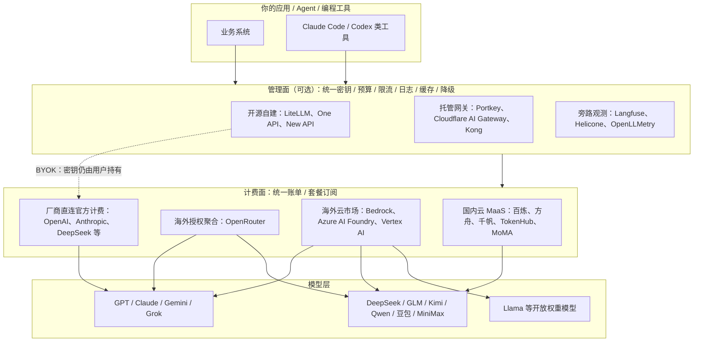

# 非中转站大模型统一管理 API 订阅全景指南

> **时效快照声明**：本文所有价格、套餐档位与模型版本集中核实于 **2026-09-22**。大模型行业价格与模型版本呈周级变动（核实当日即有 xAI Grok 4.7 发布、OpenAI 帮助中心两日内更新），文中数字仅作量级参考，**采购前必须以厂商官网定价页为准**。标注"限时/促销/售罄"者为页面时点状态。"官网自述"表示数据来自厂商自我介绍页面，未经第三方独立验证。
>
> **范围界定**：本文只调研**非灰色中转站**渠道，即模型厂商官方 API、官方授权聚合平台、云厂商/运营商 MaaS、正规自建推理服务商，以及只做管理层不转售模型的 API 网关。对归类存在公开争议的主体（如硅基流动、302.AI），并列呈现各方证据，不代替证据下定性结论。

## 1. 五分钟摘要

1. **"统一管理"不等于"中转站"**。密钥管控、预算限流、日志观测（管理面）与 token 代购结算（计费面）是两个可分离的平面。自建开源网关（LiteLLM、One API 等）接入自己持有的官方 Key，不碰资金流，是正规的内部管控方案。
2. **国际厂商的消费订阅（ChatGPT Plus/Pro、Claude Pro/Max、Google AI Pro、SuperGrok）均不包含 API 额度**，OpenAI 以官方 FAQ 明示分账；"订阅制 API"在中国官方云平台才是主流——阿里云百炼、火山方舟、百度千帆、腾讯云 TokenHub 在 2026 年均已提供 39–200 元/月档的多模型套餐。
3. **企业级正规多模型通道呈双区格局**：海外为 AWS Bedrock、Azure AI Foundry、Google Vertex AI（模型官方授权入驻、合规认证完备，但均无中国大陆区域）；国内为云厂商/运营商 MaaS（备案模型、人民币结算、增值税发票、PrivateLink 私网）。
4. **OpenRouter 是海外最接近"统一 API 订阅"的授权聚合市场**：500+ 模型、推理价透传、平台费 5.5% 起、支持支付宝；但官网未声明中国大陆节点，直连可用性第三方说法冲突。2026-08-19 Stripe 官方宣布签署收购协议。
5. **在中国，"中转站"是授权与合规分类而非技术分类**。同一套 New API 软件，企业内部分发与无授权对外商业转售的法律性质不同；2026 年已有监管风险提示与刑事案例。采购前用"主体—发票合同—授权链—数据条款"四特征清单尽调。
6. **推荐路径**：个人/轻量团队 → 国内云 MaaS 套餐包或官方 API + 免费额度；成长团队 → 1–2 个官方直连 + LiteLLM/Cloudflare 免费网关做统一管控；企业 → 境内云 MaaS + 境外云三强的双区架构，数据出境按网信办 16 号令评估。

## 2. 问题界定：四类主体与"中转站"边界

| 类别 | 定义 | 典型主体 | 资金流 | 授权链 |
|---|---|---|---|---|
| A. 模型厂商官方平台 | 模型研发方自营 API | OpenAI、Anthropic、Google、xAI、DeepSeek、智谱、Kimi、MiniMax | 用户→厂商 | 自研模型，权属清晰 |
| B. 云厂商/运营商 MaaS 与授权聚合 | 持牌云市场或官方合作集市，统一计费多家模型 | AWS Bedrock、Azure AI Foundry、Vertex AI、OpenRouter、阿里百炼、火山方舟、千帆、腾讯 TokenHub、移动 MoMA | 用户→平台→（分账）厂商 | 入驻/合作协议，平台公示模型清单 |
| C. 自建推理服务商与网关层 | 自建 GPU 集群推理，或只做管理/观测层、用户自带 Key | 硅基流动（官网自述定位）；LiteLLM、Portkey、Cloudflare AI Gateway、One API/New API（自建软件） | BYOK：用户→厂商；网关另收软件/订阅费 | 取决于部署与使用方式 |
| D. 灰色中转/聚合站 | 无官方授权，靠账号池、Key 转售、逆向网页协议对外经营 | 各类"低价 API 站"、Chat2API 网页会话转售 | 用户→站长→（来路不明的）上游 | 授权链不透明 |

C 类与 D 类的区分关键在于**使用方式与授权关系**，而非软件本身：

- One API（MIT，3.7 万 star）与 New API（AGPL-3.0，4.9 万 star）仓库自述均定位为"个人或企业内部管理与分发育渠道使用"；New API 历史自述写明"请勿用于商业用途"，其运营方锟腾科技 2026 年 3 月发声明反对第三方未经授权以该软件及品牌名义商业牟利。
- Chat2API 类工具复用的是网页版账号会话而非官方付费 API Key（如 lanqian528/chat2api），技术性质与"管理官方 Key 的网关"不同。
- 2026-06-08 国家安全部发布"AI 中转"风险提示，指出部分站点资质缺失、防护薄弱、存在数据倒卖、低配模型冒充高端模型等现象；2026 年 5 月上海一名中转站站长因非法获取 API 模型被刑拘后取保候审（第一财经、钛媒体、中国新闻周刊等报道）；央广中国之声 2026-09-11 报道二手平台低价 AI 积分存在数据截留倒卖风险。

## 3. 全景地图：三层架构

读图要点：管理面与计费面可独立选择。典型正规组合是"自建/托管网关（BYOK）+ 厂商直连官方计费"；灰色中转站则把两个平面混为一体且授权链不透明。

## 4. 第一层：模型厂商官方直连 API

### 4.1 国际厂商：订阅会员与 API 严格分账

| 厂商 | 2026 旗舰模型 API 按量价（每百万 token，美元，短上下文档） | 消费/团队订阅 | 订阅是否含 API 额度 |
|---|---|---|---|
| OpenAI | gpt-6-astra：输入 $10 / 输出 $50；gpt-5.6-sol 促销价 $4 / $20（促销至少至 2026-11-21）；gpt-5.6-luna：$0.20 / $1.20。Batch/Flex 5 折，Fast 约 2 倍 | Free $0、Go $8、Plus $20、Pro 5x $100、Pro 20x $200（2026-09-10 起暂停新签）；Business 标准席 $20/席/月（年付）；Enterprise 定制 | **否**，官方 FAQ 明示；ChatGPT credits 官方明示"非 API credits" |
| Anthropic | Opus 4.5/4.6/4.7：$5 / $25；Sonnet 4.5/4.6：$3 / $15；Haiku 4.5：$1 / $5。Batch 5 折；Fast 6 倍；美国境内推理 1.1 倍 | Pro $20（年付折合 $17）；Max 5x $100、Max 20x $200；Team $20/席起；**Enterprise $20/席/月 + 全部用量按标准 API 费率另计** | 个人/Team 不含通用 API 额度；Enterprise 已实现产品消费与 API 计价并轨 |
| Google | Gemini 3.1 Pro：$2 / $12（无免费层）；3.6/3.7/3.8 Flash 促销 $0.75 / $3.75 至 2026-12-31，之后 $1.50 / $7.50 | AI Plus $4.99、AI Pro $19.99、Ultra 5x $100、Ultra 20x $200 | 无 token 账单额度；订阅仅提高 AI Studio 速率限额，Pro/Ultra 另送 $10/$40 Google Cloud 抵扣 |
| xAI | Grok 4.7（2026-09-21 发布，500K 上下文）：<200K 输入 $2 / 输出 $6；≥200K $4 / $12。OpenAI 兼容接口 | SuperGrok Lite $10、$30、Plus $100、Heavy $300；Business $30/席 | 否，Grok API 与订阅分别计费（订阅价未经官网直接复核，多源交叉，置信度中） |
| Meta | 一方免费 Llama API 预览约 2026-07 停止服务；Meta Model API（Muse Spark 闭源系列）$1.25 / $4.25，新账户 $20 额度 | 消费端 Meta AI 免费，无付费订阅档 | Llama 走 Bedrock/Azure/Vertex/Together/Fireworks/Groq/Cerebras 等授权托管 |

来源：developers.openai.com/api/docs/pricing、openai.com/api/pricing、docs.claude.com/en/docs/about-claude/pricing、claude.com/pricing、ai.google.dev/gemini-api/docs/pricing、blog.google（I/O 2026 套餐公告）、docs.x.ai（多源交叉）、llama.com/products/llama-api。

**企业管理能力要点**：OpenAI Business/Enterprise 提供 SAML SSO、SCIM、EKM 客户密钥、RBAC、10 区域数据驻留、SOC 2 Type 2 与 ISO 27001 系列；Claude Enterprise 提供 SSO/域捕获、SCIM、审计日志、自管密钥、HIPAA BAA、可经 AWS Marketplace 采购。个人免费/Plus/Pro 档数据默认可用于训练（提供退出选项），企业档默认不训练。

**编程代理双轨计费**：Claude Code、OpenAI Codex、Grok Build 均同时支持"订阅身份登录"与"API Key 按量身份登录"。Anthropic 曾计划 2026-06-15 起向订阅用户发放 Agent SDK 月度额度（Pro $20、Max 最高 $200），当日宣布暂停，截至核实日未落地——这是订阅与 API 并轨趋势中一次中途暂停的尝试。

### 4.2 国内厂商官方 API：套餐化程度高

国内模型厂商普遍同时提供按量计费与包月套餐，且各家云 MaaS 也有同模型套餐（下单前建议比价）。

| 厂商 | 2026 代表模型与按量价（元/百万 token） | 官方套餐 |
|---|---|---|
| DeepSeek | deepseek-flash（V4.1-Flash，支持图像）：空闲输入 1 / 高峰 2、输出 4 / 8、缓存命中 0.02；v4-pro：输入 4.5 / 9、输出 13.5 / 27（2026-08-17 起峰谷定价，1M 上下文） | 无订阅，纯按量；新用户 100 万 token |
| 智谱 BigModel | GLM-5.3（约 744B MoE）：缓存 2 / 未命中 8 / 输出 28；GLM-5.3-Flash：0.23 / 0.8 / 2.8 | GLM Coding Plan：Lite 118、Pro 538、Max 1078 元/月；团队 598 元起 |
| 月之暗面 Kimi | K3（约 2.8 万亿参数，1M 上下文）：缓存 2 / 未命中 20 / 输出 100；K2.7-Code：1.3 / 6.5 / 27 | Andante 49、Moderato 99、Allegretto 199、Allegro 699 元/月 |
| MiniMax | M3（1M 上下文）：缓存 0.42 / 未命中 2.10 / 输出 8.40 | Token Plan：Starter 29（第三方汇编口径）、Plus 49、Max 119、Ultra 469 元/月 |
| 阶跃星辰 | step-5-preview：缓存 0.35 / 未命中 7 / 输出 20 | Step Plan：Flash Mini 49、Plus 99、Pro 199、Max 699 元/月（部分档位曾显示售罄） |
| 百川 | Baichuan-M3：输入 10 / 输出 30（32K 档） | 未见套餐 |

来源：api-docs.deepseek.com/zh-cn/quick_start/pricing、docs.bigmodel.cn、platform.kimi.com、platform.minimaxi.com、platform.stepfun.com、platform.baichuan-ai.com（部分套餐价经第三方汇编 jia.je 交叉，置信度中，下单前以官网为准）。

## 5. 第二层：官方授权聚合与云 MaaS（统一账单所在）

### 5.1 OpenRouter：授权模型集市

- **规模（官网自述）**：500+ 模型、80+ 提供商、月处理 400T+ token、1000 万用户；OpenAI 兼容端点 `https://openrouter.ai/api/v1`；代表模型含 GPT-6 Astra、Gemini 3.8 Flash、Claude Fable 5.1。
- **计费**：推理价格按提供商目录价**透传无加价**；平台费 Standard 5.5%、Business 8%、Enterprise 议价；信用卡充值手续费 5.5%（最低 $0.80），USDC 5%，**支持支付宝**；credits 预付制（官网标注 "no subscriptions"，购买满一年可能过期）。
- **BYOK**：自带厂商密钥时，每月 $25,000 用量免平台费，超出收 5%；Enterprise 免额 $200,000/月。
- **管控**：Guardrails（预算上限、模型/提供商白名单、零留存 ZDR、数据区域限制、PII 检测、提示注入防护，免费档即可用）、per-key 限额；Workspace 预算、SSO/SAML、合同 SLA、后付发票仅 Enterprise。
- **数据**：默认不记录 prompt/completion 内容（仅元数据），opt-in 记录可换 1% 折扣；逐家公开上游留存政策（经 Bedrock/Azure/Vertex 为零留存，Anthropic 30 天，DeepSeek 标注 "May train"）；企业版支持 eu/us 区域内路由。
- **中国大陆**：官网未声明大陆节点；2026 年两份第三方评测称"可连接但直连不稳定、需代理"，另有导航站称"国内直连可用"——三方说法冲突，不下结论，建议实测。
- **资本事件**：Stripe 官方新闻稿（2026-08-19）宣布已签署收购 OpenRouter 协议；约 $7.5B 金额为纽约时报等媒体口径，官方稿未披露。

来源：openrouter.ai、openrouter.ai/pricing、openrouter.ai/docs/faq、provider-logging 页、stripe.com/newsroom/news/stripe-agrees-to-acquire-openrouter。

### 5.2 海外云三强与 watsonx

| 维度 | AWS Bedrock | Azure AI Foundry（含 Azure OpenAI） | Google Vertex AI | IBM watsonx.ai |
|---|---|---|---|---|
| 模型规模（官网口径） | 100+ 基础模型，Marketplace 另 100+ | 目录 11,000+（含社区打包），Azure 自营数十个 | 200+ 企业就绪模型 | Granite 自研 + Llama/Mistral/DeepSeek 等 |
| 代表供给 | Nova、Claude 5.x/4.x、**OpenAI GPT-6 Astra（2026-09 GA）**、DeepSeek、Llama、Kimi、MiniMax、xAI、Qwen | OpenAI 全系（gpt-6-astra 2026-09-03 上线）、DeepSeek、Grok、Mistral、Llama | Gemini 3.x、Claude 全托管 MaaS、Llama、Mistral；开源模型可 VPC 内自部署 | Granite 4 系、Llama 4、Mistral、gpt-oss 等 |
| 计费 | 按 token，Batch 比 on-demand 低 50%；Provisioned Throughput 询价；Guardrails 另计 | PAYG + PTU 预置吞吐（可跨模型弹性）；Batch 低 50%；并入 Azure 账单 | Flash 促销 $0.75/$3.75 至 2026-12-31；非 global 端点 +10%；支持承诺折扣 | 按 token serverless + 按小时自部署；并入 IBM 账单 |
| 管控 | IAM、PrivateLink、KMS、CloudTrail、Guardrails、Knowledge Beds、模型评估；ISO/SOC/FedRAMP High/HIPAA | Entra ID RBAC、Private Endpoint、Content Safety、区域化部署、100+ 合规认证；默认免审批 | Model Armor、VPC Service Controls、私有端点、Gen AI 评估 | 企业治理、可私有化部署、OpenAI 兼容模型网关 |
| 中国大陆 | 区域表无北京/宁夏（据官方区域表的保守推断） | 经世纪互联运营，**2024-10-21 起仅企业客户，个人订阅终止**（公开新闻报道） | 无大陆区域，最近为香港/台湾节点 | 未公示大陆服务细节，有本地企业销售 |

数据政策三厂均承诺客户数据不用于训练基础模型；Bedrock 声明不与模型厂商共享。注意两个细节：Vertex 上使用 Claude 5 需开启向 Anthropic 的数据共享，否则返回 403；Azure 中国区（世纪互联）最新在售模型清单未取得 docs.azure.cn 直接证据，采购前需向世纪互联核实。

### 5.3 国内云/运营商 MaaS：人民币结算的多模型套餐主战场

| 平台 | 模型范围 | 个人套餐起步 | 统一计量 | 企业管控 |
|---|---|---|---|---|
| 阿里云百炼 | Qwen 全系 + DeepSeek、Kimi K3、GLM-5.2/5.3、MiniMax M3、小米、可灵等；公示 14 个算法备案号 | Token Plan 限时 39 元/7 天（原价 60），另 79/139/499 档；**Coding Plan Pro 200 元/月**（6000 次/5 小时，新客首月 39.9，每日限量）；Lite 档已停售 | Credits | RAM、业务空间、角色权限、模型限流、分账、PrivateLink（北京/新加坡）、安全护栏 |
| 火山方舟 | 豆包 Seed 2.0/2.1、DeepSeek V4 全系、GLM-5.3、Kimi K2.7–K3、MiniMax M3 + 图视频语音 | Agent Plan：Small 40、Medium 200、Large 500、Max 1000 元/月；Coding Plan Lite 40 / Pro 200 | AFP | 子账号、推理接入点权限、私网能力 |
| 腾讯云 TokenHub | 混元 Hy4、DeepSeek V4（标"原厂直供"）、GLM-5.x、Kimi K2.7/K3、MiniMax M2.7/M3；Auto 智能路由 | 个人积分制 39 元/780 积分起，另有 99/299/599 档；混元专档 28 元起；新用户 100 万 token | 积分 | 企业版 500 元/月起、节省计划 SP；"一个 API、一个 Key、一份账单"为卖点 |
| 百度千帆 | ERNIE 5.1 + DeepSeek/GLM/Kimi 等上百款；ERNIE-Speed/Lite/Tiny 永久免费（RPM 300） | Token Plan 2026-07-13 发布，Mini/Lite/Pro/Max 四档，**首购 5 折 4.9 元起**（具体档位价部分来自第三方汇编，置信度中） | 通用 Token（不区分模型倍率） | 云账号体系；OpenAI/Anthropic 双协议；AppBuilder 兼容 MCP |
| 华为云 ModelArts Studio | 盘古 openPangu 2.0 + DeepSeek、通义等 | 未见公开个人档位，按 token 预置服务 | 华为云账单 | IAM/VPC；贵阳等区域；实名 |
| 中国移动 MoMA | 自研九天 + 340+ 第三方模型（新华网 2026-09 口径），三种智能路由 | Token 包月/代码包月/资费包（无公开标价）；新认证赠 2500 万 token | 统一网关计费 | 政企合同；官方材料称单位成本压降 30%（官网自述） |
| 中国电信 TeleAI 星辰 | TeleChat + DeepSeek/Qwen/ChatGLM 等 100+，万亿参数全国产集群 | 未见公开档位 | 政企计费 | 私有化部署为主要形态，服务 1000+ 政企客户（官网口径） |

来源：help.aliyun.com/zh/model-studio（coding-plan、token-plan-overview、models、filing 页，2026-09 更新）、docs.volcengine.com/docs/ark、cloud.tencent.com/product/tokenhub、IT 之家千帆发布报道、support.huaweiocloud.com、news.cn、teleai.com.cn。

**自建推理服务商（C 类典型）硅基流动**（两方证据并陈，不下定性结论）：官网自述 2023 年成立，定位"独立生态词元供应平台""不开发模型、不涉足终端应用"，接入 170+ 模型，2026 年 4 月注册用户超 1000 万、企业客户 13000+（官网自述），融资至 B 轮（2026-06），通过等保三级，适配英伟达/AMD/昇腾等算力，2026-05-15 起免费模型需实名；另有第三方对比文章将其与 OpenRouter 等列入"API 中转服务"对比表。其与典型灰色站的可观察差异：有公开融资主体与官网合同/企业业务形态（专属实例、本地部署、BYOC、算力联营）。

## 6. 第三层：统一管理网关与可观测性（BYOK，不转售模型）

| 产品 | 形态 | 协议 | 价格（官网现行） | 核心能力 |
|---|---|---|---|---|
| LiteLLM | 开源自托管 + 企业版 | MIT（enterprise/ 商业），5.9 万 star | OSS $0（虚拟密钥/预算/限流/降级/日志全含）；Enterprise 年度询价，明示"绝不按 token 计费"（第三方估算 $250/月、$30k/年仅参考，未证实） | 100+ 供应商、OpenAI 兼容、Redis 缓存、跨供应商降级、Prometheus |
| Portkey | 开源核心 + 托管 SaaS | MIT（1.3 万 star；网传改 Apache 2.0 与 GitHub 元数据不符） | Developer 免费；Production **$49/月**；Enterprise 询价 | 200+ 模型路由、Guardrails、语义缓存、Prompt 管理 |
| Cloudflare AI Gateway | 托管云服务 | 闭源 | **核心功能免费**（缓存/限流/分析/DLP）；代购统一账单 +5% 手续费 | 原生支持 24 家供应商（含 Bedrock、OpenRouter、DeepSeek、xAI），边缘缓存与降级；BYOK |
| Helicone | 开源 + 托管云（观测+代理混合） | Apache-2.0，6170 star | Hobby 免费；Pro $79/月；Team $799/月 | 监控评估、缓存、限流、代理降级 |
| Kong AI Gateway | 商业 API 网关 AI 插件包 | Kong 商业许可 | Konnect Plus 按控制面 $25/$200/$500/月；被代理 LLM 超 5 个后 $100/月/模型 | AI Proxy、语义缓存、token 级限流、内容安全；面向已有 Kong 体系的企业 |
| Langfuse | 开源旁路观测（不过流量） | MIT 核心 + ee 商业，3.5 万 star；2026-01 被 ClickHouse 收购 | Hobby 免费；Core $29/月；Pro $199；Enterprise $2499 | Trace、评估、Prompt 管理、Playground |
| One API | 开源自建软件 | MIT，3.7 万 star | 无官方托管 | 单二进制/Docker，多渠道统一适配、令牌与分组额度、兑换码；维护节奏放缓 |
| New API | 开源自建软件 | AGPL-3.0，4.9 万 star，高度活跃 | 无官方托管 | One API 增强版，含易支付体系；自述限内部使用 |
| one-hub 等 | 开源自建 | Apache-2.0 等 | 自托管 | One API 衍生，增强统计 |
| RouteLLM / OpenLLMetry | 学术/标准 | Apache-2.0 | 自托管/无 | 智能路由研究框架；基于 OpenTelemetry 的 GenAI 观测埋点 |

来源：各 GitHub 仓库（star 数为 2026-09-22 实时值）、litellm.ai/pricing、portkey.ai/pricing、developers.cloudflare.com/ai-gateway（页面标注 2026 年更新）、konghq.com/pricing、langfuse.com/pricing 及 ClickHouse 收购公告。

选型含义：网关层解决"**多把官方 Key 的统一治理**"（团队虚拟密钥、按项目预算与熔断、请求日志与成本归集、失败自动降级、缓存省钱），资金仍直接与官方结算；它不解决"一个账号买到所有模型"——后者属于第 5 章的聚合/云市场层。

## 7. 选型模式：「三面四分」选型法

- **模式名称**：三面四分选型法
- **成熟度**：L1（单轮多案例归纳，待后续采购案例验证）
- **适用边界**：适用于需要在两家及以上大模型 API 间做统一接入、统一计费或统一治理的个人/团队/企业；不适用于只用单一模型且无合规要求的玩具项目。

### 三个审视面

1. **合规面**：用户与数据在哪？是否涉及个人信息出境（阈值见第 8 节）？是否必须增值税专票、对公合同、私有化/私网？应用上架是否需要调用备案模型？
2. **计费面**：要"一份账单买多家"（聚合/云 MaaS），还是"分别直连官方、只做内部对账"（BYOK 网关）？能否接受预付余额、平台费、外汇支付？
3. **管理面**：需要哪些管控——团队虚拟密钥、项目预算/熔断、限流、日志留存、审计、SSO、缓存、故障降级、模型评估？

### 四类候选（按合规面先淘汰，再按计费/管理面匹配）

| 需求组合 | 首选 |
|---|---|
| 境内业务、要发票合同、多家国产模型 | 国内云 MaaS（百炼/方舟/千帆/TokenHub）或厂商官方 API |
| 境内业务、预算敏感、编程为主 | 各家 Coding/Token Plan（百炼 200 元、方舟 40/200、智谱 118 元等）+ 免费额度组合 |
| 境外业务、要最全模型与企业合规 | Bedrock / Azure AI Foundry / Vertex AI（按既有云厂商关系就近选择） |
| 境外业务、小团队要一份账单 | OpenRouter（注意支付与网络实测） |
| 已有多家官方 Key、要治理 | LiteLLM（自建免费）/ Cloudflare AI Gateway（托管免费核心）/ Portkey（$49 起） |
| 只要成本与质量观测 | Langfuse / Helicone 旁路接入 |

### 五步执行

1. **定边界**：列出业务地域、用户规模、数据级别（是否含个人信息/敏感信息）、票据要求。
2. **拆平面**：明确计费面诉求（代购账单 or BYOK）与管理面诉求清单。
3. **过四特征尽调**：候选主体的注册主体（能否查到）、发票/合同（能否对公）、模型授权链（官方入驻/合作有无书面或公示）、数据条款（留存、训练、区域、PII）。
4. **双供小规模验证**：至少一主一备两个通道，实测延迟、限流、票据流程；开源网关本地跑通虚拟密钥与预算。
5. **月度复核**：价格与套餐每月复核（建立第 11 节清单），关注模型下架（如 GLM-5/5.1 于 2026-10-09 在 TokenHub 下线类事件）与备案变化。

### 反模式（均来自本轮事实）

1. **只比单价不看授权链**——低价站可能以低配模型冒充高端模型、账号池随时断供（国安部风险提示列举现象）。
2. **把消费订阅当 API 额度采购**——ChatGPT/Claude 个人订阅不含通用 API，买错无法用于业务系统。
3. **单渠道锁定无降级**——官方模型版本与商业政策会变（Llama API 预览关停、Azure 中国区个人订阅终止、套餐档位停售均有先例），没有备用通道即单点。
4. **用分发软件对外商业转售**——New API 仓库自述限内部使用且运营方反对冒名牟利；2026 年已有刑事案例。
5. **忽视数据出境阈值**——境内用户数据直连海外 API 触发 16 号令义务而未评估，属于企业级合规事故。

### 检验标准（做完如何确认做对了）

- 每家供应商可提供：合同/协议文本、发票路径、模型授权说明、数据处理条款，四项书面材料归档。
- 架构图标得清每一条请求的 PII 数据流与存储位置。
- 网关层存在按项目/人的预算上限与熔断；任一主通道故障可在约定时间内切到备用通道。
- 财务侧能按团队归集成本；安全侧能审计谁在何时调用了哪个模型。

### 跨领域迁移

该模式等价于多云采购中的"直销云厂商 / 授权经销商 / 云管理平台（CMP）/ 灰色代充"四分：经销商与 CMP 的区别同样是"碰不碰资金流、授权链是否书面"；游戏与 SaaS 行业的"官方订阅 / 授权渠道商 / 黑卡代充"三分也符合同一结构。

## 8. 合规与风险：中国企业必须回答的问题

**模型备案**：《生成式人工智能服务管理暂行办法》（2023-08-15 施行）实行算法备案与大模型备案双轨管理；面向公众提供服务的应用上架分发需提供备案信息。使用云 MaaS 时可引用平台公示的备案号（如百炼合规页列示 DeepSeek 算法备案号与大模型备案号）；直连自研模型厂商 API 时，应用方需自行完成服务备案。

**数据出境**：《促进和规范数据跨境流动规定》（网信办令第 16 号，2024-03-22）阈值——

- 非关键信息基础设施运营者，当年累计向境外提供不满 10 万人个人信息（不含敏感）：免评估、免标准合同、免认证；
- 10 万–100 万人个人信息：需订立标准合同或通过个人信息保护认证；
- 100 万人以上个人信息、1 万人以上敏感个人信息或重要数据：需申报数据出境安全评估；
- 关键信息基础设施运营者向境外提供任何个人信息或重要数据均需安全评估。

配套：《网络数据安全管理条例》（国务院令第 790 号，2025-01-01 施行）、《个人信息出境认证办法》（2025 年 10 月）。直连 OpenAI/Claude 等海外 API 前应将用户 prompt 视同数据出境评估。

**灰色站特有风险**（监管与媒体公开列举）：数据截留与倒卖、上传材料泄露、低价模型以次充好、站点无资质随时关停、支付与发票无合规路径、使用方可能卷入上游非法获取 API 案件。

**采购尽调四特征清单**：

| 特征 | 正规渠道可观察证据 |
|---|---|
| 注册主体 | 与模型权属一致或为持牌云/央企，官网可查 ICP/算法备案与工商主体 |
| 发票合同 | 企业认证后可开增值税发票、可签对公合同与 SLA |
| 模型授权 | 自研声明或厂商入驻/合作公示（如云市场模型目录、"原厂直供"标注） |
| 数据条款 | 隐私政策、留存期限、是否训练、区域路由、私网/VPC 选项 |

## 9. 三类读者的行动路径

**个人开发者 / 学习用途**：① 用满免费层（Google AI Studio、Groq、国内各家 100 万 token 新客额度、ERNIE 轻量系永久免费、硅基流动免费模型）；② 编程需求选一个国产 Coding Plan（40–200 元/月档）或官方低价模型（DeepSeek flash 空闲 1 元/百万输入、GLM-5.3-Flash）；③ 不要购买 ChatGPT Plus 期望获得 API；④ 切勿把含敏感数据的 prompt 交给来路不明的低价站。

**5–50 人成长团队**：① 境内：1 家云 MaaS 套餐（统一账单+发票）+ 1 家模型厂商官方直连（压价与备份）；② 部署 LiteLLM 或 Cloudflare AI Gateway：团队成员只拿网关虚拟 Key，按项目设预算与限流，开启降级；③ 接 Langfuse/Helicone 做成本与质量观测；④ 境外业务需要 GPT/Claude 时，优先 Bedrock/Azure/Vertex（若已有云账号）或 OpenRouter（先实测网络与支付）。

**企业 / 政企**：① 境内生产负载放云 MaaS（合同、专票、PrivateLink、备案号、内容安全）；② 境外业务独立账号体系走 Bedrock/Azure/Vertex，签企业协议（数据驻留、不训练、审计、BAA/HIPAA 按需）；③ 数据出境按 16 号令留评估/标准合同记录；④ 网关考虑 LiteLLM Enterprise/Portkey Enterprise/Kong（SSO、RBAC、审计、SLA、气隙部署）；⑤ 建立供应商季度复核与退出预案，禁止员工自行采购灰色站接入生产。

## 10. 术语表

- **MaaS（Model as a Service）**：云厂商以托管服务形式提供多家模型调用的平台形态，如百炼、Bedrock。
- **BYOK（Bring Your Own Key）**：网关只转发请求，用户自带并自付官方 API Key，网关不经手 token 费用。
- **PTU / Provisioned Throughput**：Azure/Bedrock 的预置吞吐容量，承诺付费换取稳定速率。
- **Credits / AFP / 积分**：百炼 Credits、方舟 AFP、腾讯积分，均为平台内统一计量代币，不同模型按系数抵扣。
- **Token Plan / Coding Plan**：国内 2026 年流行的包月套餐，前者通用、后者按编程工具调用次数/限额设计。
- **ZDR（Zero Data Retention）**：零数据留存，OpenRouter 对经三大云转发的通道标注此政策。
- **算法备案 / 大模型备案**：中国对生成式 AI 算法与服务的双轨行政备案。
- **Guardrails**：护栏，对模型请求/响应做内容、PII、注入、预算等策略管控。
- **峰谷定价**：DeepSeek 2026-08 起按工作日忙闲时段分价。

## 11. 局限、冲突信息与复核清单

本文已知局限：

1. 所有价格具时效性；xAI 订阅价、Google AI 美区入门档美元价、千帆具体档位价、MiniMax/智谱套餐部分数字来自第三方汇编或动态页面，置信度为中，下单前必须复核官网。
2. OpenRouter 中国大陆直连可用性三方说法冲突；OpenRouter 官方无大陆节点声明。
3. Stripe 收购 OpenRouter 有官方新闻稿证实签约事实，约 $7.5B 金额为媒体口径。
4. 硅基流动、302.AI 的归类存在公开分歧，本文并列官网自述与第三方说法，未作定性。
5. Bedrock"中国区不提供"依据官方区域表的保守推断，未见 AWS 中国文字声明；世纪互联在售模型清单未取得直接证据。
6. LiteLLM Enterprise 第三方价格估算未获官方确认；华为云/运营商套餐无公开标价。
7. 平台规模数字（500+ 模型、400T token、340+ 模型、千万用户、成本压降 30% 等）均为官网/官方媒体口径。

采购前复核清单：官网定价页截图存档 → 模型版本与下线公告（如 GLM-5/5.1 下线）→ 合同与发票样本 → 数据处理协议（DPA）→ 备案号核验 → 网络与支付实测（连续 7 日、含高峰时段）→ 免费/促销到期日。

## 12. 主要来源

- 厂商定价与文档：developers.openai.com、docs.claude.com、claude.com/pricing、ai.google.dev、cloud.google.com、docs.x.ai、aws.amazon.com/bedrock、learn.microsoft.com/azure/foundry、ibm.com/products/watsonx-ai、openrouter.ai/docs
- 国内平台：help.aliyun.com/zh/model-studio、docs.volcengine.com/docs/ark、cloud.tencent.com/product/tokenhub、api-docs.deepseek.com、docs.bigmodel.cn、platform.kimi.com、platform.minimaxi.com、platform.stepfun.com、platform.baichuan-ai.com、siliconflow.cn、support.huaweicloud.com、teleai.com.cn
- 网关与开源：github.com/BerriAI/litellm、Portkey-AI/gateway、Helicone/helicone、langfuse/langfuse、songquanpeng/one-api、QuantumNous/new-api、developers.cloudflare.com/ai-gateway、konghq.com/pricing
- 法规与监管：cac.gov.cn（网信办令第 16 号）、《生成式人工智能服务管理暂行办法》、国家安全部"AI 中转"风险提示（2026-06-08）、第一财经/钛媒体/中国新闻周刊/南方都市报/央广中国之声相关报道
- 资本事件：stripe.com/newsroom/news/stripe-agrees-to-acquire-openrouter（2026-08-19）、langfuse.com/blog/joining-clickhouse（2026-01-16）

## 13. 方法论记录

本文按方法论编排（R→I→E→V→C，场景 4 知识沉淀，depth=standard）产出：

- **R（复盘/事实采集）**：四路独立并行网络调研，采集 81 条带来源事实（国际厂商 18、授权聚合/云平台 19、网关层 20、国内渠道 24），G1 质量门通过（客观陈述、附 URL/核实日期/置信度、冲突信息显式标注）。
- **I（洞察）**：5 条四元组洞察（管理面/计费面解耦、订阅与 API 中外分野、中转站是合规分类、双区格局、网关商业模式），G2 通过。
- **E（萃取）**：沉淀「三面四分选型法」（三审视面、四候选、五步骤、五反模式、检验标准、跨领域迁移），G3 通过；成熟度标注 L1，待更多采购案例验证。
- **V（对抗审查）**：四视角 6 条攻击意见，采纳 4 条修正（时效快照声明、官网自述口径标注、术语表与三读者路径、出境阈值与尽调清单），另将"套餐价格不可线性外推/计费层金融化/订阅-API 并轨"作为趋势观察保留。
