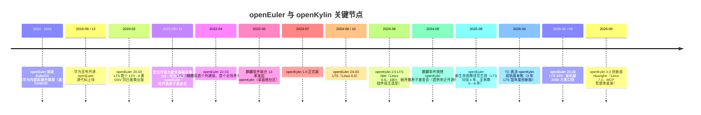

# 00 双像对照与名称辨析：先分清谁是谁

> 读完本文你会知道：openEuler 与 openKylin 各自的一分钟画像、六个高频混淆名字的准确关系、两条时间线的关键节点，以及后文反复出现的术语是什么意思。

## 0.1 一分钟画像对照

| 维度 | openEuler（欧拉社区版） | openKylin（开放麒麟） |
|---|---|---|
| 一句话定位 | 面向数字基础设施的开源操作系统根社区：服务器、云计算、边缘、嵌入式 | 桌面操作系统根社区：桌面、AI PC、多架构终端与开发板 |
| 发起与时间 | 华为 EulerOS 开源，2019-12 源代码上线，2020-03 首个 LTS（O-002/O-003） | 麒麟软件联合 13 家单位 2022-06-24 发起（K-001） |
| 基金会归属 | 2021-11-09 华为捐赠开放原子开源基金会（O-005） | 2024-09-25 麒麟软件捐赠开放原子开源基金会（K-002） |
| 当前主力版本 | 24.03 LTS（Linux 6.6）加 SP1—SP4（O-016/O-018） | 2.0 LTS Nile（Linux 6.6）；3.0 Huanghe 创新版（Linux 7.0）（K-005/K-006） |
| 软件包体系 | RPM / dnf，创新版试 epkg（O-023） | dpkg / apt（K-007） |
| 桌面地位 | 非主线，装后可选 DDE 或 UKUI（O-026） | 产品本体，默认 UKUI 4.24，配套 wlcom/开明/磐石（K-008/K-009） |
| 架构支持 | x86_64、aarch64、ARM32、LoongArch64、RISC-V 等（O-021） | X86、ARM、LoongArch、RISC-V 四架构同源（K-010） |
| 商业下游 | 官网列 25 家商用 OSV（O-007/O-031） | 银河麒麟桌面商业版以上游社区关系承接（K-012） |
| 社区规模（各自口径） | 约 2.9 万贡献者、112 SIG、25 OSV（2026-09 官网实时页，O-007） | 247 万用户、2210 家会员、2.4 万开发者、158 SIG（2026-07-31，K-003） |
| AI 落点 | 集群侧：超节点、NPU 切分、推理快恢、智能运维（O-029） | 端侧：MCP 调桌面、AI SDK、Token 中心、AgentOS 衍生镜像（K-011） |

最浓缩的一句话：**openEuler 是"机房里的根社区"，openKylin 是"桌面上的根社区"**；两者都在开放原子基金会体系内，麒麟软件同时深度参与两边（[02 治理与生态](02-governance-and-ecosystem.md)展开）。

## 0.2 六个名字的辨析（最常见的张冠李戴）

| 名称 | 准确身份 | 与其他五者的关系 |
|---|---|---|
| **EulerOS** | 华为内部/商用操作系统，2010—2012 年起源于高性能计算项目，基于 CentOS 编译开发，1.x 于 2013—2016 商用（O-001） | openEuler 的前身；2019 年其开源部分演化为 openEuler |
| **欧拉** | 中文品牌称呼，语境中可指 openEuler 社区、欧拉系生态或华为欧拉业务 | 不是独立产品名；正式材料中以 openEuler 为准 |
| **openEuler** | 开放原子基金会旗下开源操作系统社区与社区发行版，本文对比对象之一（后端侧） | 多家 OSV 商业发行版的上游；银河麒麟**服务器**版基于它构建（O-031） |
| **银河麒麟（Kylin OS）** | 麒麟软件（CEC 旗下）的商业发行版品牌，含桌面版与高级服务器版 V10/V11 | 服务器版以 openEuler 为上游（O-031），桌面版以 openKylin 为上游（K-012）——**一家商业公司、两条社区上游** |
| **openKylin（开放麒麟）** | 开放原子基金会旗下桌面操作系统根社区与社区发行版，本文对比对象之二（桌面侧） | 银河麒麟**桌面**商业版的上游社区（K-012） |
| **优麒麟（Ubuntu Kylin）** | 麒麟软件主导的另一个项目，Ubuntu 官方风味版，工程协作在 Launchpad/Ubuntu 体系 | 与 openKylin 并行的独立老项目；26.04 基于 Ubuntu 与 Linux 7.0、UKUI 4.20（本地包 F-053），不是 openKylin 的版本 |

记忆法：**EulerOS 是华为的前史，openEuler 是捐赠后的服务器侧根社区，openKylin 是麒麟软件发起的桌面侧根社区，银河麒麟是商业产品且服务器/桌面分别认两个上游，优麒麟是留在 Ubuntu 体系内的另一条线。**

## 0.3 两条时间线对照

时间线读法（事实依据 O-001~O-005、O-015~O-018、K-001~K-006）：

1. openEuler 早约两年半起步，且诞生即带商业下游（发布首日 4 家 OSV）；openKylin 起步即以"桌面根社区"为旗帜。
2. 捐赠节奏相差近三年：华为 2021-11 捐 openEuler，麒麟 2024-09 捐 openKylin，两者先后进入同一基金会。
3. 2024 年两者主力版本内核同为 Linux 6.6；2026 年节奏分叉——openEuler 在 6.6 上以 SP4 做超节点与 NPU 特性，openKylin 在创新版跨代到 Linux 7.0。

## 0.4 术语速查

| 术语 | 解释 |
|---|---|
| OSV | Operating System Vendor，操作系统发行厂商；openEuler 官网列 25 家（O-007） |
| LTS / SP | 长期支持版 / Service Pack；openEuler 的 SP 分 6 月小 SP（9 个月维护）与 12 月大 SP（24 个月维护）（O-015） |
| Upstream First | openEuler 早期即宣布的策略：优先把补丁贡献到上游社区而非仅留在自维护分支（O-003） |
| SIG | 特别兴趣小组，社区技术治理基本单元；openEuler 112 个、openKylin 158 个（两者口径与时点不同，不可直接比较，O-007/K-003） |
| 超节点 / 灵衢 | 面向多颗 NPU/CPU 紧耦合算力池的服务器形态及其可靠性、算力切分技术；24.03 LTS SP3/SP4 的重点方向（O-018/O-019） |
| StratoVirt / iSula | openEuler 的轻量虚拟化项目与轻量容器项目（O-027） |
| SysCare / Kmesh | openEuler 的热补丁技术与服务网格数据面项目（O-027） |
| UKUI | Qt 技术栈桌面环境；openKylin 默认桌面（4.24），openEuler 中为可选仓库组件（K-009/O-026） |
| DDE | 统信团队维护的桌面环境；openEuler 官方文档提供 `dnf install dde` 指南（O-026） |
| wlcom | openKylin 自研 Wayland 合成器（K-008） |
| 开明 Kaiming / 磐石 | openKylin 的应用包格式（OCI 沙箱、一次打包多处运行）与"不可变系统+KARE+开明包"组合架构（K-008） |
| MCP | Model Context Protocol，智能体调用工具与系统能力的开放协议；openKylin 3.0 智能体经其调用桌面能力（K-011） |
| AgentOS | 两边都使用的名称：openEuler 侧指集群智能运维方向，openKylin 侧指面向智能体的端侧衍生镜像，同名不同层（O-029/K-011） |
| epkg | openEuler 25.09 创新版起引入的包格式，支持多环境多版本（O-023） |

## 0.5 下一步阅读

- 想理解"为什么不是竞品"：[01 定位与场景分工](01-positioning-and-scenarios.md)
- 想看治理、生态与所有规模数字的口径：[02 治理与生态形状](02-governance-and-ecosystem.md)
- 要做版本与维护期决策：[03 版本与生命周期](03-release-lifecycle.md)
- 要做最终选型：[05 场景区间选型法](05-selection-guide.md)
