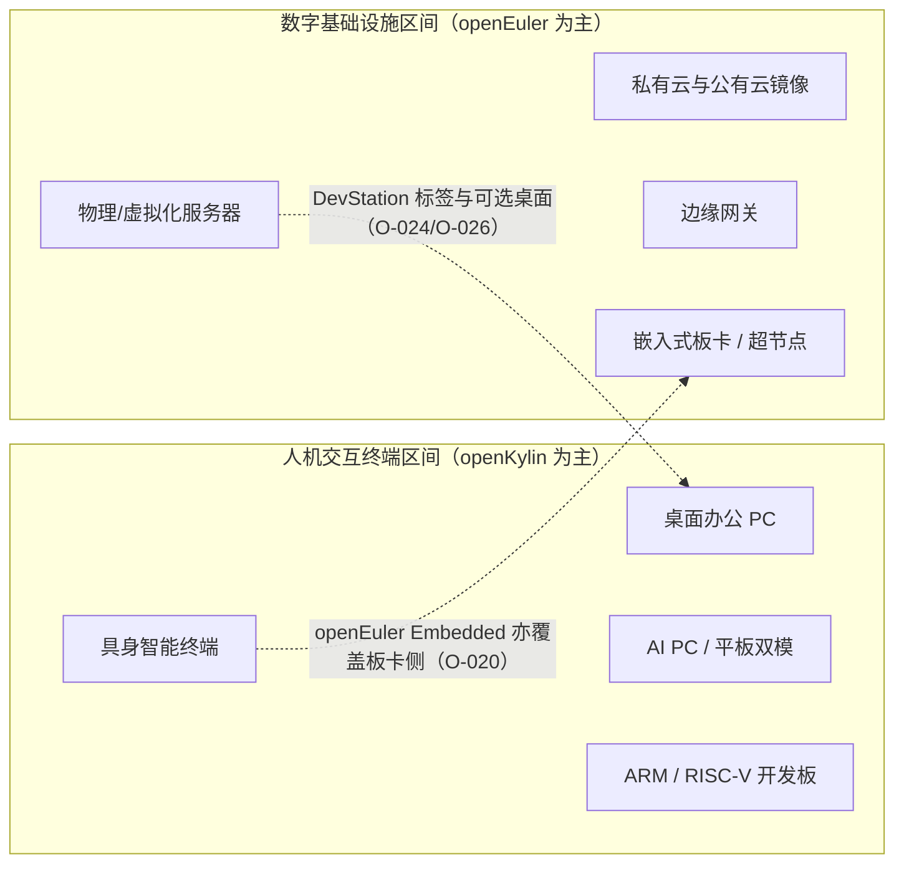
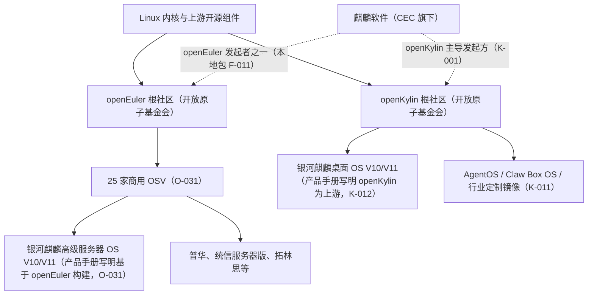

# 01 定位与场景分工：机房里的根社区与桌面上的根社区

> 读完本文你会知道：两者各自的官方定位措辞、覆盖的工作负载区间、场景证据，以及"同一公司、两个上游"的产业结构图。

## 1.1 官方定位的措辞对比

| 项 | openEuler | openKylin |
|---|---|---|
| 定位表述 | 2021-09 华为宣布欧拉从服务器 OS 升级为"数字基础设施 OS"，覆盖 IT、CT、OT（O-004） | 发起时官方表述为"中国首个桌面操作系统根社区"；愿景为"为世界提供与人工智能技术深度融合的开源操作系统"（K-001、本地包 F-002） |
| 场景枚举 | 服务器、云计算、边缘、嵌入式（O-004）；镜像场景标签为服务器/边缘/云/嵌入式/DevStation（O-024） | 桌面 PC、平板、教育开发板、AI PC、RISC-V 设备、具身智能终端（本地包 F-017/F-031/F-032） |
| 介质形态 | Standard/Everything/Network Install ISO、公有云镜像、容器镜像、WSL、嵌入式版本（O-024/O-025/O-020） | Desktop/Server/WSL/Desktop WSL/Phytium Pro/RISC-V Server/Embedded 镜像（本地包 F-031） |
| 典型用户证据 | 金融（工行、农行、山西证券、三湘银行）、运营商、能源、物流、高校科研、云计算案例（O-032） | 个人与开发者社区、整机/芯片厂商适配、上合国际化用户组、智能体生态伙伴（本地包 F-050/F-055） |

注意措辞中的分工信号：openEuler 的场景枚举没有"桌面工作站"的一等位置（DevStation 是标签之一，但桌面组件为装后可选，见 O-026 与[04 技术栈](04-technology-stack.md)）；openKylin 的介质虽含 Server，但其版本特性叙事（UKUI、隔空手势、语音输入、Token 中心、MCP 调桌面）围绕人机交互终端展开。

## 1.2 工作负载区间图

区间不是绝对绝缘，存在两条交界带：

1. **板卡/嵌入式**：openKylin 有 Embedded 镜像与具身场景（本地包 F-031/F-032），openEuler Embedded 26.03 基于 IB-Robot 全栈做机器人板卡（O-020）。此区间按板卡 BSP 与社区 SIG 支持情况逐案判断。
2. **开发者工作站**：openEuler 镜像有 DevStation 标签并提供 DDE/UKUI 安装指南（O-024/O-026），但定位是"基础设施工程师的工作站"而非通用桌面；通用桌面外设与办公软件适配的厚度在 openKylin 侧。

## 1.3 产业结构图：一家商业公司，两个社区上游

这张图给出的三个事实判断：

1. **麒麟软件是两个社区的交集企业**：它既是 openEuler 的发起参与者（本地包 F-011），又是 openKylin 的主导发起方（K-001）；其白皮书自述在 openEuler 社区贡献排名第二（O-031）。
2. **商业产品线按场景分流**：银河麒麟高级服务器版产品手册明确"基于 openEuler 社区构建"、内核主版本 4.19 在生命周期内不变并融合 openEuler 各 LTS/SP 特性（O-031）；桌面版产品手册明确 openKylin 是其上游社区（K-012）。
3. **下游结构不同**：openEuler 是 25 家 OSV 多点开花（O-007），openKylin 的商业闭环主要沿麒麟桌面产品线与衍生镜像展开（K-011/K-012）。这一差异的成因分析见[02 治理与生态](02-governance-and-ecosystem.md)。

## 1.4 媒体分工口径（定性，非事实结论）

界面新闻 2026-04-09 综述与凤凰网 2026-09-04 报道使用了"openEuler 深耕服务器、桌面能力偏弱""openKylin 承担前沿技术预研、成熟技术反哺商业版"等表述（O-035）。本知识包将其作为**媒体定性观察**引用，不作为量化结论；其与官方定位措辞、介质结构、商业下游证据（O-024/O-026/K-012）方向一致，但"偏弱""成熟"的程度无第三方测评数据支撑。

## 1.5 对选型的含义

- 工作负载落在服务器、云宿主、容器与虚拟化平台、电信/能源边缘、超节点：进入 openEuler 区间，下一步看[03 版本](03-release-lifecycle.md)与商业 OSV。
- 工作负载落在日常桌面、信创办公终端、AI PC、RISC-V 桌面/开发板、端侧智能体：进入 openKylin 区间。
- 落在两条交界带（嵌入式板卡、开发者工作站）：不做二选一的笼统判断，列出具体板卡型号、外设清单与桌面软件清单，分别核查两侧 SIG 与镜像支持，进入[05 选型五问](05-selection-guide.md)的第⑤问。
