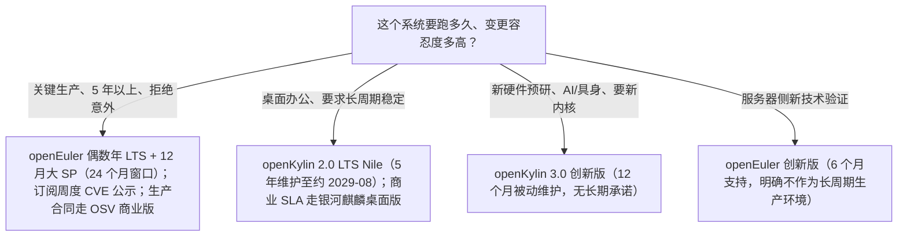

# 03 版本与生命周期：超长稳定与双轨预研

> 读完本文你会知道：两边现行版本制度的逐项差异、版本序列与内核代际、SP/创新版的维护窗口，以及这些制度对生产决策的具体含义。

## 3.1 版本制度逐项对照

| 维度 | openEuler（2025-08 起生效规范，O-015） | openKylin（2026-04-09 TC 表决双轨制，K-004） |
|---|---|---|
| 稳定线节奏 | LTS 发布间隔 **4 年**；偶数年 3 月发新一代 LTS 首版 | LTS 每 **3 年**一个主版本 |
| LTS 维护期 | 社区支持 4 年；全版本生命周期 **6 年（4+2）**，可申请延长至 **8 年** | **2 年主动维护 + 3 年被动维护，共 5 年** |
| 稳定线增量 | 偶数年 12 月与奇数年 12 月发 SP，奇数年 6 月可选发；6 月小 SP 维护 9 个月，12 月大 SP 维护 24 个月 | LTS 系列发 SP（如 2.0 SP1/SP2），细则随版本公布 |
| 创新线 | 创新版每 12 个月一个（9 月发布），支持期 **6 个月** | 创新版每 1 年一个，维护期 **12 个月（仅被动维护）**，定位"新技术的试验田和验证平台" |
| 制度决策主体 | 技术委员会与 Release SIG 公示 | 技术委员会表决（版本规划文首标注） |
| 安全更新机制 | Release/QA/CICD SIG 每周 update 公示 CVE 与缺陷，多分支并行（O-022） | 按版本发布维护更新（本地包 F-020/F-021） |

哲学差异一句话：**openEuler 用 4 年间隔与 6—8 年窗口向基础设施客户售卖"不变"；openKylin 用 3 年 LTS 保底、年度创新版暴露新内核新技术，向桌面生态售卖"新"。** 详见洞察 I-3。

## 3.2 版本序列与内核代际

### openEuler 侧（repo 目录实测，O-017）

| 线 | 版本与时间 |
|---|---|
| 20.03 LTS | 2020-03（首个 LTS）；SP1—SP4 持续维护（O-022 显示 20.03-SP4 仍在周度更新序列） |
| 22.03 LTS | 2022-04，捐赠后首个社区共建版本、首个全场景长周期版本；SP1—SP4，另有 22.03-LTS-64kb 变体 |
| 24.03 LTS | 当前主力，Linux 6.6（O-016）；SP1（2025-01-24）、SP2（2025-06-30）、SP3（仓库 2026-03-06；官方口径 2025-12-30 上线，面向超节点）、SP4（仓库 2026-09-08；官方发布日 2026-06-30；下载页 Planned EOL 2027/03）（O-018） |
| 创新版 | 20.09、21.03、21.09、22.09、23.03、23.09、24.09、25.03、25.09（每年节奏中含两次/年的历史发布）；25.09 起引入 epkg 包格式（O-023） |
| 嵌入式 | openEuler Embedded 26.03（仓库 2026-04-17），IB-Robot 具身全栈，hi3403/hi3591 等（O-020） |

24.03 LTS SP4 特性：Linux 6.6 内核、灵衢超节点可靠性与易用性、NPU 算力切分、推理服务快速恢复、E2B 沙箱、智能诊断/调优/运维、编译器增强、机密虚拟机（O-019）。

> 时点提示：SP3/SP4 的"官方宣传上线日"与"仓库目录日/下载页标注"存在月份级差异（O-018），引用具体日期时须注明取的是哪一类页面；本知识包按 V 审查 V-03 的裁定并列保留。

### openKylin 侧（引自本地包，K-005/K-006）

| 线 | 版本与时间 |
|---|---|
| 早期 | 0.7（2022-07，Linux 5.15、UKUI 3.1）→ 0.95（2023-01，UKUI 4.0）→ 1.0（2023-07，6.1 加 5.15 双内核） |
| LTS | 2.0 Nile（2024-08-08，Linux 6.6，180+ 组件自主选型）；SP1（2024-12）、SP2（2025-08-26，UKUI 4.20、磐石架构）；服务终止约 2029 年 8 月 |
| 创新版 | 3.0 Huanghe（2026 年 9 月，镜像分批上架：RISC-V/WSL 08-28、桌面 09-05、新闻稿 09-07、X86 Server 09-16），Linux 7.0、GCC 15、glibc 2.42、LLVM 22、后量子密码三项标准、Rust for Linux、UKUI 4.24 |

内核代际的关键反差：2024 年两边同在 Linux 6.6；2026 年 openEuler 继续在 6.6 上做 SP 长维护，openKylin 3.0 直接跨代到 7.0——这是"稳定线卖不变、创新线卖新"制度差异最直观的证据。

## 3.3 维护窗口的决策含义

三条硬约束：

1. **创新版支持期以月计**：openEuler 创新版 6 个月、openKylin 创新版 12 个月且仅被动维护。部署创新版等于接受一年内必须升级或自维护。
2. **SP 窗口不统一**：openEuler 6 月小 SP 只有 9 个月窗口，滚动升级时要核对当前 SP 是小窗还是大窗（O-015）。
3. **社区支持 ≠ 商业 SLA**：6—8 年与 5 年是社区维护承诺的制度文本；需要故障响应、定级保障与等保/可靠测评背书的场景，承接主体是商业发行版（openEuler 侧 25 家 OSV，openKylin 侧银河麒麟桌面版），见[05 选型指南](05-selection-guide.md)。

## 3.4 一年期复查触发器（V 审查 V-08）

- **2027-03 附近**：核对 openEuler 24.03 SP4 下载页 Planned EOL 2027/03 标注的实际执行与 SP5/下一代 LTS 公告（O-018）。
- **openKylin 3.0 首个 SP/LTS 节点**：核查 Linux 7.0 新内核的回归修复与创新版转稳定的路径；同时复查 MCP 协议生态是否仍为主流开放协议（K-006/K-011）。
