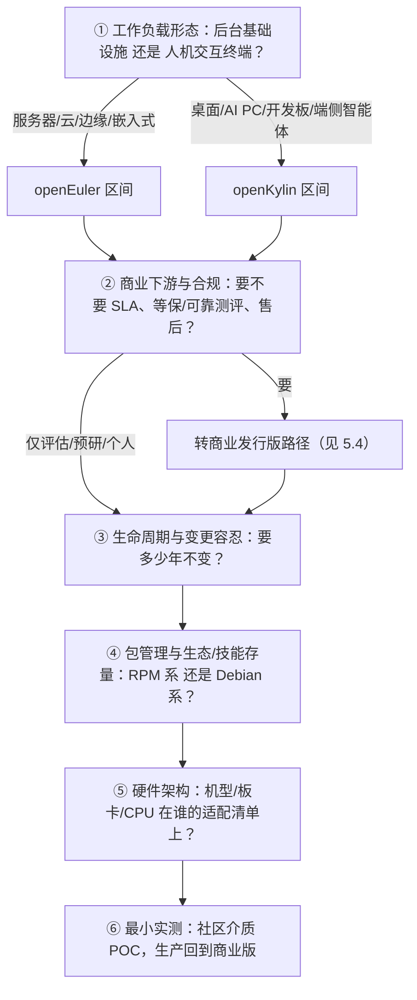

# 05 场景区间选型法：我该选谁、怎么落地

> 本文是 E 阶段模式的完整操作版。读完你会得到：六步决策流程、一张可填写的决策表、典型人群的直接建议、商业版路径、五条反模式与检验标准。

## 5.1 模式全文：场景区间选型法（L1-draft）

> 本模式已独立沉淀入方法论模式库，通用表述与跨域迁移（服务器侧双根社区、OLTP/HTAP、K8s 发行版）见 [场景区间选型法](../../../../retrospective/patterns/methodology-patterns/governance-strategy/scenario-interval-selection.md)；本页是 openEuler/openKylin 案例的完整操作版。

面对同一治理体系内两个相邻根社区，不按知名度与总量指标选型，而按五个维度依次提问，把选项推向不同区间，最后以最小实测收口。

**适用于**：存在明确工作负载形态分叉、治理同源、特性表大面积重叠的根社区/基础软件选型（本案例：openEuler 与 openKylin）。

**不适用于**：同一场景内的直接竞品横评；纯个人偏好选择；已被商业合同/认证锁定的采购；两边均无成熟下游的全新场景。

### 六步流程

| 步骤 | 提问 | openEuler 区间的答案 | openKylin 区间的答案 |
|---|---|---|---|
| ① 工作负载形态 | 系统的主要使用者是人还是别的系统？ | 服务器、云宿主、容器/虚拟化平台、边缘网关、超节点、机器人板卡（O-004/O-020） | 桌面办公、AI PC、双模平板、RISC-V 桌面/开发板、端侧智能体（K-001/K-010/K-011） |
| ② 商业下游与合规 | 是否需要 SLA、测评背书、原厂售后？ | 25 家商用 OSV 中按行业与芯片选型（O-007/O-031） | 银河麒麟桌面商业版（K-012）；关注 V11 系列测评公告（本地包 F-061） |
| ③ 生命周期与变更容忍 | 规划运行几年、升级窗口多大？ | LTS 间隔 4 年、窗口 6—8 年；大 SP 24 个月、小 SP 9 个月；创新版仅 6 个月（O-015） | LTS 3 年间隔、维护 5 年；创新版 12 个月被动维护（K-004） |
| ④ 包管理与存量 | 团队与现有资产在哪一侧？ | RPM/dnf、CentOS 系迁移、服务器软件生态（O-023） | dpkg/apt、Debian/Ubuntu 桌面软件与外设生态（K-007） |
| ⑤ 硬件架构 | 具体型号在谁的镜像/SIG/适配清单上？ | 鲲鹏/服务器 ARM、x86 服务器、嵌入式 hi 系列板卡（O-020/O-021） | 国产 X86/ARM 整机、龙芯、RISC-V 开发板统一镜像（K-010、本地包 F-023） |
| ⑥ 最小实测 | 如何把纸面选择变成证据？ | 目标硬件装对应 LTS/SP，跑基准业务与 CVE 升级演练 | 默认桌面介质跑外设/办公软件/AI 场景；WSL 336M 可作最低成本首轮（本地包 F-031） |

### 检验标准

- 五问每题有书面答案，且可由未参与选型的第三人复核；
- 最终选择至少附一条**工作负载证据**（镜像标签、适配清单、手册原文），不得以知名度或装机数字作为唯一依据；
- 商业路径写明 OSV 名称、产品版本与测评编号；
- POC 记录含硬件型号、介质版本（精确到 SP）、失败项与升级演练结果。

### 五条反模式

1. **跨场景比总量**：用 2000 万服务器装机论证桌面可用，或用 247 万桌面用户论证服务器可运维（O-013/K-003）。
2. **把相似性当同质**：以"同属开放原子、都有 UKUI、都发 AgentOS"为由任意互换（治理同构见[02](02-governance-and-ecosystem.md)，AgentOS 同名不同层见[04](04-technology-stack.md)）。
3. **社区版直接上关键生产**：忽视社区支持与商业 SLA、测评主体的差异；6—8 年/5 年是社区维护制度，不等同故障响应合同（O-015/K-004）。
4. **六名混谈**：EulerOS、欧拉、openEuler、银河麒麟、openKylin、优麒麟张冠李戴（辨析见[00 第 0.2 节](00-overview.md#02-六个名字的辨析最常见的张冠李戴)）。
5. **用宣传口径做采购测算**：57.3%、2000 万套、20%—30% 能效、36.5 倍等均为大会/白皮书转引/官方口径，未取得原始报告或自采数据前不得进入财务与容量模型（O-012/O-013/O-029，V 审查 V-01）。

### 跨域迁移与成熟度

- **跨域迁移**：同法可用于 openEuler 与龙蜥 Anolis 的服务器侧区间判定（第①问改用"合规认证/云厂商绑定/存量绑定"维度）、数据库 OLTP/HTAP 分工、Kubernetes 商业发行版选型；"先分工作负载形态"对一切"听起来差不多"的二选一基础软件决策通用。与既有[最小充分脚手架选型法](../../../../retrospective/patterns/methodology-patterns/governance-strategy/minimal-sufficient-scaffold-selection.md)互补：本模式负责"站在哪个区间"，后者负责"区间内选多厚的栈"。
- **成熟度**：**L1-draft**。步骤①—④由本案例双侧事实支撑，步骤⑥借自最小充分脚手架选型法的真实任务验证原则。升级 L2 条件：在第二个独立双根社区场景（数据库或云原生方向）完整应用五问并回填修订。

## 5.2 典型人群的直接建议

| 你是谁 | 建议 |
|---|---|
| 企业基础设施负责人（服务器/云/边缘替换 CentOS 或新建集群） | openEuler 区间；关键生产直接从 25 家 OSV 选商业版（已有银河麒麟高级服务器版等基于 openEuler 的产品手册与测评先例，O-031、本地包 F-061），社区 LTS 用于同质验证与预研 |
| 政企信创桌面采购 | openKylin 区间的商业承接：银河麒麟桌面商业版（V11 系列关注安全可靠测评公告），社区版用于兼容性验证与规模试点（K-012、本地包 F-061） |
| 个人桌面尝鲜/国产硬件爱好者 | openKylin 社区版：求稳用 2.0 SP2 LTS，尝新用 3.0；Windows 机器可先用 336M WSL 镜像低门槛体验（本地包 F-031；本机安装排障见 openKylin 包 WSL 指南） |
| RISC-V/龙芯/飞腾开发板项目 | openKylin 统一镜像与 SIG 优先核查（桌面/开发板侧投入最深，K-010）；机器人/hi 系列板卡同时核查 openEuler Embedded 26.03（O-020） |
| AI 应用与智能体开发者 | 端侧智能体（操作桌面、本地模型、MCP）走 openKylin 3.0 底座（K-011）；推理服务编排、NPU 切分、混部增效走 openEuler 24.03 SP4 侧能力（O-019/O-029） |
| 运维团队主管 | 先盘技能栈：RPM/dnf 与 CentOS 迁移脚本资产指向 openEuler；Debian/apt 桌面运维资产指向 openKylin（O-023/K-007），不要在没有培训预算时逆存量选型 |
| 深度 Ubuntu 生态个人用户 | 优麒麟（Ubuntu Kylin）仍是独立选项，它是 Ubuntu 风味版而非 openKylin 的版本（本地包 F-053），属于本对比之外的第三条线 |

## 5.3 最小实测清单（第⑥问展开）

1. 介质校验：从官方下载页获取 ISO/WSL，核对版本到 SP 与镜像日期（openEuler 侧注意官方发布日与仓库日可能不同，O-018）。
2. 硬件实测：目标整机/板卡全部外设就位安装，记录免驱与待适配清单。
3. 负载实测：跑一条真实业务链路（不是跑分），桌面侧含办公软件/会议/外设，服务器侧含数据库或容器平台基线。
4. 升级演练：执行一次包管理全量升级并核对 CVE 公示处理（openEuler 可直接订阅周度 update 邮件，O-022）。
5. 回退与恢复：openKylin 磐石/不可变系统验证原子回滚（K-008）；openEuler 侧验证热补丁或常规内核维护窗口（O-027）。
6. 商业尽调：向 OSV/麒麟软件索取 SLA、测评证书编号与生命周期承诺函，与社区制度文本分开归档。

## 5.4 商业版路径速查

| 路径 | 上游 | 承接产品（公开材料点名） | 关键凭证 |
|---|---|---|---|
| 服务器 | openEuler | 银河麒麟高级服务器 V10 SP3（手册明确基于 openEuler 构建、4.19 内核生命周期内不变）等 25 家 OSV（O-031/O-007） | 安全可靠测评公告（如 V11 SP1 过 II 级，本地包 F-061）、行业案例（O-032） |
| 桌面 | openKylin | 银河麒麟桌面 V10/V11（手册明确 openKylin 为上游，K-012） | 测评公告、适配证书流程（本地包 F-038） |
| 衍生/行业 | openKylin | AgentOS、Claw Box OS、行业定制 Derivative OS（K-011） | 社区下载页与项目方说明 |
