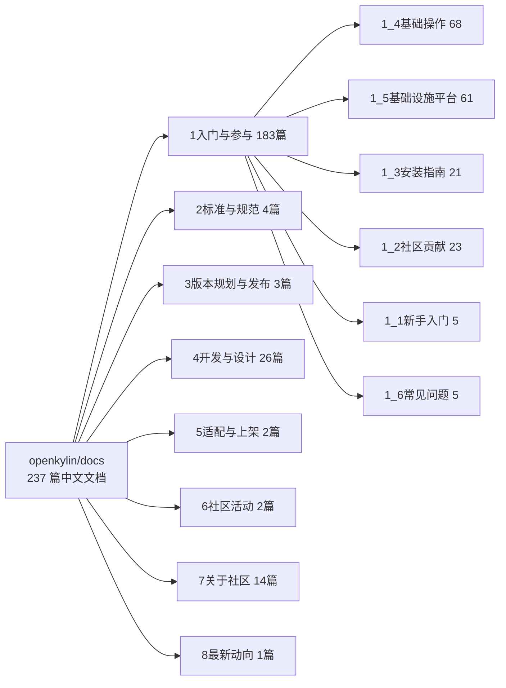

# 01 平台与源仓库地图：237 篇文档到底有什么

> 读完本文你会知道：文档平台怎么搭起来的、内容重心在哪、哪些板块新哪些旧、遇到问题该先查哪里。

## 1.1 平台形态：docsify 渲染的 Gitee 仓库

openKylin 文档平台（https://docs.openkylin.top/zh/home）没有独立的后台编辑器，它是用 docsify 把 Gitee 仓库 **openkylin/docs**（https://gitee.com/openkylin/docs）里的 Markdown 文件实时渲染成网页：

- 浏览器地址栏里的 URL 直接对应仓库中的 `.md` 文件路径，例如页面"社区简介"对应仓库 `7关于社区/7_1关于社区/` 下的文件。
- 首页正文就是仓库根目录的 `home.md`；中文内容在根的 8 个编号目录里，英文内容在 `en/` 目录。
- 文档平台由 **docs SIG**（文档兴趣小组）维护，公开渠道是邮件列表 docs@lists.openkylin.top。

这意味着一个重要的学习技巧：**网页信息不全或链接失效时，直接去 Gitee 仓库看文件树与最新提交**——仓库才是事实源。

## 1.2 内容版图：一图看清 237 篇的分布

截至 2026-09-29，仓库递归条目 3181 个（含图片资源），其中中文 Markdown 237 篇。板块分布如下：

| 板块 | 篇数 | 对学习者的价值 | 时效观感 |
|---|---:|---|---|
| 1_4 基础操作 | 68 | 最高：桌面、终端、软件安装、驱动、AI 工具实操 | 新旧混合，设有"失效文档"子目录 |
| 1_5 基础设施平台 | 61 | 开发者高价值：AI 模型配置、OKBS/版本构建平台、约 30 篇开发指南 | AI 配置系列较新 |
| 1_3 安装指南 | 21 | 高：x86/ARM/RISC-V/WSL 全路径 | WSL 篇对应 3.0，较新 |
| 1_2 社区贡献 | 23 | 高：SIG 治理 12 篇、贡献攻略、AI 辅助贡献守则 | AI 守则 2026-08，最新一档 |
| 4_9 桌面设计（UKUI） | 22 | 面向设计/前端贡献者：UKUI3/4 设计规范 | 与 UKUI 版本相关 |
| 7 关于社区 | 14 | 治理组织与政策规则 | 部分为图片版 |
| 其他板块 | 11 | 版本规划、规范、适配流程、活动入口 | 版本规划 2026-04，新；其余多为短页 |

完整逐文件地图见 [references/full-catalog.md](../references/full-catalog.md)。

## 1.3 质量分层：不是每一页都同等可信

文档库是多人多年滚动贡献的结果，至少存在四层，阅读时要区别对待：

1. **正式制度层**：经技术委员会（TC）表决的文件，如《版本发布规划》文首标注"2026年4月9日 TC 表决通过"。可信度最高。
2. **持续维护的操作文档**：提交记录显示 FAQ、SDK 指南在 2026-09 仍在更新；这类文档要核对其适配的软件版本号。
3. **社区投稿教程**：个人署名、场景具体（如某款开发板的安装记录），可用但适用面窄，换硬件/版本可能失效。
4. **占位与失效层**：首页文件名即标注"（需要更新）"的 4 篇新手文档、150–400 字符的索引短页、"失效文档"目录、被注释的 TODO 链接、指向旧编号目录（`01_安装升级指南`）的链接。

**识别技巧**：看文件 frontmatter 的 `date/dateCreated`、看文件名是否带"需要更新/过时/【过时】"、看文中出现的组件版本（UKUI 4.0 对应 1.0 时代；UKUI 4.24 对应 3.0）、看 Gitee 上该文件的最后提交时间。

## 1.4 文档贡献的硬性规则（也是文档风格的成因）

首页公布的规范解释了文档库为何呈现当前形态：

- 编码：无 BOM 的 UTF-8，统一 `.md` 后缀；
- 要素：标题、作者、创建时间；
- 图片：PNG 为主，建议高约 640px、宽不超 820px、单张不超 150K，放同级资源目录；
- 链接：仓库内一律相对路径，站外才用 http 绝对路径；
- 分支：主分支只接受 dev 分支 PR，禁止强推——这是 Gitee 提交带 `!编号`（合并请求号）的原因；
- 许可：默认 CC BY-SA 4.0。

## 1.5 检索建议

| 需求 | 推荐动作 |
|---|---|
| 找某操作怎么做 | 先在 1_4/1_5/1_3 内按文件名检索（文件命名高度口语化，如"从NVIDIA官网安装闭源显卡驱动"） |
| 找最新版本事实 | 读 3_1版本规划 + Gitee 仓库最近提交 + 官网下载页 |
| 找开发/构建入口 | 直接进入 1_5基础设施平台指南 与 4开发与设计 |
| 判断页面是否过期 | 看 frontmatter 日期、文中组件版本、Gitee 最后提交 |
| 页面链接 404 | 回 Gitee 文件树按文件名重定位（官方目录经历过编号调整） |
| 英文资料 | 仓库 `en/` 目录（本教程未做逐篇对照） |

> 下一篇：[02 版本发布与生命周期](02-release-lifecycle.md)——先确认版本制度，再决定学哪一代文档。
