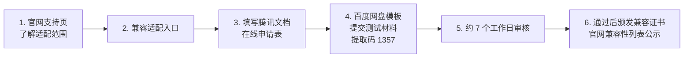

# 07 社区治理与贡献路径：五组织、SIG、三级角色与适配认证

> 文档站 1_2（23 篇）、7（14 篇）、5（2 篇）回答同一个问题：**作为个人或企业，怎样合法、有序地进入 openKylin 体系**。本文把治理结构、角色晋升、贡献入口、软硬件适配认证串成一张行动图。

## 7.1 治理结构：五个组织

《openKylin社区治理组织架构》描绘的顶层结构：

| 组织 | 职责 |
|---|---|
| 理事会 | 最高决策机构，重大方向、预算、组织变更 |
| 秘书处 | 日常运营、事务执行与协调 |
| 技术委员会（TC） | 技术决策最高机构：版本规划表决（如 2026-04-09 版本制度）、新 SIG 设立、仓库权限、软件包入官方源审批 |
| 咨询委员会 | 战略与生态咨询 |
| 生态委员会 | 生态合作、适配认证与产业推广 |

治理文件另有《openKylin社区政策规则》《政策与规则》《社区简介》《社区组织架构》《代码管理》《社区贡献者协议》《开源社区数据安全管理规则》。注意：部分"关于社区"页面正文以图片形式发布（《关于社区》正文 27 张图片无文字层），如需逐字引用应回源仓库核对。

## 7.2 执行单元：SIG（特别兴趣小组）

SIG 是实际干活的组织形态。文档库 1_2 中 SIG 相关文件 12 篇：

- **总览**：《openKylin SIG 列表》《openKylin SIG 指南》；
- **现存 SIG 条目（文档页）**：docs（文档）、i18n（国际化）、Release（发布）、Packaging（打包）、CompBase（兼容）、Kernel（内核）、Security（安全）、AI、UKUI 等（以《SIG 列表》页面为准，部分 SIG 页为占位短页）；
- **新建 SIG 流程**：

  ```mermaid
  flowchart LR
      A[1. Gitee 提交申请<br/>说明目标/范围/发起人] --> B[2. TC 审核表决]
      B --> C[3. 通过后建立<br/>邮件列表/仓库/SIG 页面]
      C --> D[4. 按 SIG 指南运作<br/>例会/产出/公开记录]
  ```

- SIG 文件要求遵循《openKylin 代码管理》与《SIG 成员与维护包变更流程》：成员、Maintainer、所维护软件包的变更均走公开 PR/表决留痕。

## 7.3 三级角色：权责边界与晋升

《openKylin 贡献角色》定义的三级体系：

| 角色 | 获得方式 | 权力范围 |
|---|---|---|
| **Contributor（贡献者）** | 提交被合并、完成 CLA 与行为准则 | 参与讨论、提交 PR/Issue；权力**仅限其加入的 SIG 内** |
| **Maintainer（维护者）** | SIG 内推举、按变更流程表决 | 合入本 SIG 仓库代码、打包权限、Review 职责；同样限本 SIG |
| **Owner** | 更高级别信任与组织程序 | SIG/仓库的最终责任人 |

关键规则：权力**不跨 SIG 自动生效**；重要事项按章程票数机制（文档口径为 2/3 票数）表决。新贡献者的标准起点就是 Contributor——从第一个被合并的 PR 开始。

## 7.4 五条贡献路径（非代码贡献同样正式）

| 路径 | 入口文档 | 第一步 |
|---|---|---|
| 代码/打包 | 《openKylin 贡献攻略》《开发者参与指南》+ [06 开发者基础设施](06-developer-infrastructure.md) | 签 CLA → 找/提 Issue → PR |
| 文档 | 《openKylin 文档贡献指南》《docs SIG》 | 从 docs 仓库"需要更新"标记或 Issue 入手 |
| 翻译/本地化 | 《非代码贡献指南》《i18n SIG 规范》《多语言本地化指南》 | 加入 i18n SIG/翻译平台 |
| 测试/Bug 反馈 | Issue 体系 + FAQ 贡献指南（含复现信息规范） | 按模板提交可复现 Issue（含环境信息命令输出，见 [04 §4.4](04-desktop-usage.md#44-硬件与驱动)） |
| 设计 | UKUI 设计规范 22 篇（[06 §6.7](06-developer-infrastructure.md#67-ukui-桌面设计规范4922-篇)） | 按设计指南出稿并联系 UKUI SIG |

《非代码贡献指南》明确：文档、翻译、设计、测试、社区支持都算正式贡献，晋升 Contributor/Maintainer 时与代码贡献同体系评估。

**AI 辅助贡献**必须遵守 2026-08-01 守则（披露模板、人类 Signed-off-by、禁 Bot 批量 PR、数据红线），详见 [05 §5.4](05-ai-stack.md#54-治理层ai-辅助贡献守则使用者也应了解)。

## 7.5 软件/硬件适配认证（企业生态入口）

文档站 5 板块两篇同构指南（软件适配、硬件适配），流程一致：



- 硬件适配要求提交 **1080p 以上的 MP4/AVI 演示视频**（含设备识别、功能验证过程）；
- 软件适配按应用类别提供安装与功能验证材料；
- 两份指南中含指向旧目录路径（`/zh/01_安装升级指南/...`）的链接，与当前目录编号不符，遇 404 回 Gitee 文件树重定位（参见 [01 §1.3](01-platform-and-repository.md#13-质量分层不是每一页都同等可信)）。

## 7.6 沟通渠道与行为要求

- **邮件列表**：主协作渠道（SIG 各有列表，如 docs@lists.openkylin.top）；新 SIG 通过 TC 审核后第一件事就是建列表，重要讨论要求列表留痕；《邮件列表使用指南》给操作步骤；
- **Gitee Issue/PR**：代码与任务讨论；
- **社区活动**：6 板块两篇（openKylin 校园沙龙、学生作业说明）面向高校；另有会议、黑客松等以官网"活动"栏目发布；
- **行为底线**：《贡献者协议》与《开源社区数据安全管理规则》——安全漏洞走非公开渠道、不泄露未公开代码与用户数据（与 AI 守则数据红线一致）。

## 7.7 新人 30 分钟上手清单

1. 读《社区简介》《SIG 列表》，选定 1 个与你技能匹配的 SIG；
2. 在 Gitee 注册并到 https://cla.openkylin.top 签个人 CLA；
3. 订阅该 SIG 邮件列表，翻最近 3 个月归档；
4. 在 community 仓库找标记"新手友好/help wanted"的 Issue；
5. 代码贡献按 [06](06-developer-infrastructure.md) 流程；文档贡献直接 fork `openkylin/docs`，从 4 篇"（需要更新）"文档或失效链接修复入手——本教程制作期间观察到，文档库的最新提交（2026-09）中 FAQ/SDK 类 PR 正是此类小步快跑的合并。

> 上一篇：[06 开发者基础设施](06-developer-infrastructure.md) ｜ 返回 [教程主页](../index.md) ｜ 信源台账见 [references/source-inventory.md](../references/source-inventory.md)
