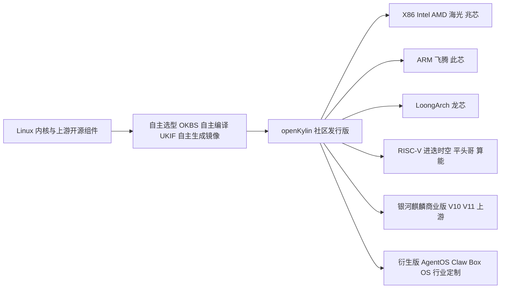

# openKylin 全面调研：从桌面根社区到 Agent OS

> 一句话摘要：openKylin（开放麒麟）是 2022 年由麒麟软件主导发起、2024 年捐赠开放原子开源基金会的 Linux 桌面操作系统**根社区**，以"核心组件自主选型 + 多架构同源 + UKUI 桌面"为底座，四年间从 AI 插件走到 3.0 的智能体原生操作系统，并作为银河麒麟商业版的上游社区存在。本文按方法论编排 **R（事实）→ G1 → I（洞察）→ E（模式）→ V（对抗）→ G2/G3** 的链路产出，所有结论可回溯到 §9 信源。

- **编排 session**：`sc-20260929-openkylin-research`
- **场景与链路**：场景 4 知识沉淀，`R→I→E→V→C（入库）`，depth=standard
- **信源访问日**：2026-09-29；时点最新版本 **openKylin 3.0**（桌面镜像日期 2026-09-05），长期稳定版 **2.0 SP2**

---

## 1. 一分钟画像

OpenAtom openKylin 是由开放原子开源基金会孵化及运营的开源操作系统项目，官方愿景为"为世界提供与人工智能技术深度融合的开源操作系统"，自我定位为"智能操作系统开源根社区" [S09]。它由麒麟软件联合 13 家单位于 2022-06-24 发起 [S10]，2024-09-25 完成中国首例央企开源捐赠进入基金会体系 [S13]。截至 2026-07-31，社区用户超 247 万、会员超 2210 家、开发者超 2.4 万、SIG 158 个 [S12]。



**三个最容易混淆的项目（详见 §5）**：

| 名称 | 性质 | 上游关系 |
|---|---|---|
| **openKylin（开放麒麟）** | 基金会旗下社区根项目，独立构建发行版 | 银河麒麟商业版的上游社区 [S14] |
| **银河麒麟 Kylin OS** | 麒麟软件商业发行版（桌面/服务器 V10、V11） | 以 openKylin 为技术源头 [S14] |
| **优麒麟 Ubuntu Kylin** | Ubuntu 官方风味版之一（Launchpad 托管） | 独立老项目，与 openKylin 并行 [S22] |

---

## 2. R 阶段：客观事实清单（F-001 ~ F-062）

> G1 已通过：纯客观陈述、无因果推断词、每条附信源编号；官方口径数字与第三方数字分别标注；多源日期不一致处显式保留。

### 2.1 A 组：定位、起源与治理

| 编号 | 事实 | 来源 |
|---|---|---|
| F-001 | 官方全称为 OpenAtom openKylin，定位为开放原子开源基金会孵化及运营的开源项目，由基础软硬件企业、非营利组织、社团组织、高校、科研机构与个人开发者共同创立 | [S09] |
| F-002 | 社区愿景表述为"为世界提供与人工智能技术深度融合的开源操作系统"；原则为"开源、自愿、平等、协作" | [S09] |
| F-003 | 2022-06-24 openKylin 社区以线上发布会正式发布，官方表述为"中国首个桌面操作系统根社区"，发布会观看量超 200 万；麒麟软件主导，首批 13 家理事会单位为麒麟软件、国家工信安全中心、普华基础软件、中科方德、麒麟信安、凝思软件、一铭软件、中兴新支点、元心科技、中国电科 32 所、技德系统、北京麟卓、先进操作系统创新中心 | [S10] |
| F-004 | 治理机构包含理事会、咨询委员会（公开出席的院士含沈昌祥、倪光南、桂卫华、郑纬民、王怀民等）、项目工作委员会、生态委员会与 SIG 层级 | [S10][S08] |
| F-005 | 2024-09-25 麒麟软件在开放原子开源生态大会宣布将 openKylin 社区捐赠给开放原子开源基金会，官方表述为"我国首例央企开源捐赠"；基金会提供中立性保障、AtomGit 代码托管、法务与知识产权等服务 | [S13] |
| F-006 | 捐赠时点（2024-09）官方披露：社区企业会员超 560 家、用户累计超 170 万、覆盖 188+ 国家和地区、已发布 8 个桌面系统版本 | [S13] |
| F-007 | SIG 数量时点序列：2022-07 为 14 个；2023-03 近 60 个；2023-07 为 74 个；2024-08 为 110+ 个；2025-08 为 141 个；2026-02-28 为 151 个；2026-07-31 为 158 个 | [S16][S30][S17][S05][S08][S11][S12] |
| F-008 | 社区规模时点序列：2022-07 有 46 家企业加入；2023-03 有 150+ 单位会员、2000+ 注册开发者、70 万+ 用户；2023-07 有 3867 名开发者、271 家企业；2024-08 有 6500+ 开发者、520+ 企业；2026-02-28 用户超 230 万、会员超 2070 家、开发者超 2.1 万；2026-07-31 用户超 247 万、会员超 2210 家、开发者超 2.4 万 | [S16][S30][S17][S05][S11][S12] |
| F-009 | 代码主托管平台为 Gitee 的 openkylin 组织（gitee.com/openkylin），含 community、kaiming、qa 等仓库；社区基础设施含 CLA 平台、UKBS 编译平台、UKIF 镜像平台、UKCI 平台 | [S20][S21] |
| F-010 | 麒麟软件为中国电子（CEC）旗下企业，2020 年 1 月由天津麒麟信息技术有限公司与中标软件有限公司整合成立 | [S12] |
| F-011 | 麒麟软件官网引用赛迪顾问统计称其操作系统产品连续 15 年位列中国 Linux 市场占有率第一；麒麟软件为开放原子开源基金会白金捐赠人，并为 openEuler 社区发起者之一 | [S12] |

### 2.2 B 组：版本时间线

| 编号 | 事实 | 来源 |
|---|---|---|
| F-012 | 2022-07-22 首个体验版 openKylin 0.7 发布，基于 Linux 5.15，默认 UKUI 3.1，开启 Wayland 支持与平板模式；基础库含 glibc 2.31、GCC 9.3、Python 3.8.2、Qt 5.15 LTS；发布节奏规划为每年一个操作系统版本 | [S16] |
| F-013 | openKylin 0.7.5 更新版完成 KMRE 适配，修复 150+ 已知 Bug | [S16] |
| F-014 | 2023-01-12 openKylin 0.95 版本发布，基于 Linux 5.15，默认搭载 UKUI 4.0，优化平板模式与多端互联互通 | [S18] |
| F-015 | 2023-05-16 openKylin 1.0 Beta 开启公测 | [S18] |
| F-016 | 2023-07-05 openKylin 1.0 正式发布，默认 6.1+5.15 双内核（启动时可切换），完成 20+ 核心组件自主选型，修复超 1000 个 Bug；凝聚 3867 名开发者、74 个 SIG、271 家企业 | [S17] |
| F-017 | 1.0 适配 X86、ARM、RISC-V 三架构的 PC、平板与教育开发板；新增智能语音助手；软件商店上架百余款 Windows 与 Android 应用；实现从应用程序到底层库对 GB 18030-2022 的支持 | [S17] |
| F-018 | 2024-08-08 openKylin 2.0 正式发布，默认 Linux 6.6 LTS，完成 180+ 核心组件自主选型（gcc 12.3、glibc 2.38、binutils 2.41、llvm 17、qt 5.15、gtk 3.24、jdk 17、python 3.12、systemd 255、grub 2.12），搭载 UKUI 4.10，累计修复 Bug 3000+，汇聚 6500+ 开发者、110+ SIG、520+ 企业 | [S05] |
| F-019 | 2.0 新特性含 NPU 支持、EEVDF 调度器、Shadow Stack 安全技术、开明软件包格式、基于 OSTree 的不可变系统、wlcom Wayland 合成器、KARE 生态兼容方案（1.0 系列原生软件在 2.0 上"安装+启动"综合成功率官方口径 94%）、AI 子系统与麒麟 AI 助手 | [S05] |
| F-020 | 2024-12-20 openKylin 2.0 SP1 发布；其 openKylin 6.6 内核含 16000+ 上游社区补丁与 200+ 硬件厂商补丁；新增 ARM 与 LoongArch 通用镜像（龙芯 3A6000、飞腾 D3000、此芯科技 P1）；推出统一 RISC-V 镜像及烧录工具，支持 VisionFive2、LicheePi4a、Milk-v-pioneer、SpacemiT K1 四平台；修复 600+ Bug | [S06] |
| F-021 | openKylin 2.0 SP2 于 2025-08-26 正式发布（英文新闻稿日期 2025-08-31；官网下载中心 LTS 镜像更新日期标注 2026-08-13）；6.6 内核合入 10000+ 上游补丁；搭载 UKUI 4.20；原生开发 SDK 升级至 3.0，英文稿口径新增 273 个 API、中文运营报告口径新增 300+ 接口 | [S07][S08][S01] |
| F-022 | SP2 内置接入 DeepSeek、文心一言、通义千问、商汤、讯飞星火、百川等云端大模型（API Key 方式），并通过软件商店提供 Qwen2.5-3B 等本地模型；首次搭载"磐石架构"，由不可变系统、KARE 兼容环境、开明包格式三项技术组成 | [S07] |
| F-023 | SP2 硬件兼容扩展至海光 C86-4G、飞腾 D3000、兆芯 KX-7000、龙芯 3A6000、格兰菲 Arise2 显卡、中关村实验室 HAOC，并适配联想开天、中科可控等 100 余款整机型号 | [S07][S08] |
| F-024 | openKylin 3.0 桌面镜像（X86/ARM/LoongArch）官网日期为 2026-09-05；X86 Server 镜像日期 2026-09-16；ARM/LoongArch Server、WSL、RISC-V 镜像日期 2026-08-28；科技日报 2026-08-31 已刊发 3.0 发布报道；官方发布新闻稿日期为 2026-09-07 | [S01][S02][S04][S03] |
| F-025 | 3.0 将系统内核从 Linux 6.6 跨代升级至 Linux 7.0；核心组件升级 GCC 15、glibc 2.42、LLVM 22、JDK 25；180 余个核心组件完成迭代 | [S03][S04] |
| F-026 | 3.0 集成 NIST 三项后量子密码标准 ML-KEM、ML-DSA、SLH-DSA，通过 openHiTLS 开源密码套件实现系统级调用，配合 TPM 可信启动链 | [S03][S04] |
| F-027 | 3.0 内核层支持 Rust For Linux，可用 Rust 编写外设驱动；核外层 wget、time 等首批系统工具完成 Rust 重写 | [S03][S04] |
| F-028 | 3.0 新增朝鲜语、泰语、阿拉伯语、俄语、德语、日语、法语等 18 种语言支持 | [S03][S04] |
| F-029 | 3.0 搭载 UKUI 4.24：隔空手势（握拳截屏、挥手翻页与音量调节）、全局语音输入、触摸板边缘滑动调节亮度/音量/进度、系统级屏幕朗读、任务栏三岛模式（数据岛、应用岛、设置岛）、动态壁纸 | [S03] |
| F-030 | 3.0 同源支持 X86、ARM、RISC-V、LoongArch 四架构；支持 RVA23 标准；官方口径称经 RVV 指令优化后 RISC-V 平台 AI 推理 FP32 场景提速 2 至 5 倍、FP16 场景最高 36.5 倍 | [S03][S04] |
| F-031 | 3.0 下载中心提供 Desktop、Server、WSL（最小镜像 336M）、Desktop WSL、Phytium Pro、RISC-V SpacemiT K3 Server（962M）与 Embedded（4.8G）等镜像；历史版本列表含 openkylin3_0_agentos 镜像 | [S01][S02] |
| F-032 | 3.0 发布新闻列举"20 余款覆盖 AI、云计算、大数据的 Docker 应用镜像"作为全场景能力覆盖的一部分（与"灵龙"人形机器人、AI 无人小车、AI 机械臂、主流 AI PC、PocketClaw 便携终端、服务器与工作站并列），未声明这些镜像基于 3.0 构建；2026-10-08 复核官方镜像仓列表：共 25 款应用镜像，`okVersion` 字段全部为 2.0，Tag 规则为「应用版本-ok20」，最近更新 2026-07-30，均早于 3.0 发布日（2026-09-07） | [S03][S31] |

### 2.3 C 组：技术架构与工程体系

| 编号 | 事实 | 来源 |
|---|---|---|
| F-033 | 官方以"核心组件自主选型"描述其构建路线：1.0 完成 20+ 组件自主选型构建，2.0 完成 180+；1.0 发布稿将其表述为"具备构建根社区独立上游的能力" | [S17][S05] |
| F-034 | 0.7 时期公开的工程平台为"码云 → OKBS 编译平台 → OKIF 镜像构建平台"的一体化流水线，官方表述为"代码自主选型、软件包自主编译、镜像自主生成"；SIG 列表中对应基础设施名为 UKBS、UKIF、UKCI 与 CLA 平台 | [S16][S21] |
| F-035 | 官方升级指南使用 apt 命令（apt update、apt install kylin-revision-manager）进行软件包与跨版本升级管理 | [S06] |
| F-036 | 开明（Kaiming）软件包由 KaiMing SIG（麒麟软件发起）研发，目标为"应用与系统解耦、一次打包多处运行"；随 2.0 首次推出，软件商店上架 100 款开明应用；2025-08 升级为 base + runtime + app 架构，底层沙箱工具升级为符合 OCI 规范的 crun，新增包签名、文件反查接口、depend 预编译依赖机制、可视化构建工具与增量构建；代码仓库 gitee.com/openkylin/kaiming | [S05][S20] |
| F-037 | openKylin 不可变系统基于 OSTree 技术研发，支持原子更新、失败回滚，改变系统目录结构与版本更新管理方式 | [S05] |
| F-038 | wlcom 是 openKylin Wayland SIG 自研维护的 Wayland 合成器，承担输入事件接收、窗口管理、屏幕图像输出能力 | [S05] |
| F-039 | KARE 为生态兼容环境组件；SP2 将"不可变系统 + KARE + 开明包"组合命名为"磐石架构" | [S07] |
| F-040 | UKUI 为 Qt 技术栈桌面环境（2.0 组件清单中 Qt 5.15 与 GTK 3.24 并存）；版本序列为 UKUI 3.1（0.7）→ 4.0（0.95）→ 4.10（2.0）→ 4.20（SP2）→ 4.24（3.0）；项目站点为 ukui.org | [S16][S18][S05][S07][S03] |
| F-041 | 《openKylin 技术全景案例集（2024）》收录的社区技术项含：分级冻结机制、VirtIO-GPU 硬件视频加速框架与 AV1 解码、不可变系统、GB18030-2022 支持、UKUI、wlcom、麒麟输入法框架、RVtrans 二进制翻译技术、KARE、开明包、openKylin Wine 助手、KylinCode IDE、openSDK、青霜 Web 框架、UraSDK、RISC-V 统一镜像烧录工具、Genmai、火焰卫士、openKylin AI SDK、麒麟 AI 助手 | [S19] |
| F-042 | 社区设有 Compliance（开源合规与知识产权，对接可信开源合规计划）、SBOM（软件物料清单）、KYChain（开源软件供应链安全，国防科技大学）、PQCTransition（后量子密码工程化）、ConfidentialComputing（ARM TEE 机密计算）等安全与供应链相关 SIG | [S21][S08] |
| F-043 | KG4OS SIG（Knowledge Graph For OS）以知识图谱方法解析软件包依赖、冲突关系与操作系统演化中的兼容性故障机理 | [S21] |

### 2.4 D 组：AI 能力演进

| 编号 | 事实 | 来源 |
|---|---|---|
| F-044 | 1.0（2023-07）开始 AI 大模型产品兼容：开始菜单上架 AI 大模型插件演示程序，用户自行提供 API Key 与 Secret Key 调用大模型接口 | [S17] |
| F-045 | 2.0（2024-08）构建 AI 子系统、向上提供统一 AI 接口，上线麒麟 AI 助手、智能文生图、智能模糊搜索、智能剪切板、智能数据管理；完成 Intel 14 代 Meteor Lake AI PC 适配；与讯飞星火合作提供 V4.0 免费试用账号 | [S05] |
| F-046 | SP2（2025-08）AI 助手改版为窗口/侧边双显示模式，支持图片文档拖拽、可定制快捷指令、本地文档知识库问答 | [S07] |
| F-047 | 3.0（2026-09）构建"智能体开放底座"：将模型、记忆、工具、系统权限与桌面能力纳入统一架构；智能体通过 MCP 协议直接调用桌面能力；KylinBot、WorkBuddy、OpenClaw、Raccoon Work 等智能体可完整运行；提供统一封装 AI SDK（一套接口适配多家大模型）；开发者技能可提交至 openKylin-skills 仓库；系统预装 Token 中心客户端，以签到方式发放模型 Token 额度 | [S03] |
| F-048 | 下载中心将衍生版分为 AgentOS（面向智能体的操作系统镜像）、Claw Box OS（openKylin + openClaw 开箱即用的创新硬件镜像）、行业定制 Derivative OS 三类；历史版本中含 openkylin3_0_agentos 文件名 | [S01][S02] |
| F-049 | 2026-07 社区宣布成立移动智能工作组（Mobile Intelligence Working Group），向移动端扩展 | [S24] |
| F-050 | 2026-09 智谱 AI 工作助手 AutoClaw 完成适配并上架麒麟软件商店与 openKylin 社区 | [S25] |

### 2.5 E 组：生态、商业版图与国际化

| 编号 | 事实 | 来源 |
|---|---|---|
| F-051 | 银河麒麟桌面操作系统产品手册明确表述"openKylin 是银河麒麟商业版的上游社区"；麒麟软件"1+2+3+M+N"产品体系中"1 个技术源头"为开放麒麟社区，旗舰产品为银河麒麟桌面与高级服务器操作系统 | [S14][S13] |
| F-052 | 麒麟商业产品线覆盖桌面、高级服务器、嵌入式、云操作系统与星光麒麟智能终端（万物智联）；官网新闻显示在售版本包括银河麒麟 V10/V11 系列 | [S12][S25] |
| F-053 | 优麒麟（Ubuntu Kylin）是麒麟软件主导的另一开源项目，官网称有 10 年以上历史、累计 20 个操作系统版本、全球下载量 3800 万+、活跃爱好者与开发者 20 万+；优麒麟 26.04（2026-04-24 发布，支持 3 年）基于 Ubuntu、Linux 7.0 内核、UKUI 4.20，工程协作在 Launchpad/Ubuntu 邮件列表，与 openKylin 为不同项目 | [S15][S22] |
| F-054 | 截至 2026-07-31，麒麟软件官网披露累计硬件适配超 106 万项、软件适配超 748 万项，合计超 855 万项 | [S12] |
| F-055 | 2026-09-15 上合组织数字经济论坛（乌鲁木齐）发布"openKylin 开源操作系统与国际根社区"成果；"面向上合组织成员国开展 openKylin 开源操作系统项目"列入《中国推动上合组织发展行动成果清单（2025—2026）》；官方披露已在全球建立 55 个用户组、2400+ 社区成员，支持 100 种语言适配，UKUI 已进入 12 个主流国际 Linux 发行版 | [S23] |
| F-056 | 社区荣誉含 2025 年度中国计算机学会（CCF）科技进步特等奖、中国信通院"可信开源项目/社区"评估（2022 年起连续获评）、世界互联网大会"开源优秀社区"、OSCAR 尖峰开源社区等 | [S09] |
| F-057 | 横向对照：统信 UOS 以 deepin 为根社区、自研 DDE 桌面环境与玲珑包格式，V25（2026-04-15 发布）同样内置不可变"磐石系统"并向 Agent OS 演进（AI SDK V2、支持 MCP 与 Skills 外挂）；deepin 已独立发展为桌面操作系统根社区 | [S27] |
| F-058 | openEuler 由开放原子开源基金会托管，定位服务器、云计算、边缘与嵌入式后端场景；科普综述将其与麒麟、统信、龙蜥并列为国产操作系统代表，前后端分工 | [S28] |
| F-059 | 第三方商业市场报告（博研咨询，2026-04 上传至豆丁文库，方法论为"PC 出货量 × 预装渗透率 × 授权均价加权测算"）给出 2025 年中国桌面 OS 市场份额：统信 UOS 约 38.4%、银河麒麟约 32.1%；同机构另一份报告数字为 UOS 38.6%、麒麟 29.1%，两份报告数字不一致 | [S29] |
| F-060 | 界面新闻 2026-04 综述引用赛迪顾问数据称银河麒麟连续十四年位居中国 Linux 市场占有率第一，行业累计部署超 2000 万套、服务用户超 21 万家 | [S26] |
| F-061 | 中国信息安全测评中心 2026 年第 3 号公告显示，银河麒麟高级服务器操作系统 V11 SP1 通过安全可靠测评 II 级 | [S25] |
| F-062 | 2026-09 麒麟 100"双模"硬件发布，官方英文新闻将其表述为 openKylin 的技术衍生版（technology-derived distro），形态覆盖平板与 PC 双模式 | [S24] |

---

## 3. I 阶段：核心洞察（四元组）

> G2 已通过：每条含 **陈述 / 证据（F 编号）/ 反常识 / 行动**，四个维度（供应链、治理、AI、架构）互不重叠。

### I-1　"根社区"的实质是供应链三自主，不是换皮发行版

- **陈述**：openKylin 与常见"基于 Ubuntu 重建"的衍生版的核心区别，是它自建了**组件选型 → 编译构建 → 镜像生成**的完整供应链（OKBS/UKBS、OKIF/UKIF、UKCI），并以"自主选型"作为每个大版本的头号叙事（1.0 为 20+ 组件、2.0/3.0 为 180+ 组件）。
- **证据**：F-033（自主选型表述与组件数）、F-034（码云→OKBS→OKIF 流水线）、F-016（1.0 即具备双内核切换）、F-053（优麒麟才是 Ubuntu 风味版，两条线并存）、F-009（Gitee 自有代码组织与 CLA/CI 平台）。
- **反常识**：舆论容易把所有国产桌面 Linux 归为"Ubuntu 换皮"。证据显示 openKylin 与优麒麟是麒麟体系下刻意分开的两条路线——优麒麟留在 Ubuntu 上游体系内，openKylin 走独立构建；两者 2026 年甚至分别用 UKUI 4.20/4.24 不同步演进。
- **行动**：评估任何"自主操作系统"时用供应链三问——组件版本能否自主选型（而非跟随某上游点版本）？有无自有编译构建平台？镜像能否自主生成？三问均为"是"才进入根社区梯队；同时区分"自主选型"与"自研组件"（见 V-04）。

### I-2　央企捐赠基金会：把企业项目升级为产业资产，同时保留下游商业闭环

- **陈述**：2024 年的基金会捐赠在治理层把 openKylin 从"麒麟软件主导"变为"基金会孵化运营"，但在产业链路上保留了"openKylin 上游 → 银河麒麟商业发行版下游"的闭环；捐赠后社区规模保持增长（SIG 141→158、用户 230 万→247 万）。
- **证据**：F-005（首例央企开源捐赠与基金会服务内容）、F-006/F-007/F-008（捐赠前后规模序列）、F-051（产品手册明示上游关系与"1+2+3+M+N"中的源头位置）、F-004（理事会/委员会治理结构）、F-011（白金捐赠人身份）。
- **反常识**：直觉上"捐赠=企业放弃控制权"。实际结构更接近 Red Hat 与 Fedora 的关系——治理中立化用于吸引竞争厂商（普华、中科方德、麒麟信安等同台入理事会）贡献资产，而最大商业受益者仍是发起方；中立性是生态扩容的手段，不是商业退出。
- **行动**：判断开源社区健康度，不要只看用户数，要看三组结构指标——SIG 发起单位的多样性（非发起方企业主导的 SIG 占比）、版本特性贡献单位名单、跨企业治理席位；本仓调研引用 openKylin 数据时统一标注"社区口径"。

### I-3　操作系统 AI 化四年完成四级跳，3.0 的关键变化是"智能体调用系统"而非"系统装 AI 应用"

- **陈述**：openKylin 的 AI 能力沿四级演进——① 1.0 的**应用级插件**（自带 Key 调聊天接口）→ ② 2.0 的**子系统级**（统一 AI 接口、系统应用智能化）→ ③ SP2 的**模型枢纽级**（多云模型 + 本地模型 + 文档知识库）→ ④ 3.0 的**智能体原生底座**（模型/记忆/工具/权限/桌面能力统一架构，智能体经 MCP 直接操作桌面，技能仓库化分发）。
- **证据**：F-044、F-045、F-046、F-047（四级演进每一级的官方特性）、F-048（AgentOS 独立镜像品类）、F-050（第三方智能体上架）。
- **反常识**：桌面 OS 的 AI 竞赛焦点正在从"自带哪个大模型"转向"智能体拥有多大系统权限、按什么协议调用"。3.0 的措辞是智能体"不是装进系统的应用，而是直接调用系统能力的原住民"，并选择 MCP 而非私有协议——竞争对象从应用商店生态变为智能体运行时生态。
- **行动**：把桌面/终端系统的 AI 评估清单改为五项——系统级能力是否以开放协议暴露（MCP/ACP 类）？第三方智能体是否与自研智能体权限对等？技能如何分发与签名审计？模型可否本地/私有化替换？Agent 误操作的权限边界与审计（结合 F-042 供应链 SIG）如何设计？

### I-4　真正的差异化腹地在新兴指令集架构，尤其 RISC-V 与 LoongArch 的"适配上游汇聚地"

- **陈述**：openKylin 是少数对 X86、ARM、LoongArch、RISC-V 四架构同源发版的桌面社区，且把 RISC-V 从碎片化开发板镜像推进到统一镜像、统一内核与 RVA23/RVV 标准对齐；国产 CPU/GPU 厂商（海光、兆芯、飞腾、龙芯、格兰菲、景嘉微、进迭时空、算能、平头哥生态）的适配补丁以 SIG 方式向此汇聚。
- **证据**：F-030（四架构同源与 RVA23/RVV）、F-020（SP1 统一 RISC-V 镜像四平台）、F-023（国产处理器/显卡适配名单）、F-019（内核补丁的 SIG 贡献名单）、F-031/F-032（服务器与嵌入式镜像、具身智能场景）、F-062（衍生硬件）。
- **反常识**：桌面操作系统的护城河看似在桌面体验，实际在国产替代与新兴架构场景中，**整机/芯片厂商需要一个中立的共同适配上游**——这个汇聚位置比 C 端桌面装机量更难替代；这也是 openEuler（服务器侧）与 openKylin（桌面/终端侧）分工的根源（F-058）。
- **行动**：国产 CPU 或 RISC-V 硬件项目选型时，优先核查 openKylin 对应 SIG 的补丁合入状态与镜像清单；引用官方性能数字（FP16 36.5 倍、94% 兼容率）时一律标注"官方口径待复测"，以自采 benchmark 为决策依据。

---

## 4. E 阶段：可迁移模式（G3）

> **本节模式已于 2026-09-29 独立化入库**：两个模式从本报告萃取为可复用方法论模式，完整正文（适用边界、核心步骤、检验标准、反模式、跨域迁移、成熟度升级条件）在独立文件中维护，本报告仅保留摘要与证据锚点。

### 模式 P1：根社区—商业发行版双轮（L2）

发起企业将重资产基础软件捐赠入中立基金会，以治理与商标中立汇聚竞品、硬件厂商与个人开发者（社区轮）；商业发行版以"社区版上游"的书面显式关系承担认证、SLA 与变现并反哺社区（商业轮）。七步建设、三问检验、四类反模式见独立模式文件；本报告对应证据为 F-003/F-004/F-005/F-007/F-008/F-009/F-033/F-034/F-051/F-055/F-056/F-057/F-058/F-061。

> 独立模式：[根社区—商业发行版双轮](../../../../retrospective/patterns/methodology-patterns/product-growth/root-community-commercial-distro-flywheel.md)

### 模式 P2：终端操作系统智能体原生化四级演进（L1）

终端 OS 的 AI 化沿"应用插件（L1）→ AI 子系统（L2）→ 模型枢纽（L3）→ 智能体底座（L4）"逐级跃迁；L4 的判据是第三方智能体不经私有 SDK 完成"读屏→调应用→写回"全链路，且与自研智能体权限对等、同审计。跳级营销与私有协议围墙为首要反模式。逐级门槛、检验标准与跨域迁移见独立模式文件；本报告对应证据为 F-022/F-026/F-032/F-042/F-044/F-045/F-046/F-047/F-057。

> 独立模式：[终端操作系统智能体原生化四级演进](../../../../retrospective/patterns/methodology-patterns/product-growth/agent-native-os-capability-ladder.md)

---

## 5. 版图界定：openKylin 与四个相邻项目

| 维度 | openKylin | 银河麒麟商业版 | 优麒麟 Ubuntu Kylin | 统信 UOS / deepin | openEuler |
|---|---|---|---|---|---|
| 形态 | 社区根项目/社区发行版 | 商业发行版（V10/V11） | Ubuntu 官方风味版 | 商业版 + deepin 根社区 | 服务器侧社区 |
| 治理 | 开放原子基金会 | 麒麟软件（CEC） | 麒麟软件 + Ubuntu 体系 | 统信软件 / deepin 社区 | 开放原子基金会 |
| 上游/下游 | 银河麒麟的上游 [S14] | 以 openKylin 为源头 | 跟随 Ubuntu（26.04 同代） | deepin 独立上游 [S27] | 多家商业版上游 |
| 主场景 | 桌面/多架构/AI 终端 | 党政、金融、能源等关键行业 | C 端桌面与国际用户 | 桌面/政企办公 | 服务器、云、边缘 |
| 标志技术 | UKUI、wlcom、开明、磐石架构 | 可信安全体系、行业认证 | UKUI、Launchpad 协作 | DDE、玲珑包、磐石系统 | 服务器内核、云原生 |
| 2026 AI 形态 | 3.0 Agent 底座 + MCP（F-047） | KylinBot 等商业集成 | — | UOS AI 3.0 Agent OS + MCP（F-057） | 面向 AI 集群调度 |

市场份额提示：F-059 的 38%/32% 类数字来自商业咨询报告且**两份口径互相矛盾**，只能作为"双寡头格局"的定性佐证，不应作为精确数据引用；赛迪口径见 F-011/F-060。

---

## 6. V 阶段：4 视角对抗审查

### 6.1 审查意见（8 条，均为具体攻击点）

| 编号 | 视角 | 攻击点 | 裁定 |
|---|---|---|---|
| V-01 | 魔鬼代言人 | 性能数字全部为官方口径：RVV "FP16 最高 36.5 倍"、KARE "94% 成功率"未给出测试集与第三方复现；"最广、成熟度最高的 RISC-V OS 之一"为自我评价 | **采纳** → F-030/F-019 与 I-4 行动项统一标注"官方口径待复测"，正文不作为结论 |
| V-02 | 魔鬼代言人 | 市场份额两份报告自相矛盾（32.1% vs 29.1%；38.4% vs 38.6%），且来源为豆丁托管商业报告，方法论不可审计 | **采纳** → F-059 降为低可信定性参考，§5 明确禁止精确引用 |
| V-03 | 魔鬼代言人 | openKylin 3.0 时间线多源不一致：科技日报 08-31 报道、WSL/RISC-V 镜像 08-28、桌面镜像 09-05、新闻稿 09-07、X86 Server 09-16——若压成"9 月 5 日发布"会掩盖分阶段发布事实 | **采纳** → F-024 按镜像/媒体/新闻稿分别列日期，画像页只写"2026 年 9 月" |
| V-04 | 魔鬼代言人 | "自主选型"被误读为"自研"的风险：GCC 15、LLVM 22、Linux 7.0 均为上游开源组件，自主在于选型/集成/维护与供应链，不在于原创；不澄清会放大宣传腔 | **采纳** → I-1 行动项增加"区分自主选型与自研组件"；§1 措辞使用"独立构建"而非"自研内核" |
| V-05 | 魔鬼代言人 | 捐赠后的治理独立性：理事长仍为麒麟体系人选，KylinBot/Token 中心/衍生版均带麒麟品牌，外部企业贡献占比无公开量化数据 | **部分采纳** → I-2 已把健康度指标设为"待核查项"；在局限声明中登记数据缺口，不做"已中立"结论 |
| V-06 | 新人 | 术语密度过高（UKUI/wlcom/KARE/开明/OSTree/RVA23/RVV/KMRE/AgentOS/磐石），无术语表；"想试用从哪开始"没有答案；"我该装社区版还是买银河麒麟"没有答案 | **采纳** → 新增 §7 术语表、最小试用路径与选型决策 |
| V-07 | 老板 | 企业生产可用性与合规未回答：社区版无 SLA、安全可靠测评主体是商业版（F-061）；"万亿 Token 免费送"是营销资源而非企业级数据治理安排 | **采纳** → §7.3 给出生产场景建议；模式 P2 反模式 3（[独立模式文件](../../../../retrospective/patterns/methodology-patterns/product-growth/agent-native-os-capability-ladder.md)）点明 Token 锁定双面性 |
| V-08 | 未来 | Linux 7.0 在发布当月即跟进（3.0 镜像 09-05）存在新内核回归窗口；Agent OS 的开放协议可能被国际标准统一或替换，MCP 押注一年后需复查；RISC-V 桌面起量慢则高投入回报周期长 | **采纳** → §8 行动项设置 3.0 首个 LTS/SP 节点与 MCP 生态两个复查触发器；F-024 保留"7.0 为 .0 新内核"事实供风险判断 |

### 6.2 回归确认

- V-01/V-02 关闭：所有官方性能数字与份额数字均已加口径标注，§5 增加引用禁令 ✔
- V-03 关闭：F-024 日期表拆分到镜像/媒体/新闻稿粒度 ✔
- V-04/V-05 关闭：自主/自研措辞已修正；治理独立性以"待核查指标"呈现而非结论 ✔
- V-06/V-07 关闭：§7 补齐术语、试用、选型三块新人内容 ✔
- V-08 关闭：§8 设置复查触发器与局限声明 ✔

**V 门裁定**：意见 8 条（≥5），覆盖 4 视角，采纳/部分采纳 8 条（≥2），**通过**。

---

## 7. 新人入口：术语表、试用路径与选型

### 7.1 术语表

| 术语 | 一句话解释 |
|---|---|
| openKylin | 开放麒麟社区及其社区版 Linux 操作系统（本文主体） |
| UKUI | openKylin/优麒麟使用的 Qt 桌面环境，当前 3.0 搭载 4.24 |
| wlcom | 社区自研的 Wayland 合成器（显示服务） |
| OSTree | 不可变系统的底层技术：系统以版本化镜像部署，可原子更新与回滚 |
| 开明 Kaiming | 社区自研的应用包格式，base+runtime+app，crun/OCI 沙箱，一次打包多处运行 |
| KARE | 跨版本生态兼容环境，让旧版原生应用在新版运行 |
| 磐石架构 | SP2 提出的稳定性组合：不可变系统 + KARE + 开明包 |
| KMRE | 麒麟移动运行环境（早期版本用于运行 Android 应用，F-013） |
| RVA23 / RVV | RISC-V 的 2023 年度规范画像 / RISC-V 向量扩展 |
| AgentOS | 3.0 时代面向智能体的衍生镜像品类（F-048） |
| SIG | 特别兴趣小组，社区技术治理的基本单元（158 个，F-008） |
| Token 中心 | 3.0 预装的模型额度客户端，签到发放云端模型 Token |

### 7.2 最小试用路径（按成本从低到高）

1. **WSL（约 336M 基础镜像）**：从下载中心获取 openKylin 3.0 WSL 镜像，在 Windows WSL2 中导入，适合命令行与软件包体验（F-031）。该路径已于 2026-09-29 在 Windows 10 + WSL 2.9.3 完成本机实测，含 `E_UNEXPECTED`/`E_ABORT` 排障与稀疏 VHD 决策，见 [WSL 安装与稀疏 VHD 实操指南](wsl-install-sparse-vhd-guide.md)。
2. **Live USB / 虚拟机**：下载 7.5G 的 X86 Desktop ISO（MD5 校验后）制作启动盘或在虚拟化软件中启动。
3. **物理机/国产硬件**：参照官方安装指南；ARM/飞腾、LoongArch/龙芯、RISC-V/进迭时空 K3 均有对应镜像（F-031）。
4. **参与社区**：Gitee openkylin 组织提交 issue/PR，或加入 SIG 邮件列表（F-009/F-021）。
5. **系统阅读官方文档**：官方文档平台（docs.openkylin.top，Gitee 源仓库 237 篇中文文档）的逆向导读与按问题域重组的学习路径，见同知识包主教程 [openKylin 官方文档平台学习教程](../index.md)——含版本生命周期、五条安装路径、AI 三层体系、OKBS/版本构建平台与社区贡献的完整地图。

### 7.3 我该用哪一个？

- **个人尝鲜/开发者**：openKylin 社区版（本文对象），跟进 3.0 新特性或用 2.0 SP2 长期稳定版（F-021）。
- **政企生产/等保与可靠测评要求**：银河麒麟商业版（V11 系列），商业合同、认证与售后由麒麟软件承担（F-052/F-061）。
- **Ubuntu 生态依赖深的个人用户**：优麒麟 26.04，保留 Ubuntu/Launchpad 协作方式（F-053）。
- **RISC-V/龙芯开发板**：openKylin 对应架构镜像与统一烧录工具，是其重点投入方向（F-020/F-030）。

---

## 8. 局限声明与原子行动项（G4）

### 本调研的局限

1. **信源结构偏官方**：版本特性与性能数字主要来自 openkylin.top 与麒麟软件官网，缺乏独立第三方评测；V-01 已对性能数字做口径标注，未伪造复测数据。
2. **治理贡献结构缺数据**：捐赠后非麒麟系企业的代码贡献占比、SIG 主导权分布无公开量化口径（V-05）。
3. **市场份额仅作定性**：F-059 商业报告不可审计且自相矛盾，未用于任何定量结论。
4. **采集时点性**：3.0 处于 2026-09 刚发布窗口，Server 等镜像仍在分阶段上架（F-024），首个 SP/LTS 维护策略尚未见公开文档。
5. **安装实测已另行补充**：本文公开资料调研部分不含 benchmark 实测；openKylin 3.0 WSL（336M）镜像在 Windows 10 + WSL 2.9.3 上的安装、失败排障与稀疏 VHD 启用已于 2026-09-29 完成本机实测，见 [WSL 安装与稀疏 VHD 实操指南](wsl-install-sparse-vhd-guide.md)；桌面/Server 等其他镜像仍未实测。

### 原子行动项

| # | 行动项 | Owner | 验收标准 |
|---|---|---|---|
| A1 | 如需在国产/RISC-V 硬件上选型，下载 3.0 对应镜像实测 RVV 推理与外设兼容，以自采数据替换官方口径 | 选型团队 | 输出可复现 benchmark 记录 |
| A2 | 跟踪 openKylin 3.0 首个 SP 版本发布说明，核查 Linux 7.0 新内核回归修复情况（V-08 复查触发器） | 读者 | 3.0 SP1 发布后两周内复查本文件 |
| A3 | 持续跟踪 MCP/ACP 等智能体协议标准化进展，若主流协议更替则修订 I-3 与[模式 P2](../../../../retrospective/patterns/methodology-patterns/product-growth/agent-native-os-capability-ladder.md) | 维护者 | 2026-12-31 前完成一次复查 |
| A4 | 引用本文数字时遵守 V-01/V-02 裁定：性能数字带"官方口径"、份额数字只作定性 | 引用者 | 引用处可检索到口径标注 |
| A5 | 本文档为公开知识入库，不触发任何代码/配置变更；不做 git 提交（除非用户明确要求） | — | 文件现位于 `docs/knowledge/tech/openkylin-docs-wiki/references/project-overview.md`（2026-09-29 由原 `docs/knowledge/tech/openkylin/` 合并入文档教程知识包）、toctree 经主教程 index 登记、链接检查通过 |

---

## 9. 信源清单

> 访问日期均为 2026-09-29（S31 为 2026-10-08 复核追加）。

| 键 | 信源 | URL |
|---|---|---|
| S01 | openKylin 官网下载中心（含 3.0 与 2.0 SP2 镜像及日期） | https://www.openkylin.top/downloads/os-en.html |
| S02 | openKylin 历史版本页 | https://www.openkylin.top/downloads/old_releases.html |
| S03 | 官方新闻：内核跃迁，智能原生——openKylin 3.0 正式发布（2026-09-07） | https://www.openkylin.top/news/4098-cn.html |
| S04 | 科技日报：openKylin 3.0 发布 系统内核升级至 Linux 7.0（2026-08-31） | http://www.stdaily.com/web/gdxw/2026-08/31/content_572715.html |
| S05 | 官方新闻：openKylin 2.0 正式发布（2024-08-08） | https://www.openkylin.top/news/3477-cn.html |
| S06 | 官方新闻：openKylin 2.0 SP1 Official Release（2024-12-24） | https://www.openkylin.top/news/3607-en.html |
| S07 | 官方新闻：openKylin 2.0 SP2 Officially Released（2025-08-31） | https://www.openkylin.top/news/3848-en.html |
| S08 | openKylin 社区 2025 年 8 月运营报告（2025-09-03） | https://www.openkylin.top/news/3850-cn.html |
| S09 | openKylin 官网社区介绍页与社区荣誉 | https://www.openkylin.top/community/ |
| S10 | 优麒麟站报道：openKylin 开源社区正式发布（2022-06-24） | https://ubuntukylin.com/news/1783-cn.html |
| S11 | 麒麟软件公司介绍（含 2026-02-28 社区数据快照） | https://www.kylinos.cn/about/company |
| S12 | 麒麟软件公司简介（含 2026-07-31 社区与适配数据） | https://www.kylinos.cn/about/company/ |
| S13 | 官方新闻：openKylin 正式捐赠开放原子开源基金会（2024-09-27） | https://www.openkylin.top/news/3528-cn.html |
| S14 | 银河麒麟桌面操作系统 V10 SP1 产品手册（PDF） | https://product.kylinos.cn/static/qilin/res/230727/79b7f680aa717fd9c5a31a660c160890.pdf |
| S15 | 优麒麟社区介绍 | https://ubuntukylin.com/about/ukylin-cn.html |
| S16 | UKUI 官网：openKylin 0.7 体验版发布（2022-07-22） | https://www.ukui.org/news/116.html |
| S17 | openKylin 社区论坛：openKylin 1.0 重磅发布（2023-07-10） | https://bbs.openkylin.top/t/topic/121992 |
| S18 | 头条百科：开放麒麟（时间线交叉验证用，三级信源） | https://m.baike.com/wiki/%E5%BC%80%E6%94%BE%E9%BA%92%E9%BA%9F/7114681636951840012 |
| S19 | OpenAtom openKylin 技术全景案例集（2024，PDF） | https://www.openkylin.top/public/pdf/OpenAtom_openKylin_Community_Technical_Panorama_Case_Collection_2024.pdf |
| S20 | 官方新闻：openKylin 开明软件包全架构革新（2025-08-12） | https://www.openkylin.top/news/3656-cn.html |
| S21 | openKylin SIG 列表页 | https://www.openkylin.top/sig/index-cn.html |
| S22 | 优麒麟 26.04 版本正式发布（2026-04-24） | https://www.ubuntukylin.com/news/ubuntukylin2604-cn.html |
| S23 | 官方新闻：上合数字经济论坛发布 openKylin 国际根社区成果（2026-09-17） | https://www.openkylin.top/news/4142-en.html |
| S24 | openKylin 英文新闻列表（移动工作组、麒麟 100 等 2026-09 条目） | https://www.openkylin.top/news/list-news-en.html |
| S25 | 麒麟软件动态页（AutoClaw、V11 SP1 测评等 2026-09 条目） | https://www.kylinos.cn/about/news/ |
| S26 | 界面新闻：构建安全数字底座 主流国产操作系统发展与应用解析（2026-04-09） | https://www.jiemian.com/article/14229209.html |
| S27 | 统信软件：统信桌面操作系统 V25 新品发布会（2026-04-16） | https://uniontech.com/m/news-info/2879.html |
| S28 | 湖南开放大学：一文看懂国产操作系统（2025-12-30） | https://www.hnou.edu.cn/sites/html/jszx/2025_12/30_10/content-29271.html |
| S29 | 博研咨询：2026 年中国桌面操作系统行业报告（豆丁托管，**低可信、口径矛盾，仅定性参考**） | https://www.docin.com/touch_new/preview_new.do?id=4969353483 |
| S30 | openKylin 论坛：社区携手平头哥打造 RISC-V 新生态（2023-03） | https://bbs.openkylin.top/t/topic/121586 |
| S31 | openKylin 官方 Docker 应用镜像仓列表（2026-10-08 全量复核）。数据接口 `GET https://id.openkylin.top/prod-api/docker-images?index=&size=&category=`，响应 `total=31`，按 `name` 去重后共 25 款（alertmanager、atomcode、containerd、cubefs、druid、etcd、fastdfs、flannel、flink、gemini-cli、go、hermes-agent、hbase、hive、kafka、libvirt、mariadb、mmx-cli、nginx、node、postgres、pytorch、qemu、qwen-code、spark）；31 条记录 `okVersion` 全部为 2.0，架构全为 amd64/arm64/riscv64，`updatedAt` 区间 2026-03-20 至 2026-07-30；场景分布 ai 9 / bigdata 6 / cloud 6 / others 5 / database 3 / storage 2；详情页「版本列表」表头字段为 Tag/Currently/Architectures，站内自述「Tag 由其版本信息和基础镜像版本信息组成」并以 `2.6.0-ok20` = "PyTorch 2.6.0 on openKylin 2.0" 为示例，即「openKylin版本」列指该应用镜像所基于的 openKylin 基础镜像版本；详情页 URL 模式 `docker_image.html?name=&version=&category=` | https://www.openkylin.top/support/docker_images.html |

---

## 10. 质量门与编排记录

| 门 | 标准 | 结果 |
|---|---|---|
| G1 | 事实 ≥20、无因果词、可溯源、缺口显式标注 | PASS（62 条，日期/口径不一致点已显式保留） |
| G2 | 洞察 ≥3 且四元组完整、维度独立、含反常识与行动 | PASS（I-1~I-4：供应链/治理/AI/架构） |
| G3 | 模式含触发与不适用边界、步骤、≥3 反模式、检验、跨域迁移、成熟度 | PASS（P1 为 L2、P2 为 L1；两模式 2026-09-29 独立化入方法论模式库，§4 保留摘要与链接） |
| V 门 | 4 视角、意见 ≥5 且具体、采纳 ≥2 并回归确认 | PASS（8 条意见全部裁定，8 条关闭） |
| G4 | 行动项单一职责、可独立验证 | PASS（A1~A5，无强制代码变更、不自动提交） |

```
[CMD-LOG] | level=INFO | cmd=seven-concepts | step=S99 | event=CHAIN_COMPLETED | session=sc-20260929-openkylin-research | msg=知识沉淀链路完成：62事实/4洞察/2模式/4视角8意见/5行动项 | ctx={"gates":["G1","G2","G3","V","G4"],"deliverable":"docs/knowledge/tech/openkylin-docs-wiki/references/project-overview.md","note":"2026-09-29 由 docs/knowledge/tech/openkylin/index.md 合并迁入，入链同步更新"}
```
