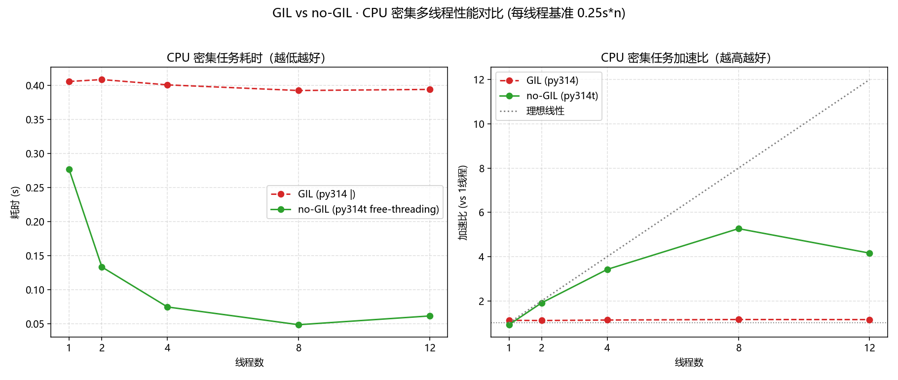

# Python 3.14 Free-Threading 适用场景分析

> **分析结论速览**：free-threading（no-GIL）只对"**纯 Python CPU 密集 + 多线程**"这一种负载带来近线性加速；对 I/O 密集、已由 C 扩展释放 GIL 的计算、以及各处串行场景，收益有限或为零。选型应以"GIL 是否在阻塞并行"为判据。

***

## 1. 背景与实测依据

### 1.1 Free-Threading 是什么

Python 3.13 引入实验性 free-threading 构建，3.14 进一步稳定。核心改变是**移除全局解释器锁（GIL）**，使同一进程内多个线程能真正并行执行 Python 字节码，而非因 GIL 排队互斥。本分析基于 Windows 11 原生实测数据（详见[环境复盘报告](../../../.agents/docs/retrospective/reports/environment-setup/retrospective-py314t-conda-freethreading-20260819.md)）。

### 1.2 实测数据（多线程数扫描 · 纯 Python CPU 密集）

| 线程数 | no-GIL 耗时 | no-GIL 加速 | 标准 GIL 耗时 | GIL 加速 |
|---|---|---|---|---|
| 2 | 0.133s | 1.91x | 0.409s | 1.11x |
| 4 | 0.074s | 3.42x | 0.401s | 1.13x |
| **8** | **0.048s** | **5.26x** | 0.393s | 1.15x |
| 12 | 0.056s | 4.51x | 0.401s | 1.13x |

**曲线解读**：no-GIL 加速比随线程数线性爬升至峰值 **5.26x** 后回落；标准 GIL 全程水平线 ~1.1x。8 线程时 no-GIL 相对 GIL 耗时降 **88%**。

***

## 2. 适用场景判定矩阵

判据一句话：**你的并行瓶颈是否真正卡在 GIL 上？**

| 负载类型 | 是否受 GIL 阻塞 | Free-Threading 收益 | 建议 |
|------|------|------|------|
| 纯 Python CPU 密集（整数/字符串/结构运算） | **是** | 🟢 高（近线性，实测 5x+） | **适用**，推荐多线程并行 |
| C 扩展算如 NumPy/SciPy/TVMBind（已释放 GIL） | 否（调用本身已并行） | 🟠 无增益 | 用进程池或保持现架构，free-threading 无意义 |
| I/O 密集（网络/文件/DB 等待） | 否（阻塞时让出 GIL） | 🟡 中（有，但非来自并行） | 用 asyncio/协程即可，无需 free-threading |
| 单线程串行脚本 | — | ⚪ 无（甚至略损） | 不需要 free-threading |
| 依赖 GIL 保护的第三方 C 库/写入 | 部分 | 🔴 有兼容风险（ABI 或 GIL 假设） | 先验证兼容性再迁移 |

### 2.1 场景一：纯 Python CPU 密集（✅ 强烈适用）

- **特征**：无重计算 C 库参与的复杂逻辑——如算法原型、数值微积分、正则/字符串处理、JSON 序列化、机器学习特征工程的纯 Python 部分。
- **原因**：这类负载的并行瓶颈完全由 GIL 造成（实测标准 GIL 多线程仅 ~1.1x），free-threading 直接解除瓶颈，线程数 ≤ 物理核数时近线性扩展。
- **行动**：`ThreadPoolExecutor` 或原生 `threading` 直接并行，受益清晰。

### 2.2 场景二：C 扩展重计算（🟠 收益有限）

- **特征**：NumPy、Pandas、SciPy、OpenCV、TVM 等已通过 C-API 释放 GIL 的库。
- **原因**：GIL 只保护 Python 解释器状态，多数数值库在计算长循环中已主动 `Py_BEGIN_ALLOW_THREADS` 释放 GIL，进程内多线程本就可并行（受 CPU 资源调度）；此时 no-GIL 不改变其并行度。
- **行动**：维持 multiprocessing / 现有多线程策略；free-threading 不解决此处的扩展问题。

### 2.3 场景三：I/O 密集（🟡 收益中等但非根本）

- **特征**：网络请求、文件读写、数据库查询等阻塞等待。
- **原因**：阻塞调用会释放 GIL 让其它线程运行，GIL 从不限制 I/O 并发。多线程提升来自"等待重叠"（并发）而非"同时计算"（并行）。
- **行动**：asyncio 或线程池均可，free-threading 在此非必需；真正瓶颈在 I/O 而非 GIL。

### 2.4 场景四：串行 & 兼容敏感（⚪/🔴 不建议）

- **串行脚本**：单线程本就无并行，free-threading 不提供收益，且因 `python_abi=_cp314t` 限制部分 wheel 可能缺 `cp314t` 版本而装不上。
- **兼容敏感**：某些依赖全局状态、C 迭代器非线程安全的第三方扩展可能假设默认有 GIL 保护；迁移前必须做完整测试。Triton 等库明确不支持 free-threading（import 时临时启用 GIL）。

***

## 3. 关键洞察与反常识

| 洞察 | 反常识点 |
|------|---------|
| 真正缺 free-threading 的是"被 GIL 卡住的纯 Python 并行" | 很多人以为"多线程慢 = 该用 no-GIL"，实际多数慢来自 C 扩展调度或 I/O |
| free-threading 的甜区很窄：纯 Python + CPU + 线程 | 它不解决进程级扩展、I/O 并发、C 库内并行 |
| 收益上限 ≈ 物理核数，超线程区反而回落 | 8 线程 5.26x，12 线程回落 4.51x——不是无限扩大线程无脑加速 |

***

## 4. 选型与迁移建议

**什么时候值得迁到 py314t / free-threading：**
1. 你有**纯 Python、CPU 密集、可多线程**的核心循环或算法。
2. 现有代码用 `threading` 提升不明显，且确认瓶颈来自 GIL（而非 I/O 或 C 库调度）。
3. 依赖库都能提供 `cp314t` wheel，或已排查 ABI/GIL 假设兼容。

**快速验证方法**（用同仓库 CLI 工具）：在同一负载下分别跑 GIL 与 no-GIL 环境，若多线程加速比 no-GIL >> GIL（如 5x vs 1x），则迁移值得；若两者相近，说明瓶颈不在 GIL，迁移无收益。

**迁移注意**：
- 环境需用 `conda-forge::python-freethreading` 且锁定 `python_abi=*_cp314t`。
- 排查第三方扩展的 GIL/free-threading 兼容性（重点：Triton、部分 Cython 扩展）。
- 用进程池的存量代码无需改，free-threading 属于"新增并行手段"而非替代。

***

## 5. 结论

Free-Threading 是**定向武器**：专治"纯 Python 数字/逻辑运算 + 多线程 + GIL 排队"这一类负载，可带来近线性加速（实测 5x+）。它**不是万能并发方案**——I/O 密集、C 扩展重计算、串行场景都不需要它。选型只要问一句：**GIL 是否在真正阻塞我的并行？** 是 → 值得迁移；否 → 保持现状，用 asyncio / 进程池即可。

***

## 关联资源
- 实测数据与图表：[环境复盘报告](../../../.agents/docs/retrospective/reports/environment-setup/retrospective-py314t-conda-freethreading-20260819.md)
- CLI 基准工具：`.agents/scripts/gil-bench/gil-bench.py`