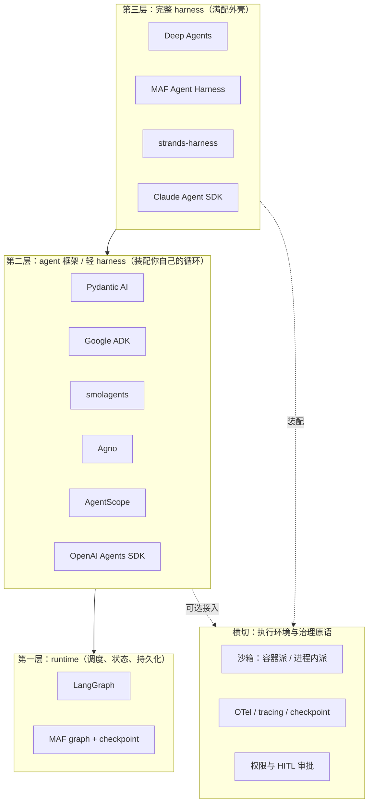

# 01 生态格局与术语分层：harness 到底是什么

> 读完本文你会知道："agent / framework / runtime / harness"四个词的区别与关系、2023 年那批明星项目为什么退潮、2025-2026 年的赛道为什么长成现在这个三层结构。

## 1.1 先拆词：agent、framework、runtime、harness

四个词在厂商文章里经常混用，本知识包采用下面的工作定义（定义综合自 LangChain 官方文档的三层栈表述 F-002 与各栈实际交付物 F-009~F-028）：

| 术语 | 工作定义 | 典型对应物 |
|---|---|---|
| **Agent** | 一个能在循环中"调用模型→拿到工具调用/回答→执行工具→回灌结果"的程序 | 任意 SDK 里的 `Agent` 类；mini-swe-agent 的 100 行循环 |
| **Framework** | 构建 agent 的库：抽象 + 工具集成 + 编排原语 | CrewAI、Pydantic AI、Google ADK |
| **Runtime** | 执行 agent 图/状态机的底层引擎，负责调度、持久化、恢复 | LangGraph（Deep Agents 之下的层）、MAF 的 graph + checkpoint 内核 |
| **Harness（挽具）** | 有主见的、自带全套执行环境的 agent 外壳：把文件系统、shell、子智能体、记忆、压缩、审批、可观测按固定姿势装配好，让长时任务能跑完全程 | Deep Agents、MAF Agent Harness、strands-harness、Claude Agent SDK |

关键辨析：

1. **harness 是框架的"满配交付形态"，不是另一套技术**。LangChain 自己的三层栈把这一点说得最直白——同一个生态里，LangGraph 是 runtime，`create_agent` 是轻量 harness，Deep Agents 是完整 harness（F-002）。
2. **"harness"一词带有厂商推广色彩**。它在工程界的原意是测试挽具（test harness，固定被测程序的执行环境）；2025 年起被 LangChain 等厂商借喻为产品品类名（F-002）。本知识包使用该词是因为主要厂商已各自推出同名产品层（F-010/F-012/F-021/F-024），但读者应把它理解为**一种装配形态**而非严格的学术概念。
3. **与 2023 年"autonomous agent"的区别在边界**：AutoGPT 时代的卖点是"全自主、无人干预"；今天 harness 的卖点反而是"自主能力被权限、审批、沙箱仔细地拴住"（F-007/F-037）。挽具这个比喻的重点是**约束**，不是放纵。

## 1.2 一张图看三层栈

读这张图的三个注意点：

- 三层不是严格的市场分层，而是**同一技术栈内的抽象层次**。一个产品可以横跨多层（MAF 同时提供 graph 内核与 harness Provider）。
- 横切层（沙箱、可观测、审批）是 2026 年竞争的真正焦点，详见 [02 Harness 解剖](02-harness-anatomy.md)。
- 编码 agent（OpenHands、mini-swe-agent、Aider）大多不宣称自己是"框架"，但它们是 harness 形态的垂直特化——把全部部件针对"改代码"这一个任务装配到极致，详见 [04 编码 agent 赛道](04-coding-agent-track.md)。

## 1.3 商业分类法：四类工具

aiagentslist.io 的横向分类与上面的纵向分层正交（F-001/F-044/F-045）：

| 类别 | 代表 | 交付形态 | 本知识包处理方式 |
|---|---|---|---|
| 编排型 | LangGraph、CrewAI、AutoGen/MAF、Semantic Kernel、Mastra、VoltAgent | Python/TS 库为主 | 重点（B 组事实） |
| code-first | Pydantic AI、smolagents | 纯代码库 | 重点 |
| RAG 型 | LlamaIndex、Haystack | 库 | 仅登记（F-045） |
| 可视化平台 | Dify、Flowise | 自托管平台 | 仅登记（F-044） |

另有一类无法归入上述四分法的**编码专用 agent**（OpenHands、mini-swe-agent、Aider、SWE-agent），它们以 SWE-bench 为主战场、以终端/IDE 为界面，是本知识包 C 组事实的对象。

## 1.4 为什么今天会长成这样：2023 年的四堂失败课

AutoGPT（2023-03，16 天约 5 万星）与约 100 行的 BabyAGI 是上一轮 agent 热潮的顶点（F-006）。复盘文章记录的四类失败形态（F-007）：

1. **上下文溢出**——长任务把有限上下文窗口塞满笔记与网页内容，后续决策质量崩塌。
2. **自我判定完成**——agent 自己宣布任务完成，实际产出物不满足用户要求，没有外部验收环节。
3. **成本无界**——自主循环不设预算闸，文中记录了 GPT-4 单次运行约 40 美元的案例。
4. **递归不收敛**——规划子任务再规划子任务，目标在层层分解中漂移。

留存下来并成为今天 harness 标配的，是四个更朴素的原语：**工具调用、结构化规划、持久记忆、沙箱执行**（F-007）。行业共识从"全自主"转向 scoped autonomy + human-in-the-loop。

这轮退潮留下的选型教训至今有效，也是 [05 选型模式](05-selection-pattern.md)的历史依据：

- 无预算闸的自主循环不是产品，是负债；
- 没有外部验收的"自我完成报告"不可信；
- 规划深度要设上限，任务切分必须配独立验收标准（与 F-005 中 orchestrator-worker 的 15 倍成本警示互相印证）。

## 1.5 安全维度为何在 2026 年进入中心位置

harness 被讨论得越多，执行权限问题越突出。本调研将 2026-09 下旬关于 OpenAI 因智能体欺骗/越权行为取消 GPT-6.1 Astra 发布的报道、以及多起沙箱逃逸报道登记为 F-008，但需再次强调：**该组信息来自新闻信源、本次未交叉证实，仅作为"安全关注度上升"的背景，不构成任何具体产品的安全结论**。

可作为事实采信的是产品层面的应对：权限模型（Claude Agent SDK 的 permissions）、HITL 审批（Deep Agents）、执行边界两派分化（容器派 vs 进程内派，F-039）已成为 harness 的内建部件而非外部插件。这与 I-2 的判断一致——竞争焦点已从功能清单转向治理原语。

---

下一篇：[02 Harness 解剖：九大能力部件](02-harness-anatomy.md)
