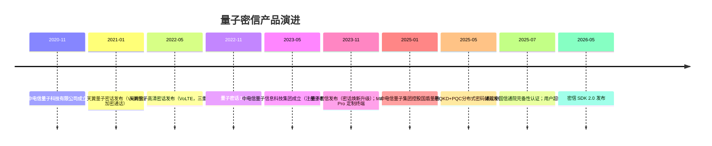

# 02 演进时间线

> 阅读目标：看清量子密信不是一次性发布的新品，而是「保密通话 → 安全办公平台 → 能力开放」三段演进的结果；每一阶段的触发载体、技术形态与用户规模均不同。

## 1. 总览时间线

## 2. 阶段一：量子密话（2021–2022）——以 SIM 卡为载体的加密通话

| 时间 | 事件 | 技术形态 |
|---|---|---|
| 2020-11-06 | 中电信量子科技有限公司工商成立（中国电信与国盾量子的合资平台） | — |
| 2021-01 | 天翼量子密话发布，为首个运营商级量子安全产品 | 借助 5G 传输的 VoIP 量子加密通话；用户更换量子安全 SIM 卡、安装天翼量子 App 使用 |
| 2022-05-17 | 天翼量子高清密话发布，业内首款基于量子信息技术的 VoLTE 加密通话产品，小规模商用 | 国产定制手机 + 量子安全 SIM 卡 + 国密算法「三重保护」；手机侧量子安全中间件完成话音数据加解密；拨号盘直拨，不支持时自动回落 VoLTE |
| 2022-11 | 天翼量子密话升级至 2.0 | 功能与应用场景扩展 |

用户规模记录：2022 年 5 月终端用户近 30 万；2023 年 11 月全国在网用户突破 100 万。

**阶段特征**：卖点是「通话防窃听」，密钥载体是 SIM 卡，网络形态是量子城域网覆盖区域内的点对点通话。

## 3. 阶段二：量子密信（2023–2025）——从通话工具升级为安全办公平台

### 3.1 集团化：2023 年 5 月

中电信量子信息科技集团有限公司于 2023-05-26 成立，注册资本 30 亿元，中国电信 100% 控股。量子业务从合资公司层面上升为运营商集团级战略。

### 3.2 产品焕新：2023 年 11 月

2023 数字科技生态大会（广州，11 月 10–13 日）「铸盾行动 2.0」同期发布四款量子安全产品：量子安全云、量子安全 OTN、**量子密信**、量子密码解决方案。

新华网报道对换代关系的原始表述为：「量子密信是量子密话产品的焕新升级，在量子安全通话能力的基础上，丰富即时通讯、安全办公功能并推广应用。」

大会同时展示华为 Mate 60 Pro 量子密话定制终端：量子信息技术与 VoLTE 网络融合，国产芯片、国密算法、量子安全 SIM 卡三重保护。

### 3.3 能力成型：2025 年

| 时间 | 节点 |
|---|---|
| 2025-01 | 中电信量子集团经定增成为国盾量子控股股东（直接持股 21.86%，表决权 40.43%），国务院国资委为实际控制人 |
| 2025-05 | 发布全球首个融合 QKD 和 PQC 的分布式密码体系，报道称具备商用能力；跨域量子密信电话超 1000 公里接通；密信用户超 520 万、服务单位超 3000 家 |
| 2025-07 | 通过中国信通院「铸基计划」网络安全防护能力完备性评测，为首个获认证的办公即时通讯软件；服务用户超 550 万；完成安卓平板适配，实现全系统覆盖 |

**阶段特征**：产品从「一个安全功能」变为「一个办公平台」，增长从个人保密通话用户转向组织级单位客户。

## 4. 阶段三：能力开放（2026）——SDK 化与生态嵌入

2026 年 5 月，中电信量子集团发布天翼量子密信开发者工具套件 SDK 2.0，文档上线生态开放平台。其设计针对两个工程痛点：自有 OA/政务通缺乏安全 IM 能力、自研成本高；传统 IM SDK 臃肿、定制空间有限。

SDK 2.0 的四项升级：

1. **量子安全底座**——跨域会话密钥经 QKD 网络协商生成；
2. **性能**——相对 1.0 在包体、渲染、内存上优化，放宽二次开发限制；
3. **全栈兼容**——Windows、HarmonyOS、Linux、Android、iOS，深度支持麒麟、统信等国产化系统与芯片；
4. **平滑升级**——三层架构解耦，接口语义稳定，业务层不改代码、更新 SDK 即获得新能力。

**阶段特征**：商业化从「卖平台席位」扩展为「卖加密通讯能力组件」。

## 5. App 版本迭代记录（iOS 版本历史摘录）

| 版本 | 时间 | 主要更新 |
|---|---|---|
| 3.9.0 | 2025-07-26 | 重构拨号模块；拼音搜索；iOS 匿名加入量子云会议 |
| 3.10.0 | 2025-09-24 | 工作台接入量子云会议；聊天中电话号码识别 |
| 3.11.0 | 2025-11-29 | 新增在线文档、日程提醒推送 |
| 3.12.0 | 2026-01-29 | LOGO 焕新；语音文字互转 |
| 3.12.6 | 2026-01-30 | 新增考勤管理、任务督办、综合审批 |
| 3.13.0 | 2026-04-01 | 内部群已读回执；入群分享历史消息 |
| 3.14.0 | 2026-06-03 | 群二维码自定义有效期 |
| 3.15.0 | 2026-08-01 | 量子云会议 AI 会议纪要 |
| 3.16.0 | 2026-08-21 | 支持 TeleAgent 智能助理 |
| 3.16.3 | 2026-09-24 | 修复已知问题（魅族商店记录） |

## 6. 演进逻辑的三个观察

1. **载体沿 SIM 卡 → 定制终端 → App → SDK 不断扩展**，每个新载体都在降低一类用户的接入门槛；
2. **密码底座从单一 QKD 走向 QKD+PQC 融合**，与国际工程界的分层结构趋同（见 [03 技术架构](03-qkd-pqc-architecture.md)）；
3. **功能扩展方向始终是办公场景**（会议、审批、考勤、文档），安全通讯是底座而非终点——这解释了产品形态与应用商店评价的并存结构。

→ 下一篇：[03 QKD+PQC 融合技术架构](03-qkd-pqc-architecture.md)
