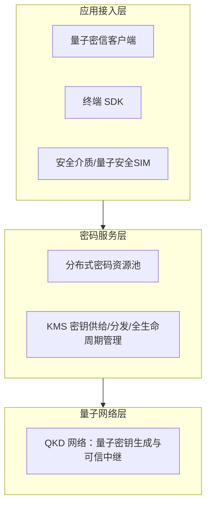
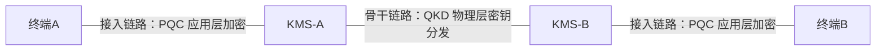

# 03 QKD+PQC 融合技术架构

> 阅读目标：理解量子密信背后「融 QKD 和 PQC 的分布式密码体系」如何分层、密钥在一条加密通话/消息中如何流动，以及量子安全 SIM 卡承担什么角色。

## 0. 术语先行

| 术语 | 全称/含义 |
|---|---|
| QKD | Quantum Key Distribution，量子密钥分发：利用量子态不可克隆、测量扰动等物理特性，使双方协商共享密钥并可察觉窃听 |
| PQC | Post-Quantum Cryptography，后量子密码：设计目标为抵抗量子计算攻击的数学密码算法，运行于经典设备 |
| KMS | Key Management Service/System，密钥管理系统 |
| QKM | Quantum Key Manager，量子密钥管理器，负责 QKD 密钥的接收、中继与供给 |
| WK | Working Key，跨域工作密钥，用于跨 KMS 场景的会话密钥 |
| 国密算法 | 中国商用密码算法体系（SM 系列，如 SM4 对称算法、SM2 非对称算法等） |
| 一次一密（OTP） | 学术定义：密钥与消息等长、只用一次，满足香农完美保密性；与产品文案中的口语用法需区分 |

## 1. 体系定位

2025 年 5 月，中电信量子集团发布其称为「全球首个融合 QKD 和 PQC 的分布式密码体系」，官方报道称已具备商用能力；同期跨域量子密信电话横跨超 1000 公里接通。该体系入选中央企业科技创新成果推荐目录（2026 年展望材料记载）。

## 2. 三层解耦架构

| 层 | 构成 | 职责 |
|---|---|---|
| 量子网络层 | QKD 设备、QKD 链路、QKM、量子城域网 | 跨域密钥分发的物理安全；QKD 密钥生成、可信中继 |
| 密码服务层 | 分布式密码资源池、KMS、硬件随机数、硬件安全模块 | 标准化密钥供给、分发与全生命周期管理 |
| 应用接入层 | 主流终端 SDK、安全 SIM 等安全介质 | 应用快速接入并获得抗量子攻击能力 |

解耦的工程价值：密码底座升级不要求业务应用改代码（SDK 2.0 平滑升级的依据）。

## 3. 分段部署：干线 QKD，接入 PQC

《电信科学》论文给出的实际部署纪律是**QKD 与 PQC 分段、分层**：

| 链路段 | 使用技术 | 安全来源 |
|---|---|---|
| KMS ↔ KMS（骨干/跨域干线） | QKD | 量子物理特性（跨域会话密钥分发） |
| KMS ↔ 终端（用户接入） | PQC | 抗量子数学算法（应用层保护） |
| 业务数据本体 | 国密对称算法（如 SM4 类） | 计算安全 + 高质量会话密钥 |

这一结构与国际安全机构「PQC 优先、QKD 利基增强」的立场在工程形态上接近，详见 [05 安全边界](05-security-boundaries.md)。

## 4. 跨域密钥协商流程（论文描述）

1. 主叫终端发起请求，经所属 KMS 上传会话相关信息；
2. 主被叫分属不同 KMS 时，QKM-A 与 QKM-B 之间进行工作密钥 WK 的协商；
3. WK 协商实质为通过量子通信网络完成具有量子属性密钥的**生成、可信中继、安全分发**；
4. QKM-A、QKM-B 获得一致 WK，经传输层安全通道送回各自 KMS；
5. KMS 经 PQC 接入链路把密钥材料送达终端安全中间件；
6. 终端以会话密钥加密/解密话音或消息数据，会话结束后密钥废弃。

## 5. 量子安全 SIM 卡：终端侧的根

| 特性 | 说明 |
|---|---|
| 集成方式 | 安全芯片直接集成在 SIM 卡内，无需外部安全介质或贴膜芯片 |
| 用户体验 | 换卡不换号，使用原有手机号码 |
| 身份职能 | SIM 卡作为身份识别介质，每次发起业务随机抽取卡内密钥校验身份 |
| 防护目标 | 身份伪造、冒用；终端侧密钥存储与运算隔离 |

配套形态还包括量子密话定制手机（如华为 Mate 60 Pro 定制终端）：国产芯片 + 量子安全中间件在手机侧完成 VoLTE 话音加解密。当任一方不支持量子业务时，通话自动回落原有 VoLTE。

## 6. 「一网一池一平台」

中国电信对外把基础设施方案概括为：

- **一网**：量子密钥分发网络（16 城量子城域网为当前主体，见 [04 基础设施](04-quantum-infrastructure.md)）；
- **一池**：量子密码资源池（分布式密码资源池）；
- **一平台**：量子密码管理平台（密钥全生命周期可管、可控、可溯）。

## 7. 「一次一密」：必须区分的两种语义

| 维度 | 学术 OTP | 产品工程机制 |
|---|---|---|
| 密钥长度 | 与消息等长 | 会话密钥长度按对称算法规格 |
| 安全性质 | 信息论安全（完美保密性） | 对称算法计算安全 + 会话级密钥更新 |
| 可行性 | QKD 当前速率/距离难以支撑大规模等长密钥 | 现行商用方案 |
| 厂商论文原文 | 「当前 QKD 网络……不能满足大规模应用需求，需要结合经典密码技术」 | — |

官网「一次一密」的实际所指是：每次会话使用经量子网络新生成的密钥、会后废弃（一话一密/会话级密钥）。引用与验收时须按此口径，不可按香农 OTP 理解。

## 8. 本篇结论

1. 架构关键词是**分层解耦 + 分段部署**：QKD 守干线、PQC 守接入、对称算法守数据；
2. 终端安全根在 SIM 卡安全芯片，身份认证与密钥存储均依赖它；
3. 评估该架构时，安全证明必须逐段出示，不存在覆盖全链路的单一「量子安全证明」。

→ 下一篇：[04 量子安全基础设施](04-quantum-infrastructure.md)
