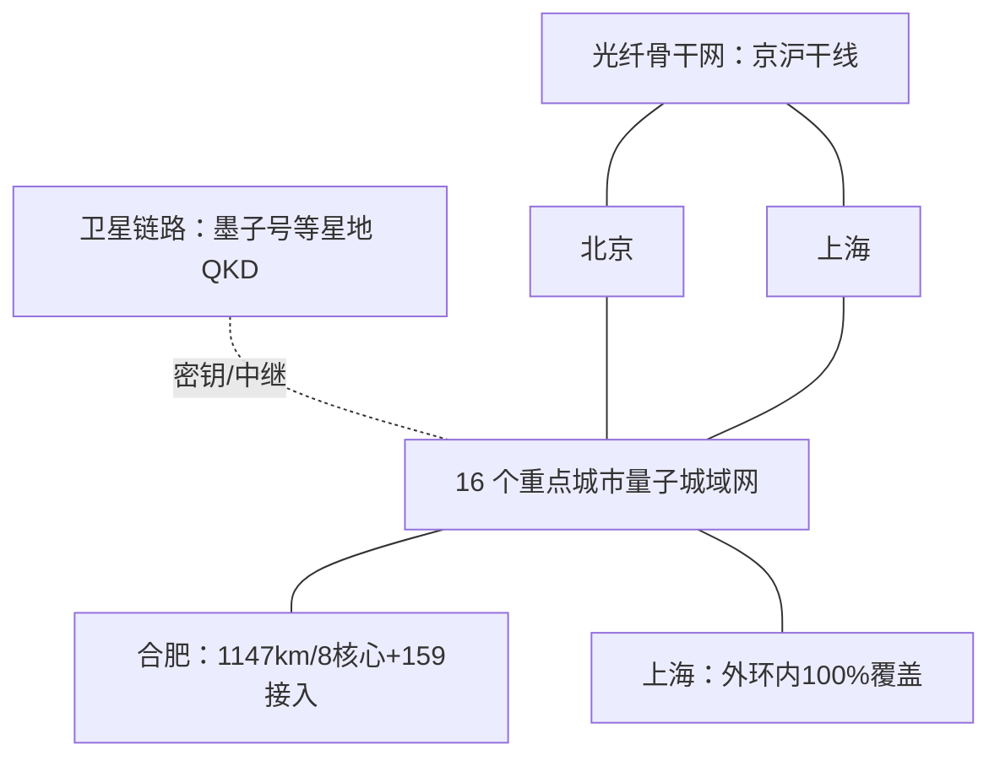

# 04 量子安全基础设施

> 阅读目标：了解量子密信「全国量子密钥分发网络」这一表述的实际所指——城市量子城域网、骨干干线、卫星链路与共纤传输工程，各自的规模、用途与边界。

## 1. 总体图景

官方表述为「天地一体量子安全基础设施」：地面以量子城域网 + 骨干干线为主体，天上以科学实验卫星提供星地/洲际链路补充。

## 2. 城市量子城域网（QKD 网络的主体形态）

截至 2025 年 5 月，中国电信已在**合肥、上海、北京、广州等 16 个重点城市**建成量子城域网，初步提供全国纵横相连、跨域互通能力。2026 年展望材料记载后续目标为加速 40 余个量子城域网互联互通、实现 31 省全覆盖（规划口径）。

### 2.1 合肥量子城域网

| 指标 | 数据 |
|---|---|
| 地位 | 全国首个量子城域网；官方称全球规模最大、用户最多、应用最全 |
| 核心节点 | 8 个 |
| 接入节点 | 159 个 |
| QKD 光纤长度 | 1147 公里 |
| 客户 | 约 500 家市属/区属/县属党政机关；380 家国资委下属企业 |
| 荣誉 | 2024 年入选国家数据局第一批数字中国建设典型案例（安徽省唯一） |

### 2.2 上海城域量子安全基础设施

| 指标 | 数据 |
|---|---|
| 地位 | 全国首个运营商级商用量子安全基础设施 |
| 站点 | 2 个核心站、1 个接入站、4 个用户站 |
| 覆盖 | 上海外环内覆盖率 100% |
| 容量 | 可同时支持超百万用户接入 |
| 架构 | 「核心网 + 接入网」双层 QKD 网络 |

## 3. 长途骨干：京沪干线

「京沪干线」是国际上首个远距离光纤量子保密通信骨干网。受光纤损耗限制，单段 QKD 距离约百公里量级，长途网络采用**可信中继节点**逐段衔接——每个中继节点在节点内完成密钥落地与再加密，因此干线的整体安全包含对各中继节点物理与人员安全的要求（争议细节见 [05 安全边界](05-security-boundaries.md)）。

近年新增的城际/行业干线用例：

| 场景 | 记录 |
|---|---|
| 上海—合肥量子加密通信专线 | 2025 年 10 月前启用，用于航空管控系统，全国首个航空管控标准化量子 OTN 商业案例 |
| 2025 成都世运会 | 全球首条重大赛事 OTN 加密专线，证件制作、入场验证数据量子加密传输 |
| 金融行业 | 2026 年 1 月四川农商行全国金融行业首条正式商用 OTN 量子加密专线 |

## 4. 卫星链路：墨子号与星地量子通信

- 2016 年：我国发射世界首颗量子科学实验卫星「墨子号」；
- 公开记录包括星地 QKD、千公里级纠缠分发、洲际链路（如北京—维也纳）实验；
- 2025 年 3 月：首次实现跨越亚非、距离上万公里的星地量子通信。

卫星链路的定位是**地面光纤网络的超远距离补充**：无需可信地面中继即可在星—地两点间分发密钥，但受过境时间、天气与地面站条件约束。

## 5. 规模化关键工程：量子—经典共纤传输

QKD 规模化部署的核心门槛之一是不必新建暗光纤、与现有通信光网同纤共存。

| 里程碑 | 指标 | 来源时点 |
|---|---|---|
| 实芯光纤共纤现网纪录 | 80 公里以上；与 10Tbps 光网共纤；DV-QKD 可与超 90% 骨干网设备共纤；论文入《JLT》 | 2024 年实验/2025-10 报道 |
| 空芯光纤共纤实验（全球首个超百公里） | 距离 101.6 公里；21dBm 高功率；容量 37.6Tbps；安全密钥率约 5kbps | 2025-11 |

工程意义：复用现网光纤显著降低量子通信网络建设成本，城域网多数场景（80 公里量级）可被覆盖。

## 6. 基础设施与量子密信的关系

1. 量子密信的跨域加密能力**依赖量子城域网覆盖与互通**——双方所在城市/单位接入 QKD 网络是跨域 QKD 密钥协商的前提；
2. 未覆盖区域内，产品仍可经 PQC + 国密提供加密办公能力，但不构成端到端 QKD 链路；
3. 因此核验一项具体通话是否「走量子」，应确认：双方所在地城域网是否覆盖、是否跨域互通、终端/ SIM 是否为量子安全形态。

## 7. 本篇结论

1. 「全国量子密钥分发网络」当前实际形态是 **16 城城域网 + 骨干干线 + 卫星补充**，规模数据均有时点；
2. 可信中继与共纤传输是决定该网络安全属性与建设成本的两个工程关键点；
3. 基础设施覆盖度直接决定具体用户可获得的安全能力等级，宣传口径与实际链路须逐案核对。

→ 下一篇：[05 安全边界与争议](05-security-boundaries.md)
