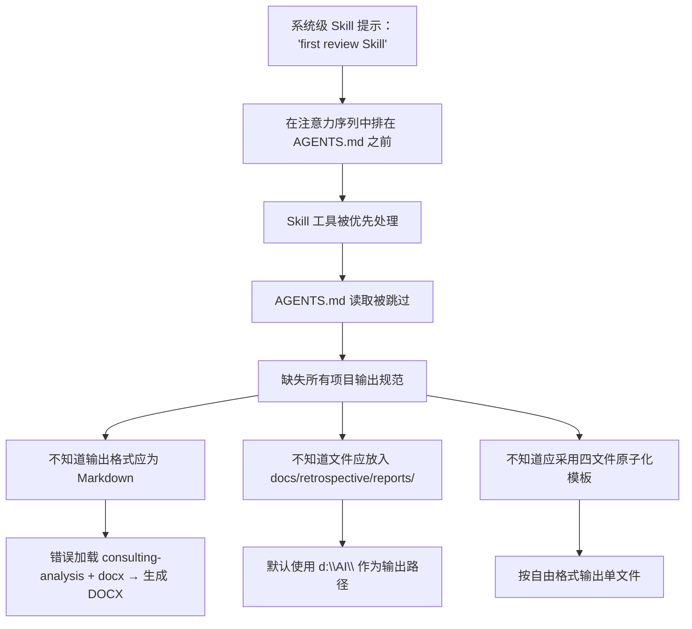

# 跳过 AGENTS.md 启动协议导致三重连锁输出错误

## 背景

项目 `d:\AI\` 的 AGENTS.md 文件明确规定「所有智能体在启动时必须首先读取本文件，依据上下文路由表定位到具体的 .agents/ 规范」。该文件定义了输出格式（Markdown）、文件路径（`docs/retrospective/reports/`）、文档结构（README + 3 子文件的原子化模板）等关键输出规范。

在一次「分析 TRAE AI 创造力大赛 FAQ 文档」任务中，智能体在未读取 AGENTS.md 的情况下直接加载 Skill 并生成产出物，触发了三重连锁错误。

## 问题/场景

### 错误表现

| 轮次 | 错误类型 | 错误表现 | 正确应为 |
|------|---------|---------|---------|
| 第 2 轮 | 格式错误 | 生成了 .docx 文件 | Markdown（.md）文件 |
| 第 3 轮 | 路径错误 | 文件放在 `d:\AI\` 根目录 | `docs/retrospective/reports/competitive-analysis/.../` |
| 第 4 轮 | 结构错误 | 单文件自由格式 | 4 个原子化文件（README + execution-retrospective + insight-extraction + export-suggestions） |
| 第 2-4 轮 | 命名错误 | 中文 + 下划线命名 | kebab-case + 日期后缀 |

### 根因分析

三个错误共享同一个根因——**第 1 轮时跳过了 AGENTS.md 的启动协议读取**。具体原因链：

### 派生问题：多 Skill 并行加载的执行路径竞争

当 `consulting-analysis`（指定输出 Markdown）和 `docx`（提供 docx-js 代码骨架）同时被加载时，docx 技能的 JavaScript 代码示例比 consulting-analysis 的文本描述更具操作性，在注意力竞争中胜出，导致输出格式从 Markdown 偏离为 DOCX。

## 解决方案/经验

### 立即修复（已完成）

1. **强化 AGENTS.md 启动协议**：在文件顶部增加 `PRIORITY ZERO` 声明、四步检查清单和具体负面后果预警
2. **将「启动协议优先」提升为全局核心规则第一条**：确保在注意力序列中优先于其他规则

### 长期防护

1. **纠错反馈触发根因诊断**：收到用户纠错反馈后，先回答「为什么犯错、缺少什么知识」，再执行修正
2. **Skill 加载前语义去重检查**：同一轮中不加载两个都声称「生成文档」的 Skill
3. **启动协议合规自检**：任何产出物生成前，确认已读取 AGENTS.md 并按路由表完成规范读取

### 经验总结

- AGENTS.md 的「必须首先读取」指令与系统级 Skill 提示存在隐式优先级竞争，Skill 提示因物理距离更近而胜出
- 表层修正（只修被指出的症状）无法解决根因，会导致错误反复出现
- 一次文件读取操作（AGENTS.md）的修正效果 = 3+ 轮表层修正的成本

## 参考

- [AGENTS.md](../../../AGENTS.md) - 项目智能体全局契约（已强化启动协议）
- [本次问题复盘报告](../../retrospective/reports/project-governance/process-and-compliance/retrospective-session-agents-md-violation-20260624/)
- [复盘→洞察→导出知识闭环](../../retrospective/patterns/methodology-patterns/retrospective-knowledge/review-insight-export-loop.md)
