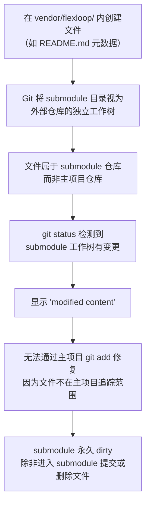

# Git Submodule 显示 modified content 或 dirty 状态

## 背景

在通过 git submodule 管理外部依赖（如 `vendor/flexloop/`）时，如果主项目在 submodule 目录内创建或修改了文件，会导致 submodule 出现 `modified content` 状态，且无法通过正常的 `git add` 消除。

## 问题/场景

### 错误表现

`git status` 显示类似：

```
modified:   vendor/flexloop (modified content)
```

或者 `git submodule status` 显示前缀为 `+`：

```
+ d618849a0742772dd9d4ffb472c3e1f7e7f3ab4e vendor/flexloop (v0.7.1-270-gd618849)
```

### 根因分析



**根本原因**：Git submodule 的本质是主项目中存储的一个 gitlink（指向特定 commit 的指针）。submodule 目录是外部仓库的完整工作树，主项目对其内部文件系统的任何修改都会被 git 视为 submodule 本身的变更，而非主项目的变更。

### 常见触发场景

1. **在 submodule 内创建 README.md/元数据文件**：试图在 `vendor/flexloop/README.md` 中记录依赖用途，但该文件属于 flexloop 仓库
2. **误操作生成文件**：IDE/编辑器在 submodule 目录内生成临时文件、缓存文件
3. **手动修改 submodule 文件**：直接在 submodule 目录内修复 bug 或添加功能

## 解决方案/经验

### 立即修复

1. **如果是误创建的文件**：直接删除
   ```powershell
   # 检查 submodule 内有哪些变更
   git -C vendor/flexloop status
   # 删除误创建的文件
   Remove-Item vendor/flexloop/unwanted-file.md
   ```

2. **如果确实需要记录元数据**：将元数据移动到 submodule 目录之外
   ```
   vendor/
   ├── README.md      ← 元数据放在这里
   ├── VERSION.md     ← 版本信息放在这里
   └── flexloop/      ← submodule 内不放主项目文件
   ```

3. **验证修复**：
   ```powershell
   git status vendor/flexloop
   # 应该没有输出（clean）
   git submodule status vendor/flexloop
   # 前缀应该是空格（不是 +、-、U）
   ```

### 长期防护

1. **遵循"不侵入"原则**：永远不在 submodule 目录内创建或修改主项目维护的文件，详见[外部依赖四不原则](../../retrospective/patterns/methodology-patterns/governance-strategy/four-negatives-external-dependency.md)
2. **采用元数据外置模式**：所有元数据放在 vendor/ 根级（README.md、VERSION.md），详见 [Submodule 元数据外置模式](../../retrospective/patterns/architecture-patterns/submodule-metadata-externalization.md)
3. **自动化验证**：使用 `python .agents/scripts/repo-check.py vendor --deep` 定期检查 submodule 清洁度
4. **.gitignore 保护**：确保 `.gitignore` 对 vendor/ 目录有正确规则：
   ```gitignore
   /vendor/*
   !/vendor/flexloop/
   !/vendor/README.md
   !/vendor/VERSION.md
   ```

### 经验总结

- Git submodule 目录是**外部仓库的领地**，主项目应该视为只读
- 元数据必须放在 submodule 之外，通过接口层文件管理
- `modified content` 不同于 `new commits`——前者表示工作树有未提交变更，后者表示 submodule 指向了不同的 commit
- 自动化验证脚本（--deep）是防止此类问题的最可靠手段

## 参考

- [VENDOR-INTEGRATION.md](../../../docs/knowledge/VENDOR-INTEGRATION.md) - Vendor 协同操作指南
- [三区域边界模型](../../retrospective/patterns/methodology-patterns/governance-strategy/three-zone-boundary-model.md)
- [四不原则](../../retrospective/patterns/methodology-patterns/governance-strategy/four-negatives-external-dependency.md)
- [Submodule 元数据外置模式](../../retrospective/patterns/architecture-patterns/submodule-metadata-externalization.md)
- [本次复盘报告](../../retrospective/reports/spec-system/retrospective-vendor-submodule-collaboration-20260629/)
