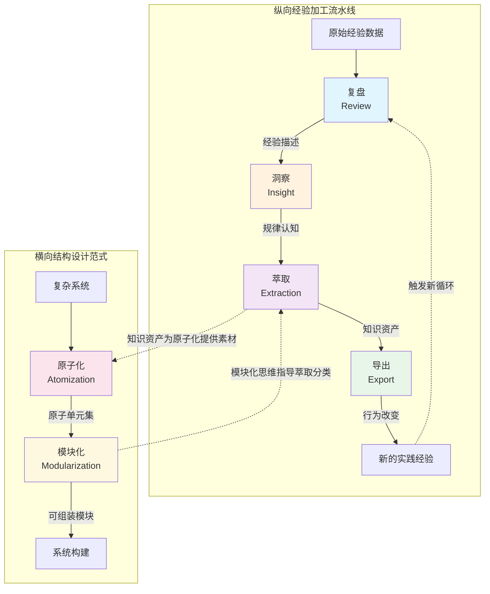
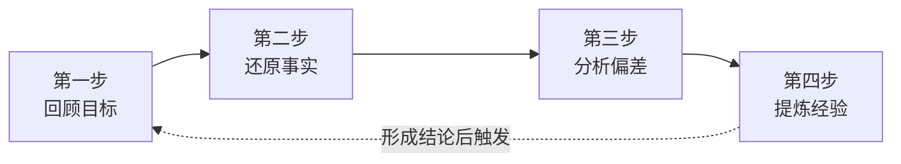
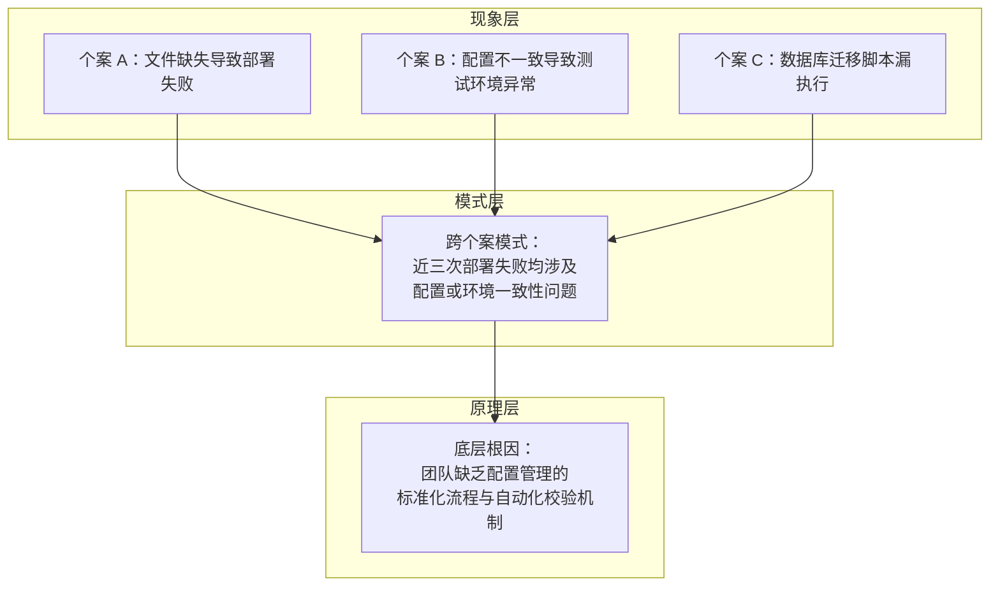
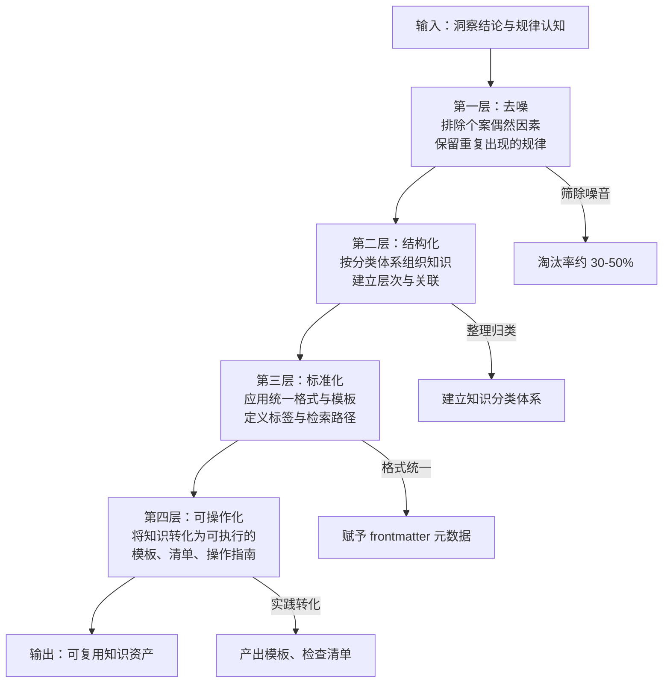
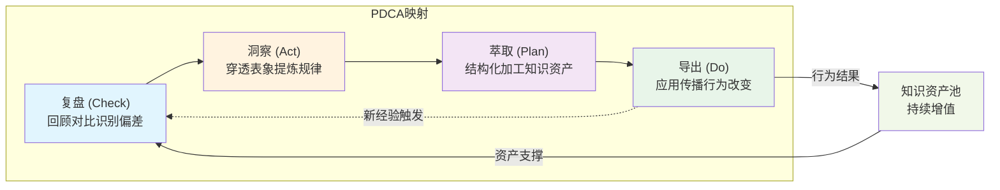
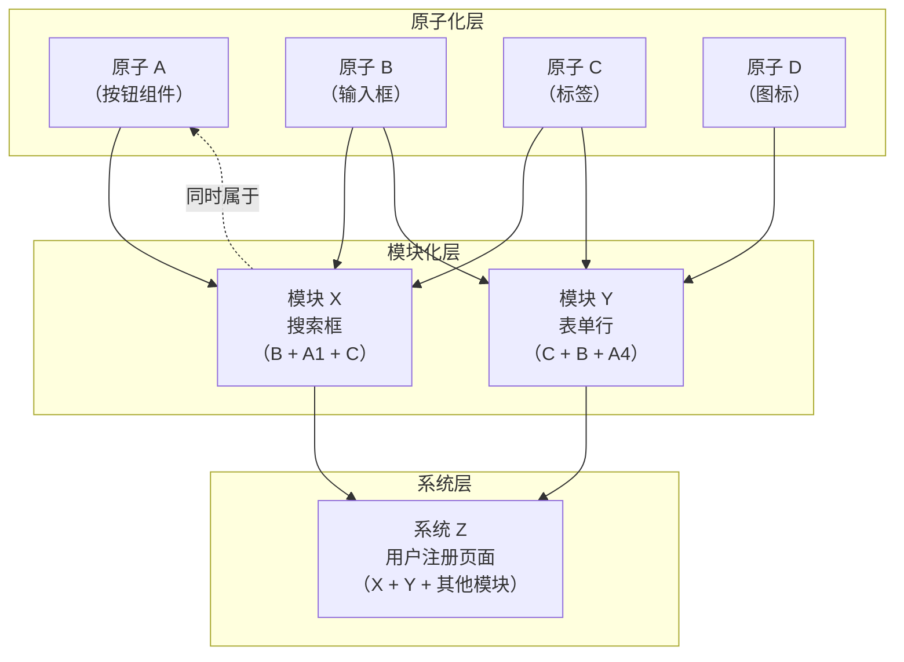
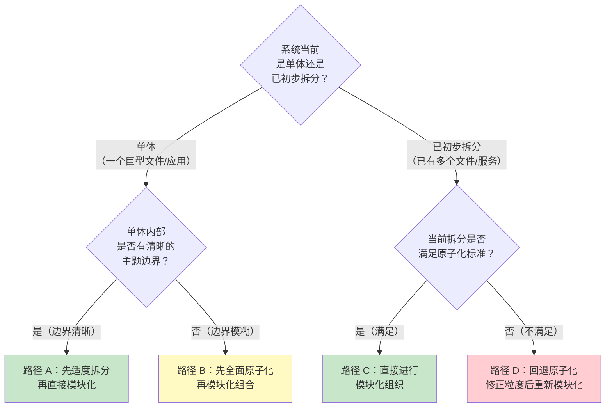
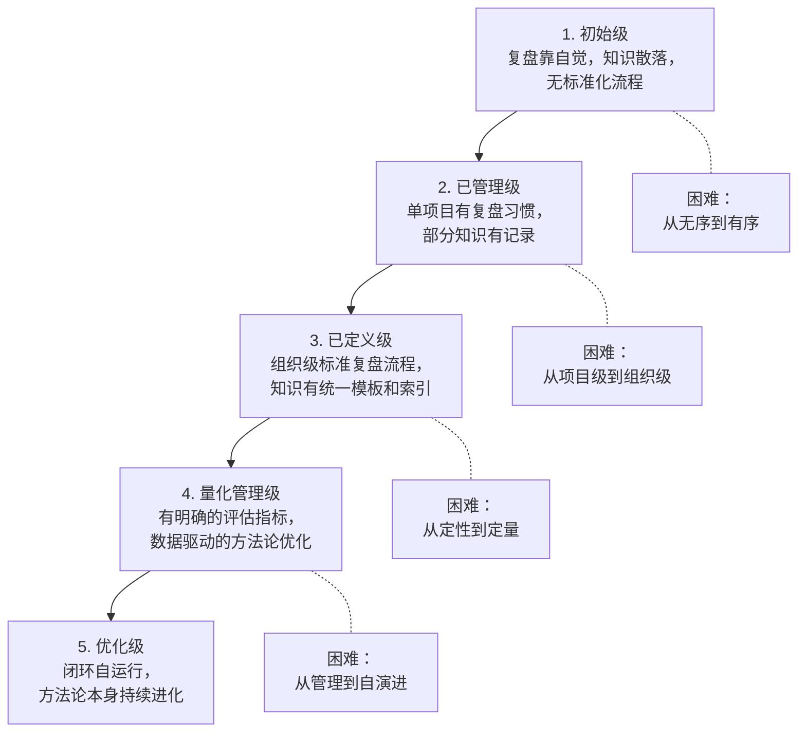

# 「复盘+洞察+萃取+导出」与「原子化+模块化」方法论全面分析

## 摘要

本报告从概念定义、实施步骤、应用案例、闭环构建、设计原则、挑战应对和效果评估七个维度，对「复盘→洞察→萃取→导出」闭环体系与「原子化→模块化」设计方法论进行了系统性分析。核心发现如下：（1）「复盘-洞察-萃取-导出」构成了一条从经验到资产的纵向加工流水线，而「原子化-模块化」则提供了一套从单元到系统的横向结构范式，两者在知识管理实践中互为支撑、缺一不可；（2）闭环体系的效能取决于四环节的均衡性——复盘深度不足导致洞察缺乏素材、萃取缺位导致知识无法沉淀、导出断裂导致资产无法变现，任何一个环节的薄弱都将拖累整个闭环的效率；（3）原子化追求"最小完备单元"，模块化追求"标准接口组合"，两者的递进关系并非线性强制，实践者应根据系统复杂度和团队规模选择合适的起点；（4）方法论落地的最大障碍不在方法论本身，而在于组织文化、激励机制和执行纪律的缺失——**形式化复盘**和**过度原子化**是最常见的两种实施陷阱；（5）成熟的评估体系应超越单一 KPI 思维，建立包含定量指标与定性判断的五级成熟度模型，并将评估结果反馈至闭环中驱动持续改进。

## 1. 引言

在知识经济时代，组织与个人的核心竞争力越来越依赖于"学习如何学习"的元能力。如何将一次性的项目经验转化为可复用的知识资产？如何在复杂系统中实现"高内聚、低耦合"的模块化设计？这两个问题分别对应了两套核心方法论：「复盘→洞察→萃取→导出」的闭环体系，以及「原子化→模块化」的结构设计范式。

「复盘」源于美军的 AAR（After Action Review）机制，经彼得·圣吉引入管理领域后，已成为组织学习的标准工具。「洞察」代表了从现象到规律的认知跃迁，是人类区别于机器的核心能力。「萃取」回应了野中郁次郎 SECI 模型中外化（Externalization）阶段的难题——如何将隐性知识转化为显性资产。「导出」则是闭环的"最后一公里"，决定了知识能否真正改变行为。

「原子化」与「模块化」作为软件工程的经典范式，近年来在知识管理、设计系统、组织架构等领域展现出强大的迁移价值。Brad Frost 的 Atomic Design 方法论将原子化思想引入 UI 设计体系，而 Parnas 的信息隐藏原则则为模块化提供了半个世纪以来从未过时的哲学基础。

本报告综合运用概念层次模型、SIPOC 流程建模、STP 场景映射、PDCA 闭环分析、SWOT 风险识别、KPI 指标体系和 CMMI 成熟度模型共七套分析框架，并结合本项目在 AI 智能体开发规范体系建设中的大量实践证据（涵盖 19 个 Spec 规范、44 份复盘报告、8 个自我演进模块、1 个提示词萃取系统、48 个可复用模式），力求为读者提供一份系统、可操作的方法论指南。

## 2. 概念定义与核心内涵

### 2.1 复盘：从经验到认知的起点

**复盘**（英文对应 Review / Retrospective）是一个结构化的经验回顾过程。其学术起源可追溯至美国陆军在 1970 年代越南战争后期发展的 AAR（After Action Review）机制。AAR 的核心原则是：在每次行动结束后 24-48 小时内，组织所有参与者进行无等级（rank-free）的平等讨论，聚焦四个核心问题——"原定目标是什么？""实际发生了什么？""为什么会产生差异？""下次如何改进？"

与一般意义上的"总结"不同，复盘具有三个核心特征：

- **即时性**：复盘发生在行动结束后的最短时间内，而非项目完结数月后的"归档式回顾"
- **结构化**：复盘遵循明确的步骤框架，不依赖个人即兴发挥
- **非追责性**：复盘的目的不是追究责任，而是提取经验——美军明确规定 AAR 中"不记录个人表现评价"

在中文管理语境中，"复盘"一词源自围棋术语，指对弈结束后双方重新摆放棋子以回顾棋局。将其引入企业管理领域的过程，融合了西方 AAR 的组织学习理念与中国文化中"温故知新"的认知传统。

**复盘的输入与输出**：

- 输入：原始经验数据（行动记录、数据指标、参与者观察）
- 输出：经验描述（目标达成度评估、偏差分析、根因假设）

复盘为后续的洞察环节提供最基础的认知素材——没有充分的复盘，洞察将成为"无源之水"。

### 2.2 洞察：从现象到规律的跃迁

**洞察**（Insight）是在复盘所揭示的现象基础上，穿透表面差异、识别深层模式、提炼普适规律的认知过程。如果说复盘的焦点是"发生了什么"与"为什么发生"，那么洞察的焦点则是"这意味着什么"与"还有什么类似的情况"。

洞察的认知层次可以借助"冰山模型"来理解：

- **现象层**（水面以上）：单个事件的具体表现——"这次部署失败是因为配置文件缺失"
- **模式层**（水面以下浅层）：多个事件中反复出现的规律——"最近三次部署失败都涉及配置文件问题"
- **原理层**（水面以下深层）：驱动模式的底层机制——"团队缺乏配置管理的标准化流程和自动化校验机制"

真正的洞察发生在模式层和原理层。停留在现象层的"洞察"实际上只是复盘的简单重述。高质量的洞察通常具有以下特征：

- **跨情境性**：洞察不仅解释当前案例，还能迁移到其他类似情境
- **可验证性**：洞察可以被后续的事实数据证实或证伪
- **杠杆效应**：一个深度的洞察可以引发一系列后续行为的改变

**洞察的输入与输出**：

- 输入：复盘结论（事实描述、偏差分析、根因假设）
- 输出：规律认知（模式识别结果、因果逻辑链、可迁移的通用规律）

### 2.3 萃取：从认知到资产的转化

**萃取**（Extraction）是将洞察中获得的规律认知，经过筛选、提炼和结构化加工，转化为可复用知识资产的过程。其方法论基础可以追溯到野中郁次郎的 SECI 模型——特别是其中的**外化（Externalization）**阶段，即把隐性知识转化为显性概念的过程。

萃取的本质是一个"去粗取精、去伪存真"的筛滤过程，可以类比为漏斗模型：

- 第一层筛滤：**去噪**——排除个案的偶然因素，保留具有重复出现概率的规律
- 第二层筛滤：**结构化**——将散点的规律组织为有层次、有分类的知识框架
- 第三层筛滤：**标准化**——为萃取出的知识单元定义统一的格式、标签和检索方式
- 第四层筛滤：**可操作化**——将知识转化为可执行的模板、清单、操作指南

萃取的质量直接决定了知识资产的复用价值。一条好的萃取产出应当满足"四可"标准：**可检索**（通过标签和索引能找到）、**可理解**（独立阅读无需额外背景）、**可复用**（在其他场景中可直接使用或小幅适配）、**可验证**（是否有效的判断标准明确）。

**萃取的输入与输出**：

- 输入：规律认知（洞察发现的模式、因果逻辑、通用规律）
- 输出：可复用知识单元（标准化条目、操作模板、最佳实践文档、模式库条目）

### 2.4 导出：从资产到行为的闭环

**导出**（Export / Application）是将萃取形成的知识资产外化为具体行为、工具或制度的过程。导出的本质是"知识的变现"——只有被应用于实践，知识资产才实现了其全部价值。

导出的渠道可以从"对人的影响广度"和"制度化程度"两个维度来分类：

- **文档化**（低影响面、低制度化）：将知识写入操作手册、Wiki、README，供人查阅
- **模板化**（中影响面、低制度化）：将重复性工作流程固化为模板，降低每次的决策成本
- **工具化**（中影响面、高制度化）：开发脚本、工具、自动化检验程序，将知识嵌入系统
- **制度化**（高影响面、高制度化）：将知识纳入组织规范、角色职责、绩效考核体系

导出环节也是闭环的终点与起点的交汇处。导出行为产生的实践效果，将成为下一轮复盘的原始素材——这正是闭环的自增强机制所在。

**导出的输入与输出**：

- 输入：可复用知识单元（萃取产出的标准化知识）
- 输出：行为改变与资产沉淀（更新的操作流程、新开发的工具、修改后的规范文件）

### 2.5 原子化：追求最小完备单元

**原子化**（Atomization）是将复杂系统拆解为最小、不可再分、语义完整的独立单元的过程。该术语源自化学中"原子是物质的最小不可分割单位"的概念，由 Brad Frost 在 2013 年提出的 Atomic Design 方法论引入设计领域。

原子化的核心在于"最小完备性"——一个原子单元应当同时满足三个条件：

- **最小粒度**：在当前系统语境下，继续拆分将导致语义丢失或功能残缺
- **高内聚**：单元内部的全部元素共同服务于一个明确的单一目标
- **自包含**：单元可以独立存在、独立理解、独立测试，不依赖于对其他单元内部实现的知识

在实际操作中，判定一个对象是否达到了"原子级"粒度，可以采用以下三个检验方法：

1. **单一职责检验**：该单元是否只有一个引起变化的原因？
2. **独立可测检验**：该单元能否在不依赖其他单元内部实现的情况下被完整测试？
3. **命名聚合检验**：能否用一个简洁的、无需"和"字连接的名词或短语准确描述该单元的功能？

**原子化的输入与输出**：

- 输入：复杂系统（如巨型文档、单体应用、混杂的知识库）
- 输出：原子单元集（如独立的节、微服务、标准化的知识条目）

### 2.6 模块化：从原子到系统的构建

**模块化**（Modularization）是将原子单元按照标准化的接口和组合规则，构建为更大粒度的可复用模块的过程。其方法论根基来自 David Lorge Parnas 于 1972 年提出的**信息隐藏（Information Hiding）**原则和软件工程中经典的**高内聚、低耦合**设计准则。

模块化的三个核心原则：

- **接口标准化**：每个模块对外暴露一个明确、稳定、最小化的接口，所有跨模块交互必须通过接口进行
- **松散耦合**：模块之间的依赖最小化，理想情况下仅通过数据参数交互，避免控制耦合和公共耦合
- **可替换性**：符合相同接口规范的模块可以相互替换，不影响系统其他部分的正常运行

Parnas 的深刻洞察在于：**模块化的目的不是让系统更容易理解（虽然这是很好的副产品），而是让系统在面对变化时成本更低**。当某个设计决策发生变化时，只需修改封装了该决策的单个模块，其余模块因不依赖其内部实现而完全不受影响。

**模块化的输入与输出**：

- 输入：原子单元集（相同或相关领域的原子单元）
- 输出：可组装模块（包、库、微服务、知识模块、规范子体系）

### 2.7 概念关系全景

六大概念之间的层级关系与流转逻辑可以通过以下全景图清晰展示：

从全景图可以清晰看出，六个概念构成了一个完整的知识管理方法论矩阵：

- **纵向维度**（复盘→洞察→萃取→导出）：经验的加工流水线，从原始数据逐层提炼为可复用资产并反馈到实践中，形成自增强的闭环
- **横向维度**（原子化→模块化）：结构的组织范式，从复杂整体到最小单元再到标准组合，实现系统的可维护和可扩展

| 概念 | 英文对应 | 核心特征 | 输入 | 输出 | 与其他概念的关系 |
|---|---|---|---|---|---|
| 复盘 | Review / Retrospective | 回顾、对比、归因、结构化、非追责 | 原始经验数据 | 经验描述与偏差分析 | 为洞察提供认知素材 |
| 洞察 | Insight | 穿透表象、模式识别、跨情境迁移 | 复盘结论 | 规律认知与因果逻辑 | 承接复盘成果，为萃取提供抽象素材 |
| 萃取 | Extraction | 筛滤、提炼、结构化、标准化 | 规律认知 | 可复用知识单元 | 承接洞察成果，为导出提供格式化资产 |
| 导出 | Export / Application | 外化、应用、传播、制度化 | 知识单元 | 行为改变与资产沉淀 | 闭环终点，触发新复盘的起点 |
| 原子化 | Atomization | 最小粒度、高内聚、自包含、单一职责 | 复杂系统 | 原子单元集 | 模块化的前置条件与构建材料 |
| 模块化 | Modularization | 接口标准化、松散耦合、可替换 | 原子单元集 | 可组装模块 | 原子化的上层组织与系统构建方式 |

这六个概念之所以在知识管理领域形成核心方法论群，根本原因在于它们共同回答了两个现代组织必须面对的根本问题：**知识如何不被遗忘**（纵向闭环）和**系统如何不被复杂性压垮**（横向结构）。在理解上述概念关系的基础上，实践者可以更有针对性地选择适合当前阶段的核心方法论，而非盲目追求"全套方法论的同步落地"。

## 3. 实施步骤与操作方法

### 3.1 复盘的四步操作法

复盘的标准操作流程可以归纳为"四步法"，每一步都有明确的输入、输出、工具和常见误区：

**第一步：回顾目标**

回顾并明确本轮行动的原始目标。关键问题包括：当时设定的目标是什么？成功的标准是什么？有哪些关键假设？产出物为一份清晰的目标描述，包括量化指标和定性标准。常见误区是"以当前认知重新定义过去目标"——复盘应忠实还原当时的意图，而非事后合理化。

**第二步：还原事实**

基于数据而非主观印象，客观还原实际发生的过程。关键问题包括：实际发生了什么（按时间线）？关键数据和指标是多少？与目标相比有哪些偏差？产出物为事实描述文档，包含时间线、关键事件和数据对比。操作要点是区分"事实"和"判断"——"部署耗时 45 分钟"是事实，"部署太慢了"是判断，复盘在此阶段只记录事实。

**第三步：分析偏差**

对事实与目标之间的差距进行归因分析。关键问题包括：偏差的直接原因是什么？根本原因是什么（建议追问"五个为什么"）？哪些是可控因素，哪些是不可控因素？产出物为偏差分析报告，包含根因树、贡献度评估和改进方向。常见误区是过多归因于不可控的外部因素而忽视可控的内部因素。

**第四步：提炼经验**

从分析结果中提炼可迁移的经验教训。关键问题包括：我们学到了什么？如果重来一次，哪些做法会保留、哪些会改变？这些经验是否适用于其他类似情境？产出物为经验总结，包含可复用的经验条目、具体的改进建议和行动计划。

| 步骤 | 核心问题 | 关键产出物 | 推荐工具/模板 | 常见误区 |
|---|---|---|---|---|
| 回顾目标 | 当初要达成什么？ | 目标描述 | SMART 目标清单 | 事后合理化目标 |
| 还原事实 | 实际发生了什么？ | 事实文档 | 时间线工具、数据仪表盘 | 混淆事实与判断 |
| 分析偏差 | 为什么产生差异？ | 偏差分析报告 | 五个为什么、鱼骨图 | 归因偏差（过度外归因） |
| 提炼经验 | 我们学到了什么？ | 经验总结 | 经验卡片、改进建议表 | 停留在具体操作、无法迁移 |

### 3.2 洞察的三层分析法

洞察分析的"冰山模型"为从现象到原理的递进分析提供了清晰的路径：

**现象层分析**：逐一列举复盘中发现的每一个具体偏差，确保每条事实都有对应的数据支撑。"发生了什么"是现象层分析的唯一焦点。完成标准为：无遗漏地记录了所有关键偏差。

**模式层分析**：跨越单个案例，寻找多个现象之间的共性。核心操作是"同类归并"和"异类对比"——将相似的现象聚合成模式，将看似矛盾的现象进行对照分析以发现隐藏的调节变量。关键问题包括：是否有多个偏差指向同一个根因？是否在不同项目中反复出现相似的偏差模式？是否存在看似矛盾的现象（如"有时快有时慢"），这可能揭示了某个隐藏的调节变量？产出物为模式识别清单，每个模式附带支持的案例数量和典型案例引用。

**原理层分析**：追问"为什么这个模式会存在"，直至触及底层机制。关键问题包括：这个模式背后的系统性原因是什么？如果改变某些前提条件，模式是否会消失？这个模式在其他领域是否也存在（跨领域验证）？产出物为原理陈述，包含因果逻辑链、触发条件和适用范围。完成标准为：原理可以被验证（证实或证伪），且具有跨情境的解释力。

从现象到模式的关键转折在于**样本量的积累**：单个案例只能产生假设，三个以上相似案例才具备形成模式的条件。从模式到原理的关键转折在于**机制的揭示**：不仅知道"什么会发生"，还知道"为什么会发生"以及"在什么条件下不会发生"。

### 3.3 萃取的漏斗筛滤法

萃取过程可以类比为一个四层漏斗，每一层都在去除冗余、提升价值密度：

**第一层：去噪**。将洞察中发现的规律放入"可重复性检验"——该规律是否在至少两个独立场景中得到验证？如果只是一个孤立的发现，其更可能是偶然因素的结果而非真正的规律，应予以剔除或标记为"待验证假设"。此层的淘汰率通常为 30-50%。

**第二层：结构化**。使用预先定义的知识分类体系（如本项目知识库的五分类：操作经验、平台兼容性、故障排查、架构决策、最佳实践），将通过筛选的规律进行归类。同类的规律应进一步组织为层次结构——如"部署类"下分为"配置管理""环境准备""回滚策略"等子类。

**第三层：标准化**。为每个知识单元套用统一模板，包含标题、分类、标签、日期、状态、作者、摘要等元数据字段。这确保了知识的可检索性和可发现性。本项目知识库采用 YAML frontmatter + Markdown 正文的标准格式，通过自动脚本生成索引。

**第四层：可操作化**。这是最关键也最容易被忽略的一层。一条"开发前应确认环境变量"的知识，可操作化后变成一份 5 项的环境变量检查清单；一条"大文件应原子化处理"的原则，可操作化后变成一个脚本工具和配套的使用说明。可操作化将"知道"转化为"做到"。

### 3.4 导出的多渠道输出法

导出应覆盖四种渠道，按制度化程度由低到高推进：

**文档化**：将萃取出的知识写入操作手册、Wiki 页面或项目 README 中。文档化是导出成本最低的方式，但影响力也最有限——"写了不等于有人看，看了不等于照做"。适用场景为知识尚在验证期，频繁迭代的可能性高。

**模板化**：将重复性工作流程固化为可复用的模板。如复盘报告模板、Spec 规范模板、知识条目模板。模板化的核心价值在于**降低每次重复的决策成本**——使用者不需要每次从头设计结构，只需要按模板填充内容。

**工具化**：开发脚本、自动化工具将知识嵌入系统。如本项目的索引自动生成脚本（`generate_index.py`）、链接有效性验证脚本（`check-links.py`）、Spec 一致性验证脚本（`check-spec-consistency.py`）。工具化是"用工具治理工具"的元层级实践——每条烦人的手动检验流程，都可以催生一个新的自动化工具。

**制度化**：将知识纳入组织的规范体系、角色职责或绩效考核。如将"开发者启动前必须查阅知识库"写入角色定义，将"所有 Spec 变更必须通过 checklist 验证"作为合并准入条件。制度化是导入成本最高但影响力也最持久的渠道。

实践者应根据知识的成熟度和重要程度选择合适的导出渠道：一条刚发现的经验适合从文档化起步，经过验证后逐步推进到模板化和工具化；一条已经被反复验证的核心原则，应直接纳入制度化层面。

### 3.5 原子化的粒度判定法

判断一个对象是否达到了"原子级"粒度，可以依次应用三个检验标准：

**单一职责检验**：该单元是否只有一个引起变化的原因？如果一个知识条目同时涉及"配置问题"和"性能优化"两个独立主题，它应该被拆分为两个原子条目。思考方式是"如果这个主题的某一方面发生变化，整个条目都需要修改吗？"

**独立可测检验**：该单元能否在不依赖其他单元内部实现的情况下被完整理解？如果阅读者需要先读完另外三个文档才能理解当前文档，说明原子化不充分——原子单元应当是自包含的。

**命名聚合检验**：能否用一个简洁的、无需"和"字连接的名词准确描述该单元？"Windows PowerShell 不支持 heredoc 语法"可以通过检验，而"Move-Item 目录重命名与 Git 提交规范"则明显包含了两个独立主题，应当拆分。

原子化的实际操作步骤：
1. 识别当前复杂系统中的所有独立主题
2. 按主题边界进行初步拆分
3. 对每个拆分结果依次应用三个检验标准
4. 未通过检验的单元继续拆分，直到所有单元都满足原子化标准
5. 建立原子单元之间的交叉引用关系（而非合并）

### 3.6 模块化的接口设计法

模块化的核心操作是定义模块间的接口。接口设计应遵循以下步骤：

**第一步：确定模块边界**。基于原子单元的主题聚类，确定每个模块的职责范围。使用"一句话原则"——如果无法用一句话清晰描述一个模块的职责，说明边界还需要调整。

**第二步：定义对外接口**。每个模块应对外暴露最小化的接口。接口只暴露"做什么"，不暴露"怎么做"——这正是 Parnas 信息隐藏原则的核心。

**第三步：控制耦合度**。模块之间的依赖关系应保持在"数据耦合"层级（仅通过参数传递简单数据），避免控制耦合（通过 flag 参数影响行为）、公共耦合（共享全局变量）和内容耦合（直接访问内部实现）。

**第四步：建立版本管理**。对于被多个模块依赖的接口，建立版本号机制。接口变更应遵循"只增不减"原则——新增接口方法可以，删除或修改已有方法签名则视为破坏性变更，需要相应的迁移计划。

| 环节 | 核心步骤 | 关键产出物 | 推荐工具/模板 | 常见误区 |
|---|---|---|---|---|
| 复盘 | 回顾目标→还原事实→分析偏差→提炼经验 | 复盘报告 | AAR 四步法模板、时间线工具 | 复盘即总结（缺乏结构化）、追溯责任而非经验 |
| 洞察 | 现象聚类→模式识别→原理揭示 | 洞察报告 | 冰山模型、鱼骨图 | 停留在现象描述、缺乏跨案例比较 |
| 萃取 | 去噪→结构化→标准化→可操作化 | 知识条目/模式库 | 知识条目模板、自动索引脚本 | 萃取=存档（缺乏筛滤与可操作化） |
| 导出 | 文档化→模板化→工具化→制度化 | 操作手册/模板/脚本/规范 | 四种渠道递进模型 | 写了就算导出（缺乏效果追踪） |
| 原子化 | 识别主题→边界拆分→三标准检验→交叉引用 | 原子单元集 | 单一职责/独立可测/命名聚合检验 | 过度拆分导致信息碎片化 |
| 模块化 | 确定边界→定义接口→控制耦合→版本管理 | 模块规格说明 | 接口定义模板、耦合度评估表 | 过早模块化（原子化不充分就组合） |

## 4. 应用案例分析

### 4.1 知识管理场景

**场景描述**：本项目的知识管理体系建设，从零构建了一套覆盖五分类（操作经验、平台兼容性、故障排查、架构决策、最佳实践）的结构化知识库。

**方法论匹配**：该场景的核心挑战是"如何将散落在对话和临时代码中的经验转化为可检索、可复用的知识资产"，天然适用"萃取→原子化→模块化"方法论组合。萃取负责将原始经验加工为知识单元，原子化确保每个知识条目独立完整，模块化通过分类体系将知识条目组织为可导航的知识网络。

**实施过程**：
1. 萃取阶段：从已有项目复盘报告、任务总结中提取可复用的知识点，经过去噪和结构化后形成初版知识条目
2. 原子化阶段：将每个知识点拆分为独立的知识条目文件，每个文件遵循 YAML frontmatter + Markdown 正文的标准格式，确保可独立检索和理解
3. 模块化阶段：建立五分类目录结构，开发自动索引生成脚本（`generate_index.py`），将所有知识条目整合为可导航的知识库

**成果与收益**：
- 建立了包含 **5 个分类目录**、多种条目的结构化知识库
- 索引生成脚本实现了"新增条目→自动更新索引"的零手动维护机制
- 知识条目通过 YAML frontmatter 中的标签字段实现了多维度交叉检索
- 知识库与智能体规范体系通过 AGENTS.md 中的引用实现了集成，各角色在被调用时会主动查阅相关知识类目

**关键经验**：知识管理的难点不在于"写"，而在于"找"。如果一条知识不能被快速检索到，它等于不存在。这正是原子化（独立文件）和模块化（分类+标签+索引）的联合价值——原子化解决了"每个知识点独立可检索"，模块化解决了"相关知识点的聚合导航"。

### 4.2 经验沉淀场景

**场景描述**：本项目复盘体系的演化——从零散的复盘报告发展为包含 44 份独立报告、48 个可复用模式库的完整复盘体系。

**方法论匹配**：该场景的核心挑战是"如何让复盘不只是'写报告'，而是真正驱动行为改变和知识沉淀"，完整覆盖了"复盘→洞察→萃取→导出"全闭环。

**实施过程**：
1. 复盘阶段：每完成一个 Spec 项目（如智能体规范体系建设、知识管理系统搭建），即生成一份标准四段式（事实→分析→洞察→建议）的复盘报告
2. 洞察阶段：在积累了多份复盘报告后，启动跨项目元分析——识别出"子代理并行验证""Spec 三件套模式""文档即代码实践"等高频模式，并进一步揭示"用工具治理工具""反馈循环加速效应"等深层原理
3. 萃取阶段：将跨项目元分析发现的规律萃取为 48 个可复用模式，按方法论/架构/代码三个领域分类，每条模式包含"名称-问题-方案-适用场景-案例引用"的标准结构
4. 导出阶段：将"复盘报告模板""复盘闭环模式"等成果文档化和模板化，同时将"所有 Spec 变更必须通过 checklist 验证"的制度写入角色定义和 CI 检查流程

**成果与收益**：
- 复盘报告从阶段零的"无标准模板"演进到阶段四的"跨项目元分析"，方法论本身在复盘闭环的驱动下持续迭代
- 提取出 **6 大元模式**（元工具体系、零延迟闭环、三层治理模型、文档即代码、工具熵减、反馈循环加速）
- 复盘闭环模式在 **14%** 的复盘报告（6/44 份）中被直接运用
- 从发现到修复的平均延迟显著缩短，实现了"复盘报告不是交付物，而是执行清单"的零延迟闭环

**关键经验**：复盘的质量不仅取决于单次复盘的深度，更取决于复盘之间的"连接"——跨项目元分析是将分散的经验整理为系统性洞察的关键节点。没有跨项目元分析，复盘就始终停留在"就事论事"的单环学习层面。

### 4.3 流程优化场景

**场景描述**：本项目智能体开发规范体系的持续优化——从最初的单个 AGENTS.md 文件，演进为包含 7 个角色定义、8 个自我演进模块、4 个协作协议、3 个标准工作流、17 个自动化脚本的完整规范体系。

**方法论匹配**：该场景的核心挑战是"如何在快速迭代中保持系统的一致性，同时避免规范体系的熵增"，同时需要原子化、模块化和闭环体系的协同运作。

**实施过程**：
1. 原子化阶段：将最初混杂在一个文件中的角色定义、协作协议、工作流模板等内容，拆分为独立的原子文件——每个角色一个文件、每个协议一个文件、每个工作流一个文件
2. 模块化阶段：通过 TOML frontmatter 的 `domain` 和 `layer` 字段建立统一的模块分类体系——协调层、工程层、质量层、治理层——各模块按领域聚合，通过标准接口（AGENTS.md 路由表）相互引用
3. 闭环驱动阶段：每次流程优化后通过 checklist 验证，验证中发现的问题触发新的复盘，复盘洞察萃取为新的模式或规范，导出为规范文件的更新——形成"执行→验证→复盘→萃取→导出→再执行"的完整闭环

**成果与收益**：
- 规范体系从 **1 个文件**增长为 **76 个 .md 文件**，通过原子化和模块化的设计，单文件复杂度反而下降
- **19 个 Spec** 均采用标准三件套（spec.md + tasks.md + checklist.md），通过模块化模板保证了跨项目的一致性
- **18 个自动化脚本**覆盖了检查、验证、生成、CI 四类能力，实现了"工具治理工具"的元层级自动化
- 并行执行效率显著提升——子代理并行验证在复盘报告中被多次提及

**关键经验**：流程优化的核心不在于"设计完美的初始流程"，而在于建立"流程自我迭代的机制"——这正是复盘闭环的价值所在。规范文件不再像传统文档那样"写完后逐渐过时"，而是在每次使用中被验证、在每次验证中被修复、在每次修复中被更新，始终维持"最新且经过验证"的状态。

### 4.4 跨场景模式总结

三个场景共同揭示了方法论应用的核心原则：

- **递进性**：任何方法论的实施都应当从低制度化向高制度化递进——知识管理从"写一条知识条目"开始，经验沉淀从"做一次复盘"开始，流程优化从"建一个 checklist"开始。不必追求一次性达到最高成熟度。
- **原子化先行**：在开始模块化之前，确保被组合的单元真正达到了原子化标准。没有充分的原子化，模块化只是在混乱之上加盖一层"看起来整齐"的表层结构。
- **闭环完整性**：最容易被忽略的不是某个环节，而是环节之间的**连接**——复盘做了，但没有产生洞察；洞察有了，但没有被萃取；萃取出来了，但没有人使用。环环相扣的连接质量，决定了整个体系的效能。

| 应用场景 | 主要应用方法论 | 典型实施路径 | 关键成功因素 | 量化收益示例 |
|---|---|---|---|---|
| 知识管理 | 萃取 + 原子化 + 模块化 | 经验采集→知识条目→分类索引→自动生成 | 知识条目原子化、自动索引维护、与角色体系集成 | 5 分类体系、标签交叉检索、零手动索引维护 |
| 经验沉淀 | 复盘→洞察→萃取→导出 | 单项目复盘→跨项目元分析→模式萃取→模板化输出 | 跨项目元分析、可复用模式库、行动项闭环追踪 | 44 份复盘报告、48 个可复用模式、6 大元模式 |
| 流程优化 | 原子化 + 模块化 + 闭环驱动 | 规范原子化→模块分类→执行验证→复盘改进→规范更新 | 三件套模板、自动化脚本、角色职责嵌入 | 76 文件规范体系、19 Spec、18 个自动化脚本 |

## 5. 「复盘-洞察-萃取-导出」闭环体系

### 5.1 闭环的结构与运行机制

复盘-洞察-萃取-导出体系的结构可以用 PDCA 循环来理解：

- **复盘 → Check（检查）**：对比目标与实际，识别偏差
- **洞察 → Act（行动/分析）**：分析偏差的深层原因，形成规律认知
- **萃取 → Plan（计划）**：将规律转化为可复用的知识资产和行动计划
- **导出 → Do（执行）**：将知识资产应用于实践，产生新的经验数据

闭环的自增强机制体现在两个正反馈回路上：

**反馈回路一（知识增值回路）**：每次导出产生的行为结果，成为下一轮复盘的更高质量素材→更高质的复盘产生更深层的洞察→更深层的洞察萃取为更高价值的资产→更高价值的资产导出为更有效的行动→更好的行动结果→更进一步提升了复盘素材的质量。这是一个知识资产的"复利增长"模型。

**反馈回路二（能力提升回路）**：每次完整循环都在训练组织和个人的"复盘能力""洞察能力""萃取能力""导出能力"本身——做复盘的技能在复盘中提升，做萃取的技能在萃取中提升。这种"学会如何学习"的元能力积累，是闭环体系最深层的价值。

### 5.2 闭环断裂的常见模式与修复

在实践中，闭环最常见的断裂不是某个环节的完全缺失，而是环节间连接的质量问题：

| 闭环要素 | 定义 | 断裂表现 | 断裂原因 | 修复策略 |
|---|---|---|---|---|
| 复盘→洞察 | 从事实到规律 | 复盘报告写得详细，但结论是"下次要注意"之类泛泛而谈，缺乏深层规律提炼 | 复盘停留在现象层，缺乏跨案例比较和"五个为什么"追问 | 引入洞察分析模板（冰山模型），要求每条结论附带至少两个案例的交叉验证 |
| 洞察→萃取 | 从规律到资产 | 洞察写在复盘报告里，但没有被提取为独立的知识条目——随着报告被归档，洞察也被"埋葬" | 缺乏萃取意识，洞察与复盘报告耦合过紧 | 在复盘报告中增加"可萃取项"专区，由专人（或自动化流程）将萃取项转化为独立知识条目 |
| 萃取→导出 | 从资产到行为 | 知识库条目写得很规范，但没有人查阅使用——"知识库是存档室，不是工具箱" | 导出渠道单一（仅文档化），缺乏模板化/工具化/制度化层面的推进 | 按知识成熟度分级导出：验证初期走文档化、稳定后推进模板化、高频使用场景推进工具化和制度化 |
| 导出→复盘 | 从行为到新经验 | 行为改变后缺乏数据追踪，无法判断"导出"是否有效，下一轮复盘缺少事实依据 | 缺乏效果追踪机制，导出行为与复盘触发之间没有建立因果连接 | 为导出行为定义可量化的效果指标，在复盘中自动引入这些指标数据 |

最容易断裂的是"萃取→导出"环节——它位于知识加工与行为改变之间的"最后一公里"，也是价值实现最关键的一步。修复该断裂的核心策略是**渐进式导出**：一条刚萃取的知识从文档化开始，不追求一步到位制度化。如果在文档化阶段没有人查阅，说明该知识的实际需求度存疑，不值得投入更高的导出成本。

### 5.3 从单环学习到双环学习的演进

闭环体系不仅是操作层面的流程管理工具，更是组织学习层次跃迁的驱动框架：

**单环学习**（在既定框架内纠偏）：当闭环只运行在"行为层"时，组织的学习停留在"如何把当前的事做得更好"。典型表现是：复盘聚焦于操作细节（"下次应该把配置文件提前检查"），而不质疑操作背后的流程假设（"为什么配置文件的正确性依赖人工检查？"）。

**双环学习**（质疑框架本身）：当闭环深入到"规则层"和"假设层"时，组织开始追问"我们在做正确的事吗？"和"为什么我们选择了这个流程？"。典型表现是：复盘不仅发现"配置文件缺失导致部署失败"，更进一步追问"为什么配置管理流程的设计允许单个文件的遗漏导致整体失败？"

从单环学习到双环学习的跃迁，关键节点在**洞察环节**。单环层面的洞察回答"如何做得更好"，双环层面的洞察回答"是否在做正确的事"。推动这一跃迁的操作策略包括：

1. **在复盘中引入"假设层"问题**：在每个偏差分析后增加一个问题——"如果我们改变某个前提条件（如流程、工具、人员配置），这个偏差还会发生吗？"
2. **在跨项目元分析中寻找"系统性同构"**：如果不同项目出现了相似但根源不同的偏差，说明问题不在操作层而在规则层
3. **在萃取时将"原则性知识"与"操作性知识"分列**：原则性知识（如"工具应自动检验而非依赖人工"）指向双环层面的改进，操作性知识（如"部署前检查配置文件的三项清单"）指向单环层面的改进

闭环体系的深层价值在于：它同时支持单环学习和双环学习——单环学习确保当前流程的持续优化，双环学习确保流程本身在必要时被重构。一个健康的闭环体系需要在两者之间保持动态平衡：单环学习提供持续改进的惯性，双环学习提供突破框架的勇气。

## 6. 「原子化」与「模块化」设计方法论

### 6.1 原子化设计原则

原子化设计的三个核心原则——**最小粒度、高内聚、单一职责**——并非彼此独立，而是互为验证条件：

**最小粒度原则**：一个原子单元应在当前系统语境下"不可再分"——进一步拆分将导致语义完整性的丧失。判断"最小粒度"的标准不是绝对大小（如"不超过 200 行"），而是功能性完整度。一个完整表达了一个独立概念的知识条目，即使只有 20 行，也是合格的原子；一个混杂了两个概念的文件，即使只有 50 行，也需要继续拆分。

**高内聚原则**：原子单元内部的全部元素应紧密围绕一个明确的主题，不包含与该主题无关的旁支信息。高内聚的反面是"偶然内聚"——多个元素被强行放在一起仅仅因为它们恰好同时出现，而非因为它们服务于共同的目标。

**单一职责原则**：每个原子单元应有且只有一个引起变化的原因。这是原子化三个原则中最强有力的检验标准——如果一个文件的修改可能由两种互不相关的需求驱动，说明它应该被拆分。

在知识管理领域，原子化原则转化为三条可操作的准则：
- 一个知识条目 = 一个独立问题 + 一个解决方案
- 条目标题应精确到无需阅读正文即可判断是否相关
- 条目之间通过交叉引用（链接）而非内容合并来建立关联

### 6.2 模块化设计原则

模块化设计的三个核心原则——**接口标准化、松散耦合、可替换性**——强调的是模块之间如何高效协作：

**接口标准化原则**：每个模块对外暴露一个明确、稳定、最小化的接口。在软件工程中，接口是一个模块的功能签名；在知识管理中，接口可以理解为模块的"索引描述"——一个模块的 README 或路由表中的注册条目。接口标准化的核心要求是：通过接口就能理解模块的功能和依赖关系，无需阅读模块内部实现。

**松散耦合原则**：模块之间的依赖应最小化。耦合度的七个等级（无耦合→数据耦合→标记耦合→控制耦合→外部耦合→公共耦合→内容耦合）提供了从"理想"到"灾难"的递进标尺。在知识管理领域，模块之间的耦合主要表现为引用关系——当一个知识模块引用另一个模块时，理想状态是"被引用的模块变更不影响引用者的内部完整性"。

**可替换性原则**：遵守相同接口规范的模块可以互换而不影响系统。这一原则的价值体现在系统的可维护性和可扩展性上——当某个模块需要升级时，只要新模块实现了同样的接口，系统其余部分无需修改。

在 AI 智能体规范体系的设计中，模块化原则得到了直接应用：7 个角色定义文件通过统一的 TOML frontmatter 格式（id/domain/layer）实现了接口标准化；角色之间的引用通过 AGENTS.md 路由表进行，避免了直接耦合；任何一个角色的系统提示词可以独立更新而不影响其他角色的正常工作。

### 6.3 两者的递进与互补关系

原子化与模块化之间存在的不是"二选一"的替代关系，而是"由底向上"的递进关系和"各司其职"的互补关系：

**递进关系**：原子化是模块化的前提条件。只有在原子单元足够稳定、内聚且接口明确的基础上，模块化的组合才是有意义的——否则模块化只是把"混乱的集合"变成了"混乱的组合"。原子化的质量决定了模块化的上限。

**互补关系**：原子化解决的是"每个单元的内部质量"问题（高内聚、单一职责），模块化解决的是"单元之间的组织方式"问题（接口标准化、松散耦合）。两者关注的层次不同，但不能互相替代。仅做原子化而不做模块化，系统将退化为"一堆彼此独立但毫无组织的碎片"；仅做模块化而不做原子化，系统将是"外表整齐但内部混乱的假模块化"。

体现在具体的实践指导上：
- **先原子化，后模块化**是通用推荐路径，尤其在系统从单体向模块化演进时
- **但不是绝对铁律**——如果系统本身就由清晰的独立主题构成（如本项目的角色定义天然是七个独立角色），可以从适度拆分后直接进入模块化
- **原子化与模块化是循环迭代的**——模块化过程中可能发现某些原子划分不合理，需要回退到原子化阶段重新拆解；原子化过程中也可能发现某些原子天然具有模块化的聚类特征，可以提前规划模块结构

### 6.4 实施路径选择

实施路径的选择取决于系统的当前状态和团队的能力水平：

**路径 A（适度拆分后模块化）**：适用于内部主题边界相对清晰的单体系统。如一个 README 文件中包含"安装指南""使用说明""API 参考"等明确的小节，可以按小节边界拆分为独立文件后直接进入模块化阶段。

**路径 B（全面原子化后模块化）**：适用于内部主题混杂、边界模糊的单体系统。如一个巨型复盘报告混合了项目回顾、洞察分析、模式萃取和经验导出等多种内容，需要先按"单一职责"标准全面原子化，再按领域（如回顾类、洞察类、萃取类）进行模块化组织。本项目复盘文档体系的重构正是走的这条路径——一个 598 行的巨型复盘报告被原子化为 18 个独立模块。

**路径 C（直接模块化）**：适用于已满足原子化标准的多文件系统。核心操作是定义分类体系和接口标准（如本项目的 TOML frontmatter 四维定位），建立路由表（如 AGENTS.md 上下文路由表）。

**路径 D（回退修正后重新模块化）**：适用于已经拆分但粒度不合理的系统。常见问题是过度原子化（拆得太细）或原子化不充分（拆得不够细）。需要回退到原子化阶段修正粒度，然后重新进行模块化组织。

选择实施路径时的一个实用决策准则：**如果无法在 30 秒内向一个新成员解释清楚模块间的依赖关系，说明当前的模块化设计需要重新审视**——要么是原子化不充分导致模块边界模糊，要么是模块化的接口设计不够清晰。

## 7. 实施挑战与应对策略

### 7.1 常见挑战全览

两套方法论在落地过程中面临六大类常见挑战，按照"发生概率 × 影响程度"的二维矩阵分级：

| 挑战类别 | 具体表现 | 发生概率 | 影响程度 | 风险等级 |
|---|---|---|---|---|
| 文化阻力 | 复盘被认为是"形式主义""浪费时间"，团队成员应付了事 | 高 | 高 | 极高 |
| 执行纪律 | 开始几轮做得认真，随后逐渐松懈，闭环断裂 | 高 | 极高 | 极高 |
| 闭环断裂 | 某一环节的输出无法有效传导到下一环节 | 高 | 极高 | 极高 |
| 过度原子化 | 将系统拆得过于细碎，导致信息碎片化、上下文丢失 | 中 | 高 | 高 |
| 质量下降 | 知识条目越来越多但质量参差不齐，知识库变成"信息垃圾场" | 中 | 高 | 高 |
| 工具缺失 | 缺乏支撑方法论落地的自动化工具，完全依赖人工维护 | 中 | 中 | 中 |

### 7.2 文化与执行层面的挑战

**文化阻力**是方法论落地面临的首要挑战。其深层根因不在于"方法论不好"，而在于：团队成员看不到方法论能为他们个人带来什么直接收益；方法论被视为"额外的工作负担"而非"提升工作效率的工具"。如果复盘只是"写一份报告给领导看"，而非"让我自己下一次能做得更好"，参与者的投入度必然是低下的。

应对策略分为短、中、长期三个层次：

- **短期（1-3 个月）**：从最小可行复盘开始——不追求全面的四步法，只做"一件事做对了什么、做错了什么、下次怎么改"三句话复盘。降低参与门槛，先让团队体验到复盘的直接价值（"确实帮我少踩了一个坑"）。
- **中期（3-6 个月）**：建立"复盘→行动→见效"的正反馈循环。确保每次复盘至少产出一个可落地的行动项，并在下次复盘中回顾该行动项的完成效果。团队成员只有在看到"上次复盘的建议真的被执行了，而且真的有效"之后，才会对复盘产生真正的认同。
- **长期（6 个月以上）**：将复盘文化纳入组织的价值观体系。"复盘不是额外的任务，而是工作方式的一部分"——就像代码审查是开发流程的一部分而非额外的负担一样。

**执行纪律**的衰减通常呈现为"S 型曲线"——初期热情高涨（"我们要建立完美的知识管理体系"），随后因缺乏即时反馈而逐渐松懈，最终退化到"偶尔想起来做一次"的随机状态。

应对策略的核心是**降低维护成本**而非依赖自律：

- 将重复性维护工作自动化——索引生成、链接验证、格式校验等不应依赖人工
- 将方法论要求嵌入到工作流程的"必经之路"上——如 Spec 变更必须通过 checklist 验证，而非"建议检查"
- 建立最小维护节奏——"每周新增 1 条知识条目"比"每月集中写 10 条"更容易坚持

### 7.3 技术与工具层面的挑战

**过度原子化**是最常见的工具层面陷阱。其典型症状是：一个原本 5 分钟能读完的知识主题，被拆成了 15 个互相引用的碎片，读者需要"跳转阅读"10 次才能拼凑出完整的理解。过度原子化的根本原因是将"最小粒度"机械地等同于"越细越好"，而忽视了"语义完整性"这个约束条件。

应对策略：
- 始终坚持"语义完整性优先于绝对粒度"——如果继续拆分会导致读者需要同时阅读多个片段才能理解一个完整概念，说明已经到了原子化的边界
- 使用"独立可读性"作为拆分是否过度的反向检验——每条原子知识应该让读者在阅读后"有所得"，而非"被迫去读下一条"
- 建立粒度审查机制——在原子化后进行交叉审查，识别是否存在"话题碎片化"现象

**质量下降**的挑战体现在知识库的"熵增"趋势上。随着知识条目数量增加，质量参差不齐的问题会越来越突出——过时的条目未及时更新、低质量的条目未及时清理、重复的条目未及时合并。

应对策略：
- 为每条知识条目设置"状态"字段（draft / reviewed / archived），定期整理归档过时条目
- 引入"知识条目腐烂度"评分——长时间未被引用且状态为 draft 的条目自动标记为待清理
- 在知识条目模板中强制要求"最后验证日期"字段

### 7.4 系统化的应对策略矩阵

| 挑战类别 | 短期对策（1-3 月） | 中期对策（3-6 月） | 长期对策（6 月以上） |
|---|---|---|---|
| 文化阻力 | 最小可行复盘（三句话复盘），从个人收益切入 | 建立"复盘→行动→见效"正反馈，用实例说服 | 复盘文化制度化——融入角色定义和工作流程 |
| 执行纪律 | 设定最小维护节奏（每周 1 条），降低启动成本 | 自动化脚本替代人工维护，嵌入工作流必经节点 | 将方法论实践纳入团队 OKR 或绩效参考指标 |
| 闭环断裂 | 在每个环节转换处设置"门禁"检查点 | 引入自动化追踪——行动项的状态从"建议"变成"可追踪" | 建立闭环健康度仪表盘，实时监控各环节转换率 |
| 过度原子化 | 引入"独立可读性"反向检验 | 建立粒度审查机制（交叉审查） | 形成组织的原子化粒度指南与典型案例库 |
| 质量下降 | 建立知识条目的"腐烂度"基础评分 | 定期归档清理，设置质量和时效性阈值 | 将知识库维护纳入角色职责（如 reviewer 审查代码时同步审查相关知识条目） |
| 工具缺失 | 优先开发"痛点最大"的自动化脚本 | 建立工具开发从问题发现到部署的标准化流程 | 构建"工具治理工具"的元层级自动化生态 |

应对这些挑战的核心心法是：**不要试图一次解决所有问题**。选择当前阶段影响最大、最容易见效的 1-2 个挑战集中应对，取得可见成果后再扩展到其他挑战。方法论落地是一个长期演进而非一次性工程的过程。

## 8. 效果评估框架

### 8.1 评估指标体系设计

方法论实施效果的评估需要覆盖六个维度，每个维度包含量化指标与定性判断：

| 评估维度 | 关键指标 | 数据来源 | 评估频率 | 目标值（参考） | 警戒值 |
|---|---|---|---|---|---|
| 复盘质量 | 复盘覆盖率（复盘项目数/总项目数）、复盘深度评分（四步完整度） | 项目管理系统、复盘报告 | 月度 | 覆盖率 ≥ 80%、深度评分 ≥ 70% | 覆盖率 < 50% |
| 洞察产出 | 洞察数量、洞察采纳率（被后续行动引用的洞察占比）、跨项目元分析频率 | 复盘报告、行动项追踪 | 季度 | 采纳率 ≥ 60% | 连续两季度无跨项目分析 |
| 萃取效率 | 知识条目产出数、复用率（被引用条目数/总条目数）、平均萃取延迟（洞察→知识条目的时间间隔） | 知识库系统 | 季度 | 复用率 ≥ 30% | 复用率 < 10% |
| 导出效果 | 知识传播率（查阅≥1次的知识条目占比）、行为改变率（导出行动项的完成率） | 知识库访问日志、行动项追踪 | 半年 | 传播率 ≥ 50%、行为改变率 ≥ 70% | 行为改变率 < 40% |
| 原子化纯度 | 原子单元内聚度（通过单一职责检验的单元占比）、粒度匀称度（粒度的标准差/平均值） | 代码/文档审查 | 按需 | 内聚度 ≥ 90% | 内聚度 < 70% |
| 模块化质量 | 模块耦合度（跨模块依赖数量/模块总数）、接口稳定性（接口变更频率的反比） | 依赖分析工具 | 按需 | 耦合度保持或下降 | 耦合度连续上升 |

### 8.2 成熟度模型构建

借鉴 CMMI 的五级成熟度框架，为方法论实施构建一个对应的五级成熟度模型：

**各级别的行为特征与产出标准**：

| 级别 | 复盘 | 洞察 | 萃取 | 导出 | 原子化与模块化 |
|---|---|---|---|---|---|
| **1. 初始级** | 偶尔做，无固定格式，依赖个人自觉 | 停留在现象描述 | 无系统化萃取 | 结论停留在报告中 | 系统为单体，无拆分意识 |
| **2. 已管理级** | 单项目有复盘习惯，使用简单模板 | 开始跨案例比较，识别重复模式 | 建立知识条目记录，使用基础模板 | 知识以文档形式输出 | 开始初步拆分，但边界模糊 |
| **3. 已定义级** | 组织级标准复盘流程和模板 | 有跨项目元分析的制度化安排 | 知识有统一分类体系和自动索引 | 推进模板化和部分工具化 | 原子单元满足单一职责标准，有模块分类体系 |
| **4. 量化管理级** | 有复盘覆盖率和深度量化指标 | 洞察有采纳率追踪 | 知识复用率可量化，腐烂度可追踪 | 导出效果有行为改变率数据 | 内聚度、耦合度可量化评估 |
| **5. 优化级** | 复盘已是肌肉记忆，流程根据数据自我调整 | 双环学习常态化 | 萃取→导出全流程自动化 | 制度化与工具化深度融合 | 系统持续重构优化，粒度根据反馈自动调整 |

**级别跃迁的关键节点**：

从 **L1 到 L2** 是最困难的一步——它需要从"无序"建立"秩序"，从"靠人"转向"靠流程"。关键在于找到一个高价值、低门槛的切入点（如"每周一次 15 分钟的站立复盘"），通过快速见效的正反馈建立团队的信心和习惯。

从 **L2 到 L3** 的核心挑战是从"项目级标准"扩展到"组织级标准"——不同项目之间需要共享同一套复盘模板、知识分类体系和工具体系。这需要跨项目的协调和规范化的强制执行。

从 **L3 到 L4** 要求引入量化管理思维——不仅要"做"，还要"度量做得好不好"。这通常需要配套的自动化工具支持（如自动采集知识库访问日志、自动计算行动项完成率）。

从 **L4 到 L5** 的标志是"闭环自运行"——方法论不再依赖外部推动，而是通过内置的正反馈机制自我驱动。系统的成熟度已经内化为组织文化的一部分。

### 8.3 评估驱动的持续改进

评估的目的不是打分考核，而是发现改进机会。因此，评估结果必须反馈到闭环体系中，驱动下一轮改进：

1. **评估→识别差距**：通过雷达图对比"当前状态"与"目标状态"在各维度的差距
2. **差距→定位根因**：分析差距产生的原因，是某环节薄弱还是环节间连接断裂
3. **根因→制定改进**：针对根因制定改进措施，进入下一轮"复盘→洞察→萃取→导出"循环
4. **改进→再评估**：实施改进后再次评估，验证改进效果

这个"评估→改进→再评估"的子循环本身也嵌套在更大的闭环体系中——它运行在双环学习的层面，对"改进的方法"本身进行改进。

建议的评估节奏：**月度复盘、季度评估、年度成熟度升级**。月度复盘关注操作层（"这个月哪些做得好、哪些需要调整"），季度评估关注战术层（"各维度的指标变化趋势如何"），年度成熟度升级关注战略层（"我们的成熟度是否达到了升级的标准"）。

## 9. 结论

「复盘→洞察→萃取→导出」闭环体系与「原子化→模块化」设计方法论共同构成了一套完整的知识管理与能力建设框架。前者解决了"经验如何持续转化为资产"的纵向问题，后者解决了"复杂系统如何有序组织"的横向问题。两套方法论在实践中相互渗透：萃取的成果为原子化提供素材——从纷繁的经验中提炼出的规律天然倾向于独立、最小化、语义完整的表达形式；模块化的思维反过来影响萃取的分类体系——知识条目的分类结构本身就是对知识域的模块化组织。

闭环体系的本质是组织学习的制度化。它不追求一次性的完美复盘，而追求"每次复盘都比上一次更好"的迭代进化。原子化与模块化的本质是通过结构设计来管理复杂性——原子化让每个单元稳定可控，模块化让单元之间的协作清晰有序。两者都不是目标本身，而是手段：最终目标是让组织和个人在面对持续变化的环境时，拥有更强的适应力和创造力。

需要警惕的是，方法论的过度追求也可能导致**方法论主义**——沉溺于方法论本身的形式完美而忽视了真实问题的解决。一个简洁的、被实际执行的"三句话复盘"，远胜于一个精致的、从被执行过的"四步法复盘模板"。方法论是工具，不是目的。最好的方法论，是那个消失了的方法论——不再是"额外的任务"，而是工作方式本身不可分割的一部分。

## 10. 参考文献

[1] U.S. Army. A Leader's Guide to After-Action Reviews[EB/OL]. (2013). https://www.army.mil/

[2] 彼得·圣吉. 第五项修炼：学习型组织的艺术与实践[M]. 中信出版社, 2009.

[3] Nonaka I, Takeuchi H. The Knowledge-Creating Company: How Japanese Companies Create the Dynamics of Innovation[M]. Oxford University Press, 1995.

[4] Nonaka I, Toyama R, Konno N. SECI, Ba and Leadership: a Unified Model of Dynamic Knowledge Creation[J]. Long Range Planning, 2000, 33(1): 5-34.

[5] Frost B. Atomic Design[M/OL]. (2016). https://atomicdesign.bradfrost.com/

[6] Parnas D L. On the Criteria To Be Used in Decomposing Systems into Modules[J]. Communications of the ACM, 1972, 15(12): 1053-1058.

[7] Argyris C, Schon D A. Organizational Learning: A Theory of Action Perspective[M]. Addison-Wesley, 1978.

[8] Deming W E. Out of the Crisis[M]. MIT Press, 1986.

[9] CMMI Institute. CMMI for Development, Version 2.0[EB/OL]. (2018). https://cmminstitute.com/

[10] Martin R C. Clean Architecture: A Craftsman's Guide to Software Structure and Design[M]. Prentice Hall, 2017.

[11] 本项目复盘体系文档. 复盘报告合集 (2024-2026)[EB/OL]. d:\AI\docs\retrospective\reports\

[12] 本项目知识库体系文档. 知识管理系统 (2025-2026)[EB/OL]. d:\AI\docs\knowledge\

[13] 本项目智能体规范体系. AGENTS.md 及 .agents/ 目录 (2025-2026)[EB/OL]. d:\AI\.agents\
