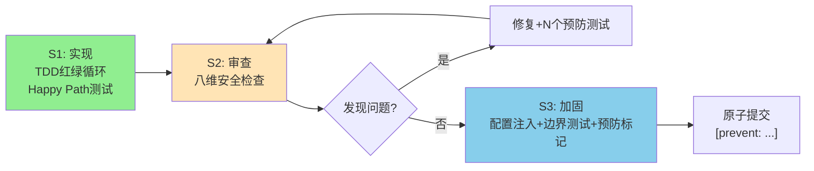

# 模式对比总结："实现→审查→加固"三段式SOP vs 可配置性默认原则

> 本文档对比从多智能体冲突解决机制复盘中萃取的两个核心模式，帮助快速理解差异与适用场景。

---

## 基础信息对比

| 维度 | **"实现→审查→加固"三段式SOP** | **可配置性默认原则** |
|------|------------------------------|---------------------|
| 完整文件 | [implement-review-harden-sop.md](../retrospective/patterns/methodology-patterns/governance-strategy/implement-review-harden-sop.md) | [configurable-by-default-principle.md](../retrospective/patterns/code-patterns/configurable-by-default-principle.md) |
| 模式层级 | 🏛️ **治理层（governance）** | 🔧 **代码层（code）** |
| 抽象级别 | **流程/方法论**——回答"什么时候做什么事" | **编码技巧/设计原则**——回答"具体怎么写代码" |
| 解决的核心问题 | 功能写完、测试全绿≠代码安全，Happy Path之外的死锁/活锁/饥饿等隐性缺陷漏检 | 业务规则硬编码导致扩展性差、测试困难、不同场景需要改代码 |
| 核心洞察 | "测试通过是最低标准，不是完成标准" | "多写一个参数的成本远低于重构硬编码的成本" |
| 成熟度 | L2（已验证） | L2（已验证） |

---

## 适用时机对比

| 开发阶段 | 三段式SOP | 可配置性默认原则 |
|---------|----------|-----------------|
| **开发前/写代码时** | —— | ✅ 写第一行代码时就要考虑：哪些值需要可配置 |
| **开发完成（测试全绿）** | ✅ 启动八维安全审查的触发点 | —— |
| **审查发现硬编码问题** | ✅ 记录问题并进入修复循环 | ✅ 立即重构为可配置注入 |
| **Bug修复阶段** | ✅ 阶段3加固：修复+预防测试+commit标记 | ✅ 阈值/规则类修复考虑可配置化 |

---

## 核心内容对比

### 三段式SOP：3阶段循环



**八维安全检查清单**：

| 维度 | 检查项 | 典型缺陷 |
|------|--------|---------|
| 1. 超时 | 所有等待/锁有超时？ | 永久死锁 |
| 2. 幂等 | 重复消息/操作安全？ | 活锁/绕过检查 |
| 3. 边界 | N≥3场景覆盖？ | 饥饿/错误选择 |
| 4. 防御 | 可变参数有拷贝？ | 竞态条件 |
| 5. 配置 | 规则/阈值可注入？ | 硬编码扩展差 |
| 6. 国际化 | 多语言文本支持？ | 中文匹配失效 |
| 7. 死锁顺序 | 多锁获取顺序一致？ | 循环等待死锁 |
| 8. 资源泄漏 | 获取有对应释放？ | 资源泄漏 |

**六问审查法**：
- 对每个锁："对方永远不回应怎么办？"
- 对每个状态更新："收到重复消息怎么办？"
- 对每个选择算法："N=3时正确吗？N=5呢？"
- 对每个传入参数："调用方返回后修改它会怎么样？"
- 对每个常量："不同场景需要不同值怎么改？"
- 对每个字符串操作："中文/日文没有空格分词怎么办？"

---

### 可配置性默认原则：3种实现模式

**三问快速决策法**（遇到常量/规则/阈值时）：
1. 不同用户/项目/场景需要不同值？→ 可配置
2. 测试需要注入简单/极端值验证逻辑？→ 可配置
3. 未来6个月内因需求变化会调整？→ 可配置

> 任一答案为"是"即设计为可配置。

**三种实现模式**：

| 模式 | 适用场景 | 代码示例 |
|------|---------|---------|
| **模式1：None覆盖** | 配置项<5个 | `def __init__(self, timeout: int = DEFAULT_TIMEOUT, rules: dict \| None = None)` |
| **模式2：配置对象** | 配置项≥5个 | `@dataclass class Config: ...` + `def __init__(self, config: Config \| None = None)` |
| **模式3：策略注入** | 变化的是算法/行为 | `def __init__(self, strategy: LoadBalancingStrategy \| None = None)` |

**五不原则（反模式）**：
1. ❌ 不写魔法数字（`time.sleep(30)` → `self._config.retry_interval`）
2. ❌ 不硬编码规则表（错误码/关键词列表从配置注入）
3. ❌ 不用布尔参数控制多种行为（>3个bool考虑配置对象）
4. ❌ 不用可变默认值（`def __init__(self, rules={})` 是经典坑）
5. ❌ 不对参数做边界验证（负超时/超长超时需拦截）

---

## 二者关系

```
┌─────────────────────────────────────────────────────────────┐
│  "实现→审查→加固"三段式SOP（宏观流程）                        │
│                                                             │
│  S1 实现 ──→ S2 审查 ──→ S3 加固 ──→ 提交                    │
│              │                     ↑                        │
│              └──── 发现问题 ────────┘                        │
│                     │                                       │
│                     │ 八维检查第5维命中"硬编码"               │
│                     ↓                                       │
│           ┌───────────────────┐                             │
│           │ 可配置性默认原则   │ ← 阶段3加固措施之一          │
│           │ （微观编码技巧）   │                             │
│           └───────────────────┘                             │
└─────────────────────────────────────────────────────────────┘
```

- **包含关系**：可配置性默认原则是三段式SOP阶段3（加固）中的一项具体措施
- **互补关系**：SOP告诉你"什么时候需要检查配置可注入性"，可配置原则告诉你"具体怎么写可配置代码"
- **触发关系**：SOP八维检查的第5维就是"配置维度"——命中硬编码问题则使用可配置原则重构

---

## 反模式对比

| 三段式SOP反模式 | 可配置性默认原则反模式 |
|----------------|----------------------|
| ❌ "测试全绿=完成" | ❌ 魔法数字直接写在代码里 |
| ❌ "只修不防"（修Bug不加预防测试） | ❌ 硬编码业务规则表 |
| ❌ "只测N=2"（排序/选择算法不测N≥3） | ❌ 布尔标志爆炸（>3个bool参数） |
| ❌ "硬编码快速上线"（以后再改） | ❌ 可变对象作为默认值（Python经典坑） |
| ❌ "假设英文环境"（按空格分词） | ❌ 配置参数不做边界验证 |

---

## 快速记忆

### 一句话理解

- **三段式SOP**：写完代码别急着提交，先做八维安全体检，修Bug时别忘了加预防测试
- **可配置性默认**：凡是可能变的值（规则/阈值/超时/策略），从一开始就做成构造函数可注入，给默认值但允许覆盖

### 记忆口诀

| 模式 | 口诀 |
|------|------|
| 三段式SOP | **实现→审查→加固，八维检查防死锁** |
| 可配置默认 | **三问问完要注入，默认合理可覆盖** |

---

## 验证清单速查

### 核心机制代码提交前（SOP检查）

- [ ] 阶段1：所有功能测试通过
- [ ] 阶段2：八维检查完成（超时/幂等/边界/防御/配置/国际化/死锁顺序/泄漏）
- [ ] 阶段3：加固完成（每个修复≥1个预防测试 + commit标记`[prevent: ...]`）

### 编写可配置代码时（配置原则检查）

- [ ] 业务规则/阈值/超时都作为构造函数参数
- [ ] 有模块级默认常量
- [ ] 可选参数用None哨兵值，正确处理0/False/空集合
- [ ] 可变默认值用`field(default_factory=...)`
- [ ] ≥5个配置项聚合为dataclass
- [ ] 行为变化用策略对象注入
- [ ] 参数有边界验证
- [ ] 单元测试可注入自定义配置

---

## 共同起源

两个模式均萃取自同一次任务复盘：[多智能体冲突解决机制实现与死锁风险修复复盘](../retrospective/reports/task-reports/retrospective-conflict-resolution-mechanism-20260708/retrospective-report.md)（2026-07-08）。

- 初始实现26个测试全绿，但主动审查发现8个问题（含2个高风险死锁缺陷）
- 全部修复后新增13个预防测试，最终39个测试全部通过
- 从开发流程和具体编码两个维度萃取得到本模式对
