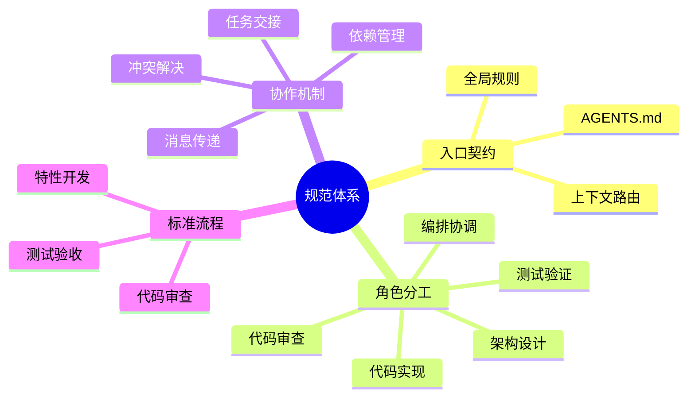

# 项目概述

> **来源**：从 `README.md` "项目概述"与"核心特性"章节拆分

## 项目定位

本项目是一套**智能体开发规范体系**，而非传统意义上的可执行应用。它通过两个核心载体为 AI 智能体提供项目级上下文与协作契约：

- **`AGENTS.md`**：项目 AI 智能体的最高优先级入口与上下文路由文件，定义全局核心规则、角色索引、能力边界与协作协议概要。
- **`.agents/`**：智能体规范容器，承载角色定义、系统提示词、工具调用规范、协作协议、工作流、模板与自动化脚本。

本规范体系被 [OpenAI Codex](https://openai.com/codex)、[Cursor](https://cursor.sh)、[GitHub Copilot](https://github.com/features/copilot) 等 30+ 工具识别与遵循，可作为任意 AI 编码工具的项目级指令源。

## 设计理念

## 核心特性

- **单一入口路由**：所有智能体启动时仅读取 `AGENTS.md`，按上下文路由表按需加载 `.agents/` 中的具体规范，避免上下文爆炸。
- **5 角色分工体系**：定义 orchestrator、architect、developer、reviewer、tester 五个核心角色，每个角色有明确的职责与能力边界（Non-Goals）。
- **机器可读的角色定义**：角色文件使用 TOML frontmatter 声明 `id`、`domain`、`layer`、`bindings`，便于智能体程序化解析与绑定。
- **完整协作协议**：覆盖任务交接、消息传递、冲突解决与临时依赖管理四类协议，确保多智能体协作有章可循。
- **Mermaid 流程可视化**：所有工作流、架构、关系均使用 Mermaid 表达，可渲染、可版本化、可审查。
- **临时依赖治理**：通过 `.gitignore` 规则、Git pre-commit hook 与验证脚本三重机制，防止 `vendor/`、`.temp/`、`__pycache__/` 等临时依赖被误提交。
- **Conventional Commits 规范**：统一提交信息格式，便于自动生成变更日志与版本管理。

> **关联模块**：
> - `../README.md`
> - `project-structure.md`
> - `agent-roles.md`
> - `collaboration.md`