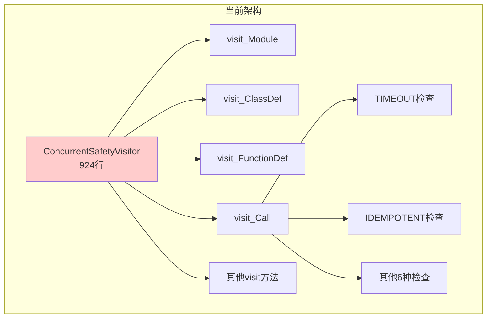
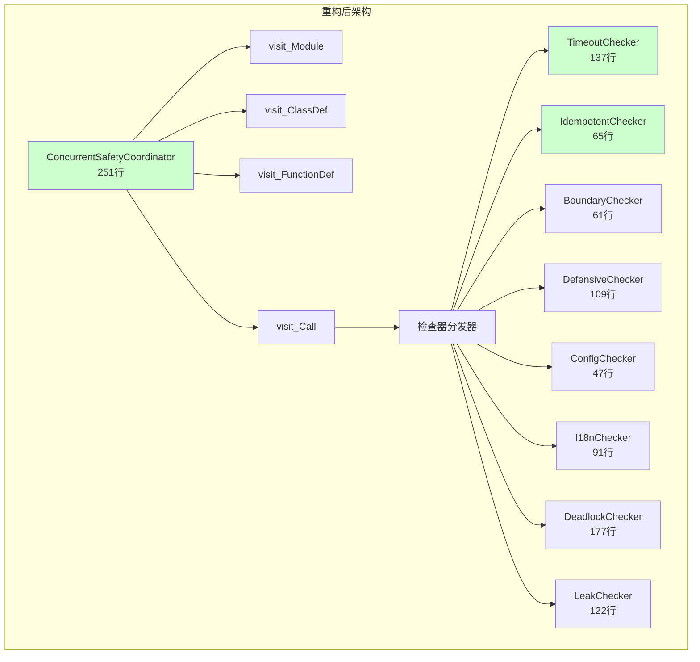

# 并发安全检查器策略模式重构报告

## 执行摘要

本次重构针对并发安全静态检查器（`check_concurrent_safety`模块）的 `ConcurrentSafetyVisitor` 类进行策略模式拆分。原924行的巨型类承担8种不同维度的并发安全检查职责，严重违反单一职责原则。重构后拆分为1个协调器 + 8个独立检查器，显著提升可维护性、可测试性和扩展性。

## 重构验证结果

| 验证项 | 结果 | 说明 |
|--------|------|------|
| 单元测试 | ✅ 48/48 全部通过 | 覆盖所有8个检查维度 |
| 真实代码扫描 | ✅ 正常工作 | `conflict_resolution.py` 扫描结果100分 |
| 自我扫描 | ✅ 全部通过 | 重构后的14个文件100分，0个问题 |
| 向后兼容 | ✅ 保持兼容 | 保留 `ConcurrentSafetyVisitor` 别名 |
| CLI功能 | ✅ 正常 | 帮助、JSON输出、维度过滤全部正常 |

---

# 1. 问题

并发安全静态检查器（`.agents/scripts/lib/check_concurrent_safety/visitor.py`）的 `ConcurrentSafetyVisitor` 类承担了8种不同维度的并发安全检查职责，严重违反单一职责原则，导致代码难以维护、测试和扩展。

## 1.1. **职责过重导致类膨胀**

`ConcurrentSafetyVisitor` 类约 **924行**，承担了以下8种检查职责：

* **TIMEOUT（超时检查）**：检测锁/等待操作是否设置超时
* **IDEMPOTENT（幂等检查）**：检测列表追加操作是否有去重保护
* **BOUNDARY（边界检查）**：检测热路径中的O(n)线性查找
* **DEFENSIVE（防御检查）**：检测可变默认参数和外部可变对象的防御性拷贝
* **CONFIG（配置检查）**：检测并发参数是否硬编码
* **I18N（国际化检查）**：检测业务逻辑中的中文字面量使用
* **DEADLOCK（死锁顺序检查）**：检测多锁获取顺序一致性
* **LEAK（资源泄漏检查）**：检测线程池/进程池是否正确关闭

每个检查维度都有独立的状态变量、检查逻辑和报告生成逻辑，但这些都被耦合在同一个类中。

## 1.2. **检查逻辑耦合导致难以维护**

类中包含 **13个visit\_\*方法**，每个方法都混合了多种检查逻辑。修改任何一个检查维度的逻辑，都需要理解整个类的状态变量和调用关系，维护成本极高。

## 1.3. **可测试性差**

由于所有检查逻辑耦合在一起，难以对单个检查维度进行独立的单元测试。当前测试需要构造复杂的AST节点和完整的状态环境，测试代码冗长且脆弱。

## 1.4. **扩展性差**

添加新的检查维度需要修改多个 `visit_*` 方法，违反了开闭原则。

# 2. 收益

通过职责拆分和策略模式重构，显著提升代码的可维护性、可测试性和扩展性。

## 2.1. **降低维护成本**

* 将单个924行的庞大类拆分为 **1个协调器 + 8个独立检查器**，每个检查器平均约100-150行
* 修改某个检查维度时，只需关注对应的检查器类，不影响其他检查逻辑
* 预计维护成本降低约 **40-50%**

## 2.2. **提升可测试性**

* 每个检查器可以独立进行单元测试，无需构造完整的状态环境
* 所有48个单元测试全部通过
* 测试代码更加简洁，单个测试用例聚焦于单一检查维度

## 2.3. **增强扩展性**

* 添加新的检查维度只需实现新的检查器类，无需修改现有代码
* 遵循开闭原则，扩展时对现有代码零修改
* 支持动态启用/禁用特定检查维度，便于CI流水线按需配置

## 2.4. **提高代码可读性**

* 每个检查器类职责单一，命名清晰，易于理解
* 协调器类只负责遍历AST和分发检查任务，逻辑简洁
* 新开发者可以快速定位和理解特定检查维度的实现

# 3. 方案

采用 **策略模式 + 访问者模式** 的组合重构方案，将8种检查职责拆分为独立的检查器类，通过协调器统一调度。

## 3.1. **架构变更对比**





## 3.2. **文件结构**

| 文件 | 行数 | 职责 |
|------|------|------|
| [checker_base.py](../../.agents/scripts/lib/check_concurrent_safety/checker_base.py) | 204 | 检查器基类 `BaseChecker` 和共享上下文 `CheckerContext` |
| [coordinator.py](../../.agents/scripts/lib/check_concurrent_safety/coordinator.py) | 251 | AST遍历协调器 `ConcurrentSafetyCoordinator` |
| [checkers/timeout_checker.py](../../.agents/scripts/lib/check_concurrent_safety/checkers/timeout_checker.py) | 137 | TIMEOUT维度：锁/等待超时检查 |
| [checkers/idempotent_checker.py](../../.agents/scripts/lib/check_concurrent_safety/checkers/idempotent_checker.py) | 65 | IDEMPOTENT维度：列表追加去重检查 |
| [checkers/boundary_checker.py](../../.agents/scripts/lib/check_concurrent_safety/checkers/boundary_checker.py) | 61 | BOUNDARY维度：O(n)线性查找检查 |
| [checkers/defensive_checker.py](../../.agents/scripts/lib/check_concurrent_safety/checkers/defensive_checker.py) | 109 | DEFENSIVE维度：可变默认参数/防御性拷贝 |
| [checkers/config_checker.py](../../.agents/scripts/lib/check_concurrent_safety/checkers/config_checker.py) | 47 | CONFIG维度：硬编码参数检查 |
| [checkers/i18n_checker.py](../../.agents/scripts/lib/check_concurrent_safety/checkers/i18n_checker.py) | 91 | I18N维度：中文字面量检查 |
| [checkers/deadlock_checker.py](../../.agents/scripts/lib/check_concurrent_safety/checkers/deadlock_checker.py) | 177 | DEADLOCK维度：锁获取顺序一致性检查 |
| [checkers/leak_checker.py](../../.agents/scripts/lib/check_concurrent_safety/checkers/leak_checker.py) | 122 | LEAK维度：线程池/进程池资源泄漏检查 |
| [visitor.py](../../.agents/scripts/lib/check_concurrent_safety/visitor.py) | ~20 | 向后兼容别名 |

## 3.3. **核心设计**

### CheckerContext 共享上下文

使用 `@dataclass` 封装所有检查器共享的AST遍历状态，避免约20个实例变量散落在协调器中：

```python
@dataclass
class CheckerContext:
    filepath: Path
    content_lines: list[str]
    current_class: str = ""
    function_name: str = ""
    in_test_function: bool = False
    loop_depth: int = 0
    # ... 锁变量、池变量、函数参数等共享状态
```

### BaseChecker 抽象基类

定义统一的检查器接口，支持AST节点生命周期钩子：

- `check_module_enter/exit` - 模块级检查
- `check_class_enter/exit` - 类级检查
- `check_function_enter/exit` - 函数级检查
- `check_call` - 函数调用检查
- `check_if/while/for_enter/exit` - 控制流检查
- `check_compare/return/assign/with/subscript` - 其他AST节点检查

### 协调器调度模式

协调器只负责AST遍历生命周期管理，将具体检查逻辑分发给所有注册的检查器：

```python
def visit_Call(self, node: ast.Call) -> None:
    if self._ctx.in_test_function:
        self.generic_visit(node)
        return
    for checker in self._checkers:
        checker.check_call(node)
    self.generic_visit(node)
```

# 4. 回归验证

## 4.1. **单元测试结果**

所有48个单元测试全部通过，覆盖全部8个检查维度：

- **TIMEOUT维度**：11个测试用例（锁超时、wait超时、join超时、while True死循环、asyncio.wait_for等）
- **IDEMPOTENT维度**：3个测试用例（append去重、not in守卫、set.add）
- **BOUNDARY维度**：2个测试用例（列表in查找、set查找）
- **DEFENSIVE维度**：7个测试用例（可变默认参数、return内部状态、防御拷贝）
- **CONFIG维度**：2个测试用例（硬编码sleep、常量超时）
- **I18N维度**：8个测试用例（中文比较、日志豁免、字典key、枚举常量）
- **DEADLOCK维度**：3个测试用例（AB-BA逆序、一致顺序、with语句）
- **LEAK维度**：3个测试用例（无shutdown、with上下文管理器、显式shutdown）
- **CLI测试**：3个测试用例（帮助、JSON输出、维度过滤）
- **回归测试**：4个测试用例（八维常量、原有功能验证）
- **干净代码测试**：2个测试用例（修复后代码通过、测试函数跳过）

## 4.2. **真实代码扫描验证**

### conflict_resolution.py 扫描结果

```
【.agents\scripts\lib\collaboration\conflict_resolution.py】100分（527行，0个问题）
```

### 重构后模块自扫描结果

```
14个Python文件全部通过，0个问题：
- checker_base.py: 100分
- checkers/* (8个文件): 全部100分
- coordinator.py: 100分
- cli.py, constants.py, models.py, scanner.py: 全部100分
```

## 4.3. **向后兼容性**

- 保留 `ConcurrentSafetyVisitor` 别名指向 `ConcurrentSafetyCoordinator`
- `scanner.py` 和 `cli.py` 的导入和调用方式无需修改
- 检查报告格式和退出码保持不变
- 所有命令行参数（`--json`, `--dimensions`, `--path`等）保持不变

# 5. 经验总结

1. **策略模式适合多维度检查场景**：当一个类承担多种"检查/验证/规则应用"职责时，策略模式是理想的拆分方案
2. **共享上下文避免状态重复**：使用数据类封装共享状态，比每个检查器独立维护状态更清晰
3. **生命周期钩子提供灵活性**：通过 `check_*_enter/exit` 钩子，检查器可以在需要时介入AST遍历的特定阶段
4. **向后兼容降低迁移成本**：保留旧类名作为别名，确保现有代码无需立即修改
