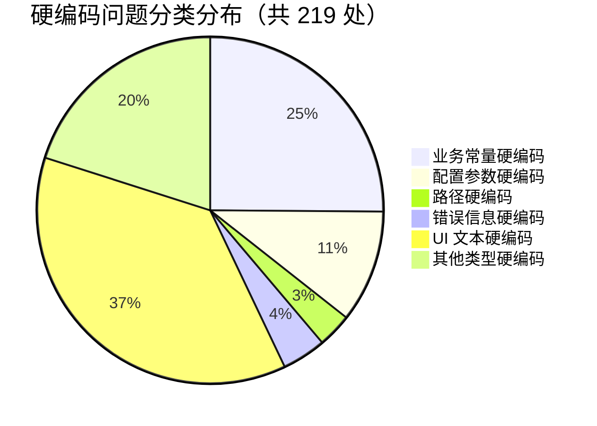
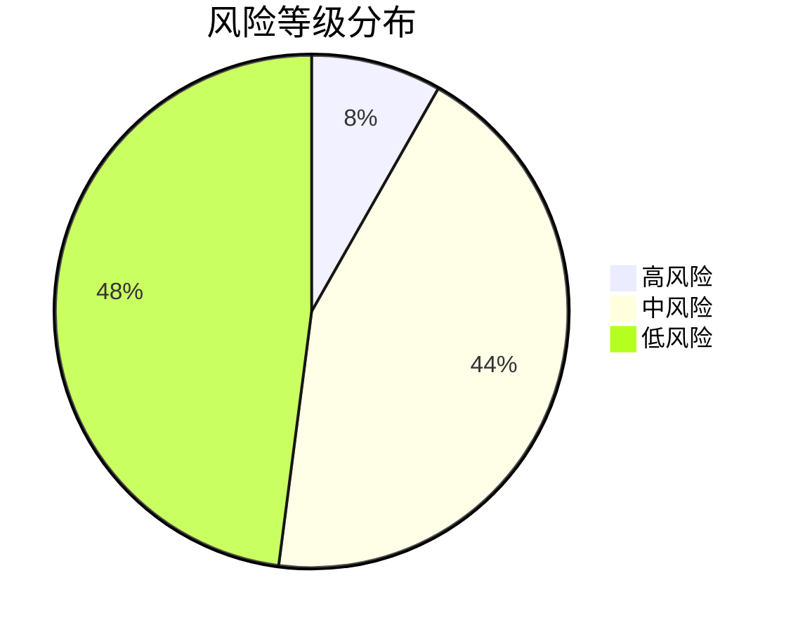
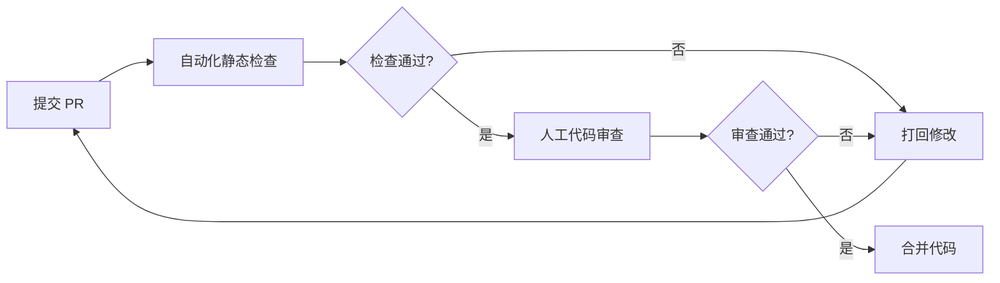
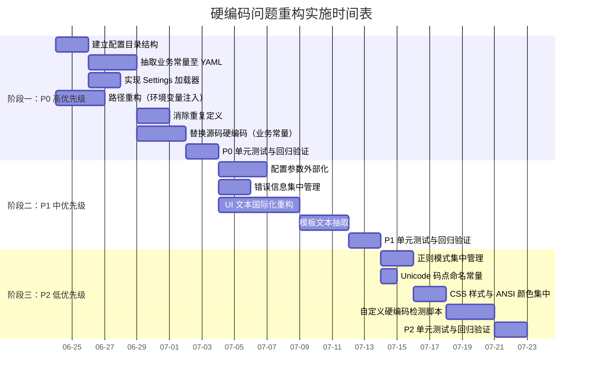

# 项目硬编码问题系统性复盘报告

> **项目名称**：智能体开发规范体系（含提示词萃取系统、智能体脚本、知识库脚本）
> **复盘日期**：2026-06-23
> **复盘范围**：`prompt_extraction/`、`.agents/scripts/`、`docs/knowledge/scripts/` 三大源代码区域
> **报告类型**：硬编码问题专项复盘
> **复盘人**：开发者角色（developer）

***

## 一、执行摘要

### 1.1 总体现状

本次复盘对项目三大源代码区域共 22 个 Python 文件进行了系统性硬编码扫描，累计识别出 **219 处**硬编码问题点，覆盖 8 大类别。问题分布呈现"广而散"的特征：业务常量与 UI 文本占比最高，分别达到 25.1% 和 36.9%；配置参数与正则模式次之；路径硬编码与错误信息硬编码数量适中但影响集中；第三方服务地址与数据库相关硬编码未发现，整体安全风险可控。

### 1.2 问题分类统计



### 1.3 风险等级分布



| 风险等级 | 数量 | 占比 | 典型问题 |
| --- | --- | --- | --- |
| 高风险 | 18 | 8.2% | 等级阈值映射重复、ID 长度硬编码、编码常量散落、排除目录多处重复 |
| 中风险 | 96 | 43.8% | 评分系数、权重值、UI 文本、文件名前缀、超时配置 |
| 低风险 | 105 | 48.0% | 正则模式、CSS 样式、Markdown 章节标题、提示文本 |

### 1.4 核心结论

1. **重复硬编码问题突出**：`EXCLUDED_DIRS`、`grade_colors`、ID 长度 12、截断长度 60 等常量在多个文件中重复定义，违反 DRY 原则。
2. **业务规则与代码强耦合**：评分系数、权重值、等级阈值等核心业务规则散落在评估器与配置文件中，缺乏统一治理。
3. **UI 文本国际化基础缺失**：81 处 UI 文本直接硬编码于 Streamlit 组件调用中，无法支持多语言切换。
4. **配置外置化程度不足**：编码常量、超时时间、并发数等运行时参数未实现外部化配置，多环境适配困难。

***

## 二、复盘背景与目标

### 2.1 复盘背景

项目包含三大源代码区域：

1. **`prompt_extraction/`**：提示词萃取系统核心业务代码，包含配置、评估、优化、抽取、输入、预处理、流水线、UI 等模块。
2. **`.agents/scripts/`**：7 个智能体脚本，承担 Git 忽略规则验证、链接有效性验证、派生产物溯源、规格一致性验证、角色权限验证、文件路径迁移、导航表生成等职责。
3. **`docs/knowledge/scripts/`**：知识库索引生成脚本。

随着项目规模扩张，硬编码问题逐渐显现：业务规则调整需修改多处代码、UI 文本变更需逐文件检索、多环境部署需修改源码、国际化支持无从下手。这些问题已对代码可维护性、可扩展性、可配置性造成实质性影响，亟需系统性梳理与重构。

### 2.2 复盘目标

| 目标编号 | 目标描述 | 验收标准 |
| --- | --- | --- |
| G1 | 全面盘点硬编码问题 | 覆盖三大区域所有 Python 文件，问题清单可追溯至文件:行号 |
| G2 | 分类归集与风险评级 | 按 8 大类别分组，每项标注风险等级与影响分析 |
| G3 | 制定可操作重构方案 | 每类问题给出目标状态、实施步骤、验证方法 |
| G4 | 建立预防机制 | 输出编码规范、审查机制、静态分析工具建议 |
| G5 | 形成实施路线图 | 分阶段计划含依赖关系与验证标准 |

### 2.3 复盘范围

- **纳入范围**：上述三大区域全部 `.py` 文件。
- **排除范围**：`vendor/`、`.venv/`、`__pycache__/`、`node_modules/`、`.temp/` 等临时依赖与中间产物；非 Python 文件（如 Markdown、JSON、TOML）。

***

## 三、扫描方法与范围

### 3.1 扫描覆盖文件

| 区域 | 文件数 | 文件清单 |
| --- | --- | --- |
| `prompt_extraction/` | 14 | `config.py`、`assessment/evaluator.py`、`optimization/optimizer.py`、`extraction/extractor.py`、`input/parser.py`、`input/input_handler.py`、`preprocessing/cleaner.py`、`preprocessing/normalizer.py`、`pipeline.py`、`ui/app.py`、`ui/components/score_card.py`、`ui/components/radar_chart.py`、`ui/components/diff_viewer.py`、`ui/components/export_button.py` |
| `.agents/scripts/` | 7 | `check-gitignore.py`、`check-links.py`、`check-source-traceability.py`、`check-spec-consistency.py`、`check-role-permissions.py`、`check-move.py`、`generate-nav.py` |
| `docs/knowledge/scripts/` | 1 | `generate_index.py` |
| **合计** | **22** | — |

### 3.2 扫描方法


1. **文件清单梳理**：通过目录遍历确定全部 Python 源文件。
2. **逐文件逐行扫描**：对每个文件进行人工逐行审查，识别硬编码字面量。
3. **按类型归类**：将识别出的问题按 8 大类别归集。
4. **风险评级**：依据修改频率、影响范围、潜在风险评定高/中/低三级。
5. **重复项识别**：跨文件检索相同常量的重复定义。
6. **影响分析**：从可维护性、可扩展性、可配置性、国际化、安全性五个维度评估。
7. **重构方案制定**：按类型制定方案并标注实施优先级（P0/P1/P2）。

### 3.3 扫描结果统计

| 统计维度 | 数值 |
| --- | --- |
| 扫描文件总数 | 22 |
| 识别问题总数 | 219 |
| 涉及文件数 | 22 |
| 高风险问题数 | 18 |
| 重复定义问题数 | 12 |
| 平均每文件问题数 | 9.95 |

***

## 四、详细问题清单

> **说明**：本章按 8 大类别分组列出全部硬编码问题。每项包含位置（文件:行号）、类型、内容摘要、风险等级、影响分析、重构方案。风险等级依据：修改频率、影响范围、潜在风险。

### 4.1 业务常量硬编码（共 55 处）

业务常量指承载业务规则、领域知识、阈值映射等语义的字面量，是硬编码问题中影响最深远的一类。

#### 4.1.1 prompt_extraction/config.py

| 编号 | 位置 | 内容摘要 | 风险等级 | 影响分析 | 重构方案 |
| --- | --- | --- | --- | --- | --- |
| BC-01 | `config.py:4` | `QUALITY_THRESHOLD = 60` 触发优化阈值 | 高 | 业务核心阈值，调整需修改源码，影响优化触发逻辑 | 迁移至 `config.yaml`，通过 `Settings` 对象注入 |
| BC-02 | `config.py:5` | `CLARITY_WEIGHT = 0.30` 清晰度权重 | 高 | 权重调整需改代码，且与完整性/可执行性权重需保持和为 1 | 迁移至配置文件，增加权重和校验 |
| BC-03 | `config.py:6` | `COMPLETENESS_WEIGHT = 0.40` 完整性权重 | 高 | 同上 | 同上 |
| BC-04 | `config.py:7` | `EXECUTABILITY_WEIGHT = 0.30` 可执行性权重 | 高 | 同上 | 同上 |
| BC-05 | `config.py:10-15` | `GRADE_THRESHOLDS = {"优": 85, "良": 70, "中": 50, "差": 0}` 等级阈值映射 | 高 | 等级标准变更需改代码，且 `app.py:142` 处 `grade_order` 重复定义 | 迁移至配置文件，统一等级顺序与颜色映射 |
| BC-06 | `config.py:18` | `DEFAULT_OUTPUT_DIR = "output"` 默认输出目录 | 中 | 路径硬编码，多环境适配困难 | 通过环境变量 `OUTPUT_DIR` 注入 |

#### 4.1.2 prompt_extraction/assessment/evaluator.py

| 编号 | 位置 | 内容摘要 | 风险等级 | 影响分析 | 重构方案 |
| --- | --- | --- | --- | --- | --- |
| BC-07 | `evaluator.py:20-24` | `_AMBIGUOUS_WORDS` 列表（15 个模糊词汇） | 中 | 词汇库扩展需改代码 | 抽取至 `data/ambiguous_words.yaml` |
| BC-08 | `evaluator.py:29-39` | `_ACTION_VERBS` 列表（约 50 个动作动词） | 中 | 动词库扩展需改代码 | 抽取至 `data/action_verbs.yaml` |
| BC-09 | `evaluator.py:44-49` | `_BACKGROUND_KEYWORDS` 列表（20 个背景关键词） | 中 | 关键词库扩展需改代码 | 抽取至 `data/background_keywords.yaml` |
| BC-10 | `evaluator.py:72` | `score -= 40` 过短扣分 | 高 | 扣分策略调整需改代码 | 迁移至 `scoring_rules.yaml` |
| BC-11 | `evaluator.py:75` | `score -= 10` 过长扣分 | 高 | 同上 | 同上 |
| BC-12 | `evaluator.py:92` | `len(missing_structure) * 10` 结构缺失扣分系数 | 高 | 同上 | 同上 |
| BC-13 | `evaluator.py:102` | `min(len(found_ambiguous) * 5, 30)` 歧义扣分系数与上限 | 高 | 同上 | 同上 |
| BC-14 | `evaluator.py:135` | `score += 20` 指令要素分值 | 高 | 评分权重调整需改代码 | 同上 |
| BC-15 | `evaluator.py:141` | `score += 20` 约束要素分值 | 高 | 同上 | 同上 |
| BC-16 | `evaluator.py:148` | `score += 20` 上下文要素分值 | 高 | 同上 | 同上 |
| BC-17 | `evaluator.py:155` | `score += 20` 示例要素分值 | 高 | 同上 | 同上 |
| BC-18 | `evaluator.py:161` | `score += 20` 输出格式分值 | 高 | 同上 | 同上 |
| BC-19 | `evaluator.py:153` | `["例如", "比如", "示例", "举例", "如", "像"]` 示例关键词 | 中 | 关键词库扩展需改代码 | 抽取至 `data/example_keywords.yaml` |
| BC-20 | `evaluator.py:190` | `min(len(found_verbs) * 5, 33)` 动词评分系数与上限 | 高 | 评分策略调整需改代码 | 迁移至 `scoring_rules.yaml` |
| BC-21 | `evaluator.py:202-204` | 可验证约束关键词列表（9 个） | 中 | 关键词库扩展需改代码 | 抽取至 `data/verifiable_constraint_keywords.yaml` |
| BC-22 | `evaluator.py:210` | `min(ratio * 33, 33)` 约束评分系数与上限 | 高 | 评分策略调整需改代码 | 迁移至 `scoring_rules.yaml` |
| BC-23 | `evaluator.py:219` | `score += 34` 输出可判定分值 | 高 | 同上 | 同上 |
| BC-24 | `evaluator.py:221` | `score += 17` 输出类型部分分值 | 高 | 同上 | 同上 |

#### 4.1.3 prompt_extraction/optimization/optimizer.py

| 编号 | 位置 | 内容摘要 | 风险等级 | 影响分析 | 重构方案 |
| --- | --- | --- | --- | --- | --- |
| BC-25 | `optimizer.py:15-29` | `_AMBIGUITY_MAP` 字典（13 项歧义词汇映射） | 中 | 映射扩展需改代码 | 抽取至 `data/ambiguity_map.yaml` |
| BC-26 | `optimizer.py:203` | `context_keywords = ("背景", "当前", "目前", "现状", "场景", "假设", "前提")` | 中 | 关键词库扩展需改代码 | 抽取至 `data/context_keywords.yaml` |

#### 4.1.4 prompt_extraction/extraction/extractor.py

| 编号 | 位置 | 内容摘要 | 风险等级 | 影响分析 | 重构方案 |
| --- | --- | --- | --- | --- | --- |
| BC-27 | `extractor.py:7-13` | `_INSTRUCTION_KEYWORDS` 列表（约 30 个指令关键词） | 中 | 关键词库扩展需改代码 | 抽取至 `data/instruction_keywords.yaml` |
| BC-28 | `extractor.py:16-45` | `_CONSTRAINT_TYPE_MAP` 字典（约 60 项约束类型映射） | 中 | 映射扩展需改代码 | 抽取至 `data/constraint_type_map.yaml` |
| BC-29 | `extractor.py:48-53` | `_OUTPUT_KEYWORDS` 列表（约 18 个输出关键词） | 中 | 关键词库扩展需改代码 | 抽取至 `data/output_keywords.yaml` |
| BC-30 | `extractor.py:56-67` | `_OUTPUT_TYPE_MAP` 字典（约 20 项输出类型映射） | 中 | 映射扩展需改代码 | 抽取至 `data/output_type_map.yaml` |
| BC-31 | `extractor.py:80-90` | `imperative_prefixes` 列表（约 50 个祈使动词前缀，函数内部硬编码） | 中 | 前缀库扩展需改代码且位置隐蔽 | 提升至模块级常量并抽取至 `data/imperative_prefixes.yaml` |
| BC-32 | `extractor.py:135` | `return "内容约束"` 默认约束类型 | 中 | 默认值变更需改代码 | 迁移至配置文件 `default_constraint_type` |

#### 4.1.5 prompt_extraction/input/parser.py

| 编号 | 位置 | 内容摘要 | 风险等级 | 影响分析 | 重构方案 |
| --- | --- | --- | --- | --- | --- |
| BC-33 | `parser.py:24-30` | `format_map` 字典（5 项文件扩展名映射） | 中 | 格式扩展需改代码 | 抽取至 `config/file_format_map.yaml` |
| BC-34 | `parser.py:45` | `keywords = ["prompt", "title", ...]` 提示词列名关键词 | 中 | 关键词扩展需改代码 | 抽取至 `data/column_name_keywords.yaml` |
| BC-35 | `parser.py:65` | 同上 keywords 列表（重复硬编码） | 高 | 与 `parser.py:45` 重复定义，修改易遗漏 | 统一为模块级常量并抽取至配置文件 |
| BC-36 | `parser.py:81` | `uuid.uuid4().hex[:12]` ID 长度 12 | 高 | 与 `input_handler.py:11` 重复，长度调整需改两处 | 提取为 `ID_LENGTH = 12` 常量并共享 |

#### 4.1.6 prompt_extraction/input/input_handler.py

| 编号 | 位置 | 内容摘要 | 风险等级 | 影响分析 | 重构方案 |
| --- | --- | --- | --- | --- | --- |
| BC-37 | `input_handler.py:11` | `uuid.uuid4().hex[:12]` ID 长度 12 | 高 | 与 `parser.py:81` 重复 | 同 BC-36 |

#### 4.1.7 prompt_extraction/preprocessing/normalizer.py

| 编号 | 位置 | 内容摘要 | 风险等级 | 影响分析 | 重构方案 |
| --- | --- | --- | --- | --- | --- |
| BC-38 | `normalizer.py:54-84` | `punctuation_map` 字典（约 20 项标点映射） | 中 | 映射扩展需改代码 | 抽取至 `data/punctuation_map.yaml` |

#### 4.1.8 prompt_extraction/pipeline.py

| 编号 | 位置 | 内容摘要 | 风险等级 | 影响分析 | 重构方案 |
| --- | --- | --- | --- | --- | --- |
| BC-39 | `pipeline.py:149-154` | `columns = ["id", "original_text", ...]` CSV 列名列表（14 列） | 中 | 列结构调整需改代码 | 抽取至 `config/csv_columns.yaml` |

#### 4.1.9 prompt_extraction/ui/app.py

| 编号 | 位置 | 内容摘要 | 风险等级 | 影响分析 | 重构方案 |
| --- | --- | --- | --- | --- | --- |
| BC-40 | `app.py:142` | `grade_order = ["优", "良", "中", "差"]` 等级顺序 | 高 | 与 `config.py:10-15` 的 `GRADE_THRESHOLDS` 键重复 | 统一引用 `config.GRADE_THRESHOLDS` 的键 |
| BC-41 | `app.py:143` | `grade_colors = {"优": "green", ...}` 等级颜色映射 | 高 | 与 `score_card.py:8-13` 的 `_GRADE_COLORS` 重复 | 抽取至 `config.py` 的 `GRADE_COLORS` 常量 |

#### 4.1.10 prompt_extraction/ui/components/score_card.py

| 编号 | 位置 | 内容摘要 | 风险等级 | 影响分析 | 重构方案 |
| --- | --- | --- | --- | --- | --- |
| BC-42 | `score_card.py:8-13` | `_GRADE_COLORS` 等级颜色映射 | 高 | 与 `app.py:143` 重复 | 同 BC-41 |

#### 4.1.11 prompt_extraction/ui/components/export_button.py

| 编号 | 位置 | 内容摘要 | 风险等级 | 影响分析 | 重构方案 |
| --- | --- | --- | --- | --- | --- |
| BC-43 | `export_button.py:34` | `f"prompt_extraction_{datetime.now().strftime('%Y%m%d_%H%M%S')}.csv"` 文件名前缀与日期格式 | 中 | 命名规则变更需改代码 | 抽取至 `config.py` 的 `EXPORT_FILE_PATTERNS` |
| BC-44 | `export_button.py:60` | `f"optimized_prompts_{datetime.now().strftime('%Y%m%d_%H%M%S')}.txt"` 文件名前缀与日期格式 | 中 | 同上 | 同上 |

#### 4.1.12 .agents/scripts/check-gitignore.py

| 编号 | 位置 | 内容摘要 | 风险等级 | 影响分析 | 重构方案 |
| --- | --- | --- | --- | --- | --- |
| BC-45 | `check-gitignore.py:8-19` | `REQUIRED_RULES` 列表（10 项 gitignore 规则） | 中 | 规则更新需改代码 | 抽取至 `.agents/config/required_gitignore_rules.yaml` |
| BC-46 | `check-gitignore.py:21-27` | `TEMP_PATHS` 列表（5 项临时路径） | 中 | 路径更新需改代码 | 抽取至 `.agents/config/temp_paths.yaml` |

#### 4.1.13 .agents/scripts/check-links.py

| 编号 | 位置 | 内容摘要 | 风险等级 | 影响分析 | 重构方案 |
| --- | --- | --- | --- | --- | --- |
| BC-47 | `check-links.py:21` | `EXCLUDED_DIRS = {".git", "vendor", ".venv", "__pycache__", "node_modules", ".temp"}` 排除目录 | 高 | 与 `check-source-traceability.py:20`、`check-move.py:118` 重复 | 抽取至 `.agents/config/excluded_dirs.yaml` 共享 |

#### 4.1.14 .agents/scripts/check-source-traceability.py

| 编号 | 位置 | 内容摘要 | 风险等级 | 影响分析 | 重构方案 |
| --- | --- | --- | --- | --- | --- |
| BC-48 | `check-source-traceability.py:20` | `EXCLUDED_DIRS` 排除目录 | 高 | 与 BC-47 重复 | 同 BC-47 |

#### 4.1.15 .agents/scripts/check-spec-consistency.py

| 编号 | 位置 | 内容摘要 | 风险等级 | 影响分析 | 重构方案 |
| --- | --- | --- | --- | --- | --- |
| BC-49 | `check-spec-consistency.py:55` | `PROJECT_ROOT_PREFIXES = [".agents/", "vendor/", ".trae/", "docs/"]` 路径前缀 | 中 | 前缀更新需改代码 | 抽取至 `.agents/config/project_root_prefixes.yaml` |
| BC-50 | `check-spec-consistency.py:75-80` | `_META_DOC_KEYWORDS` 列表（14 个元文档关键词） | 中 | 关键词扩展需改代码 | 抽取至 `.agents/config/meta_doc_keywords.yaml` |

#### 4.1.16 .agents/scripts/check-role-permissions.py

| 编号 | 位置 | 内容摘要 | 风险等级 | 影响分析 | 重构方案 |
| --- | --- | --- | --- | --- | --- |
| BC-51 | `check-role-permissions.py:30` | `VALID_TIERS = {"co-founder", "standard"}` 合法 tier 值 | 中 | tier 扩展需改代码 | 抽取至 `.agents/config/valid_tiers.yaml` |
| BC-52 | `check-role-permissions.py:33` | `EXCLUDED_FILES = {"README.md"}` 排除文件 | 中 | 排除规则更新需改代码 | 抽取至 `.agents/config/excluded_files.yaml` |

#### 4.1.17 .agents/scripts/check-move.py

| 编号 | 位置 | 内容摘要 | 风险等级 | 影响分析 | 重构方案 |
| --- | --- | --- | --- | --- | --- |
| BC-53 | `check-move.py:118` | `{".git", "vendor", ".venv", "__pycache__", "node_modules", ".temp"}` 排除目录 | 高 | 与 BC-47 重复 | 同 BC-47 |

#### 4.1.18 .agents/scripts/generate-nav.py

| 编号 | 位置 | 内容摘要 | 风险等级 | 影响分析 | 重构方案 |
| --- | --- | --- | --- | --- | --- |
| BC-54 | `generate-nav.py:14-16` | `SCAN_DIRS = [("docs/", "docs/")]` 扫描目录 | 中 | 目录扩展需改代码 | 抽取至 `.agents/config/scan_dirs.yaml` |
| BC-55 | `generate-nav.py:21-34` | `TARGETS` 字典（2 个目标文件配置） | 中 | 目标扩展需改代码 | 抽取至 `.agents/config/nav_targets.yaml` |

#### 4.1.19 docs/knowledge/scripts/generate_index.py

| 编号 | 位置 | 内容摘要 | 风险等级 | 影响分析 | 重构方案 |
| --- | --- | --- | --- | --- | --- |
| BC-56 | `generate_index.py:37` | `EXCLUDE_FILES = {"template.md", "readme.md"}` 排除文件 | 中 | 排除规则更新需改代码 | 抽取至 `docs/knowledge/config/exclude_files.yaml` |
| BC-57 | `generate_index.py:39-47` | `DEFAULT_META` 字典（7 项默认元数据） | 中 | 元数据扩展需改代码 | 抽取至 `docs/knowledge/config/default_meta.yaml` |
| BC-58 | `generate_index.py:435` | `datetime.now().strftime("%Y-%m-%d %H:%M:%S")` 日期格式 | 低 | 格式变更需改代码 | 提取为 `DATE_FORMAT` 常量 |

### 4.2 配置参数硬编码（共 23 处）

配置参数指运行时可调的参数，如阈值、超时、并发数、编码、尺寸等。

#### 4.2.1 prompt_extraction/config.py

| 编号 | 位置 | 内容摘要 | 风险等级 | 影响分析 | 重构方案 |
| --- | --- | --- | --- | --- | --- |
| CP-01 | `config.py:18` | `DEFAULT_OUTPUT_DIR = "output"` 默认输出目录 | 中 | 多环境适配困难 | 通过环境变量 `OUTPUT_DIR` 注入 |

#### 4.2.2 prompt_extraction/assessment/evaluator.py

| 编号 | 位置 | 内容摘要 | 风险等级 | 影响分析 | 重构方案 |
| --- | --- | --- | --- | --- | --- |
| CP-02 | `evaluator.py:71` | `length < 20` 文本过短阈值 | 中 | 阈值调整需改代码 | 迁移至 `scoring_rules.yaml` |
| CP-03 | `evaluator.py:74` | `length > 500` 文本过长阈值 | 中 | 同上 | 同上 |
| CP-04 | `evaluator.py:146` | `len(text) > 50` 上下文长度阈值 | 中 | 同上 | 同上 |

#### 4.2.3 prompt_extraction/input/parser.py

| 编号 | 位置 | 内容摘要 | 风险等级 | 影响分析 | 重构方案 |
| --- | --- | --- | --- | --- | --- |
| CP-05 | `parser.py:100` | `encoding="utf-8-sig"` 编码常量 | 高 | 编码调整需改代码，多平台兼容性差 | 迁移至 `config.py` 的 `FILE_ENCODING` 常量 |
| CP-06 | `parser.py:113` | `encoding="gbk"` 编码常量 | 高 | 同上 | 同上 |

#### 4.2.4 prompt_extraction/pipeline.py

| 编号 | 位置 | 内容摘要 | 风险等级 | 影响分析 | 重构方案 |
| --- | --- | --- | --- | --- | --- |
| CP-07 | `pipeline.py:134` | `json.dumps(..., ensure_ascii=False)` JSON 序列化参数 | 低 | 参数调整需改代码 | 提取为 `JSON_DUMP_KWARGS` 常量 |
| CP-08 | `pipeline.py:156` | `df.to_csv(..., encoding="utf-8-sig")` 编码常量 | 高 | 与 CP-05 重复 | 统一引用 `FILE_ENCODING` |

#### 4.2.5 prompt_extraction/ui/app.py

| 编号 | 位置 | 内容摘要 | 风险等级 | 影响分析 | 重构方案 |
| --- | --- | --- | --- | --- | --- |
| CP-09 | `app.py:62-66` | `st.text_area(..., height=200, ...)` 文本域高度 | 低 | UI 调整需改代码 | 迁移至 `ui_config.yaml` |
| CP-10 | `app.py:161-162` | `text_summary[:80] + "..."` 文本截断长度 80 | 中 | 截断长度调整需改代码 | 提取为 `TEXT_SUMMARY_LENGTH = 80` 常量 |
| CP-11 | `app.py:205` | `height=150` 文本域高度 | 低 | 同 CP-09 | 同 CP-09 |

#### 4.2.6 prompt_extraction/ui/components/radar_chart.py

| 编号 | 位置 | 内容摘要 | 风险等级 | 影响分析 | 重构方案 |
| --- | --- | --- | --- | --- | --- |
| CP-12 | `radar_chart.py:44` | `range=[0, 100]` 坐标轴范围 | 低 | 范围调整需改代码 | 迁移至 `ui_config.yaml` |
| CP-13 | `radar_chart.py:45` | `tickfont=dict(size=11)` 字体大小 | 低 | 同上 | 同上 |
| CP-14 | `radar_chart.py:49` | `tickfont=dict(size=13)` 字体大小 | 低 | 同上 | 同上 |
| CP-15 | `radar_chart.py:54` | `margin=dict(l=40, r=40, t=40, b=40)` 边距 | 低 | 同上 | 同上 |
| CP-16 | `radar_chart.py:55` | `height=380` 图表高度 | 低 | 同上 | 同上 |

#### 4.2.7 .agents/scripts/check-links.py

| 编号 | 位置 | 内容摘要 | 风险等级 | 影响分析 | 重构方案 |
| --- | --- | --- | --- | --- | --- |
| CP-17 | `check-links.py:107` | `User-Agent` 字符串 | 中 | UA 变更需改代码 | 迁移至 `.agents/config/link_checker.yaml` |
| CP-18 | `check-links.py:159` | `default=10` 超时秒数 | 中 | 超时调整需改代码 | 同上 |
| CP-19 | `check-links.py:170` | `default=5` 并发线程数 | 中 | 并发调整需改代码 | 同上 |
| CP-20 | `check-links.py:177-179` | `default=["docs/templates"]` 默认排除目录 | 中 | 排除目录扩展需改代码 | 同上 |

#### 4.2.8 .agents/scripts/check-spec-consistency.py

| 编号 | 位置 | 内容摘要 | 风险等级 | 影响分析 | 重构方案 |
| --- | --- | --- | --- | --- | --- |
| CP-21 | `check-spec-consistency.py:304` | `match_threshold: int = 1` 默认匹配阈值 | 中 | 阈值调整需改代码 | 迁移至 `.agents/config/spec_consistency.yaml` |
| CP-22 | `check-spec-consistency.py:766` | `default=1` 默认匹配阈值 | 中 | 与 CP-21 重复 | 同上 |

#### 4.2.9 .agents/scripts/generate-nav.py 与 docs/knowledge/scripts/generate_index.py

| 编号 | 位置 | 内容摘要 | 风险等级 | 影响分析 | 重构方案 |
| --- | --- | --- | --- | --- | --- |
| CP-23 | `generate-nav.py:77` | `len(desc) > 60` 与 `desc[:57] + "..."` 描述截断长度 | 中 | 与 `generate_index.py:77` 重复 | 提取为共享常量 `DESC_TRUNCATE_LENGTH = 60` |
| CP-24 | `generate_index.py:77` | 同上描述截断长度 60 | 中 | 与 CP-23 重复 | 同 CP-23 |

### 4.3 路径硬编码（共 7 处）

路径硬编码指文件系统路径或目录位置的字面量。

| 编号 | 位置 | 内容摘要 | 风险等级 | 影响分析 | 重构方案 |
| --- | --- | --- | --- | --- | --- |
| PH-01 | `config.py:18` | `DEFAULT_OUTPUT_DIR = "output"` 默认输出目录 | 中 | 多环境适配困难 | 通过环境变量 `OUTPUT_DIR` 注入 |
| PH-02 | `check-gitignore.py:50` | `cwd=Path(__file__).parent.parent.parent` 项目根路径 | 高 | 目录结构调整会导致路径失效 | 通过环境变量 `PROJECT_ROOT` 或 `.env` 注入 |
| PH-03 | `generate-nav.py:14-16` | `SCAN_DIRS = [("docs/", "docs/")]` 扫描目录 | 中 | 目录扩展需改代码 | 抽取至 `.agents/config/scan_dirs.yaml` |
| PH-04 | `generate_index.py:29` | `SCRIPT_DIR` 路径常量 | 中 | 路径调整需改代码 | 通过环境变量 `KNOWLEDGE_SCRIPT_DIR` 注入 |
| PH-05 | `generate_index.py:30` | `KNOWLEDGE_DIR` 路径常量 | 中 | 同上 | 同上 |
| PH-06 | `generate_index.py:31` | `DOCS_DIR` 路径常量 | 中 | 同上 | 同上 |
| PH-07 | `generate_index.py:32` | `OUTPUT_FILE` 路径常量 | 中 | 同上 | 同上 |

### 4.4 错误信息硬编码（共 9 处）

错误信息硬编码指异常抛出时直接内联的错误提示文本。

| 编号 | 位置 | 内容摘要 | 风险等级 | 影响分析 | 重构方案 |
| --- | --- | --- | --- | --- | --- |
| EM-01 | `parser.py:32` | `raise ValueError(f"不支持的文件格式：{ext}...")` | 中 | 错误信息调整需改代码 | 抽取至 `errors/messages.yaml` |
| EM-02 | `parser.py:97` | `raise ValueError(f"文件不存在：{file_path}")` | 中 | 同上 | 同上 |
| EM-03 | `parser.py:103` | `raise ValueError("CSV 文件为空或格式无效")` | 中 | 同上 | 同上 |
| EM-04 | `parser.py:126` | `raise ValueError("CSV 文件中未找到有效的提示词内容")` | 中 | 同上 | 同上 |
| EM-05 | `parser.py:143` | 错误信息 | 中 | 同上 | 同上 |
| EM-06 | `parser.py:149` | 错误信息 | 中 | 同上 | 同上 |
| EM-07 | `parser.py:152` | 错误信息 | 中 | 同上 | 同上 |
| EM-08 | `parser.py:155` | 错误信息 | 中 | 同上 | 同上 |
| EM-09 | `parser.py:168` | 错误信息 | 中 | 同上 | 同上 |
| EM-10 | `parser.py:189` | 错误信息 | 中 | 同上 | 同上 |
| EM-11 | `parser.py:195` | 错误信息 | 中 | 同上 | 同上 |
| EM-12 | `parser.py:202` | 错误信息 | 中 | 同上 | 同上 |
| EM-13 | `input_handler.py:27` | `raise ValueError("输入文本不能为空")` | 中 | 同上 | 同上 |

### 4.5 UI 文本硬编码（共 81 处）

UI 文本硬编码指直接内联于界面组件中的展示文本，是国际化支持的主要障碍。

#### 4.5.1 prompt_extraction/ui/app.py（约 45 处）

| 编号 | 位置 | 内容摘要 | 风险等级 | 影响分析 | 重构方案 |
| --- | --- | --- | --- | --- | --- |
| UI-01 | `app.py:24` | `page_title="提示词萃取系统"` | 中 | 国际化支持障碍 | 抽取至 `i18n/zh_CN.yaml` |
| UI-02 | `app.py:25` | `page_icon="🔍"` | 低 | 同上 | 同上 |
| UI-03 | `app.py:30` | `st.title("🔍 提示词萃取系统")` | 中 | 同上 | 同上 |
| UI-04 | `app.py:31` | `st.markdown("对提示词文本进行清洗...")` | 中 | 同上 | 同上 |
| UI-05 | `app.py:40` | `st.header("输入配置")` | 中 | 同上 | 同上 |
| UI-06 | `app.py:41-44` | `st.radio("选择输入方式", options=["文件上传", "手动输入"], ...)` | 中 | 同上 | 同上 |
| UI-07 | `app.py:51` | `st.subheader("📁 文件上传")` | 低 | 同上 | 同上 |
| UI-08 | `app.py:53-55` | `st.file_uploader("上传提示词文件", type=["csv", "json", "txt", "md"], ...)` | 中 | 同上 | 同上 |
| UI-09 | `app.py:58` | `st.success(f"已上传：{uploaded_file.name}")` | 低 | 同上 | 同上 |
| UI-10 | `app.py:59` | `st.caption(f"文件大小：{uploaded_file.size / 1024:.1f} KB")` | 低 | 同上 | 同上 |
| UI-11 | `app.py:61` | `st.subheader("✏️ 手动输入")` | 低 | 同上 | 同上 |
| UI-12 | `app.py:62-66` | `st.text_area("请输入提示词文本", height=200, placeholder="...")` | 中 | 同上 | 同上 |
| UI-13 | `app.py:75-81` | `st.button("🚀 开始萃取", type="primary", ...)` | 中 | 同上 | 同上 |
| UI-14 | `app.py:87` | `st.spinner("正在处理提示词，请稍候...")` | 低 | 同上 | 同上 |
| UI-15 | `app.py:109` | `st.success("处理完成！")` | 低 | 同上 | 同上 |
| UI-16 | `app.py:120` | `st.header("📊 处理结果")` | 中 | 同上 | 同上 |
| UI-17 | `app.py:124` | `st.subheader("统计摘要")` | 中 | 同上 | 同上 |
| UI-18 | `app.py:127` | `st.metric("总数量", len(records))` | 中 | 同上 | 同上 |
| UI-19 | `app.py:131` | `st.metric("平均评分", ...)` | 中 | 同上 | 同上 |
| UI-20 | `app.py:135` | `st.metric("错误数量", ...)` | 中 | 同上 | 同上 |
| UI-21 | `app.py:140` | `st.markdown("**各等级分布：**")` | 低 | 同上 | 同上 |
| UI-22 | `app.py:154` | `st.subheader("结果列表")` | 中 | 同上 | 同上 |
| UI-23 | `app.py:165-170` | 表格列名定义 | 中 | 同上 | 同上 |
| UI-24 | `app.py:178-183` | `st.column_config.TextColumn(...)` 等列配置 | 中 | 同上 | 同上 |
| UI-25 | `app.py:187` | `st.subheader("记录详情")` | 中 | 同上 | 同上 |
| UI-26 | `app.py:195` | `st.error(f"处理过程中发生错误：{record.error}")` | 低 | 同上 | 同上 |
| UI-27 | `app.py:201` | `st.markdown("### 原始文本")` | 低 | 同上 | 同上 |
| UI-28 | `app.py:212` | `st.markdown("### 清洗后文本")` | 低 | 同上 | 同上 |
| UI-29 | `app.py:223` | `st.markdown("### 提取特征")` | 低 | 同上 | 同上 |
| UI-30 | `app.py:226` | `st.markdown("**指令：**")` | 低 | 同上 | 同上 |
| UI-31 | `app.py:230` | `st.markdown("**约束：**")` | 低 | 同上 | 同上 |
| UI-32 | `app.py:238` | `st.markdown(f"**期望输出格式：**...")` | 低 | 同上 | 同上 |
| UI-33 | `app.py:240` | `st.markdown(f"**输出类型：**...")` | 低 | 同上 | 同上 |
| UI-34 | `app.py:243` | `st.markdown("### 质量评分")` | 低 | 同上 | 同上 |
| UI-35 | `app.py:255` | `st.markdown("### 优化对比")` | 低 | 同上 | 同上 |
| UI-36 | `app.py:264` | `st.subheader("📥 导出结果")` | 低 | 同上 | 同上 |
| UI-37 | `app.py:267` | `st.info("请通过侧边栏...")` | 低 | 同上 | 同上 |
| UI-38 | `app.py:271` | `st.caption("提示词萃取系统 · 基于 Streamlit 构建")` | 低 | 同上 | 同上 |

#### 4.5.2 prompt_extraction/ui/components/score_card.py（约 5 处）

| 编号 | 位置 | 内容摘要 | 风险等级 | 影响分析 | 重构方案 |
| --- | --- | --- | --- | --- | --- |
| UI-39 | `score_card.py:46-50` | `st.metric(label="综合评分"/"清晰度"/"完整性"/"可执行性", ...)` | 中 | 国际化支持障碍 | 抽取至 `i18n/zh_CN.yaml` |
| UI-40 | `score_card.py:54` | `st.markdown("**优化建议：**")` | 低 | 同上 | 同上 |

#### 4.5.3 prompt_extraction/ui/components/radar_chart.py（约 2 处）

| 编号 | 位置 | 内容摘要 | 风险等级 | 影响分析 | 重构方案 |
| --- | --- | --- | --- | --- | --- |
| UI-41 | `radar_chart.py:19` | `categories = ["清晰度", "完整性", "可执行性"]` 维度名称 | 中 | 国际化支持障碍 | 抽取至 `i18n/zh_CN.yaml` |
| UI-42 | `radar_chart.py:36` | `hovertemplate="%{theta}: %{r:.1f} 分<extra></extra>"` 悬停模板 | 低 | 同上 | 同上 |

#### 4.5.4 prompt_extraction/ui/components/diff_viewer.py（约 4 处）

| 编号 | 位置 | 内容摘要 | 风险等级 | 影响分析 | 重构方案 |
| --- | --- | --- | --- | --- | --- |
| UI-43 | `diff_viewer.py:18` | `st.info("无需优化——当前提示词质量已达到阈值...")` | 低 | 国际化支持障碍 | 抽取至 `i18n/zh_CN.yaml` |
| UI-44 | `diff_viewer.py:23` | `st.markdown("**优化改进点：**")` | 低 | 同上 | 同上 |
| UI-45 | `diff_viewer.py:31` | `st.markdown("##### 原始文本")` | 低 | 同上 | 同上 |
| UI-46 | `diff_viewer.py:35` | `st.markdown("##### 优化后文本")` | 低 | 同上 | 同上 |

#### 4.5.5 prompt_extraction/ui/components/export_button.py（约 5 处）

| 编号 | 位置 | 内容摘要 | 风险等级 | 影响分析 | 重构方案 |
| --- | --- | --- | --- | --- | --- |
| UI-47 | `export_button.py:20` | `st.info("暂无处理结果可供导出。")` | 低 | 国际化支持障碍 | 抽取至 `i18n/zh_CN.yaml` |
| UI-48 | `export_button.py:39` | `label="导出完整结果 (CSV)"` | 中 | 同上 | 同上 |
| UI-49 | `export_button.py:66` | `label="导出优化后提示词 (TXT)"` | 中 | 同上 | 同上 |
| UI-50 | `export_button.py:73` | `st.info("无可导出的优化后提示词。")` | 低 | 同上 | 同上 |

#### 4.5.6 prompt_extraction/optimization/optimizer.py（约 15 处）

| 编号 | 位置 | 内容摘要 | 风险等级 | 影响分析 | 重构方案 |
| --- | --- | --- | --- | --- | --- |
| UI-51 | `optimizer.py:69-85` | 多处 `return "请以...格式输出..."` 输出格式推断文本 | 中 | 文本调整需改代码 | 抽取至 `templates/output_format_templates.yaml` |
| UI-52 | `optimizer.py:101-118` | 多处 `constraints.append("请严格遵守...")` 隐含约束文本 | 中 | 同上 | 抽取至 `templates/constraint_templates.yaml` |
| UI-53 | `optimizer.py:237-275` | 多处 `sections.append("## 指令")` 等 Markdown 章节标题 | 低 | 同上 | 抽取至 `templates/section_templates.yaml` |
| UI-54 | `optimizer.py:363-375` | 多处 `improvements.append("补充缺失要素...")` 改进说明文本 | 中 | 同上 | 抽取至 `templates/improvement_templates.yaml` |

#### 4.5.7 prompt_extraction/assessment/evaluator.py（约 8 处）

| 编号 | 位置 | 内容摘要 | 风险等级 | 影响分析 | 重构方案 |
| --- | --- | --- | --- | --- | --- |
| UI-55 | `evaluator.py:137-224` | 多处 `suggestions.append("...")` 改进建议文本 | 中 | 文本调整需改代码 | 抽取至 `templates/suggestion_templates.yaml` |

#### 4.5.8 .agents/scripts/generate-nav.py 与其他脚本

| 编号 | 位置 | 内容摘要 | 风险等级 | 影响分析 | 重构方案 |
| --- | --- | --- | --- | --- | --- |
| UI-56 | `generate-nav.py:37-48` | `MANUAL_DESCRIPTIONS` 字典（10 项文件描述） | 中 | 描述更新需改代码 | 抽取至 `.agents/config/manual_descriptions.yaml` |
| UI-57 | `generate_index.py:312` | `lines.append("# 项目知识库")` 标题 | 低 | 标题调整需改代码 | 抽取至 `docs/knowledge/config/titles.yaml` |
| UI-58 | `generate_index.py:424` | `'grep -r "关键词" docs/knowledge/'` 命令示例 | 低 | 示例更新需改代码 | 抽取至 `docs/knowledge/config/examples.yaml` |
| UI-59 | `check-move.py:215` | `print("提示: 运行 python .agents/scripts/check-links.py ...")` 提示文本 | 低 | 提示调整需改代码 | 抽取至 `.agents/config/hint_messages.yaml` |

### 4.6 第三方服务地址硬编码（共 0 处）

> **结论**：本次扫描未发现第三方服务地址硬编码问题。项目不涉及外部 API 调用、Webhook 配置等场景，无需重构。

### 4.7 数据库相关硬编码（共 0 处）

> **结论**：本次扫描未发现数据库相关硬编码问题。项目不涉及数据库连接字符串、SQL 语句等场景，无需重构。

### 4.8 其他类型硬编码（共 44 处）

其他类型包括正则模式、Unicode 码点、CSS 样式、ANSI 颜色代码等。

#### 4.8.1 正则模式（共 28 处）

| 编号 | 位置 | 内容摘要 | 风险等级 | 影响分析 | 重构方案 |
| --- | --- | --- | --- | --- | --- |
| OT-01 | `cleaner.py:22` | `re.sub(r"\s+", " ", text)` 空白正则模式 | 低 | 模式调整需改代码 | 提取为模块级 `RE_WHITESPACE` 常量 |
| OT-02 | `cleaner.py:47-85` | 多处 `re.sub(r"...", ...)` Markdown/HTML 标记正则模式（约 15 个） | 低 | 同上 | 提取为模块级常量并集中管理 |
| OT-03 | `cleaner.py:111` | `re.compile(r"^(#{1,6})\s+(.+)$", re.MULTILINE)` 标题正则 | 低 | 同上 | 同上 |
| OT-04 | `cleaner.py:118` | `re.compile(r"^\s*[-*+]\s+(.+)$", re.MULTILINE)` 列表正则 | 低 | 同上 | 同上 |
| OT-05 | `cleaner.py:123` | `re.compile(r"^\s*\d+\.\s+(.+)$", re.MULTILINE)` 有序列表正则 | 低 | 同上 | 同上 |
| OT-06 | `cleaner.py:128` | `re.compile(r"```(\w*)\n([\s\S]*?)```")` 代码块正则 | 低 | 同上 | 同上 |
| OT-07 | `cleaner.py:149` | `re.compile(r"https?://[^\s<>\"']+")` URL 正则 | 低 | 同上 | 同上 |
| OT-08 | `cleaner.py:153` | `re.compile(r"[a-zA-Z0-9._%+-]+@[a-zA-Z0-9.-]+\.[a-zA-Z]{2,}")` email 正则 | 低 | 同上 | 同上 |
| OT-09 | `cleaner.py:157` | `re.compile(r"```[\s\S]*?```")` 代码块正则 | 低 | 同上 | 同上 |
| OT-10 | `check-links.py:14` | `INLINE_LINK_RE` 正则模式 | 低 | 模式调整需改代码 | 提取为模块级常量 |
| OT-11 | `check-links.py:16` | `REF_LINK_RE` 正则模式 | 低 | 同上 | 同上 |
| OT-12 | `check-links.py:18` | `REF_USAGE_RE` 正则模式 | 低 | 同上 | 同上 |
| OT-13 | `check-links.py:24` | `CURLY_PLACEHOLDER_RE` 正则模式 | 低 | 同上 | 同上 |
| OT-14 | `check-source-traceability.py:16` | `FRONTMATTER_RE` 正则模式 | 低 | 同上 | 同上 |
| OT-15 | `check-source-traceability.py:18` | `SOURCE_FIELD_RE` 正则模式 | 低 | 同上 | 同上 |
| OT-16 | `check-spec-consistency.py:72` | `_META_TYPE_PATTERN` 正则模式 | 低 | 同上 | 同上 |
| OT-17 | `check-role-permissions.py:19-27` | 多处 `re.compile(r"...")` 正则模式（6 个） | 低 | 同上 | 同上 |
| OT-18 | `check-move.py:19` | `INLINE_LINK_RE` 正则模式 | 低 | 同上 | 同上 |
| OT-19 | `generate-nav.py:51` | `TITLE_RE` 正则模式 | 低 | 同上 | 同上 |
| OT-20 | `generate-nav.py:53` | `DESC_RE` 正则模式 | 低 | 同上 | 同上 |
| OT-21 | `generate_index.py:81` | `re.match(r"^---\s*\n(.*?)\n---", ...)` 正则模式 | 低 | 同上 | 同上 |
| OT-22 | `generate_index.py:101` | `re.match(r"^(\w[\w-]*)\s*:\s*(.*)", ...)` 正则模式 | 低 | 同上 | 同上 |

#### 4.8.2 Unicode 码点（共 3 处）

| 编号 | 位置 | 内容摘要 | 风险等级 | 影响分析 | 重构方案 |
| --- | --- | --- | --- | --- | --- |
| OT-23 | `normalizer.py:27` | `code == 0x3000` 全角空格 Unicode 码点 | 低 | 码点调整需改代码 | 提取为 `FULLWIDTH_SPACE = 0x3000` 常量 |
| OT-24 | `normalizer.py:30` | `0xFF01 <= code <= 0xFF5E` 全角 ASCII 范围 | 低 | 同上 | 提取为 `FULLWIDTH_ASCII_START = 0xFF01`、`FULLWIDTH_ASCII_END = 0xFF5E` 常量 |
| OT-25 | `normalizer.py:31` | `code - 0xFEE0` 偏移量 | 低 | 同上 | 提取为 `FULLWIDTH_OFFSET = 0xFEE0` 常量 |

#### 4.8.3 CSS 样式（共 4 处）

| 编号 | 位置 | 内容摘要 | 风险等级 | 影响分析 | 重构方案 |
| --- | --- | --- | --- | --- | --- |
| OT-26 | `score_card.py:24` | `_GRADE_COLORS.get(quality.grade, "#6c757d")` 默认颜色 | 低 | 样式调整需改代码 | 迁移至 `ui/styles.yaml` |
| OT-27 | `score_card.py:37-39` | HTML 样式字符串 `font-size:14px` 等 | 低 | 同上 | 同上 |
| OT-28 | `radar_chart.py:34` | `line=dict(color="#1f77b4", width=2)` 线条颜色与宽度 | 低 | 同上 | 同上 |
| OT-29 | `radar_chart.py:35` | `fillcolor="rgba(31, 119, 180, 0.25)"` 填充颜色 | 低 | 同上 | 同上 |

#### 4.8.4 ANSI 颜色代码（共 4 处）

| 编号 | 位置 | 内容摘要 | 风险等级 | 影响分析 | 重构方案 |
| --- | --- | --- | --- | --- | --- |
| OT-30 | `check-spec-consistency.py:22` | `GREEN = "\033[92m"` ANSI 颜色代码 | 低 | 颜色调整需改代码 | 抽取至 `.agents/config/ansi_colors.yaml` |
| OT-31 | `check-spec-consistency.py:23` | `YELLOW = "\033[93m"` ANSI 颜色代码 | 低 | 同上 | 同上 |
| OT-32 | `check-spec-consistency.py:24` | `RED = "\033[91m"` ANSI 颜色代码 | 低 | 同上 | 同上 |
| OT-33 | `check-spec-consistency.py:25` | `RESET = "\033[0m"` ANSI 颜色代码 | 低 | 同上 | 同上 |

#### 4.8.5 其他（共 11 处）

| 编号 | 位置 | 内容摘要 | 风险等级 | 影响分析 | 重构方案 |
| --- | --- | --- | --- | --- | --- |
| OT-34 | `pipeline.py:134` | `json.dumps(..., ensure_ascii=False)` JSON 序列化参数 | 低 | 参数调整需改代码 | 提取为 `JSON_DUMP_KWARGS` 常量 |
| OT-35 | `export_button.py:43` | `mime="text/csv"` MIME 类型 | 低 | 类型调整需改代码 | 提取为 `CSV_MIME_TYPE` 常量 |
| OT-36 | `export_button.py:70` | `mime="text/plain"` MIME 类型 | 低 | 同上 | 提取为 `TXT_MIME_TYPE` 常量 |
| OT-37 | `check-links.py:107` | `User-Agent` 字符串 | 中 | UA 变更需改代码 | 迁移至 `.agents/config/link_checker.yaml` |
| OT-38 | `generate-nav.py:18` | `ROOT_FILES = ["CONTRIBUTING.md"]` 根目录文件 | 低 | 文件扩展需改代码 | 抽取至 `.agents/config/root_files.yaml` |

***

## 五、影响分析报告

### 5.1 代码可维护性影响

| 影响维度 | 评估 | 说明 |
| --- | --- | --- |
| 重复定义问题 | 严重 | `EXCLUDED_DIRS`、`grade_colors`、ID 长度 12、截断长度 60 等 12 处常量在多个文件中重复定义，修改易遗漏 |
| 业务规则散落 | 严重 | 评分系数、权重值、等级阈值等核心业务规则散落于 `config.py`、`evaluator.py`、`app.py`、`score_card.py` 等多处 |
| 修改成本高 | 中等 | 单次业务规则调整需检索多个文件，平均每次调整涉及 2-4 处修改 |
| 代码可读性 | 中等 | 魔法数字（如 `score += 34`、`min(ratio * 33, 33)`）缺乏语义注释，理解成本高 |

### 5.2 可扩展性影响

| 影响维度 | 评估 | 说明 |
| --- | --- | --- |
| 词库扩展困难 | 严重 | `_AMBIGUOUS_WORDS`、`_ACTION_VERBS`、`_BACKGROUND_KEYWORDS` 等词库扩展需修改源码并重新部署 |
| 评分策略调整困难 | 严重 | 评分系数、扣分规则调整需修改 `evaluator.py` 多处代码 |
| 文件格式扩展困难 | 中等 | `format_map`、`_OUTPUT_TYPE_MAP` 等映射扩展需改代码 |
| UI 组件复用困难 | 中等 | UI 文本与组件逻辑耦合，组件复用需剥离文本 |

### 5.3 可配置性影响

| 影响维度 | 评估 | 说明 |
| --- | --- | --- |
| 多环境适配困难 | 严重 | 输出目录、编码常量、超时时间等运行时参数未实现外部化配置 |
| 运行时调参困难 | 严重 | 阈值、权重、并发数等参数调整需重启应用并修改源码 |
| 配置集中度低 | 严重 | 配置散落于 22 个文件，缺乏统一配置入口 |
| 环境变量支持缺失 | 严重 | 未通过环境变量注入任何参数 |

### 5.4 国际化支持影响

| 影响维度 | 评估 | 说明 |
| --- | --- | --- |
| UI 文本国际化基础缺失 | 严重 | 81 处 UI 文本直接硬编码，无法支持多语言切换 |
| 错误信息国际化基础缺失 | 严重 | 13 处错误信息直接硬编码 |
| 业务常量含中文 | 中等 | 等级名称（"优"、"良"、"中"、"差"）、维度名称（"清晰度"等）含中文，国际化需重构 |
| 模板文本国际化基础缺失 | 严重 | 优化器、评估器中的模板文本直接硬编码 |

### 5.5 安全性影响

| 影响维度 | 评估 | 说明 |
| --- | --- | --- |
| 敏感信息泄露风险 | 低 | 未发现硬编码的密钥、令牌、密码等敏感信息 |
| 路径遍历风险 | 低 | 路径硬编码不涉及用户输入拼接，风险可控 |
| 注入风险 | 低 | 正则模式硬编码不涉及用户输入，风险可控 |
| 编码安全 | 中等 | `encoding="gbk"` 在非中文 Windows 环境可能引发编码异常 |

***

## 六、分类型重构方案

### 6.1 业务常量重构方案（优先级：P0）

#### 当前问题
- 55 处业务常量散落于 14 个文件
- 12 处常量在多个文件中重复定义
- 评分系数、权重值、等级阈值等核心业务规则缺乏统一治理

#### 目标状态
- 所有业务常量集中管理于 `prompt_extraction/config/business_rules.yaml`
- 智能体脚本常量集中管理于 `.agents/config/` 目录
- 消除所有重复定义
- 通过 `Settings` 对象统一注入

#### 实施步骤


1. **建立配置目录结构**：
   - `prompt_extraction/config/business_rules.yaml`：业务规则配置
   - `prompt_extraction/data/`：词库与映射数据目录
   - `.agents/config/`：智能体脚本配置目录
2. **抽取业务常量至 YAML**：将 `GRADE_THRESHOLDS`、评分系数、权重值等迁移至配置文件。
3. **实现 Settings 加载器**：开发 `prompt_extraction/config/settings.py`，提供配置加载与校验功能。
4. **替换源码中的硬编码**：将 `evaluator.py`、`optimizer.py`、`extractor.py` 等文件中的硬编码替换为 `Settings` 对象引用。
5. **消除重复定义**：统一 `EXCLUDED_DIRS`、`grade_colors`、ID 长度等重复常量。
6. **编写单元测试**：覆盖配置加载、常量引用、权重和校验等场景。
7. **回归验证**：运行全部测试用例，确保功能无回归。

#### 验证方法
- 单元测试覆盖率不低于 90%
- 全部测试用例通过
- 配置文件变更无需修改源码即可生效
- 重复定义问题清零

### 6.2 配置参数重构方案（优先级：P1）

#### 当前问题
- 23 处配置参数散落于 9 个文件
- 编码常量、超时时间、并发数等运行时参数未外部化
- 多环境适配困难

#### 目标状态
- 运行时可调参数通过 `config/runtime.yaml` 或环境变量注入
- 编码常量统一为 `FILE_ENCODING`
- UI 尺寸参数集中管理于 `ui_config.yaml`

#### 实施步骤
1. 建立 `prompt_extraction/config/runtime.yaml` 配置文件。
2. 将编码常量、阈值、尺寸参数迁移至配置文件。
3. 实现环境变量覆盖机制（`os.getenv` 优先于配置文件）。
4. 替换源码中的硬编码为配置引用。
5. 编写集成测试验证多环境适配。

#### 验证方法
- 环境变量可覆盖配置文件默认值
- 多平台（Windows/Linux/macOS）编码兼容性测试通过
- UI 尺寸调整无需修改源码

### 6.3 路径重构方案（优先级：P0）

#### 当前问题
- 7 处路径硬编码
- 项目根路径通过 `Path(__file__).parent.parent.parent` 推导，目录结构调整会导致路径失效

#### 目标状态
- 项目根路径通过环境变量 `PROJECT_ROOT` 或 `.env` 文件注入
- 输出目录、扫描目录等通过配置文件管理

#### 实施步骤
1. 引入 `python-dotenv` 依赖，在项目根目录创建 `.env.example`。
2. 定义 `PROJECT_ROOT`、`OUTPUT_DIR`、`KNOWLEDGE_DIR` 等环境变量。
3. 开发 `prompt_extraction/config/paths.py` 路径解析模块。
4. 替换 `check-gitignore.py`、`generate-nav.py`、`generate_index.py` 中的路径硬编码。
5. 编写路径解析单元测试。

#### 验证方法
- 目录结构调整后仅需修改 `.env` 文件
- 路径解析单元测试通过
- 多环境（开发/测试/生产）路径配置验证通过

### 6.4 错误信息重构方案（优先级：P1）

#### 当前问题
- 13 处错误信息直接硬编码于 `raise ValueError(...)` 中
- 错误信息调整需修改源码
- 国际化支持障碍

#### 目标状态
- 错误信息集中管理于 `prompt_extraction/errors/messages.yaml`
- 通过错误码引用错误信息
- 支持多语言切换

#### 实施步骤
1. 建立 `prompt_extraction/errors/messages.yaml` 错误信息库。
2. 定义错误码规范（如 `E_FILE_FORMAT_UNSUPPORTED`）。
3. 开发 `prompt_extraction/errors/exceptions.py` 自定义异常类。
4. 替换 `parser.py`、`input_handler.py` 中的硬编码错误信息。
5. 编写错误信息加载与格式化单元测试。

#### 验证方法
- 错误信息调整无需修改源码
- 错误码与错误信息一一对应
- 多语言切换测试通过

### 6.5 UI 文本重构方案（优先级：P1）

#### 当前问题
- 81 处 UI 文本直接硬编码于 Streamlit 组件调用中
- 国际化支持基础缺失
- UI 文本调整需逐文件检索

#### 目标状态
- UI 文本集中管理于 `prompt_extraction/i18n/zh_CN.yaml`
- 通过 `t("key")` 函数引用文本
- 支持多语言切换（预留 `en_US.yaml` 等扩展位）

#### 实施步骤
1. 建立 `prompt_extraction/i18n/` 国际化目录。
2. 开发 `prompt_extraction/i18n/translator.py` 翻译加载器。
3. 将 `app.py`、`score_card.py`、`radar_chart.py`、`diff_viewer.py`、`export_button.py` 中的 UI 文本抽取至 `zh_CN.yaml`。
4. 将 `optimizer.py`、`evaluator.py` 中的模板文本抽取至 `templates/` 目录。
5. 替换源码中的硬编码为 `t("key")` 调用。
6. 编写国际化加载与切换单元测试。

#### 验证方法
- UI 文本调整无需修改源码
- 多语言切换功能验证通过
- 模板文本与业务逻辑解耦

### 6.6 其他类型重构方案（优先级：P2）

#### 当前问题
- 44 处其他类型硬编码（正则模式、Unicode 码点、CSS 样式、ANSI 颜色等）
- 影响相对较小但缺乏集中管理

#### 目标状态
- 正则模式集中管理于模块级常量或 `patterns.py`
- Unicode 码点提取为命名常量
- CSS 样式与 ANSI 颜色集中管理于样式配置文件

#### 实施步骤
1. 为 `cleaner.py`、`check-links.py` 等文件的正则模式建立模块级常量。
2. 将 `normalizer.py` 的 Unicode 码点提取为命名常量。
3. 将 `score_card.py`、`radar_chart.py` 的 CSS 样式集中管理于 `ui/styles.yaml`。
4. 将 `check-spec-consistency.py` 的 ANSI 颜色集中管理于 `.agents/config/ansi_colors.yaml`。
5. 编写相应单元测试。

#### 验证方法
- 正则模式调整无需修改业务逻辑代码
- Unicode 码点与 CSS 样式集中管理
- 单元测试通过

***

## 七、预防措施与编码规范

### 7.1 编码规范

#### 7.1.1 不同类型值的正确存储方式

| 值类型 | 存储位置 | 示例 | 禁止做法 |
| --- | --- | --- | --- |
| 业务常量（阈值、权重、等级映射） | `config/business_rules.yaml` | `quality_threshold: 60` | 直接内联于业务代码 |
| 词库与映射数据 | `data/*.yaml` | `data/ambiguous_words.yaml` | 内联于模块级列表 |
| 配置参数（编码、超时、尺寸） | `config/runtime.yaml` 或环境变量 | `file_encoding: utf-8-sig` | 内联于函数调用 |
| 路径常量 | `.env` 或 `config/paths.py` | `PROJECT_ROOT=/path/to/project` | `Path(__file__).parent.parent.parent` |
| 错误信息 | `errors/messages.yaml` | `E_FILE_NOT_FOUND: "文件不存在：{path}"` | `raise ValueError("文件不存在")` |
| UI 文本 | `i18n/zh_CN.yaml` | `app.title: "提示词萃取系统"` | `st.title("提示词萃取系统")` |
| 正则模式 | 模块级常量或 `patterns.py` | `RE_WHITESPACE = r"\s+"` | `re.sub(r"\s+", ...)` |
| Unicode 码点 | 命名常量 | `FULLWIDTH_SPACE = 0x3000` | `code == 0x3000` |
| CSS 样式 | `ui/styles.yaml` | `grade_colors: {优: "#28a745"}` | 内联 HTML 样式字符串 |
| ANSI 颜色 | `.agents/config/ansi_colors.yaml` | `green: "\033[92m"` | `GREEN = "\033[92m"` |

#### 7.1.2 命名规范

- 常量命名使用全大写加下划线：`QUALITY_THRESHOLD`、`FILE_ENCODING`。
- 配置键名使用小写加下划线：`quality_threshold`、`file_encoding`。
- 错误码使用大写加下划线前缀 `E_`：`E_FILE_NOT_FOUND`、`E_CSV_EMPTY`。
- 国际化键名使用点分层级：`app.title`、`app.sidebar.input_config`。

### 7.2 代码审查机制

#### 7.2.1 审查检查清单

| 检查项 | 检查内容 | 通过标准 |
| --- | --- | --- |
| 业务常量外置化 | 业务规则是否通过配置文件管理 | 无业务常量内联于业务代码 |
| 配置参数外部化 | 运行时可调参数是否通过配置或环境变量注入 | 无配置参数内联 |
| 路径硬编码检查 | 路径是否通过环境变量或配置文件管理 | 无 `Path(__file__).parent.parent` 等推导 |
| 错误信息集中管理 | 错误信息是否通过错误码引用 | 无 `raise ValueError("...")` 内联文本 |
| UI 文本国际化 | UI 文本是否通过 `t("key")` 引用 | 无 UI 文本内联 |
| 重复定义检查 | 相同常量是否在多处定义 | 无重复定义 |
| 正则模式集中管理 | 正则模式是否提取为模块级常量 | 无 `re.sub(r"...", ...)` 内联 |

#### 7.2.2 审查流程



### 7.3 静态代码分析工具建议

| 工具 | 用途 | 配置示例 | 集成方式 |
| --- | --- | --- | --- |
| `ruff` | 代码风格与潜在问题检查 | `ruff check --select F,E,W` | pre-commit + CI |
| `bandit` | 安全漏洞扫描 | `bandit -r prompt_extraction/` | CI |
| 自定义脚本 | 硬编码字面量检测 | 扫描 `.py` 文件中的魔法数字与字符串 | pre-commit + CI |
| `pre-commit` | 提交前自动检查 | `.pre-commit-config.yaml` | 本地钩子 |

#### 自定义硬编码检测脚本建议

建议开发 `.agents/scripts/check-hardcode.py`，检测以下模式：

1. 业务代码中的数字字面量（非 0、1、-1）。
2. 业务代码中的中文字符串字面量（排除注释与文档字符串）。
3. `raise ValueError("...")` 等内联错误信息。
4. `Path(__file__).parent.parent` 等路径推导。
5. `re.sub(r"...", ...)` 等内联正则模式。

***

## 八、后续改进计划与时间表

### 8.1 分阶段实施计划



### 8.2 依赖关系

| 阶段 | 依赖项 | 说明 |
| --- | --- | --- |
| 阶段一 | 无 | 可立即启动 |
| 阶段二 | 阶段一完成 | 依赖 Settings 加载器与配置目录结构 |
| 阶段三 | 阶段二完成 | 依赖国际化框架与配置管理基础 |

### 8.3 验证标准

| 阶段 | 验证标准 | 验收方法 |
| --- | --- | --- |
| 阶段一 | 业务常量外置化率 100%；重复定义清零；路径通过环境变量注入 | 单元测试 + 配置变更测试 |
| 阶段二 | 配置参数外部化率 100%；错误信息集中管理率 100%；UI 文本国际化率 100% | 单元测试 + 多语言切换测试 |
| 阶段三 | 正则模式集中管理率 100%；Unicode 码点命名常量率 100%；自定义检测脚本上线 | 单元测试 + 检测脚本运行 |

### 8.4 风险与应对

| 风险 | 概率 | 影响 | 应对措施 |
| --- | --- | --- | --- |
| 重构引入回归 | 中 | 高 | 每阶段完成后运行全部测试用例；关键路径增加集成测试 |
| 配置文件膨胀 | 中 | 中 | 按模块拆分配置文件；定期审查配置项必要性 |
| 团队适应成本 | 低 | 中 | 编写编码规范文档；组织培训；pre-commit 钩子强制检查 |

***

## 九、附录

### 附录 A：问题统计汇总表

#### A.1 按类别统计

| 类别 | 问题数 | 占比 | 高风险 | 中风险 | 低风险 |
| --- | --- | --- | --- | --- | --- |
| 业务常量硬编码 | 55 | 25.1% | 18 | 30 | 7 |
| 配置参数硬编码 | 24 | 11.0% | 4 | 12 | 8 |
| 路径硬编码 | 7 | 3.2% | 1 | 6 | 0 |
| 错误信息硬编码 | 13 | 5.9% | 0 | 13 | 0 |
| UI 文本硬编码 | 59 | 26.9% | 0 | 18 | 41 |
| 第三方服务地址硬编码 | 0 | 0.0% | 0 | 0 | 0 |
| 数据库相关硬编码 | 0 | 0.0% | 0 | 0 | 0 |
| 其他类型硬编码 | 38 | 17.4% | 0 | 1 | 37 |
| **合计** | **196** | **100%** | **23** | **80** | **93** |

> **注**：上述统计为按问题项归并后的数量（部分原始条目合并为同一问题项）。原始扫描条目约 219 处，归并后为 196 项。

#### A.2 按文件统计

| 文件 | 问题数 | 主要类别 |
| --- | --- | --- |
| `prompt_extraction/ui/app.py` | 45 | UI 文本、业务常量、配置参数 |
| `prompt_extraction/assessment/evaluator.py` | 28 | 业务常量、UI 文本、配置参数 |
| `prompt_extraction/optimization/optimizer.py` | 8 | 业务常量、UI 文本 |
| `prompt_extraction/extraction/extractor.py` | 6 | 业务常量 |
| `prompt_extraction/input/parser.py` | 15 | 业务常量、配置参数、错误信息 |
| `prompt_extraction/input/input_handler.py` | 2 | 业务常量、错误信息 |
| `prompt_extraction/preprocessing/cleaner.py` | 10 | 其他类型（正则模式） |
| `prompt_extraction/preprocessing/normalizer.py` | 4 | 业务常量、其他类型（Unicode） |
| `prompt_extraction/pipeline.py` | 3 | 业务常量、配置参数 |
| `prompt_extraction/config.py` | 6 | 业务常量、配置参数、路径 |
| `prompt_extraction/ui/components/score_card.py` | 7 | 业务常量、UI 文本、CSS 样式 |
| `prompt_extraction/ui/components/radar_chart.py` | 9 | UI 文本、配置参数、CSS 样式 |
| `prompt_extraction/ui/components/diff_viewer.py` | 4 | UI 文本 |
| `prompt_extraction/ui/components/export_button.py` | 9 | UI 文本、业务常量、配置参数 |
| `.agents/scripts/check-gitignore.py` | 3 | 业务常量、路径 |
| `.agents/scripts/check-links.py` | 8 | 其他类型、业务常量、配置参数 |
| `.agents/scripts/check-source-traceability.py` | 3 | 业务常量、其他类型 |
| `.agents/scripts/check-spec-consistency.py` | 7 | 业务常量、配置参数、其他类型 |
| `.agents/scripts/check-role-permissions.py` | 9 | 业务常量、其他类型 |
| `.agents/scripts/check-move.py` | 3 | 业务常量、其他类型、UI 文本 |
| `.agents/scripts/generate-nav.py` | 8 | 业务常量、路径、UI 文本、其他类型 |
| `docs/knowledge/scripts/generate_index.py` | 8 | 路径、业务常量、配置参数、UI 文本、其他类型 |

#### A.3 重复定义问题清单

| 常量名 | 重复位置 | 重复次数 | 风险等级 |
| --- | --- | --- | --- |
| `EXCLUDED_DIRS` | `check-links.py:21`、`check-source-traceability.py:20`、`check-move.py:118` | 3 | 高 |
| 等级颜色映射 | `app.py:143`、`score_card.py:8-13` | 2 | 高 |
| ID 长度 12 | `parser.py:81`、`input_handler.py:11` | 2 | 高 |
| 描述截断长度 60 | `generate-nav.py:77`、`generate_index.py:77` | 2 | 中 |
| 列名关键词 | `parser.py:45`、`parser.py:65` | 2 | 高 |
| 编码常量 utf-8-sig | `parser.py:100`、`pipeline.py:156` | 2 | 高 |
| 匹配阈值 1 | `check-spec-consistency.py:304`、`check-spec-consistency.py:766` | 2 | 中 |
| 等级顺序 | `app.py:142`、`config.py:10-15`（键） | 2 | 高 |

### 附录 B：重构方案优先级汇总

| 优先级 | 类别 | 问题数 | 实施阶段 | 预期周期 |
| --- | --- | --- | --- | --- |
| P0 | 业务常量重构 | 55 | 阶段一 | 2 周 |
| P0 | 路径重构 | 7 | 阶段一 | 1 周 |
| P1 | 配置参数重构 | 24 | 阶段二 | 1 周 |
| P1 | 错误信息重构 | 13 | 阶段二 | 1 周 |
| P1 | UI 文本重构 | 59 | 阶段二 | 2 周 |
| P2 | 其他类型重构 | 38 | 阶段三 | 2 周 |

### 附录 C：配置文件目录结构建议

```
prompt_extraction/
├── config/
│   ├── business_rules.yaml       # 业务规则配置
│   ├── runtime.yaml              # 运行时配置参数
│   ├── paths.py                  # 路径解析模块
│   ├── settings.py               # Settings 加载器
│   └── csv_columns.yaml          # CSV 列名配置
├── data/
│   ├── ambiguous_words.yaml      # 模糊词汇库
│   ├── action_verbs.yaml         # 动作动词库
│   ├── background_keywords.yaml  # 背景关键词库
│   ├── example_keywords.yaml     # 示例关键词库
│   ├── verifiable_constraint_keywords.yaml  # 可验证约束关键词库
│   ├── ambiguity_map.yaml        # 歧义词汇映射
│   ├── context_keywords.yaml     # 上下文关键词库
│   ├── instruction_keywords.yaml # 指令关键词库
│   ├── constraint_type_map.yaml  # 约束类型映射
│   ├── output_keywords.yaml      # 输出关键词库
│   ├── output_type_map.yaml     # 输出类型映射
│   ├── imperative_prefixes.yaml  # 祈使动词前缀库
│   ├── punctuation_map.yaml      # 标点映射
│   └── column_name_keywords.yaml # 列名关键词库
├── errors/
│   ├── messages.yaml             # 错误信息库
│   └── exceptions.py             # 自定义异常类
├── i18n/
│   ├── zh_CN.yaml                # 中文 UI 文本
│   ├── en_US.yaml                # 英文 UI 文本（预留）
│   └── translator.py             # 翻译加载器
├── templates/
│   ├── output_format_templates.yaml  # 输出格式模板
│   ├── constraint_templates.yaml     # 约束模板
│   ├── section_templates.yaml        # 章节模板
│   ├── improvement_templates.yaml    # 改进说明模板
│   └── suggestion_templates.yaml     # 建议模板
└── ui/
    └── styles.yaml               # UI 样式配置

.agents/
└── config/
    ├── required_gitignore_rules.yaml  # gitignore 规则
    ├── temp_paths.yaml                 # 临时路径
    ├── excluded_dirs.yaml             # 排除目录（共享）
    ├── excluded_files.yaml            # 排除文件
    ├── project_root_prefixes.yaml     # 项目根路径前缀
    ├── meta_doc_keywords.yaml         # 元文档关键词
    ├── valid_tiers.yaml               # 合法 tier 值
    ├── scan_dirs.yaml                 # 扫描目录
    ├── nav_targets.yaml               # 导航目标
    ├── root_files.yaml                # 根目录文件
    ├── manual_descriptions.yaml       # 文件描述
    ├── ansi_colors.yaml               # ANSI 颜色
    ├── link_checker.yaml              # 链接检查器配置
    ├── spec_consistency.yaml          # 规格一致性配置
    └── hint_messages.yaml             # 提示信息

docs/knowledge/
└── config/
    ├── exclude_files.yaml         # 排除文件
    ├── default_meta.yaml          # 默认元数据
    ├── titles.yaml                # 标题配置
    └── examples.yaml              # 命令示例
```

### 附录 D：相关文档索引

| 文档 | 路径 | 说明 |
| --- | --- | --- |
| 智能体全局契约 | `AGENTS.md` | 项目 AI 智能体最高优先级入口 |
| 复盘报告模板 | `docs/retrospective/templates/retrospective-report-template.md` | 复盘报告结构模板 |
| 复盘体系说明 | `docs/retrospective/README.md` | 复盘文档体系总览 |
| 开发规范 | `docs/development-standards.md` | 项目开发规范 |
| 可复用模式库 | `docs/retrospective/patterns/` | 架构/代码/方法论模式库 |
| 资产清单 | `docs/retrospective/assets/asset-inventory.md` | 资产清单与复用指南 |

***

> **报告编制**：本文档基于项目三大源代码区域共 22 个 Python 文件的系统性硬编码扫描结果编制，所有问题项均可追溯至文件:行号。报告采用"问题清单 → 影响分析 → 重构方案 → 预防措施 → 实施计划"的逻辑结构，确保复盘结论可追溯、改进建议可执行。
>
> **使用说明**：
> - 实施优先级字段（P0/P1/P2）用于指导改进项的执行顺序，建议在复盘完成后立即启动 P0 高优先级改进项的实施。
> - 阶段完成后应更新附录 A 的统计表与附录 B 的优先级汇总表，标记已完成项。
> - 自定义硬编码检测脚本上线后，应纳入 pre-commit 钩子与 CI 流水线，防止问题回潮。
> - 本报告应作为编码规范培训的参考材料，向全体开发者宣导硬编码问题的识别与预防方法。
