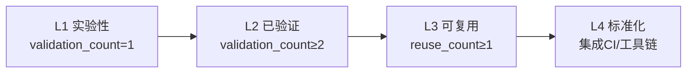

+++
description = "可复用模式库总索引 - 架构/代码/方法论三层模式体系"
+++

# 可复用模式库（patterns）

本目录存放经过验证的可复用模式，按层级分为架构模式、代码模式、方法论模式三类。

## 目录结构

| 目录 | 层级 | 说明 | 入口 |
|------|------|------|------|
| architecture-patterns/ | 架构层 | 文件依赖拓扑、级联更新策略、系统结构设计 | [README.md](architecture-patterns/README.md) |
| code-patterns/ | 代码层 | 具体代码编写、文件操作、编辑策略 | [README.md](code-patterns/README.md) |
| methodology-patterns/ | 方法论层 | 工作流程、执行策略、追踪机制 | [README.md](methodology-patterns/README.md) |

## 模式成熟度评估标准

### 成熟度等级定义

| 等级 | 名称 | 定义 | 量化条件 |
|------|------|------|---------|
| L1 | 实验性 | 仅 1 次成功案例，待更多验证 | `validation_count = 1` |
| L2 | 已验证 | ≥ 2 次成功案例，模式稳定 | `validation_count ≥ 2` |
| L3 | 可复用 | 已被其他任务复用，有文档化示例 | `reuse_count ≥ 1` 且 `validation_count ≥ 2` |
| L4 | 标准化 | 已纳入规范体系，有自动化验证 | 已集成至 CI/工具链 |

### 量化指标说明

| 指标 | 字段名 | 定义 | 计数方式 |
|------|--------|------|---------|
| 验证次数 | `validation_count` | 模式被成功应用并验证的次数 | 每次成功应用后 +1 |
| 复用次数 | `reuse_count` | 模式被其他任务（非原作者）复用的次数 | 每次复用后 +1 |
| 文档化程度 | `documentation_level` | 模式文档的完整性 | basic/standard/comprehensive |

### 成熟度升级路径



### 成熟度标注规范

每个模式文件的 TOML frontmatter 必须包含以下字段：

```toml
+++
id = "pattern-id"
domain = "methodology|code|architecture"
layer = "methodology|code|architecture"
maturity = "L1|L2|L3|L4"
validation_count = 1
reuse_count = 0
documentation_level = "basic|standard|comprehensive"
source = "来源文档路径"

[bindings]
rules = []
references = []
skills = []
+++
```

### 成熟度更新流程

1. **验证次数更新**：每次成功应用模式后，在模式文件 frontmatter 中 `validation_count + 1`
2. **复用次数更新**：其他任务复用模式成功后，在模式文件 frontmatter 中 `reuse_count + 1`
3. **成熟度升级**：满足升级条件后，更新 `maturity` 字段
4. **文档化升级**：补充正反例、检查清单后，更新 `documentation_level` 字段

## 模式统计

| 目录 | 模式数 | L1 | L2 | L3 | L4 |
|------|--------|----|----|----|----|
| architecture-patterns/ | 6 | 1 | 5 | 0 | 0 |
| code-patterns/ | 6 | 1 | 5 | 0 | 0 |
| methodology-patterns/ | 44 | 26 | 17 | 1 | 0 |
| **合计** | **56** | **28** | **27** | **1** | **0** |

> 注：统计数据截至 2026-06-24，已包含全链原子化（execution-s1-s3/s4-s7/insight-extraction）、元级复盘（retrospective-atomization-execution-s1-7/retrospective-meta-atomization-full-chain）萃取的所有新增模式，以及 methodol
ogy-analysis-report 原子化（8 个 L1 模式：复盘四步法、洞察冰山、萃取漏斗、导出四渠道、原子化三标准、模块化接口、闭环PDCA、五级成熟度）。

## 使用方式

1. 根据任务类型定位模式目录（架构/代码/方法论）
2. 在目录 README.md 中查找匹配场景的模式
3. 阅读模式正文了解规则与正反例
4. 按模式规则执行操作
5. 验证成功后更新模式成熟度（若适用）

## 相关文档

| 文档 | 说明 | 入口 |
|------|------|------|
| 复盘体系总览 | 复盘流程、报告结构、模式萃取 | [docs/retrospective/README.md](../README.md) |
| 资产清单 | 可复用资产索引 | [docs/retrospective/assets/asset-inventory.md](../assets/asset-inventory.md) |