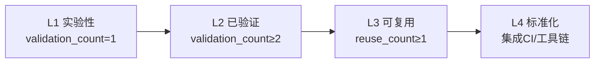

# 可复用模式库（patterns）

本目录存放经过验证的可复用模式，按层级分为架构模式、代码模式、方法论模式三类。

## 目录结构

| 目录 | 层级 | 说明 | 入口 |
|------|------|------|------|
| architecture-patterns/ | 架构层 | 文件依赖拓扑、级联更新策略、系统结构设计 | [README.md](architecture-patterns/README.md) |
| code-patterns/ | 代码层 | 具体代码编写、文件操作、编辑策略 | [README.md](code-patterns/README.md) |
| methodology-patterns/ | 方法论层 | 按主题分为8个子目录（复盘知识/外部研究/文档架构/工具自动化/治理策略/AI协作/创意设计/产品增长），共199个模式 | [README.md](methodology-patterns/README.md) |

## 模式成熟度评估标准

### 成熟度等级定义

| 等级 | 名称 | 定义 | 量化条件 |
|------|------|------|---------|
| L1 | 实验性 | 仅 1 次成功案例，待更多验证 | `validation_count = 1` |
| L2 | 已验证 | ≥ 2 次成功案例，模式稳定 | `validation_count ≥ 2` |
| L3 | 可复用 | 已被其他任务复用，有文档化示例 | `reuse_count ≥ 1` 且 `validation_count ≥ 2` |
| L4 | 标准化 | 已纳入规范体系，有自动化验证 | 已集成至 CI/工具链 |

### 量化指标说明

| 指标 | 字段名 | 定义 | 计数方式 |
|------|--------|------|---------|
| 验证次数 | `validation_count` | 模式被成功应用并验证的次数 | 每次成功应用后 +1 |
| 复用次数 | `reuse_count` | 模式被其他任务（非原作者）复用的次数 | 每次复用后 +1 |
| 文档化程度 | `documentation_level` | 模式文档的完整性 | basic/standard/comprehensive |

### 成熟度升级路径



### 成熟度标注规范

每个模式文件的 TOML frontmatter 必须包含以下字段：

```toml
+++
id = "pattern-id"
domain = "methodology|code|architecture"
layer = "methodology|code|architecture"
maturity = "L1|L2|L3|L4"
validation_count = 1
reuse_count = 0
documentation_level = "basic|standard|comprehensive"
source = "来源文档路径"

[bindings]
rules = []
references = []
skills = []
+++
```

### 成熟度更新流程

1. **验证次数更新**：每次成功应用模式后，在模式文件 frontmatter 中 `validation_count + 1`
2. **复用次数更新**：其他任务复用模式成功后，在模式文件 frontmatter 中 `reuse_count + 1`
3. **成熟度升级**：满足升级条件后，更新 `maturity` 字段
4. **文档化升级**：补充正反例、检查清单后，更新 `documentation_level` 字段

## 模式统计

| 目录 | 模式数 | L1 | L2 | L3 | L4 |
|------|--------|----|----|----|----|
| architecture-patterns/ | 25 | 6 | 10 | 0 | 0 |
| code-patterns/ | 35 | 4 | 5 | 0 | 2 |
| methodology-patterns/ | 203 | 63 | 44 | 8 | 0 |
| **合计** | **263** | **73** | **59** | **8** | **2** |

> > > > > > 注：统计数据截至 2026-07-05，由 pattern-maturity.py check-index --fix 自动更新。
> - 知识沉淀工作流元复盘（2个L1新模式入库+1个L2模式增强）：ai-collaboration/`subagent-git-three-prohibitions`（L1，子代理三不准规范）、retrospective-knowledge/`knowledge-sedimentation-workflow-sop`（L1，增强版知识沉淀SOP）；governance-strategy/`commit-quality-gate-staging-inspection`增强为暂存区卫生五步法（validation_count 2→3，补充术前检查/白名单验证/术后清理/Windows注意事项）
> - 向日葵无网远控硬件复盘（3个架构模式入库+1个方法论模式入库+5个现有模式更新）：architecture-patterns/`ipkvm-bypass-control`（L2）、`multi-mode-network-redundancy`（L2）、`usb-hid-emulation-plug-and-play`（L2）；product-growth/`hardware-price-scenario-matrix`（L1）；sunlogin-hardware-wiki-structure补充原子化变体（validation_count 4→7）、software-company-hardware-entry-framework补充第7品类案例（validation_count更新）、defuddle-web-extraction-preferred增加四步预检查法（validation_count 4→5）、multi-product-comparison-structure合并33维度KVM扩展框架（validation_count 4→5）、wiki-pre-creation-three-checks强化frontmatter 6字段校验（validation_count 4→6）
> - 向日葵智能远控鼠标MM110/BM110复盘（4个方法论模式入库+1个模式升级）：product-growth/`dual-product-matrix-portable-comfort`（L1）、product-growth/`parameter-difference-quantification`（L1）、product-growth/`saas-hardware-three-layer-funnel`（L2）、document-architecture/`sunlogin-hardware-wiki-structure`（L2）；tools-automation/`defuddle-web-extraction-preferred`增加双工具兜底机制（validation_count 3→4）
> - 向日葵P4/P1Pro智能插线板对比复盘（1个L3方法论模式）：governance-strategy/`wiki-pre-creation-three-checks`（L3，Wiki创作三查流程，4次验证3次复用）
> - 向日葵SU1摄像头wiki复盘（4个方法论模式）：product-growth/`hardware-generic-interface-service-differentiation`（L2）、product-growth/`scenario-driven-parameter-tradeoff`（L1）、ai-collaboration/`batched-creation-independent-review`（L2）、governance-strategy/`wiki-dual-track-frontmatter`（L1）
> - notebook Nuitka 构建工作区复盘（5 个模式）：code-patterns/`docker-container-session-raii`（L1）、code-patterns/`content-hash-build-cache`（L1）、architecture-patterns/`script-generator-pattern`（L1）、governance-strategy/`immutable-constraint-documentation`（L1）、ai-collaboration/`ai-agent-workspace-handbook`（L1）
> - Home Assistant 官方 Tuya 集成分析（4 个架构模式）：`iot-device-wrapper-pattern`（L1）、`iot-event-driven-state-update`（L1）、`iot-device-category-mapping`（L1）、`iot-quirks-extension-mechanism`（L1）
> - TuyaOpen 学习报告优化（4 个方法论模式）：governance-strategy/`file-creation-precheck-pattern`（L2）、governance-strategy/`spec-discoverability-guarantee`（L1）、governance-strategy/`three-layer-spec-constraint`（L2）、governance-strategy/`two-dimension-document-governance`（L2）
> - Specs 主题任务看板体系构建（3 个方法论模式）：governance-strategy/`three-tier-board-system`（L1）、governance-strategy/`progressive-requirement-clarification`（L1）、document-architecture/`mermaid-layered-visualization`（L2）
> - Ian Xiaohei 源码分析（6 个方法论模式 + 1 个架构模式）：ai-collaboration/`progressive-context-disclosure`、ai-collaboration/`output-behavior-specification`、ai-collaboration/`bilingual-prompt-engineering`、creative-design/`programmable-creativity-algorithm`、ai-collaboration/`symptom-prescription-qa`、ai-collaboration/`style-creativity-separation-control`（全部 L2）；architecture-patterns/ 新增 `dual-interface-repository`（L2）
> - 竹简悟道 Specs 分析（7 个方法论模式 + 1 个架构模式）：retrospective-knowledge/`insight-two-tier-structure`（L2）、retrospective-knowledge/`rolling-retro-eight-steps`（L3）、product-growth/`spec-nine-section-narrative`（L2）、document-architecture/`dual-audience-extraction-model`（L2）、product-growth/`three-layer-delivery-pipeline`（L3）、document-architecture/`document-entropy-three-strategies`（L3）、retrospective-knowledge/`insight-library-evolution`（L2）；architecture-patterns/ 新增 `five-layer-document-architecture`（L2）
> - Mermaid 渲染修复归档（2 个代码模式 + 1 个方法论模式更新）：code-patterns/`mermaid-safe-coding-rules`（L4）、code-patterns/`mermaid-trap-cheatsheet`（L4）；governance-strategy/`root-cause-diagnosis` 从 L1 升级为 L2，新增分层错误屏蔽概念
> - Frontmatter元数据统一复盘洞察萃取（3个模式成熟度升级）：architecture-patterns/`metadata-layering`（内容-元数据二分法）、tools-automation/`depth-reference-table`（机械心算必错原则）、governance-strategy/`spec-triple-sync`（规范悬空三缺原则）均从 L1 升级为 L2，各经3次验证（frontmatter迁移+MDI原子化+中期工具开发）
> - Frontmatter复盘实践经验沉淀（2个新模式+3个模式增强）：新增document-architecture/`bidirectional-navigation-links`（双向导航三链路，L1）、tools-automation/`shared-lib-gravity`（共享库引力定律，L2）；更新code-patterns/`cross-platform-encoding-enforcement`（补充Git commit -F UTF-8场景）、code-patterns/`gitignore-validation`（扩展为工具产出物同步治理模式）、architecture-patterns/`metadata-layering`（补充原子化frontmatter模板化案例）
> - 此前已包含全链原子化、元级复盘萃取模式，以及 methodology-analysis-report 原子化的 8 个 L1 模式。

## 使用方式

1. 根据任务类型定位模式目录（架构/代码/方法论）
2. 在目录 README.md 中查找匹配场景的模式
3. 阅读模式正文了解规则与正反例
4. 按模式规则执行操作
5. 验证成功后更新模式成熟度（若适用）

## 相关文档

| 文档 | 说明 | 入口 |
|------|------|------|
| 复盘体系总览 | 复盘流程、报告结构、模式萃取 | [docs/retrospective/README.md](../README.md) |
| 资产清单 | 可复用资产索引 | [docs/retrospective/assets/asset-inventory.md](../assets/asset-inventory.md) |
