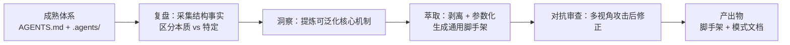

# 智能体工作区枢纽模板（Agent Workspace Hub Template）

## 模式类型
架构模式（工作区脚手架 / 规范体系模板 / 上下文路由）

## 成熟度
L1 实验性（首次从 SpecWeave 体系萃取并落库，待更多项目复用验证）

## 问题陈述

在 AI 智能体协作项目中，一套成熟的「智能体工作区枢纽」由两部分构成：

| 组成 | 作用 | 典型规模 |
|------|------|---------|
| `AGENTS.md` | 最高优先级入口：启动协议 + 顶层区域 + 规范入口导航 | ~100 行精简入口 |
| `.agents/` | 规范容器：角色/规则/协议/工具/脚本等具体内容 | 数百文件、持续演进 |

复用这套体系时面临的核心矛盾是「本质结构」与「项目特定实例」的耦合：

1. **直接复制的污染**：原项目特有内容（如 `vendor/flexloop` 子模块、具体角色名、具体脚本库）被带入新项目，需要大量删改。
2. **从头重写的遗漏**：凭记忆重写会遗漏已验证的核心机制（启动协议的强制性、内容敏感度分流、Core/Tools 分层等），且无法保证结构一致。
3. **结构不可预测**：不同人引导出的工作区结构各异，导致智能体无法按统一规则路由。

## 解决方案

从成熟体系萃取一套「通用脚手架」，核心是两个动作：**剥离** + **参数化**。

1. **剥离**：区分「本质结构」（所有项目都需要的）与「项目特定实例」（仅原项目需要的）：
   - 保留——启动协议、四大顶层区域对比表、核心规范入口导航、开发规范、知识库索引、Core/Tools 分层、L0/L1/L2 渐进式披露、内容敏感度分流。
   - 剥离——vendor/flexloop 等具体子模块、具体角色名与脚本名、具体的规则条目内容。

2. **参数化**：用占位符（如 `{{PROJECT_NAME}}`、`{{PROJECT_DESC}}`）标注需按项目替换的位置，使模板「开箱即用」。

3. **骨架化**：`.agents/` 只保留关键子目录（roles/rules/workflows/protocols/templates/scripts/skills/commands/docs）及其占位 README，明确每一层职责，供新项目逐步填充。

## 适用场景

| 场景 | 适用度 | 说明 |
|------|--------|------|
| 新项目引导智能体工作区 | 核心场景 | 复制脚手架即可得到结构一致的规范体系 |
| 多项目治理体系统一 | 核心场景 | 同一套 AGENTS.md + .agents 骨架复用 |
| 从成熟项目萃取可复用骨架 | 核心场景 | 本项目即为首次验证 |
| 单文件/极简项目 | 不适用 | 无需完整工作区枢纽，用最小 AGENTS.md 即可 |
| 已深度定制的现有项目 | 谨慎 | 替换现有体系需评估迁移成本 |

## 反模式警示

| 错误做法 | 后果 | 正确做法 |
|---------|------|---------|
| 直接复制原项目 AGENTS.md 不剥离 | 带入 vendor/具体角色等无关内容，需大量删改 | 先区分本质结构与项目特定实例，仅保留本质结构 |
| 凭记忆从头写 AGENTS.md | 遗漏启动协议强制性、内容敏感度分流等关键机制 | 以模板为基础参数化，而非从零重写 |
| 占位符命名含糊 | 替换时产生歧义、漏改 | 使用形如 `{{PROJECT_NAME}}` 的显式占位符，并在 README 列出全部占位符 |
| 骨架子目录只建空目录 | git 无法追踪空目录，结构在复制后丢失 | 每个关键子目录放置占位 README |
| 忽视 Core/Tools 分层 | 规范与脚本混放，依赖方向混乱 | 骨架中明确标注 [Core] 与 [Tools] 两类职责 |
| 模板与模式说明分离丢失 | 后人只知道结构，不知道设计意图 | 脚手架附 README 使用说明 + 沉淀独立模式文档 |

## 实现检查清单

- [ ] 脚手架是否剥离了原项目的 vendor/具体角色/具体脚本等特有内容？
- [ ] 是否用显式占位符（`{{PROJECT_NAME}}` 等）标注需参数化位置？
- [ ] 四大顶层区域表是否支持按需裁剪（无 submodule 时可仅保留 `.agents/`）？
- [ ] `.agents/` 骨架子目录是否都有占位 README，保证 git 可追踪？
- [ ] 是否说明「入口 ↔ 容器」关系（AGENTS.md 路由 vs .agents/ 细节）？
- [ ] 是否说明 Core/Tools 双层治理与 L0/L1/L2 渐进式披露？
- [ ] 是否附使用步骤（复制/参数化/装载/填充）？

## 验证来源

- **验证1：通用智能体工作区模板萃取（2026-08-19）**：运用 seven-concepts 方法论（场景4 知识沉淀，R→I→E→V→C）从 SpecWeave 的 AGENTS.md + .agents/（341+ 脚本、133+ 规则、19 Skill、13 指令集）中萃取通用脚手架，剥离 vendor/flexloop 等特有内容，产出模板 AGENTS.md + 精简 .agents/ 骨架 + 独立模式文档。首次验证，标记 L1。

## 关联资源

- 关联模式：[triple-entry-design.md](triple-entry-design.md)（三层入口设计：AGENTS.md 面向 AI + README 面向人）
- 关联模式：[three-layer-routing-protocol.md](three-layer-routing-protocol.md)（三层路由协议）
- 关联模式：[symmetric-directory-structure.md](../methodology-patterns/governance-strategy/symmetric-directory-structure.md)（对称目录结构设计）
- 脚手架：`templates/agent-workspace-hub/`（模板 AGENTS.md + .agents/ 骨架）