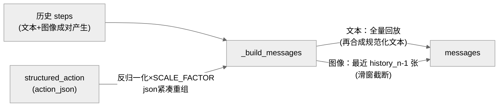

> **提炼自**：Tongyi-MAI mai-ui navigation Agent 上下文工程复盘 —— 多模态对话历史的"文本全量回放、图像滑窗、回放再合成"三原则

# 多模态历史非对称窗口（Asymmetric Multimodal History Windowing）

## 模式类型

架构模式（上下文工程 / 多模态对话历史 / token 经济学）

## 成熟度

L1 已验证（1 次验证：2026-08-29 Tongyi-MAI mai-ui 源码学习，含消息结构契约测试交叉验证）

## 适用场景

多模态多轮 Agent（GUI 操作、图像问答、视觉导航）管理对话历史时：

- 历史步数多、每步含截图，图像 token 成本远超文本
- 历史中早期画面信息可从先前 assistant 回复文本近似恢复
- 回放的 assistant 文本质量要求高于原始输出（含格式漂移/冗余思考）

## 问题背景

多模态历史管理最常见的两种做法都有缺陷：

1. **图文成对全保留**：token 随步数平方级膨胀，长任务必然爆窗。
2. **整齐滑窗（文本图像一起截断）**：早期动作语义丢失，模型重复试错。

根本矛盾：模型需要完整动作语义（文本便宜）但只需近期视觉（图像昂贵）——两种模态的信息价值衰减速率不同，**对称窗口是错误的默认**。

## 核心设计

三原则：

1. **文本全量回放**：assistant 历史文本不限窗口、逐步全量保留——模型可从先前回复中的动作与思考推断早期画面。
2. **图像滑动窗口**：只挂最近 `history_n - 1` 张截图（`start_image_idx = max(0, len(steps) - (history_n - 1))`），`history_n` 只控制图像窗口而非消息条数。
3. **回放文本再合成**：回放的 assistant 文本不是原始输出，而是从结构化 `action_json` 反归一化坐标后重新拼装的规范化版本——原始 `prediction` 字段虽保存但不用于回放。

## 实施要点

| 维度 | 做法 | mai-ui 实例 |
|---|---|---|
| 窗口语义 | `history_n` 只截图像，不截文本 | default_conf `history_n: 3`；5 步历史回放 "5 assistant + 3 image"（F-026/F-031/F-051） |
| 窗口计算 | 起始索引防御式取值，历史不足时不越界 | `start_image_idx = max(0, len(steps) - (history_n - 1))`（F-031）；`_prepare_images` 取 `min(len(history_images), history_n - 1)`（F-030） |
| 回放来源 | 从结构化状态再合成，不直接回放原始输出 | `history_responses` 坐标反归一化（normalized × SCALE_FACTOR 取 int）后以 `json.dumps(..., separators=(",", ":"))` 紧凑重组 `<thinking>/<tool_call>`（F-028） |
| 结构化写入 | 每轮把动作存为结构化字段，供回放再合成 | predict 成功后写入 `structured_action={"action_json": ...}`（F-033） |
| 单点修改 | 回放格式变更收敛在一处 | 只改 `history_responses`/`mem2response`（F-029），不动 `prediction` 字段 |
| 无 LLM 验证 | 消息结构用契约测试锁定 | 10 个消息结构测试（mock OpenAI + JSON 基线，F-051/F-052） |

## 不适用场景与反目标用户

### 不适用场景

- ❌ **文本历史同样巨大且早期文本不可再合成**：如自由对话（无结构化动作可重组）且上下文预算紧张——此时只能对文本也开窗，本模式的"全量回放"前提不成立。
- ❌ **图像便宜场景**：低分辨率缩略图/文本化 UI 树（a11y tree）作观察时，图像 token 不构成压力，滑窗收益趋零。
- ❌ **强依赖视觉连续性的任务**：如视频理解、需要追踪缓慢变化的视觉状态（早期画面无法从文本恢复）——截断早期图像会破坏任务可行性。

### 反目标用户

- 追求"历史忠实原样回放"的审计型场景：再合成文本不等于原始输出，审计需求应读 `prediction` 原始字段而非回放文本。

## 反模式

### 反模式1："对称窗口"默认

文本与图像用同一个窗口参数一起截断。**正确做法**：识别两模态信息价值衰减速率差异，文本长存、图像滑窗，窗口参数语义只绑图像。

### 反模式2："history_n 当消息条数"

把 `history_n` 理解为"保留最近 n 条消息"。后果：文本被意外截断、早期动作语义丢失。**正确做法**：以契约测试（如"5 assistant + 3 image"断言）锁定语义——`history_n` 只控制图像。

### 反模式3："直接回放原始输出"

assistant 历史直接塞原始 `prediction` 文本。后果：格式漂移、冗余前缀、非紧凑 JSON 被反复重放放大 token；且早期输出质量差会误导后续决策。**正确做法**：从结构化 `action_json` 反归一化再合成规范文本，原始输出仅存档。

### 反模式4："回放格式散落多处实现"

在消息构造、轨迹写入、测试基线多处各自实现回放逻辑。**正确做法**：再合成收敛在单一函数（`history_responses`/`mem2response`），格式变更单点完成。

### 反模式5："不做无 LLM 的消息结构验证"

消息格式正确性靠真实模型跑通来验证。后果：慢、贵、不稳定。**正确做法**：mock LLM + JSON 基线的契约测试锁定消息结构（mai-ui 10 个测试即现成素材）。

## 失败案例

### 案例：按"窗口=消息条数"先验误读 history_n（mai-ui 源码学习，2026-08-29）

**背景**：R 阶段初读 `_build_messages`（F-031）与 default_conf `history_n: 3`（F-026）时，按常见对话系统的"保留最近 n 条消息"先验理解窗口语义。

**发现过程**：该理解与滑窗实现矛盾——`start_image_idx = max(0, len(steps) - (history_n - 1))` 只切图像。交叉验证的落点是契约测试 `test_build_messages_with_5_history_steps`（F-051）：断言为"5 assistant + 3 image"，证明文本 5 步全量回放、仅图像截到 2 张（history_n - 1 窗口防御式取值）。随后在文档中显式写出"history_n 只控制图像窗口"，并同步登记"图像滑窗 + 文本全量 + 再合成"三原则的联动关系（F-030/F-028/F-033）。

**教训**：窗口类参数的语义必须以测试断言为准而非以命名直觉为准；"非对称窗口"是反直觉设计，文档若不显式声明，下一轮读者（人或 AI）必然重犯同一先验误读。

## 早期预警信号

| 预警信号 | 可能问题 | 建议行动 |
|---|---|---|
| 长任务 token 呈步数平方级增长 | 图文成对全保留（反模式1） | 拆分窗口：文本全量、图像滑窗 |
| 模型在长任务后段重复早期已完成的动作 | 文本被对称截断、动作语义丢失（反模式2） | 恢复文本全量回放，仅截图像 |
| 回放文本里出现格式漂移/冗余前缀逐轮放大 | 直接回放原始输出（反模式3） | 改为从结构化动作再合成规范文本 |
| 改回放格式需同步改多处代码 | 回放逻辑散落（反模式4） | 收敛到单一再合成函数 |
| 消息结构回归靠真实模型试跑 | 缺契约测试（反模式5） | mock LLM + JSON 基线锁定结构 |
| 窗口参数在历史不足时数组越界/空窗 | 防御式取值缺失 | `max(0, ...)` / `min(...)` 边界处理 + 边界用例 |

## 实际案例

Tongyi-MAI mai-ui navigation Agent（2026-08-29 源码学习）：

| 维度 | 事实 |
|---|---|
| 窗口参数 | `history_n: 3`（default_conf，F-026），只控制图像 |
| 图像滑窗 | 最近 `history_n - 1` 张，防御式起止索引（F-030/F-031） |
| 文本回放 | 全量，且回放"再合成"文本：坐标反归一化 × SCALE_FACTOR + 紧凑 JSON 重组（F-028） |
| 结构化写入 | 每轮存 `structured_action={"action_json": ...}`（F-033） |
| 契约测试 | 10 个消息结构测试，含 "5 assistant + 3 image" 断言（F-051/F-052） |

## 迁移验证

- **可迁移场景**：代码 Agent（文件快照贵、patch 文本便宜）；RPA 桌面自动化（截图滑窗 + 操作日志全量）；网页 Agent（DOM 快照 vs 动作序列）。
- **先例关联**：坐标反归一化再合成依赖 [normalized-coordinate-abstraction.md](./normalized-coordinate-abstraction.md) 的归一化坐标体系；消息构造的纯函数化与无 LLM 契约测试同 [io-boundary-pure-function-core.md](./io-boundary-pure-function-core.md) 的"纯函数核心"思想。

## 与其他模式的关系

| 关系模式 | 关系类型 | 说明 |
|---|---|---|
| [normalized-coordinate-abstraction.md](./normalized-coordinate-abstraction.md) | 依赖 | 回放再合成的"坐标反归一化"建立在其归一化坐标抽象之上；注意 mai-ui 存在 999/1000 双口径（见 normalization-convention-duality） |
| [io-boundary-pure-function-core.md](./io-boundary-pure-function-core.md) | 同源思想 | `_build_messages`/再合成是纯函数，配合契约测试实现无 LLM 验证 |
| [multi-agent-closed-loop-execution.md](./multi-agent-closed-loop-execution.md) | 场景互补 | 该模式解决多轮执行的失败恢复；本模式解决多轮历史的 token 经济学 |
| [context-lifecycle-layering.md](../methodology-patterns/ai-collaboration/context-lifecycle-layering.md) | 方法论层 | 上下文分层治理的一般方法论；本模式是其"多模态历史"维度的具体架构落地 |

<!-- changelog -->
- 2026-08-29 | pattern | 初始创建：从 Tongyi-MAI mai-ui 源码学习（洞察3）萃取；证据链 F-026/F-028/F-029/F-030/F-031/F-033/F-051/F-052，契约测试交叉验证
