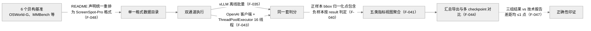

> **提炼自**：Tongyi-MAI mai-ui 评估方法论复盘 —— 异构基准先统一格式再统一判分，多通道结果与技术报告分数交叉印证

# 基准统一重排与多源交叉印证（Benchmark Unification & Cross-Validation）

## 模式类型

架构模式（评估管线 / 基准数据治理 / 结果可信度验证）

## 成熟度

L1 已验证（1 次验证：2026-08-29 Tongyi-MAI mai-ui 评估管线源码学习，data/ 目录重排声明、五类指标视图、双通道实现与 F-047 分数表逐项核对）

## 适用场景

同一模型要在单一仓库内评估多个异构公开基准，且结果需要对外可信：

- 基准间格式、坐标口径、判分规则各不相同，跨基准分数要可比
- 存在多条推理通道（离线批量推理引擎、OpenAI 兼容服务），需要确认等价性
- 复现者需要与原始技术报告分数对账，评估口径必须可解释

## 问题背景

评估管线最常见的两种失败：

1. **一基准一套评估代码**：每个基准各自维护加载器/判分器/汇总脚本，指标口径各说各话，跨基准分数不可比，改一处判分逻辑要同步 N 处。
2. **只跑单通道、不对账**：评估只在一条推理通道上跑一次，结果既无法排除通道实现引入的偏差，也无法与论文报告分数印证——分数异常时无从定位是模型问题、通道问题还是判分问题。

根本矛盾：**跨基准可比性要求判分口径绝对统一，而基准原始格式天然异构**——统一只能发生在数据入口层，不能靠在判分层为每个基准开特例。

## 核心设计

三原则：

1. **格式统一在入口，判分统一在出口**：6 个基准全部重排为 ScreenSpot-Pro 格式（F-048）后进入同一条管线，`evaluate` 用同一套判分产出五类指标视图（fine_grained / seeclick_style / leaderboard_simple_style / leaderboard_detailed_style / overall，F-041）——基准差异被消化在数据层，判分层零特例。
2. **双通道执行互为对照**：同一数据分别经 vLLM 离线批量通道（F-035）与 OpenAI 客户端 + ThreadPoolExecutor 16 线程服务通道（F-043）评估，两通道结果互证可排除单通道实现偏差。
3. **外部锚点交叉印证**：本地结果与技术报告分数对账（MAI-UI-8B：Tech Report 40.7 / eval locally 40.9 / eval by vllm api 40.3，六个数据集差距均 ≤1 点，F-047）——差距 ≤1 点即视为复现口径成立。

## 实施要点

| 维度 | 做法 | mai-ui 实例 |
|---|---|---|
| 数据入口统一 | 异构基准统一重排为单一格式，目录级声明重排事实 | data/ 下 6 个数据目录，README 声明 "OSWorld-G、MMBench 已重排为 ScreenSpot-Pro 格式"（F-048） |
| 判分规则 | 正负样本分别定义且负样本参与判分 | 正样本 bbox 归一化点包含判分，负样本按 result 判定——模型"回答有目标元素"判为 wrong（F-040） |
| 指标视图 | 同一判分产出多视图，适配不同报告口径 | `evaluate` 返回 fine_grained / seeclick_style / leaderboard_simple_style / leaderboard_detailed_style / overall 五类视图（F-041） |
| 执行通道 | 离线批量与在线服务两条通道跑同一数据 | vLLM 离线批量通道（F-035）；OpenAI 客户端 + ThreadPoolExecutor 16 线程服务通道（F-043） |
| 结果对账 | 与技术报告分数交叉印证，差距阈值明确 | MAI-UI-8B 三行结果 40.7 / 40.9 / 40.3，六数据集差距均 ≤1 点（F-047） |
| 训练-评测对齐 | 训练范式参数与标准推理模式显式对齐 | 沿用 UI-Ins 训练范式，`--use_guide_text False` 对齐标准推理模式（F-046） |
| 汇总导出 | 多 checkpoint 对比表脚本化 | `extract_metrics.py` 读 `metrics.overall.action_acc`，支持多 checkpoint 对比表（F-044） |
| 评测 prompt 口径 | 与推理 prompt 同源但差异显式登记 | 评估 prompt 末尾追加一行 `## Input instruction`（F-037），并非逐字节相同 |

## 不适用场景与反目标用户

### 不适用场景

- ❌ **单一基准自娱**：只评一个基准且不与外部分数对账时，统一格式与交叉印证的收益为零，直接跑原生基准脚本即可。
- ❌ **判分语义本质不同的基准**：若各基准的评价对象根本不同（如一个测定位、一个测端到端任务成功率），强行统一格式会丢失语义，应保持独立判分、仅在汇总层对齐。
- ❌ **无外部锚点可对账的新基准**：没有技术报告分数或第三方复现作锚点时，交叉印证退化为自己印证自己，此时只能依赖双通道对照。
- ❌ **在线低延迟评分场景**：五视图聚合与多通道对照是离线评估管线的做法，不应嵌入在线服务的实时判定路径。

### 反目标用户

- 追求"一个脚本评一切"而拒绝维护格式重排层的团队：本模式的重排层是一次性但必须严肃对待的投入。
- 只关心自家榜单名次、不关心复现口径的刷榜者：本模式的对账纪律会暴露口径差异。

### 适用边界与前提条件

- 重排必须保留原始标签语义（正/负样本、bbox），仅转换结构，否则判分失真。
- 双通道要求两条通道的模型输入（prompt、图像预处理）一致，否则对照无效。
- "差距 ≤1 点"是 mai-ui 的经验阈值，迁移时需按目标基准的噪声水平重设。

## 反模式

### 反模式1："判分层为每个基准开特例"

在判分函数里按基准名/数据集名分支处理。后果：口径分裂、改一处漏 N 处、跨基准分数不可比。**正确做法**：差异消解在数据入口的重排层（F-048），判分层对格式无感知。

### 反模式2："单通道一次性评估即发布"

只跑一条通道一次就出结论。后果：无法区分模型能力波动与通道实现偏差，复现者难以对账。**正确做法**：双通道对照（F-035/F-043）+ 与技术报告分数交叉印证（差距 ≤1 点，F-047）。

### 反模式3："只统计正样本命中率"

忽略负样本，只算"有目标时的命中"。后果：模型幻觉（无目标却回答有目标）不被惩罚，分数虚高。**正确做法**：负样本按 result 判定（F-040），"回答有目标元素"判 wrong。

### 反模式4："假设评测 prompt 与推理 prompt 逐字节相同"

直接复用训练/推理 prompt 做评测并宣称口径一致。后果：复现者按推理 prompt 跑分对不上评测分数，排查无门。**正确做法**：显式登记 prompt 差异——mai-ui 评估 prompt 末尾追加一行 `## Input instruction`（F-037）。

### 反模式5："指标只出一个总分"

只导出 overall 一个数字。后果：不同读者按各自习惯口径复算对不上，争议无法裁决。**正确做法**：同一判分产出五类指标视图（F-041），汇总脚本支持多 checkpoint 对比（F-044）。

### 反模式6："对齐参数靠口口相传"

训练/评测对齐参数（如 `--use_guide_text False`）不写进文档。后果：复现者漏参数导致分数系统性偏差。**正确做法**：教程显式提醒必要参数（F-046）。

## 失败案例

### 案例："评测 prompt 与推理 prompt 相同"的直觉预期被源码推翻（mai-ui 源码学习，2026-08-29）

**背景**：学习评估管线时，初始预期是"评测所用 prompt 应与 src 内 grounding prompt 逐字节一致，才能宣称训练-评测口径统一"。

**发现过程**：核对评估侧 prompt 构造后发现，评估 prompt 与 src 的 grounding prompt 同源，但末尾追加了单独一行 `## Input instruction`（F-037）——两者并非逐字节相同。同轮还确认第二个反直觉口径：评测的负样本（negative gt）把模型"回答有目标元素"判为 wrong，而非仅统计正样本命中率（F-040）。这两个口径事实随后回写进评估文档的"复现口径"说明（评估文档按"数据统一格式 → 双通道执行 → 判分 → 五视图聚合 → 汇总导出"五段组织），并引用 F-047 的三行分数表（Tech Report 40.7 / eval locally 40.9 / eval by vllm api 40.3）作为交叉印证证据。

**教训**：评估管线的"口径一致"必须落到逐行 prompt 与正负样本判分规则的核对上，不能靠"同源"推定"相同"；易被忽视的口径差异要在文档中显式登记，否则复现对账时必然返工。

## 早期预警信号

| 预警信号 | 可能问题 | 建议行动 |
|---|---|---|
| 判分代码里出现按基准名/数据集名的 if 分支 | 口径分裂（反模式1） | 把差异下沉到数据重排层，判分层收敛为单一规则 |
| 新增基准直接沿用旧加载器且未声明格式重排 | 格式口径漂移 | 入口层重排并在 README 声明重排事实（参照 F-048） |
| 本地分数与技术报告差距突然超过 1 点 | 通道/参数/判分任一环节漂移 | 先核对对齐参数（F-046）与 prompt 口径（F-037），再查通道差异 |
| 两条通道分数系统性偏离 | 通道实现不等价 | 核对 prompt、并发与图像预处理是否一致（F-035/F-043） |
| 负样本被静默跳过或未计入分母 | 幻觉行为未被惩罚 | 恢复负样本判分（F-040），检查分母口径 |
| 复现者反馈"按推理 prompt 跑分对不上" | 评测 prompt 差异未登记 | 在文档显式登记 prompt 追加行（F-037）与五视图口径（F-041） |
| 汇总对比表只能手工拼 | 导出未脚本化 | 用 `extract_metrics.py` 式脚本读 `metrics.overall.action_acc` 生成对比表（F-044） |

## 实际案例

Tongyi-MAI mai-ui 评估管线（2026-08-29 源码学习）：

| 维度 | 实例 |
|---|---|
| 数据统一 | 6 个数据目录统一重排为 ScreenSpot-Pro 格式（F-048） |
| 判分 | 正样本 bbox 归一化点包含；负样本按 result 判定（F-040） |
| 指标视图 | fine_grained / seeclick_style / leaderboard_simple_style / leaderboard_detailed_style / overall（F-041） |
| 双通道 | vLLM 离线批量（F-035）/ OpenAI 客户端 + ThreadPoolExecutor 16 线程服务（F-043） |
| 交叉印证 | MAI-UI-8B：40.7（Tech Report）/ 40.9（local）/ 40.3（vllm api），差距均 ≤1 点（F-047） |
| 对齐与导出 | `--use_guide_text False` 必要参数（F-046）；`extract_metrics.py` 多 checkpoint 对比（F-044） |

## 迁移验证

- **可迁移场景**：NLP 评测框架把 GLUE 系多子任务统一为统一 JSON 后单判分器输出多口径指标；推荐系统离线评估把多数据集统一为统一曝光-点击格式后多引擎对照跑分；编译器基准把多 trace 统一为单一 IR 格式后多后端验证并与论文加速比对表对账。
- **先例关联**：与 [normalization-convention-duality.md](./normalization-convention-duality.md) 直接同源——同一 mai-ui 束内 src（÷999）与评估端（÷1000）的双口径并存由该模式记录，统一判分则由本模式承接，两者共同构成评估口径治理；"数据统一格式 → 双通道执行 → 判分 → 五视图聚合 → 汇总导出"的五段组织与 [five-stage-batch-pipeline.md](./five-stage-batch-pipeline.md) 的分段批处理思想同构。

## 与其他模式的关系

| 关系模式 | 关系类型 | 说明 |
|---|---|---|
| [normalization-convention-duality.md](./normalization-convention-duality.md) | 同源互补 | 该模式记录同一评估域内坐标归一化双口径并存（src ÷999 / 评估端 ÷1000）；本模式在统一格式基础上统一判分，共同保证评估口径可信 |
| [five-stage-batch-pipeline.md](./five-stage-batch-pipeline.md) | 结构同构 | 评估文档"数据统一格式 → 双通道执行 → 判分 → 五视图聚合 → 汇总导出"的五段组织是该模式分段批处理在评估域的实例化 |
| [incremental-regression-verification.md](./incremental-regression-verification.md) | 流程互补 | 该模式保证改动后回归可增量验证；本模式提供评估口径的正确性锚点（技术报告分数对账），共同守住分数可信度 |
| [inference-shell-model-base-decoupling.md](./inference-shell-model-base-decoupling.md) | 底座配合 | vLLM 离线批量与 OpenAI 兼容服务双通道（F-035/F-043）正是"外壳与底座解耦"后同一底座挂多种推理外壳的评估侧收益 |

<!-- changelog -->
- 2026-08-29 | pattern | 初始创建：从 Tongyi-MAI mai-ui 源码学习（洞察5）萃取；证据链 F-035/F-037/F-040/F-041/F-043/F-044/F-046/F-047/F-048
