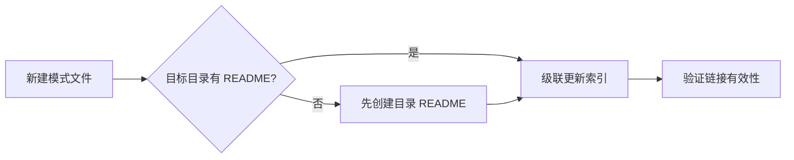

# 级联更新拓扑的前提检查（cascade-update-prerequisite-check）

## 模式类型
架构模式

## 成熟度
L1 实验性（本次任务发现摩擦点，待更多验证）

## 适用场景
新建模式文件入库至 pattern 体系前，检查目标目录是否具备级联更新的前提条件。

## 问题背景
本次任务在入库 3 个模式文件时，发现 code-patterns/ 和 architecture-patterns/ 目录无 README.md 索引文件，导致无法完成级联更新（索引同步）。这暴露了级联更新拓扑的前提条件缺失问题。

## 规则

**在执行级联更新拓扑前，先检查目标目录是否已有索引文件（README.md）。**

### 检查清单

| 目标目录 | 检查项 | 若缺失 | 处理方式 |
|---------|--------|--------|---------|
| methodology-patterns/ | README.md 是否存在？ | — | 直接级联更新 |
| code-patterns/ | README.md 是否存在？ | 需先创建索引文件 | 先创建 README.md，再级联更新 |
| architecture-patterns/ | README.md 是否存在？ | 需先创建索引文件 | 先创建 README.md，再级联更新 |

### 操作流程

## 关键要点

1. **前提检查先于级联更新**：避免因索引文件缺失导致级联更新阻断
2. **目录 README 是级联更新的锚点**：无锚点则无法完成索引同步
3. **补全历史遗漏优先**：发现缺失立即补全，而非绕过

## 成功案例

| 任务 | 发现缺失 | 处理方式 | 结果 |
|------|---------|---------|------|
| 改进建议执行 - 模式入库 | code-patterns/、architecture-patterns/ 无 README | 先创建两个 README.md，再入库模式 | 级联更新完成，索引同步 |

## 反例警示

| 错误操作 | 后果 |
|---------|------|
| 不检查前提直接入库模式 | 索引无法同步，模式可发现性受限 |
| 发现缺失后绕过不补全 | 历史遗漏持续存在，后续入库继续受阻 |

## 与 cascade-update-topology 的关系

本模式是 `cascade-update-topology` 的前置检查模式，两者配合使用：

1. **cascade-update-prerequisite-check**：检查前提条件（目录 README 存在性）
2. **cascade-update-topology**：执行级联更新（按拓扑顺序更新索引）

---

**使用顺序**：先执行前提检查，再执行级联更新拓扑。