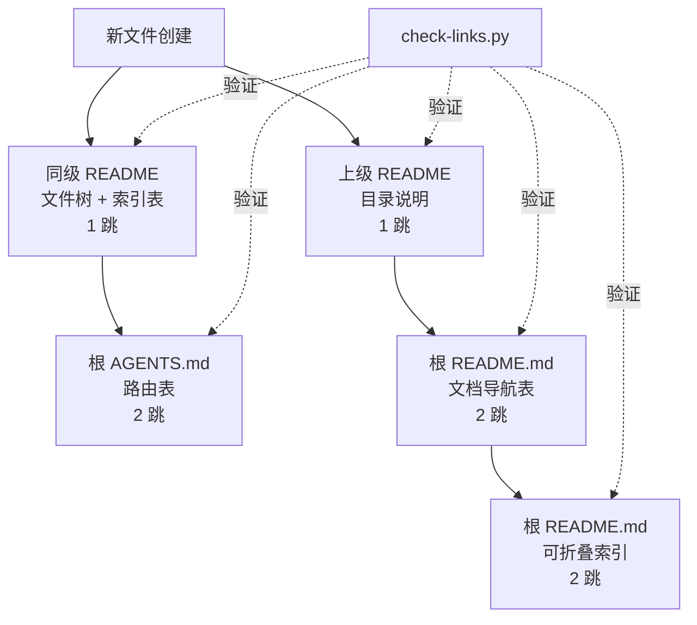

+++
id = "cascade-update-topology"
domain = "architecture"
layer = "architecture"
maturity = "L2"
validation_count = 2
reuse_count = 0
documentation_level = "standard"
source = "docs/retrospective/reports/retrospective-report-readme-collab-scenario-migration.md#六、可复用模式萃取"

[bindings]
rules = []
references = ["check-links.py"]
skills = []
+++

# 多对多文件级联更新的拓扑排序（cascade-update-topology）

## 模式类型
架构模式

## 成熟度
L2 已验证

## 适用场景
创建一个新的规范文件后，需要更新多个索引文件和路由文件以完成引用闭环。

## 问题背景
新建规范文件后，若索引更新不完整，会导致文件在不同使用场景（人类浏览、AI 路由、目录导航）下无法被发现。需要按拓扑顺序级联更新，确保引用闭环完备。

## 依赖拓扑图

## 拓扑层级

| 层级 | 文件 | 跳数 | 更新内容 |
|------|------|------|---------|
| L0 | 新建文件 | 0 | 创建内容 |
| L1 | 同级 README | 1 | 文件结构树 + 索引表 |
| L1 | 上级 README（容器说明） | 1 | 目录职责说明 |
| L2 | 根 AGENTS.md | 2 | 上下文路由表 |
| L2 | 根 README.md（导航表） | 2 | 文档导航表 |
| L2 | 根 README.md（可折叠索引） | 2 | 底部文档索引 |
| 全局 | check-links.py | — | 验证所有链接闭合 |

## 原则

1. **最小跳数优先**：先更新靠近新文件的索引（L1），再向外辐射至根部（L2）
2. **索引更新完成后运行全局验证**：所有索引更新完成后执行 check-links.py
3. **验证通过即引用闭环完备**：无死链 = 四层覆盖完整

## 引用闭环检查清单

新建规范文件后，依次检查：

- [ ] 同级目录 README：文件结构树是否包含新文件？索引表是否新增条目？
- [ ] 上级容器 README：目录职责说明是否更新？
- [ ] 根 AGENTS.md：上下文路由表是否新增条目？
- [ ] 根 README.md：文档导航表是否新增条目？
- [ ] 根 README.md：底部可折叠索引是否新增条目？
- [ ] check-links.py：所有链接是否有效？

## 成功案例

| 任务 | 新文件 | 级联更新文件数 | 验证结果 |
|------|--------|--------------|---------|
| README 角色协作场景迁移 | collaboration-scenarios.md | 5 个 | 2/2 通过 |

## 反例警示

| 错误操作 | 后果 |
|---------|------|
| 仅更新 AGENTS 路由表 | 人类读者从 README 浏览时无法发现新文件 |
| 仅更新同级 README | AI 智能体仅依赖 AGENTS 路由时忽略文件 |
| 紧邻新文件创建后立即验证 | 验证会报死链（索引尚未更新） |

## 推广方向

- 将检查清单模板化，纳入 `.agents/templates/` 目录
- 在 CI 流程中增加「新建文件后引用闭环检查」规则（待规划）