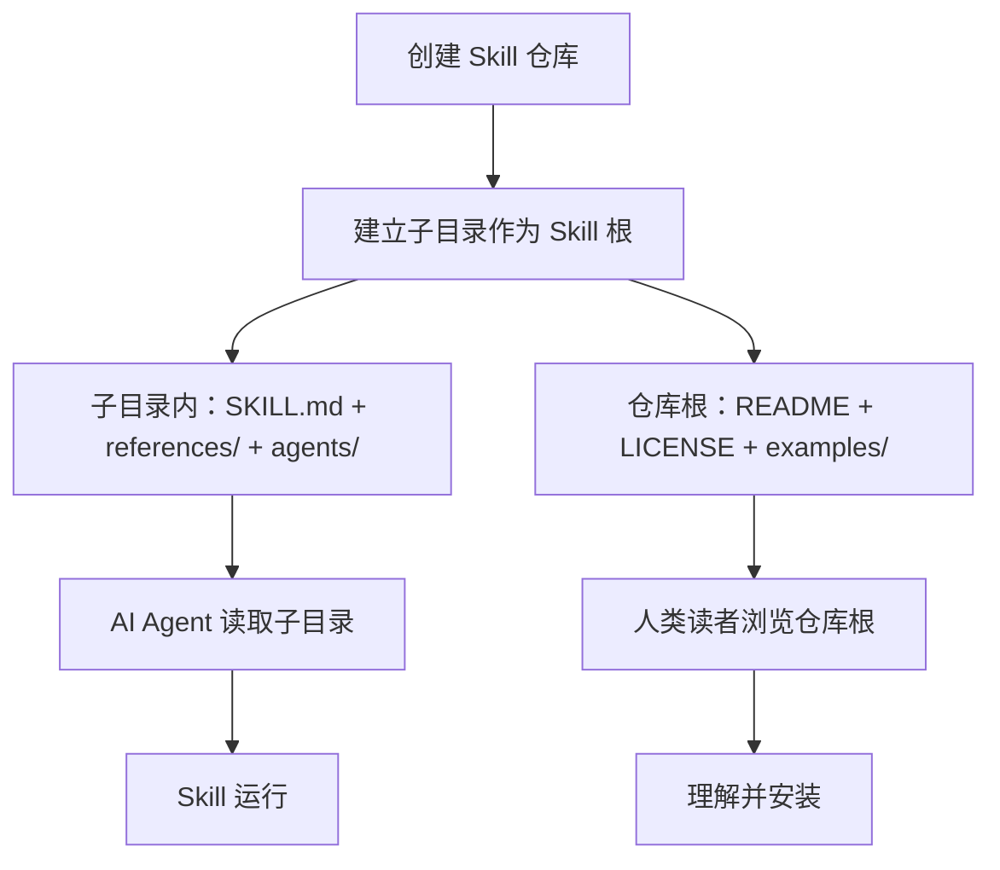

+++
id = "dual-interface-repository"
domain = "architecture"
layer = "architecture"
maturity = "L2"
validation_count = 1
reuse_count = 0
documentation_level = "standard"
source = "d:\\AI\\docs\\retrospective\\reports\\competitive-analysis\\retrospective-ian-xiaohei-source-analysis-20260625\\insight-extraction.md#洞察1"

[bindings]
rules = []
references = ["output-behavior-specification.md", "progressive-context-disclosure.md"]
skills = []
+++

> **已原子化自**：[insight-extraction.md 洞察 1](../../reports/competitive-analysis/retrospective-ian-xiaohei-source-analysis-20260625/insight-extraction.md) —— Ian Xiaohei Illustrations 仓库源码分析

# 双界面仓库架构（Dual-Interface Repository）

## 模式类型

架构模式

## 成熟度

L2 已验证（Ian Xiaohei Illustrations 完整实践验证，5300+ Star）

## 适用场景

开发面向 AI Agent 的 Skill、Plugin、Tool 或其他 AI 制品时，需要同时服务人类维护者和 AI 运行时的仓库结构设计。

## 问题背景

AI Skill 作为一种新型软件制品，其分发和维护方式与传统软件有本质区别：

- **传统软件**：人类读文档 → 人类写代码 → 机器执行代码
- **Skill 制品**：人类读 README → AI 读 SKILL.md → AI 执行推理

传统开源项目的「一个 README + 源代码」单层结构无法满足这一新范式——人类和 AI 需要的信息结构完全不同。将两者混在同一层级会导致：人类被技术指令淹没、AI Agent 被面向人类的介绍性文字污染上下文窗口。

## 核心规则

Skill 仓库应采用**根目录面向人类读者、子目录面向 AI Agent** 的双层物理结构。

### 规则 1：人类界面（仓库根目录）

根目录只包含面向人类的文件：

| 文件 | 用途 |
|------|------|
| README.md | 项目介绍、效果展示、安装步骤、使用场景、FAQ |
| LICENSE | 开源协议 |
| CHANGELOG.md | 版本变更历史 |
| examples/ | 示例截图（用于展示效果，非 AI 校准用） |

### 规则 2：AI 界面（Skill 子目录）

子目录只包含 AI 运行时需要的文件：

| 文件/目录 | 用途 |
|----------|------|
| SKILL.md | Skill 入口定义（角色、工作流、约束条件、输出口径） |
| references/ | 按需加载的参考文档索引 |
| agents/ | Agent 接口配置 |
| assets/ | 运行时所需的校准资源 |

### 规则 3：安装路径指向子目录

安装指令应明确只复制 AI 界面，不复制人类界面：

```bash
cp -R ./skill-name ~/.codex/skills/
```

### 规则 4：README 中说明双层结构

在 README 中明确说明仓库的双层结构设计，避免新用户对「为什么安装的和看到的不一样」产生困惑。

## 操作流程



## 实施检查清单

- [ ] 仓库根目录的 README 是否只面向人类读者（无 AI 指令）？
- [ ] Skill 子目录的 SKILL.md 是否只面向 AI Agent（无人类导向的营销文案）？
- [ ] 安装指令是否明确只复制子目录？
- [ ] README 中是否说明了双层结构？
- [ ] 人类界面和 AI 界面的文件是否有清晰的物理边界？

## 反例警示

| 错误做法 | 后果 |
|---------|------|
| 将 SKILL.md 放在仓库根目录 | AI 加载时会同时读取 README 等人类文档，浪费上下文窗口 |
| 在 SKILL.md 中写营销文案 | AI Agent 被无关信息干扰，影响执行质量 |
| README 和 SKILL.md 合二为一 | 人类看不懂技术约束，AI 被营销语言污染 |
| 安装指令复制整个仓库 | AI 上下文窗口被 LICENSE、README、示例截图等人类文档消耗 |

## 正例

Ian Xiaohei Illustrations 仓库（`ian-xiaohei-illustrations`）：

```text
skills/                             ← 仓库根（人类界面）
├── README.md                       ← 人类：项目介绍
├── LICENSE                          ← 人类：许可证
├── examples/images/                 ← 人类：效果展示（8 张）
└── ian-xiaohei-illustrations/      ← AI 界面（安装单元）
    ├── SKILL.md                     ← AI：Skill 定义
    ├── agents/openai.yaml           ← AI：接口配置
    ├── references/                  ← AI：5 个按需加载文档
    └── assets/examples/             ← AI：风格校准（14 张）
```

## 与现有模式的关系

- `output-behavior-specification.md`：本模式关注「文件放在哪」，该模式关注「Agent 说什么」。两者共同构成 AI Skill 工程的物理层 + 行为层设计。
- `progressive-context-disclosure.md`：本模式处理「人类文档和 AI 文档的物理隔离」，该模式处理「AI 文档内部的按需加载」，是两层递进的信息架构设计。

> **关联模块**：
> - `progressive-context-disclosure.md`
> - `output-behavior-specification.md`
