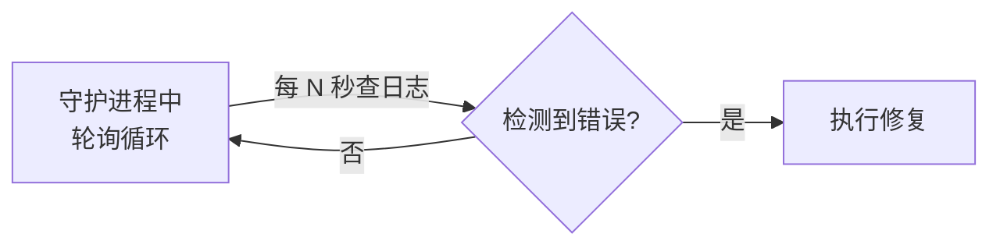
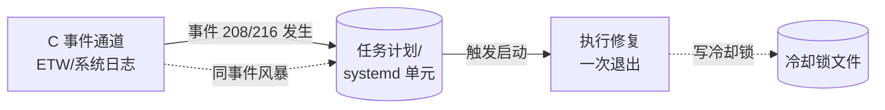

# 事件驱动守护模式（Event-Driven Guardian）

## 模式类型
架构模式

## 成熟度
L1 实验性（Windows 截图工具自愈单次验证）

## 适用场景
需要系统级"自动修复/自愈守护"的场景，尤其是守护动作本身依赖一个常驻进程去轮询日志/状态时——因为轮询守护进程本身就是单点故障（SPOF）。典型场景：

- 系统清理工具破坏 UWP/桌面应用运行时注册后，需要自动重新注册修复
- 服务崩溃后的自动重启替代方案
- 应用启动后环境变量/注册表/配置被篡改，需自动恢复
- 任何"当某类错误发生时应自动执行修复动作"的需求

## 问题背景

轮询/看门狗守护（polling watchdog）是常见的自愈方案，但它有致命缺陷：



- **单点故障（SPOF）**：守护进程必须持续存活。它一旦被终止（崩溃、手动 Ctrl+C、系统清理），ONLOGON/ONSTART 触发只会在下次登录/启动时生效，中间产生"零覆盖"空窗期。
- **守护的递归问题**："谁来看守看守人？"——守护进程本身需要被守护，形成无限递归。
- **轮询空转成本**：绝大多数时间无错误，轮询循环却在空耗资源。
- **延迟**：从错误发生到下一轮检测，平均滞后 N/2 秒。

> 本项目实证：Windows 截图工具（ScreenSketch）5 次复发 AppModel-Runtime 208/216 错误。旧方案 = ONLOGON 触发 + 轮询守护循环，其常驻进程被终止后 2 天零自愈覆盖，成为根治的关键教训。

## 核心规则

用操作系统原生的**事件订阅**替代常驻轮询：当目标错误事件发生时，系统直接启动一次修复动作，动作完成后进程即退出，无常驻进程存在。



### 规则 1：用原生事件触发，而非进程轮询

选择操作系统的事件触发机制，转移"守护"职责给 OS 内核而非一个你能杀死的用户进程：

| 平台 | 事件驱动机制 | 说明 |
|------|-------------|------|
| Windows | `schtasks /SC ONEVENT /EC <日志通道> /MO "<XPath>"` | 订阅 ETW/事件日志通道，条件触发生成任务进程 |
| Linux | `systemd path/timer units` + `inotify` / journald 匹配 | 文件变化或日志匹配触发生成服务 |
| macOS | `launchd` WatchPaths / StartOnMount / StartInterval | 路径变化或事件触发生成任务 |

关键点：触发任务运行完毕后进程退出，**不留任何常驻进程**，SPOF 随之消失。

> 工程经验：Windows 上注册系统级任务时，`schtasks.exe` CLI（`/SC ONEVENT`）比 PowerShell ScheduledTask CIM cmdlet（`New-ScheduledTaskPrincipal` 等）更稳妥——CIM cmdlet 在 PS5.1/不同 Windows 版本间有解析与行为差异，且易与 PS 自动变量冲突；`schtasks` 是系统原生 CLI，跨版本最稳。

### 规则 2：冷却锁（Cooldown Lock）防事件风暴

同一错误常在短时间内连续触发大量同源事件（事件风暴）。若无防护，会并发启动多个修复动作互相踩踏。用一个带时间戳的临界锁文件实现幂等：

```powershell
function Test-CoolDown {
    $LockFile = Join-Path $env:TEMP 'screenshot-fix.lock'
    if (Test-Path $LockFile) {
        $age = (Get-Date) - (Get-Item $LockFile).LastWriteTime
        if ($age.TotalSeconds -lt 300) { return $false }  # 5 分钟内跳过
    }
    return $true
}
function Acquire-CoolDown {
    Set-Content -Path $LockFile -Value ((Get-Date).ToString('s')) -Encoding ASCII -Force
}
```

工作中：修复动作入口先 `Test-CoolDown` 再 `Acquire-CoolDown`，保证同一时刻只有一次有效修复。

### 规则 3：幂等的修复动作

被触发执行的修复函数必须**可重复执行且无害**（幂等）。否则事件多次触发会造成状态错乱。本例的 UWP 重新注册即天然幂等。需配合：

- **最高权限运行**（Windows: `/RU SYSTEM /RL HIGHEST`；Linux: root + unit），否则无法修复系统级注册。

### 规则 4：保留单次修复入口，便于人工手动触发

事件触发复用的就是单次修复函数。保留命令行入口（无参默认单次修复），既被任务调度器调用，也可人工运行验证。这样"调试单次修复"与"注册守护"是同一代码路径，减少维护两套逻辑。

## 正反例

### 反例：轮询看门狗（Polling Watchdog）
```powershell
# ❌ 存在单点故障：watch 进程死亡后失去全部保护
schtasks /Create /SC ONLOGON /TN "Protector" /TR "powershell -File protect.ps1 -Watch"
# protect.ps1:
while ($true) {
    if (Test-Problem) { Fix-Problem }
    Start-Sleep -Seconds 60
}
```

### 正例：事件驱动守护（Event-Driven Guardian）
```powershell
# ✅ 无常驻进程：事件发生 → 任务启动 → 修复→退出
schtasks /Create /SC ONEVENT /TN "Guardian" `
    /TR 'powershell -File repair.ps1' `
    /EC 'Microsoft-Windows-AppModel-Runtime/Admin' `
    /MO '*[System[(EventID=208 or EventID=216)]]' `
    /RL HIGHEST /RU SYSTEM /F
```

## 检查清单

- [ ] 是否用 OS 原生事件触发（ONEVENT/systemd path）替代了常驻轮询进程？
- [ ] 触发动作运行后进程是否立即退出、无常驻组件？
- [ ] 是否具备冷却锁防事件风暴？（5 分钟级）
- [ ] 修复动作是否幂等、可重复执行无害？
- [ ] 是否以最高权限（SYSTEM/root）+ 适当范围运行？
- [ ] 是否保留了独立单次修复入口以便人工验证？
- [ ] 认领时是否同时删除了旧的轮询守护任务，避免两套机制并存冲突？

## 已知边界

- **事件未产生**：若目标错误根本不写系统日志/ETW，则事件触发永远不激活——需先确认错误源有对应事件订阅通道。
- **冷却锁膨胀**：高频错误下冷却锁反复刷新，会掩盖真实频率——建议冷却锁旁另配错误计数日志用于诊断。
- **注册权限**：ON BATT 等电源条件、任务计划程序默认设置会影响触发时机，需按目标场景显式配置。
- 成熟度 L1（仅本次截图工具单点验证），需更多跨场景验证方能升级 L2。

## 实践注记
本次实现（`fix-screenshot-tool.ps1` + `FixScreenshotToolEventWatcher` 任务）同时包含三处工程细节，可作为模板复用：冷却锁、schtasks CLI 选型、保留单次修复入口。