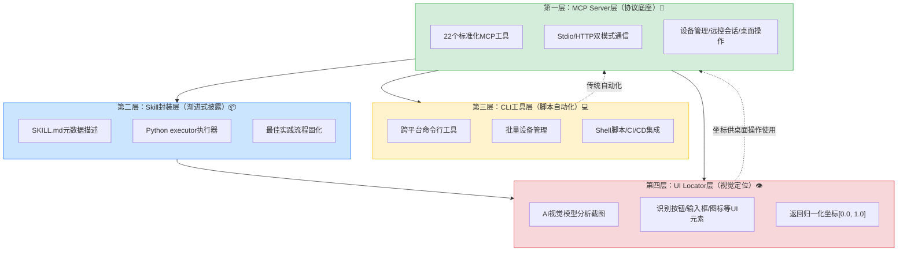

> **提炼自**：向日葵AI开发者生态（MCP+Skill+CLI+UI Locator）系统学习萃取 —— AI开发者生态四层架构设计

# AI开发者生态四层能力分层架构（Protocol-Skill-CLI-Visual Layered Architecture）

## 模式类型

架构模式（AI能力开放平台/AI开发者生态）

## 成熟度

L1 实验性（向日葵AI开发者生态官方实现验证）

## 适用场景

SaaS/软件/硬件厂商需要向AI生态开放自身能力时，设计面向不同开发者群体的多层能力开放体系。

典型场景：
- 远程控制/远程运维类产品向AI开放能力
- SaaS平台构建MCP/AI Agent生态
- 企业内部系统面向AI助手开放操作接口
- IoT平台需要同时支持API集成、脚本自动化、AI Agent操作
- 任何需要同时服务"原生AI客户端"和"传统脚本/CLI用户"的产品

## 问题背景

厂商在向AI开放能力时，常面临以下架构问题：

1. **只提供MCP协议层**：只有底层协议能力，没有封装，AI面对20+工具不知道怎么组合使用，成功率低
2. **只有CLI没有AI原生接口**：传统命令行工具无法被AI高效调用（输出不结构化、错误处理差）
3. **缺少视觉定位能力**：GUI操作只能依赖固定坐标，通用性差
4. **一刀切设计**：只面向一类用户（如只支持Claude Desktop用户），忽略了脚本开发者、运维人员、业务用户
5. **能力冗余**：不同层之间重复实现相同功能，维护成本高

向日葵的解决方案：四层递进架构，每一层服务不同场景和用户群体，下层为上层提供基础，上层为下层增强能力。

## 四层架构模型



## 各层详细设计

### 第一层：MCP Server层（协议能力底座）

**定位**：标准化协议层，将产品能力封装为AI可直接调用的工具接口。

**服务对象**：MCP协议原生支持的AI客户端（Claude Desktop、OpenCode、OpenClaw、Cherry Studio等）。

**核心能力**：
- 标准化工具定义（遵循MCP协议规范）
- 双模式通信（Stdio本地进程通信 + Streamable HTTP远程通信）
- 完整能力覆盖（设备管理7个 + 远控会话6个 + 桌面操作9个 = 22个工具）

**设计要点**：
1. **内置于客户端**：MCP Server内置于向日葵客户端V16.2.3+，无需额外安装服务端
2. **一键启用**：客户端内开关一键开启，自动生成配置
3. **工具原子化**：每个工具只做一件事（如"鼠标点击"、"键盘输入"），便于组合
4. **参数最小化**：每个工具的参数尽量精简，降低AI决策负担

**关键技术决策**：
- Stdio模式为默认推荐（本地通信低延迟、无需网络配置）
- HTTP模式支持跨网络调用（远程AI服务调用本地设备）
- 工具粒度控制在"单次原子操作"级别，不做组合操作

### 第二层：Skill封装层（渐进式能力封装）

**定位**：在MCP协议层之上，为支持Skills的AI客户端提供渐进式披露封装，将"可用能力"转化为"好用能力"。

**服务对象**：支持Skills机制的AI客户端（Claude Code、OpenCode、OpenClaw、Trae等）。

**核心组件**：
- `SKILL.md`：能力说明书（触发条件+操作流程+最佳实践+节制原则）
- `executor.py`：Python执行器（连接管理+参数验证+错误处理+重试机制）
- `mcp-config.json`：MCP连接配置

**解决的问题**：
- MCP层22个工具直接暴露 → AI决策混乱
- 没有操作流程指导 → AI跳过验证步骤，错误率高
- 没有错误处理 → 网络波动导致任务失败
- Token消耗过高 → 一次性加载全部工具文档占用上下文

**设计原则**：参见[skill-progressive-disclosure-encapsulation.md](../methodology-patterns/ai-collaboration/skill-progressive-disclosure-encapsulation.md)

### 第三层：CLI工具层（脚本自动化集成）

**定位**：面向传统开发者和运维人员的命令行接口，是连接"AI原生"与"传统自动化"的桥梁。

**服务对象**：运维人员、脚本开发者、需要CI/CD集成的团队。

**五大核心特点**：
1. **全平台支持**：Windows、macOS、Linux、信创OS全覆盖
2. **批量管理**：一行指令操作千台设备
3. **被控端零更新**：被控终端无需升级即可接入
4. **安全可审计**：操作日志完整记录，可追溯
5. **轻量部署**：单文件约20MB，无需安装

**四大命令类别**：
- 设备管理：列表/搜索/添加/删除/分组
- 远控操作：连接/断开/命令执行/文件传输
- 批量任务：批量执行命令/批量文件分发
- 系统配置：登录/配置/权限管理

**与MCP层的关系**：
- CLI底层复用MCP协议能力（不重复实现）
- CLI输出适合人类阅读和脚本解析（结构化JSON输出可选）
- CLI支持批量操作（MCP层侧重单设备实时操作）

### 第四层：UI Locator层（视觉智能定位）

**定位**：基于AI视觉模型的UI元素定位层，解决"AI如何知道按钮在哪里"的问题。

**服务对象**：所有需要进行GUI视觉操作的上层（Skill层、CLI层未来扩展、直接MCP调用）。

**核心能力**：
- 截图分析：接收桌面截图，识别UI元素
- 元素分类：按钮/输入框/图标/菜单/文本/复选框等
- 坐标返回：返回每个元素的归一化坐标[x, y]（0.0-1.0）
- 文本识别：OCR读取界面文字内容
- 置信度评分：每个识别结果附带置信度，低置信度时建议人工确认

**工作流程**：
1. MCP截屏获取桌面画面
2. 将截图发送给UI Locator视觉模型
3. 模型返回识别到的UI元素列表（含坐标、类型、文字、置信度）
4. Skill/Agent根据目标选择元素，获取坐标
5. 将坐标传给MCP桌面操作工具（click/type等）

**与下层关系**：UI Locator本身不执行操作，只提供定位能力；坐标返回给MCP层的desktop_*工具执行实际操作。

## 四层协同：视觉操作闭环

四层不是孤立的，而是协同形成完整的操作闭环：

```
完整操作闭环：
1. MCP层 → control_screenshot 截屏
2. UI Locator层 → 分析截图，返回目标坐标
3. Skill层 → 按预定义流程组织调用顺序，处理错误和重试
4. MCP层 → desktop_click_mouse 执行点击（使用Locator返回的坐标）
5. MCP层 → control_screenshot 再次截屏验证
6. Skill层 → 判断结果，决定继续/重试/中止
```

CLI层则为不经过AI的传统自动化场景提供另一条路径，底层同样复用MCP能力。

## 用户群体覆盖矩阵

| 用户群体 | 主要使用层 | 典型场景 |
|---------|----------|---------|
| AI Agent（Claude/Trae等） | L2 Skill层（L1+L4协同） | 自然语言远程操作、智能运维 |
| MCP原生用户（Claude Desktop） | L1 MCP层 + L4 UI Locator | 直接配置MCP使用 |
| 运维/脚本开发者 | L3 CLI层 | 批量运维、CI/CD集成、自动化脚本 |
| 业务场景开发者 | L2 自定义Skill | 基于官方Skill封装业务流程 |
| 企业级用户 | L1+L2+L3组合 | AI+脚本+人工协同 |

## 各层间依赖规则

1. **上层依赖下层，不反向依赖**：Skill层调用MCP，MCP不依赖Skill
2. **能力复用，不重复实现**：CLI底层复用MCP能力，不重新实现远控协议
3. **跨层组合增强**：Skill+UI Locator组合形成视觉闭环，单独使用任一层效果都打折
4. **独立可用性**：每层可以独立使用——纯MCP用户不用Skill也能工作，纯CLI用户不用AI也能工作

## 实施检查清单

设计AI能力开放平台时对照检查：

### MCP层
- [ ] 是否遵循MCP标准协议（而非自定义协议）？
- [ ] 工具是否原子化（一个工具一件事）？
- [ ] 是否支持Stdio和HTTP双模式？
- [ ] 是否内置于产品中、一键启用？
- [ ] 参数是否精简到最少？

### Skill层
- [ ] 是否有SKILL.md描述操作流程和最佳实践？
- [ ] 是否有executor处理连接/验证/错误/重试？
- [ ] 是否遵循渐进式披露（不一次性暴露全部工具细节）？
- [ ] 是否有节制原则（重试上限、截屏限制、失败中止）？

### CLI层
- [ ] 是否跨平台支持（Windows/macOS/Linux）？
- [ ] 是否支持批量操作？
- [ ] 输出是否既适合人类阅读也适合脚本解析？
- [ ] 底层是否复用MCP能力而非重复实现？
- [ ] 是否轻量（单文件，无需复杂安装）？

### UI Locator层
- [ ] 是否基于AI视觉模型识别UI元素？
- [ ] 是否返回归一化坐标（而非像素坐标）？
- [ ] 是否包含置信度评分？
- [ ] 是否支持多种UI元素类型（按钮/输入框/文本等）？
- [ ] 是否与MCP桌面操作工具无缝配合？

### 整体架构
- [ ] 四层是否职责清晰、边界明确？
- [ ] 每层是否可以独立使用？
- [ ] 上层是否复用下层能力而非重复实现？
- [ ] 是否覆盖了AI用户和传统脚本用户？
- [ ] 四层协同是否能形成完整的"感知-决策-执行-验证"闭环？

## 反例警示

| 错误做法 | 后果 |
|---------|------|
| 只做MCP层，不做Skill封装 | AI直接面对22个工具，决策混乱，成功率60-70% |
| 只做CLI，不提供MCP接口 | 无法接入AI Agent生态，错过AI原生用户 |
| MCP工具粒度过粗（一个工具做完整安装流程） | 无法灵活组合，难以适应不同场景 |
| Skill层重复实现MCP功能 | 维护成本高，两层行为不一致 |
| 没有UI Locator，只能固定坐标点击 | 通用性差，分辨率/窗口/版本变化即失效 |
| 四层耦合在一起，无法独立使用 | 强制用户安装全套，门槛高，灵活性差 |
| CLI不支持批量操作 | 运维场景不可用，只能做单设备演示 |

## 正例：向日葵AI开发者生态

| 层级 | 向日葵实现 | 验证效果 |
|-----|----------|---------|
| MCP层 | 22工具，内置于客户端V16.2.3+，Stdio/HTTP双模式 | 三大AI客户端（OpenCode/Claude Code/Cherry Studio）一键配置 |
| Skill层 | SKILL.md+executor.py+mcp-config.json，awesun-skill开源 | 飞书安装Skill验证：13步流程成功率95%+ |
| CLI层 | 跨平台单文件20MB，五大特点四大命令类别 | 支持批量千台设备运维 |
| UI Locator层 | AI视觉模型，归一化坐标，五类元素识别 | 语义定位"保存按钮"直接返回坐标，不依赖固定位置 |

## 与现有模式的关系

| 相关模式 | 关系 | 说明 |
|---------|------|------|
| [skill-progressive-disclosure-encapsulation.md](../methodology-patterns/ai-collaboration/skill-progressive-disclosure-encapsulation.md) | 本架构包含 | Skill渐进式披露封装是本架构第二层的核心模式 |
| [visual-operation-closed-loop.md](../methodology-patterns/ai-collaboration/visual-operation-closed-loop.md) | 协同模式 | 视觉操作闭环是本架构四层协同的操作范式 |
| [visual-universal-operation.md](../methodology-patterns/ai-collaboration/visual-universal-operation.md) | 思想基础 | 视觉通用操作定义AI操作异构系统的技术路线，本架构是该路线的工程实现 |
| [vertical-saas-mcp-capability-exposure.md](../methodology-patterns/product-growth/vertical-saas-mcp-capability-exposure.md) | 产品策略 | 垂直SaaS MCP能力开放定义产品战略层面的MCP开放策略，本架构是技术实现层面 |
| [three-tier-iot-architecture.md](../methodology-patterns/product-growth/three-tier-iot-architecture.md) | 架构类比 | IoT三层架构（设备/网关/云）是硬件架构分层，本模式是AI能力开放的软件架构分层，分层思想相通 |
| [five-layer-document-architecture.md](five-layer-document-architecture.md) | 分层思想 | 文档五层架构（规格→决策→质量→交付→萃取）同样体现分层解耦思想 |
