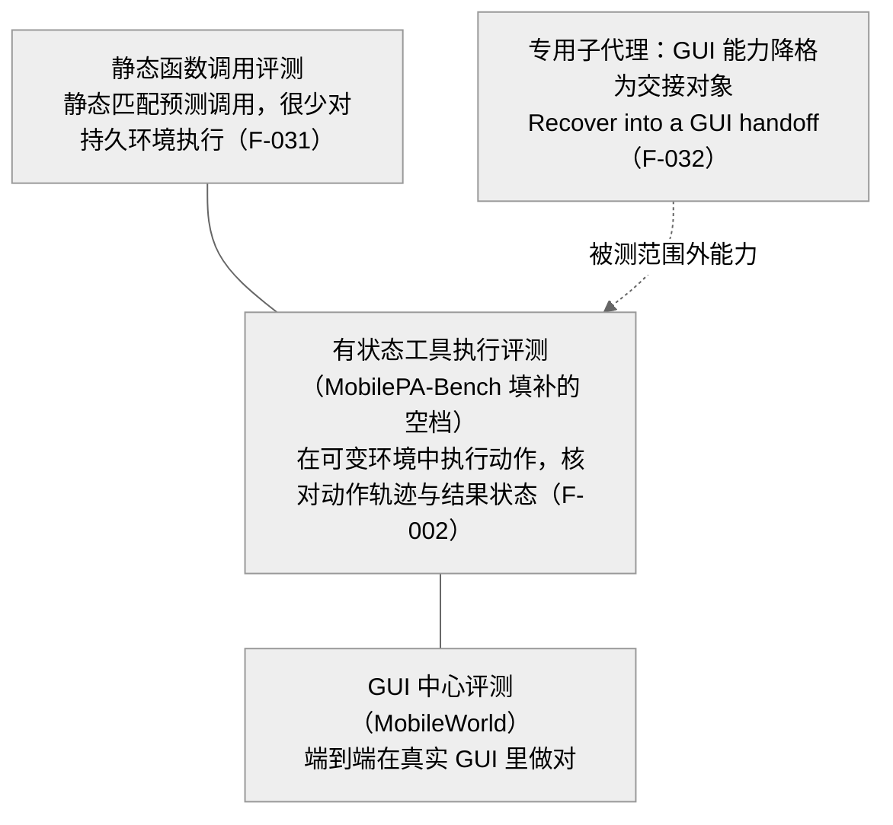

> **提炼自**：Tongyi-MAI mobilepa-bench 基准定位复盘 —— 评测体系的定位是填补两层之间的空档，而非替代任何一方

# 补空档式互补定位（Gap-Filling Complementary Positioning）

## 模式类型

架构模式（评测体系定位 / 生态坐标系声明 / 能力层划分）

## 成熟度

L1 已验证（1 次验证：2026-08-29 Tongyi-MAI mobilepa-bench 源码学习）

## 适用场景

在已有多个相邻体系（上游基准/竞品/下游平台）的生态中，为新技术、新基准或新产品做定位：

- 评测设计：静态函数调用基准与 GUI 中心基准已经成熟，新基准测的是"两者都不测的中间层"
- 产品/框架定位：新组件夹在两类既有方案之间（轻量库与重型平台之间的状态型中间层）
- 概念文档写作：需要向读者声明"本体系与谁相邻、边界在哪、两套分数是否可互换"

## 问题背景

新体系定位最常见的两种失败：

1. **替代式定位**：把新体系宣传为既有体系的"升级版/更好替代"，拿对方的成绩单直接对比自己的分数——但两者被测能力层不同，分数不可比，最终既误导读者也误导自己。
2. **模糊定位**：只罗列自己的维度与成绩，从不声明与相邻体系的关系——读者只能按"谁分数高"选基准，坐标系缺失，互补关系被误读为竞争关系。

根本矛盾：**生态位声明需要显式的对照系，而自我介绍的天性是只讲自己**——不讲对照系，"互补"在读者眼里就退化成"又一个竞品"。

## 核心设计

三原则：

1. **用三层对照表声明坐标系**：把"静态函数调用 vs 有状态工具执行 vs GUI 中心"写成一张显式对照表（各自执行什么、核对什么），自身明确落在中间层——补的是静态匹配与 GUI 端到端之间的空档，不向上也不向下越位。
2. **相邻体系显式写为互补层级而非竞品**：MobileWorld 考"端到端在真实 GUI 里做对"，MobilePA-Bench 考"规划器对 212 个结构化工具的调度与状态推理"——一个模型完全可能在 GUI 基准强而在工具规划基准弱（或反之），两套分数不可互相替代，文档必须把这句话写透。
3. **被测范围外的能力降格为交接对象**：GUI 能力不是被测主体，而是 Sub-agent 维度中的交接对象——"委托专用 Agent、从工具边界恢复、透明回退"（F-032），能力边界以交接方式表达，不以分数表达。

## 实施要点

| 维度 | 做法 | mobilepa-bench 实例 |
|---|---|---|
| 空档识别 | 引用两类既有基准各自的盲区作为动机 | 静态函数调用基准很少对持久环境执行预测调用；GUI 中心基准低估高效结构化 API、个性化上下文、可复用流程与专用 Agent 协同（F-031） |
| 能力声明 | 用"执行什么 + 核对什么"一句话讲清自己测哪层 | 在可变移动环境中执行 Agent 动作，同时核对动作轨迹与结果状态，超越静态函数匹配（F-002） |
| 对照表达 | 概念文档放置三层对照表，读者按被测能力层选基准 | "静态函数调用 vs GUI 中心 vs 有状态工具执行"三层对照（洞察4 行动项） |
| 边界降格 | 被测范围外的能力以子代理交接出现 | Sub-agent 维度聚焦委托专用 Agent、工具边界恢复、透明回退，案例含"Recover into a GUI handoff"（F-032） |
| 覆盖面量化 | 用工具域规模声明被测空间 | 13 个工具域，工具数从 Audio & Entertainment 25 到 Security & Privacy 10（F-019） |
| 失败模式对齐 | 声明的空档要有真实失败模式支撑 | 工具依赖、权限边界、冲突请求、运行时错误、不完整用户上下文（F-003） |

## 不适用场景与反目标用户

### 不适用场景

- ❌ **被测能力与既有基准真实同层**：若新基准确实与对方测同一能力层，那就是竞品，硬写"互补"是虚假定位，读者迟早用数据戳穿。
- ❌ **生态中没有可命名的相邻体系**：三层对照表需要两个以上可准确概括的对照系；没有对照系时先补生态调研，再谈定位。
- ❌ **说不出"自己测哪一层"**：若自身能力声明模糊到无法与相邻体系划界，说明定位本身未想清楚，先做能力定义再做定位声明。

### 反目标用户

- 追求"唯一权威基准"话语权的团队：本模式承认分数不可互相替代，拒绝"谁分高谁赢"的叙事。
- 习惯拿竞品分数做直接对比营销的产品方：跨层分数对比会同时伤害自己的可信度与读者的判断。

### 适用边界与前提条件

- 前提一：存在两个（或以上）可明确命名的相邻体系，且其被测能力能被一句话准确概括。
- 前提二：自身被测能力与两者都不同层——上不替代 GUI 端到端正确性，下不替代静态函数匹配。
- 前提三：文档有位置承载三层对照表（概念文档/README 显眼处），并愿意在后续宣传中持续维护同一表述。

## 反模式

### 反模式1："拿相邻体系的分数当自己的成绩单"

在对比表里把跨能力层的基准分数排在一起。后果：读者按"谁分高"选错基准，被测能力层信息丢失。**正确做法**：撤下跨层排名，改放三层对照表，声明两套分数不可互替。

### 反模式2："把互补写成竞品"

宣传文案用"取代 X""更好的 Y"句式。后果：激化对立、抬高读者预期，而实际能力层根本不同。**正确做法**：显式写出互补层级——各自考什么、边界在哪、为何不可互替。

### 反模式3："为显得全面把越界能力硬塞进被测维度"

把 GUI 操作能力也设为被测主体。后果：维度失焦、评分不可靠，且与相邻体系正面冲突。**正确做法**：降格为交接对象/回退路径（F-032 的 handoff 处理）。

### 反模式4："坐标系只存在于论文，不存在于文档"

论文里讲清了定位，README 与概念文档却只讲自己。后果：读者高频追问"这和 X 有什么区别"。**正确做法**：三层对照表放进概念文档显眼处，与论文表述一致。

### 反模式5："空档描述停在动机段，不落到能力声明"

花大量篇幅说"别人不测什么"，自己的能力声明只有一句模糊口号。后果：空档叙事与实际被测内容脱节。**正确做法**：用"执行什么 + 核对什么"重写能力声明（F-002 式一句话），空档与声明一一对应。

## 失败案例

### 案例："竞品先验"与"分数可互替"预期被源码证据推翻（mobilepa-bench 源码学习，2026-08-29）

**背景**：学习初期按"新基准 = 与 GUI 中心基准竞争"的直觉预期阅读项目，倾向把 MobilePA-Bench 与 MobileWorld 放进同一张对比表排位，默认两套分数可以互相参照。

**发现过程**：F-031 明确陈述两类既有基准各自低估了什么（静态函数调用不对持久环境执行；GUI 中心低估结构化 API、个性化上下文、可复用流程、专用 Agent 协同），F-002 给出的是与两者都不同的能力声明（可变环境执行 + 动作轨迹与结果状态双重核对）；Sub-agent 维度（F-032）进一步把 GUI 能力处理为"Recover into a GUI handoff"的交接对象而非被测主体。回读后确认：MobileWorld 考端到端 GUI 正确性，MobilePA-Bench 考规划器对 212 个结构化工具的调度与状态推理——同一模型完全可能一强一弱，"竞品 + 分数互替"预期被推翻。

**教训**：评测体系（以及任何生态位）的阅读与设计顺序应是先问"被测能力层是什么"，再谈分数高低；相邻体系是互补层级还是竞品，必须由能力层对照判定，而非由第一印象或宣传叙事判定。

## 早期预警信号

| 预警信号 | 可能问题 | 建议行动 |
|---|---|---|
| 文档用相邻体系的分数直接做排名对比 | 跨层分数互替（反模式1） | 撤下对比表，改放三层对照表 |
| README 只讲自己的维度，不提任何相邻体系 | 坐标系缺失（反模式4 前兆） | 补写互补层级声明与对照表 |
| 某维度同时要测自身能力与相邻体系的能力 | 能力层越界（反模式3） | 将越界能力降格为交接对象 |
| "这和 X 基准有什么区别"的提问高频出现 | 对照表缺位 | 在概念文档显眼处放置三层对照表 |
| 动机段长篇大论"别人不测什么"，能力声明一句话且模糊 | 空档叙事未落到能力定义（反模式5） | 用"执行什么+核对什么"重写能力声明 |
| 宣传材料与概念文档的定位表述不一致 | 定位漂移 | 以三层对照表为唯一定位表述源 |

## 实际案例

mobilepa-bench 基准定位（2026-08-29 源码学习）：

| 维度 | 实例 |
|---|---|
| 空档动机 | 静态函数调用基准很少对持久环境执行预测调用；GUI 中心基准低估结构化 API、个性化上下文、可复用流程、专用 Agent 协同（F-031） |
| 能力声明 | 在可变移动环境中执行 Agent 动作，同时核对动作轨迹与结果状态（F-002） |
| 失败模式支撑 | 工具依赖、权限边界、冲突请求、运行时错误、不完整用户上下文（F-003） |
| GUI 能力降格 | Sub-agent 维度：委托专用 Agent、工具边界恢复、透明回退，案例"Recover into a GUI handoff"（F-032） |
| 被测空间规模 | 13 个工具域，工具数从 Audio & Entertainment 25 到 Security & Privacy 10（F-019） |

## 迁移验证

- **可迁移场景**：产品定位（新工具夹在"轻量库"与"重型平台"之间的补空档叙事）；测试策略（在单测与 E2E 之间补"集成 + 状态核对"层并声明三层关系）；文档写作（教程开头放"本教程 vs 官方文档 vs 参考手册"三层对照，读者按需求层选择入口）。
- **先例关联**：与 [ecosystem-barrier-evaluation.md](../methodology-patterns/ai-collaboration/ecosystem-barrier-evaluation.md) 构成前后决策链——该模式评估"要不要进入这个生态"，本模式解决"进入后站哪一层、如何声明互补"；三层层级声明也与 legacy-integration-dual-track 的新旧轨道并置同构。

## 与其他模式的关系

| 关系模式 | 关系类型 | 说明 |
|---|---|---|
| [ecosystem-barrier-evaluation.md](../methodology-patterns/ai-collaboration/ecosystem-barrier-evaluation.md) | 前置决策 | 该模式评估进入生态的门槛与收益；本模式在决定进入后给出"填补空档"的定位与坐标系声明策略 |
| [dual-track-sdk-strategy-framework.md](../analysis-cards/dual-track-sdk-strategy-framework.md) | 分析框架 | 双轨 SDK 策略同样依赖"坐标系先行"：先声明与既有轨道的关系，再谈自身优势，两套指标不互替 |
| [legacy-integration-dual-track.md](./legacy-integration-dual-track.md) | 同构思想 | 双轨集成把"新旧体系"显式并置为互补轨道；本模式把"相邻基准"显式并置为互补层级 |
| [three-layer-capability-openness.md](./three-layer-capability-openness.md) | 分层思想 | 三层能力开放以层级声明能力边界；本模式以层级声明评测边界——都拒绝"一层打天下" |

<!-- changelog -->
- 2026-08-29 | pattern | 初始创建：从 Tongyi-MAI mobilepa-bench 源码学习（洞察4）萃取；证据链 F-002/F-003/F-019/F-031/F-032
