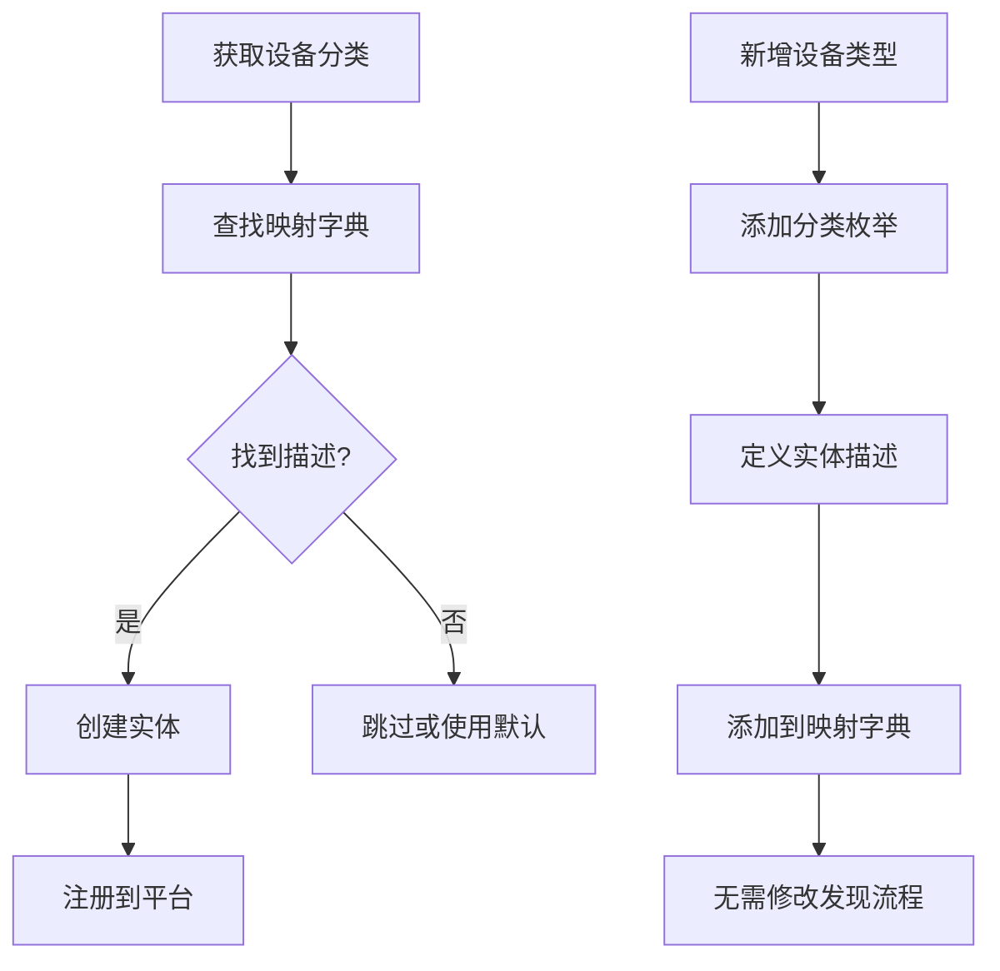

+++
id = "iot-device-category-mapping"
domain = "architecture"
layer = "architecture"
maturity = "L1"
validation_count = 1
reuse_count = 0
documentation_level = "standard"
source = "docs/retrospective/reports/insight-extraction/retrospective-home-assistant-tuya-official-20260630/insight-extraction.md#知识点-7"

[bindings]
rules = []
references = ["iot-event-driven-state-update.md"]
skills = []
+++

> **已原子化自**：[Home Assistant 官方 Tuya 集成洞察萃取](../../reports/insight-extraction/retrospective-home-assistant-tuya-official-20260630/insight-extraction.md)

# IoT 设备分类到平台映射模式（Device Category Mapping）

## 模式类型

架构模式

## 成熟度

L1 实验性（Home Assistant Tuya 集成单次验证）

## 适用场景

需要支持大量设备类型的 IoT 平台集成，实现设备的自动发现和实体创建，支持灵活的平台扩展。

## 问题背景

IoT 平台通常有大量设备分类（如 Tuya 有 100+ 分类），直接为每个分类编写实体创建代码存在以下问题：

- **代码冗余**：每个分类需要重复编写发现逻辑
- **维护困难**：新增设备类型需修改多处代码
- **扩展受限**：平台间设备分类可能重叠或不明确
- **自动化缺失**：无法自动匹配设备分类到实体类型

## 核心规则

通过设备分类（DeviceCategory）映射字典，实现设备到平台的自动发现和实体创建。

### 规则 1：定义设备分类枚举

使用枚举定义所有设备分类，每个分类对应一类设备：

```python
class DeviceCategory(Enum):
    DJ = "dj"      # 灯光
    CZ = "cz"      # 插座
    FS = "fs"      # 风扇
    KT = "kt"      # 空调
    # ... 100+ 分类
```

### 规则 2：定义实体描述

每个平台定义实体描述，包含 key、name、icon、device_class 等属性：

```python
class TuyaLightEntityDescription(EntityDescription):
    key: DPCode
    color_mode: DPCode | None
    brightness: DPCode | None
    # ...
```

### 规则 3：建立分类到平台的映射字典

使用字典映射 DeviceCategory 到 EntityDescription 元组：

```python
LIGHTS: dict[DeviceCategory, tuple[TuyaLightEntityDescription, ...]] = {
    DeviceCategory.DJ: (
        TuyaLightEntityDescription(key=DPCode.SWITCH_LED, ...),
    ),
}
```

### 规则 4：发现流程使用映射

发现流程通过映射字典查找实体描述并创建实体：

```python
if descriptions := LIGHTS.get(device.category):
    entities.extend(
        TuyaLightEntity(device, manager, description)
        for description in descriptions
    )
```

## 操作流程



## 实施检查清单

- [ ] 是否使用枚举定义了所有设备分类？
- [ ] 是否定义了平台对应的实体描述类？
- [ ] 映射字典是否覆盖了所有支持的分类？
- [ ] 发现流程是否通过映射字典查找而非硬编码？
- [ ] 是否处理了未知设备分类？

## 反例警示

| 错误做法 | 后果 |
|---------|------|
| 硬编码分类判断 | 新增设备类型需修改发现代码 |
| 映射字典与分类枚举不一致 | 设备无法正确匹配 |
| 一个分类对应多个平台时冲突 | 实体重复创建或遗漏 |
| 忽略未知分类处理 | 新设备类型无法被发现 |

## 正例

Home Assistant Tuya 集成的实现：

```python
# light.py - 定义映射
LIGHTS: dict[DeviceCategory, tuple[TuyaLightEntityDescription, ...]] = {
    DeviceCategory.DJ: (
        TuyaLightEntityDescription(
            key=DPCode.SWITCH_LED,
            color_mode=DPCode.WORK_MODE,
            brightness=DPCode.BRIGHT_VALUE,
        ),
    ),
}

# 发现流程
if descriptions := LIGHTS.get(device.category):
    entities.extend(
        TuyaLightEntity(device, manager, description)
        for description in descriptions
    )
```

## 设备分类映射表

| 设备分类 | Home Assistant 平台 | 说明 |
|---------|---------------------|------|
| `dj` | `light` | 灯光 |
| `cz/pc/kg` | `switch` | 开关/插座 |
| `sp` | `camera` | 摄像头 |
| `fs/fsd` | `fan` | 风扇 |
| `kt/ktkzq` | `climate` | 空调 |
| `sd` | `vacuum` | 扫地机器人 |
| `wsdcg` | `sensor` | 温湿度传感器 |

## 与现有模式的关系

- `iot-event-driven-state-update.md`：本模式关注设备发现，事件驱动模式关注状态更新。两者组合实现设备发现→状态更新完整流程。

## 可复用场景

- IoT 平台设备发现（任何有设备分类的平台）
- 多设备类型支持
- 模块化平台扩展
- 自动化实体创建