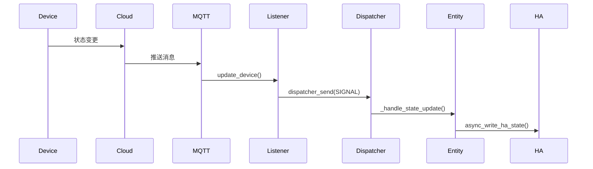
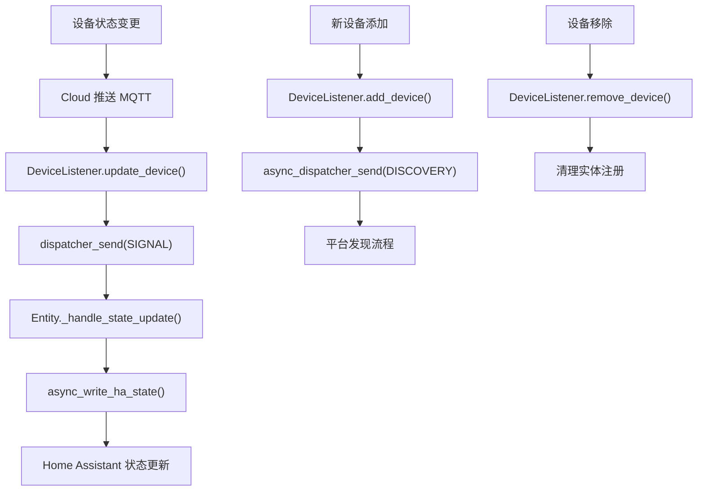

+++
id = "iot-event-driven-state-update"
domain = "architecture"
layer = "architecture"
maturity = "L1"
validation_count = 1
reuse_count = 0
documentation_level = "standard"
source = "docs/retrospective/reports/insight-extraction/retrospective-home-assistant-tuya-official-20260630/insight-extraction.md#知识点-6"

[bindings]
rules = []
references = ["iot-device-wrapper-pattern.md"]
skills = []
+++

> **已原子化自**：[Home Assistant 官方 Tuya 集成洞察萃取](../../reports/insight-extraction/retrospective-home-assistant-tuya-official-20260630/insight-extraction.md)

# IoT 事件驱动状态更新模式（Event-Driven State Update）

## 模式类型

架构模式

## 成熟度

L1 实验性（Home Assistant Tuya 集成单次验证）

## 适用场景

IoT 设备集成开发中，需要实现设备状态的实时同步，避免轮询带来的性能问题，支持大规模设备管理。

## 问题背景

传统轮询方式获取设备状态存在以下问题：

- **性能开销**：每次轮询消耗网络和计算资源
- **延迟累积**：轮询间隔导致状态更新延迟
- **规模瓶颈**：设备数量增加时轮询成本指数增长
- **实时性差**：无法捕获设备状态变更的精确时间

## 核心规则

采用事件驱动架构，通过云推送（MQTT）+ dispatcher 机制实现实时状态同步。

### 规则 1：定义设备监听器

监听器继承 SDK 提供的回调接口，实现三个核心事件：

| 事件回调 | 用途 |
|---------|------|
| `update_device()` | 设备状态变更时发送 dispatcher 信号 |
| `add_device()` | 新设备添加时触发发现流程 |
| `remove_device()` | 设备移除时清理实体 |

### 规则 2：实体注册信号监听

每个实体在加入 Home Assistant 时注册 dispatcher 连接：

```python
async def async_added_to_hass(self):
    self.async_on_remove(
        async_dispatcher_connect(
            self.hass,
            f"{SIGNAL_UPDATE_ENTITY}_{self.device.id}",
            self._handle_state_update,
        )
    )
```

### 规则 3：状态更新流程



### 规则 4：禁用轮询

实体必须设置 `_attr_should_poll = False`，明确使用事件驱动而非轮询。

## 操作流程



## 实施检查清单

- [ ] 是否定义了 DeviceListener 继承 SDK 回调接口？
- [ ] 实体是否设置了 `_attr_should_poll = False`？
- [ ] 实体是否在 `async_added_to_hass()` 中注册了 dispatcher 连接？
- [ ] 监听器是否在 `update_device()` 中发送了正确的信号？
- [ ] 是否处理了 MQTT 断连重连场景？

## 反例警示

| 错误做法 | 后果 |
|---------|------|
| 使用轮询获取状态 | 性能开销大，延迟累积，无法支持大规模设备 |
| 实体设置 `should_poll = True` | 与事件驱动机制冲突，状态更新冗余 |
| 绕过 dispatcher 直接更新 | 无法正确触发 Home Assistant 状态写入 |
| 忽略断连重连 | MQTT 断开后状态停止更新 |

## 正例

Home Assistant Tuya 集成的实现：

```python
# coordinator.py - 发送事件
def update_device(self, device, updated_status_properties, dp_timestamps):
    dispatcher_send(self.hass, f"{TUYA_HA_SIGNAL_UPDATE_ENTITY}_{device.id}")

# entity.py - 监听事件
class TuyaEntity(Entity):
    _attr_should_poll = False  # 禁用轮询
    
    async def async_added_to_hass(self):
        self.async_on_remove(
            async_dispatcher_connect(
                self.hass,
                f"{TUYA_HA_SIGNAL_UPDATE_ENTITY}_{self.device.id}",
                self._handle_state_update,
            )
        )
```

## 与现有模式的关系

- `iot-device-wrapper-pattern.md`：本模式关注状态更新机制，Wrapper 模式关注数据访问接口。两者组合实现完整的设备状态管理。

## 可复用场景

- IoT 设备状态同步（任何云推送协议）
- 实时数据更新场景
- 大规模设备管理
- 事件驱动架构设计