# Jupyter 扩展/插件注册三端对照：钩子函数 vs entry-point vs 前端插件

## 模式概述

Jupyter 生态跨越 Python 服务端、进程内模块加载器、TypeScript 前端三层，扩展注册机制在不同层采用三种不同的发现策略：**jupyter_server 用包内钩子函数**（`_jupyter_server_extension_points`/`_load_jupyter_server_extension`）、**fps 用标准 entry-point**（`entry_points(group="fps.modules")`）、**jupyterlab 用前端插件对象**（`JupyterFrontEndPlugin`）。三者共同构成"扩展注册"的统一架构主题，但发现机制互不相同。

这一对照揭示了插件体系设计的关键决策维度：**扩展发现是"约定式钩子"还是"声明式 entry-point"**，以及扩展入口在包内还是独立注册表。理解三端差异，是读懂任何 Jupyter 系仓库扩展机制、或设计跨语言插件系统的基础。

## 问题现象

阅读 Jupyter 生态源码时，扩展注册机制呈现出三种"看起来相关但实现各异"的形态：

1. **jupyter_server 端**：扩展如何被发现？它不在 `pyproject.toml` 中声明 entry_points，而是要求扩展包内定义 `_jupyter_server_extension_points()` 等钩子函数。初次接触者会习惯性在 pyproject.toml 里找 `[project.entry-points."jupyter_server.extension"]` 却一无所获。
2. **fps 端**：`fps.modules` 这一 entry-point 分组名如何被加载？与 jupyter_server 的"包内钩子"不同，fps 依赖 `importlib.metadata.entry_points(group="fps.modules")` 按名加载，且支持 `"module:attr"` 点分属性链。
3. **jupyterlab 前端端**：前端插件 `JupyterFrontEndPlugin` 如何注册？与 Python 端完全不同，它是 TypeScript 导出类型 + 插件列表，走 npm 包依赖与前端应用装配路径。

三端机制并存导致：在跨层追踪扩展加载链路时，若用某一端的发现模型去套另一端，会得出错误结论（如"jupyter_server 一定走 entry-point"）。

## 解决方案

### 三端注册机制对照

```mermaid
flowchart LR
    subgraph PyServer ["jupyter_server（Python 服务端）"]
        A1["包内钩子函数<br/>_jupyter_server_extension_points()"]
        A2["_jupyter_server_extension_paths()<br/>（旧名，弃用回退）"]
        A3["_load_jupyter_server_extension<br/>加载器（旧名 load_* 弃用）"]
        A4["ExtensionPackage 用 metadata['app']<br/>实例化 ExtensionApp"]
    end
    subgraph FPS ["fps（进程内模块加载器）"]
        B1["importlib.metadata.entry_points<br/>group='fps.modules'"]
        B2["'module:attr' 点分属性链<br/>按名加载"]
    end
    subgraph JLab ["jupyterlab（TypeScript 前端）"]
        C1["JupyterFrontEndPlugin<br/>前端插件对象"]
        C2["export type { JupyterFrontEndPlugin }<br/>from './frontend'"]
    end
    PyServer -->|"跨层对照"| JLab
    FPS -->|"跨层对照"| PyServer
```

### jupyter_server：约定式钩子函数发现

源码事实（`external/libs/jupyter/jupyter_server/jupyter_server/extension/utils.py`）：

- `get_metadata(package_name)` 用 `importlib.import_module` 导入包后，优先调用模块的 `_jupyter_server_extension_points()`；若不存在则回退到 `_jupyter_server_extension_paths()`（弃用名）；再回退到动态元数据。
- `get_loader(obj)` 查找 `_load_jupyter_server_extension` 加载函数（旧名 `load_jupyter_server_extension` 已弃用）。
- `extension/application.py` 的文档串提到 `launch_instance` 可作 entry_point。
- `manager.py` 的 `ExtensionPackage` 用 `metadata['app']` 实例化 `ExtensionApp`。
- 该仓库 `pyproject.toml` **无显式 entry_points 段**——扩展通过包内钩子函数发现，而非 entry-point。

### fps：声明式 entry-point 发现

源码事实（`external/libs/jupyter/fps/src/fps/_importer.py`）：

- 第 6/19-21 行用 `from importlib.metadata import entry_points`，按 `entry_points(group="fps.modules")` 加载。
- 第 26-40 行支持 `"module:attr"` 点分属性链（既可按模块名加载，也可指定模块内属性）。

### jupyterlab：前端插件对象

源码事实（`external/libs/jupyter/jupyterlab/packages/application/src/index.ts`）：

- 第 10 行 `export type { JupyterFrontEndPlugin } from './frontend'`。
- 前端插件是 TypeScript 类型 + 前端装配列表，与 Python 端发现机制完全解耦。

### 选型决策规则

| 维度 | 约定式钩子函数（jupyter_server） | 声明式 entry-point（fps） | 前端插件（jupyterlab） |
|------|--------------------------------|--------------------------|------------------------|
| 发现依据 | 包内固定名称钩子 | 分组注册表按名索引 | 前端类型 + 装配列表 |
| 声明位置 | 包代码内部 | `pyproject.toml`/元数据 | npm 包 + 前端应用 |
| 卸载/启用 | 改代码 | 增删元数据条目 | 改装配列表 |
| 适用层 | Python 服务端 | 进程内模块加载器 | 浏览器前端 |

## 适用场景

- ✅ 读懂 Jupyter 生态任一仓库的扩展加载链路（jupyter_server / fps / jupyterlab 三端）
- ✅ 设计跨语言插件系统：确定每层用"约定钩子"还是"声明式注册表"
- ✅ 排查扩展"未被加载"问题：先确认该层采用哪种发现机制
- ✅ 编写 Jupyter 扩展：按目标层的钩子/入口规范实现

**不适用场景**：
- ❌ 单层、单一语言的简单插件系统（对照模型过度设计）
- ❌ 需要强运行时隔离的插件（本模式关注静态发现，不涉及沙箱/子进程隔离）

## 实际案例

### 案例1：jupyter-okf-wiki-group 批量源码学习（本项目）

对 Jupyter 生态 65 个仓库批量生成 OKF Wiki 时，三端注册机制成为架构层核心概念文档的骨架：jupyter_client（多通道）、jupyter_server（扩展钩子）、fps（entry-point）、jupyterlab（前端插件）分别映射到不同概念文档，形成"扩展注册"跨层对照的知识地图。7 条核心事实在 V 阶段经 Grep 源码逐一核对一致，无虚构 API。

### 案例2：PyInvoke v3.0.3 OKF Wiki 生成（source-code-to-okf-wiki 源实践）

早期实践证实：AI 凭训练数据对"常见注册模式"的虚构倾向最强（如编造不存在的 `entry_points` 分组），三端对照明确各层真实发现机制后，虚构 API 被 Grep 级验证拦截。

## 反模式

### 反模式1：用 entry-point 模型套 jupyter_server

在 `pyproject.toml` 中寻找 jupyter_server 扩展的 entry_points 段，找不到就认为"没注册"。

**为什么错**：jupyter_server 走包内钩子函数发现（`_jupyter_server_extension_points`），无显式 entry-point 段是正常态。

**正确做法**：按层确认发现机制——服务端查包内钩子，fps 查 `fps.modules` 分组，前端查插件类型。

### 反模式2：混用新旧钩子名

实现时用旧名 `_jupyter_server_extension_paths()` 或 `load_jupyter_server_extension` 作为首选路径。

**为什么错**：旧名已弃用，仅作回退；新名 `_jupyter_server_extension_points()` / `_load_jupyter_server_extension` 才是首选。

### 反模式3：把"前端插件"当 Python 注册

试图在 jupyterlab 前端用 Python 端发现机制注册插件。

**为什么错**：jupyterlab 插件是 TypeScript 类型与前端装配列表，与 Python 元数据完全解耦。

### 反模式4：未验证就声称"扩展通过 entry-point 发现"

凭印象断言 jupyter_server 扩展走 entry-point 机制。

**为什么错**：AI 对"常见注册模式"的虚构倾向强，未 Grep 源码验证即下结论必然出错。

### 反模式5：三层机制混为一谈写进同一文档

把 jupyter_server/fps/jupyterlab 的注册机制当作"同一种东西"合并描述。

**为什么错**：三层发现策略不同，合并描述掩盖真实差异，读者无法据此排查问题。

## 与其他模式的关系

| 相关模式 | 关系 | 说明 |
|---------|------|------|
| [jupyter-kernel-zmq-channels.md](jupyter-kernel-zmq-channels.md) | 同域互补 | 扩展注册（谁被加载）与内核通道（如何通信）是 Jupyter 架构的两大支柱 |
| [four-step-extension-recipe.md](four-step-extension-recipe.md) | 特化→泛化 | 扩展四步法是通用扩展实现法，本模式聚焦"注册/发现"环节 |
| [io-boundary-pure-function-core.md](io-boundary-pure-function-core.md) | 互补 | 插件发现属 IO/装配边界，核心逻辑应保持纯函数 |
| [dependency-shimming-layer.md](dependency-shimming-layer.md) | 互补 | 插件系统常与依赖裁剪/适配层配套设计 |

## 边界与选型

### 什么时候用"约定式钩子"而非"entry-point"？

- 扩展实现方希望零元数据配置（仅需按约定命名钩子）→ 约定式
- 扩展需要被按名索引/枚举/运行时增删 → entry-point 更合适
- 目标平台没有标准元数据系统（如纯前端）→ 只能走钩子或装配列表

### 什么时候必须对照三层而非只看一层？

- 扩展链路跨层传递（前端插件 → 服务端扩展 → 模块加载器）
- 需要统一"扩展如何被发现"的知识地图
- 排查"扩展已声明但未生效"的跨层问题

### 兼容与迁移

- 新旧钩子名并存时，新名优先、旧名仅回退，删除旧名须先确认无下游依赖
- 前端插件类型升级时，需同步更新装配列表，避免类型与运行时不一致

<!-- changelog -->
