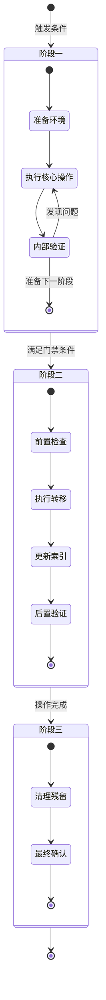

> **来源**：从 `docs/retrospective/reports/retrospective-report-create-apps-directory.md` 三、洞察环节 规律认知 萃取

# 生命周期协议三阶段

## 来源

本模式来源于 `.agents/protocols/app-development-workflow.md` 的结构设计，以及 `docs/retrospective/reports/retrospective-report-create-apps-directory.md` 中对"新协议与既有协议的继承+专项化关系模式"的规律认知。`app-development-workflow.md` 在被创建时采用了"暂存开发→稳定迁移→清理"的三阶段生命周期结构，经复盘分析确认此结构具备通用性，可抽象为独立的架构模式。

## 核心结构

任何管理实体生命周期（从创建到退役）的协议文档，均可采用标准的三阶段结构。三个阶段按时间顺序流转，阶段之间通过质量门禁连接，每个阶段均包含四个要素：进入条件、执行规范、退出标准和负责角色。

## 架构图

每个阶段内部可嵌套子状态，子状态之间允许回退循环（如"内部验证→执行核心操作"），但阶段之间只能单向流转，不可逆向。

## 各阶段要素模板

每个阶段的定义应包含以下四个要素：

### 进入条件

明确规定实体在什么前提下进入此阶段。进入条件必须是可客观判断的布尔条件，而非主观评估。示例格式：

- 前一阶段的全部退出标准已满足
- 门禁条件的全部检查项已通过
- 指定的触发事件已发生（如审批通过、时间窗口到达）

### 执行规范

在此阶段须完成的操作集合。可包含以下内容：

- **目录结构**：阶段所需的文件和目录布局（如模板化的目录树）
- **操作步骤**：按顺序执行的具体操作，含输入、输出和依赖关系
- **参与角色**：每项操作的责任智能体或人类角色，遵循项目既有的角色定义体系
- **约束规则**：阶段内的禁止行为与限制条件（如禁止逆向流转、禁止跳过验证）

### 退出标准

如何验证此阶段已完成。退出标准必须是可验证的，通常包含以下维度：

- **验证方式**：自动化测试、人工审查、脚本校验等具体手段
- **验证标准**：通过/失败的可度量阈值（如测试通过率 100%、审查意见全部解决）
- **负责角色**：执行验证的责任方

### 门禁条件

阶段之间转移的硬性检查项，连接当前阶段的退出与下一阶段的进入。门禁条件必须遵循以下原则：

1. **客观可验证**：每项条件必须有明确的验证手段，不能依赖主观判断。例如"代码审查通过"需具体化为"至少一位 reviewer 审查通过，无未解决的审查意见"。
2. **全量满足**：所有门禁条件必须同时满足，不存在"部分满足即通过"的例外。
3. **可追溯**：每项门禁条件的验证结果应有记录可查（如审查记录、测试报告链接）。

门禁条件建议以表格形式呈现：

| 序号 | 条件 | 验证方式 | 负责角色 |
|---|---|---|---|
| 1 | 条件描述 | 具体验证手段 | 负责角色 |

## 实际应用案例

以 `app-development-workflow.md` 为例，该协议管理"新应用"这一实体的完整生命周期：

### 阶段一：暂存开发

- **进入条件**：决定创建新应用
- **执行规范**：在 `.temp/<app-name>/` 下按模板搭建目录结构（src/、tests/、README.md、依赖声明文件），进入迭代开发与测试循环。暂存阶段不受代码审查约束，允许频繁修改与重构。
- **退出标准**：核心功能实现完毕，全部测试用例通过率 100%，README.md 包含应用简介、安装步骤、使用说明与依赖列表。
- **负责角色**：developer（开发）、tester（测试）

### 阶段二：稳定迁移

- **进入条件**：门禁条件全部通过（功能稳定 + 测试通过 + 审查完成 + 文档完善）
- **执行规范**：迁移前检查→执行迁移（`.temp/<app-name>/` → `apps/<app-name>/`）→更新 apps/ 索引→迁移后验证
- **退出标准**：在 `apps/<app-name>/` 路径下执行测试用例与功能验证通过，路径引用无残留指向 `.temp/`。
- **负责角色**：orchestrator（迁移发起与确认）、developer（执行迁移）、tester（迁移后验证）

### 阶段三：清理

- **进入条件**：迁移完成且迁移后验证全部通过
- **执行规范**：删除 `.temp/<app-name>/` 暂存目录→确认 `apps/<app-name>/` 正常运行→通过消息协议通知相关智能体迁移完成
- **退出标准**：暂存目录残留清理完毕，相关方均已收到迁移通知。
- **负责角色**：orchestrator（监督清理与通知）

### 门禁条件（阶段一→阶段二的硬性检查项）

| 序号 | 条件 | 验证方式 | 负责角色 |
|---|---|---|---|
| 1 | 核心功能实现完毕并通过测试 | 执行全部测试用例，通过率 100% | tester |
| 2 | 代码审查通过 | 至少一位 reviewer 审查通过，无未解决的审查意见 | reviewer |
| 3 | 无阻塞性缺陷 | 无 P0/P1 级别缺陷，已知问题已记录且不影响核心功能 | tester、reviewer |
| 4 | 文档已编写 | README.md 包含应用简介、安装步骤、使用说明与依赖列表 | developer |

## 核心原则

1. **阶段单向流转**：生命周期只能从阶段一→阶段二→阶段三顺序推进，不允许逆向流转。若阶段三发现严重问题，应发起新的生命周期流程而非回退到旧阶段。
2. **门禁不可绕过**：任何情况下不得跳过门禁条件直接进入下一阶段。门禁是质量保障的最后一道防线。
3. **角色分离**：阶段之间的负责角色应有明确交接，避免同一角色同时负责门禁的"设置者"与"检查者"两个位置。
4. **可扩展子状态**：阶段内部允许根据领域需求扩展子状态结构，但三阶段骨架和四要素模板应保持不变。

## 复用场景

- **应用开发生命周期管理**：从原型开发到正式发布的完整流程管控
- **文档审批与发布流程**：草稿→评审→正式发布→归档
- **代码审查流水线**：提交→审查→修订→合并→清理分支
- **部署流水线**：开发环境→预发布环境→生产环境，每阶段之间以自动化测试和审批为门禁
- **功能开关的生命周期管理**：实验阶段→灰度发布→全量开启→代码清理
- **数据迁移项目**：旧系统运行→数据导出与转换→新系统导入与验证→旧系统下线
- **版本发布流程**：功能冻结→候选发布→正式发布→补丁维护

## 与双区开发模型的关系

| 维度 | 双区开发模型 | 生命周期协议三阶段 |
|---|---|---|
| 定位 | 概念框架 | 结构模板 |
| 解决的问题 | 为什么需要两个区域（非正式区与正式区） | 如何在两个区域之间执行有序转移 |
| 层次 | 设计理念层 | 实现规范层 |
| 输出 | 区域定义、职责划分、隔离原则 | 阶段定义、门禁条件、角色分工 |

本模式与双区开发模型互为补充：双区模型提供了"为什么需要两个区域"的概念基础，生命周期协议三阶段提供了"如何在两个区域间转移"的具体实现结构。在实际项目中，双区模型负责定义 `.temp/`（非正式区）与 `apps/`（正式区）的边界与职责，生命周期协议三阶段负责定义从 `.temp/` 迁移至 `apps/` 的完整流程与质量保障机制。

> **关联模块**：
> - `.agents/protocols/app-development-workflow.md`（实际应用案例）
> - `docs/retrospective/reports/retrospective-report-create-apps-directory.md`（模式萃取来源）
> - `docs/retrospective/patterns/methodology-patterns/ai-collaboration/dual-zone-development-model.md`（互补概念框架）
> - `.agents/protocols/dependency-management.md`（通用管理章程，本模式与之构成继承关系）
