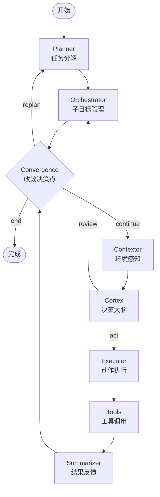

> **来源**：从mobile-use深度学习分析复盘萃取，经mobile-use AndroidWorld 100%准确率验证

# 多智能体闭环执行与自动重规划模式（Multi-Agent Closed-Loop Execution with Auto-Replan）

## 模式类型

架构模式（多智能体系统控制流设计）

## 成熟度

L1 首次萃取（mobile-use验证）

## 适用场景

需要在不确定、动态变化环境中执行复杂任务的多智能体系统：
- UI自动化（移动App/网页/桌面操作）
- 机器人控制（物理世界交互）
- API调用链编排（网络超时/限流/错误码）
- RPA流程自动化（异常弹窗/加载延迟/数据变化）
- 浏览器自动化（页面结构变化/元素遮挡/动态内容）
- 任何"动作执行后环境状态不可完全预测"的场景

## 问题背景

在设计与真实世界交互的Agent系统时，线性执行（Plan→Execute once→Done）存在根本缺陷：

1. **环境动态变化**：UI弹窗、网络延迟、意外跳转、元素遮挡等不可预测事件随时发生
2. **动作可能失败**：点击未命中、输入未生效、页面未加载完成等执行错误
3. **计划可能过时**：初始计划基于初始观察，执行几步后环境可能已完全改变
4. **假成功问题**：动作"看起来执行了"但实际未达到预期效果（如点击后页面未跳转）
5. **无反馈循环**：执行后不观察结果就认为成功，错误会级联放大

**反模式**：线性DAG无循环，一次失败整个任务失败；或虽有重试但简单重试相同动作。

## 解决方案（模式）

将执行流程设计为**观察-思考-行动-观察**的闭环循环，包含五个核心组件：

### 核心架构



### 五大核心组件

| 组件 | 职责 | 关键设计 |
|------|------|----------|
| **Planner（规划器）** | 将高层目标分解为原子化子目标序列 | 支持replan：从失败点重新规划，保留已完成子目标 |
| **Orchestrator（编排器）** | 管理子目标状态机（NOT_STARTED→IN_PROGRESS→COMPLETED/FAILED） | 审核完成理由是否充分，不盲目标记完成 |
| **Contextor（感知器）** | 每轮决策前重新采集环境状态（UI树/截图/日志） | 不缓存过时观察，每轮都重新感知 |
| **Cortex（决策器）** | 分析当前状态，结合历史思考，决定下一步动作 | 先回顾历史失败经验再决策，不重复同样错误 |
| **Convergence（收敛点）** | 屏障节点，判断继续/重规划/终止 | 显式失败检测条件：子目标FAILURE→replan |

### 关键设计规则

#### 规则1：每轮必须重新观察（观察先行）
```
正确：Observe → Think → Act → Observe → Think → Act ...
错误：Observe once → Think → Act → Act → Act ...（基于过时观察连续行动）
```
每轮决策前必须调用Contextor获取最新环境状态，绝不基于多步前的观察做决策。

#### 规则2：Convergence显式决策三种出口
| 条件 | 出口 | 动作 |
|------|------|------|
| 任意子目标FAILED | replan | 返回Planner，基于历史重新规划 |
| 所有子目标COMPLETED | end | 任务成功退出循环 |
| 其他情况 | continue | 进入下一轮观察-决策循环 |

#### 规则3：重规划不是从零开始
- **保留已完成子目标**：不重复已成功的工作
- **传递历史思考**：agents_thoughts链让Planner理解之前发生了什么、为什么失败
- **从失败点继续**：不是回退到起点，而是基于当前状态调整后续计划

#### 规则4：Executor独立消息链
Executor使用独立的短消息链而非全局历史：
- 避免上下文过长导致成本增加和注意力分散
- Executor只需要知道"当前要做什么"和"上次执行结果如何"

#### 规则5：思考历史可追溯
agents_thoughts字段记录每个智能体的决策理由：
```
[planner] 生成3个子目标：打开Gmail→查找未读邮件→提取发件人和主题
[cortex] 分析UI层级：Gmail收件箱可见，前3封邮件显示未读标记
[cortex] 检测到之前点击位置错误，调整到正确坐标
[executor] 点击第一封邮件查看详情
```
Cortex决策前先回顾思考链，检测重复失败→改变策略。

## 实现示例（mobile-use LangGraph）

```python
# graph.py 核心结构
async def get_graph(ctx: MobileUseContext) -> CompiledStateGraph:
    graph_builder = StateGraph(State)

    # 注册节点
    graph_builder.add_node("planner", PlannerNode(ctx))
    graph_builder.add_node("orchestrator", OrchestratorNode(ctx))
    graph_builder.add_node("contextor", ContextorNode(ctx))   # 感知
    graph_builder.add_node("cortex", CortexNode(ctx))         # 思考
    graph_builder.add_node("executor", ExecutorNode(ctx))     # 决策→行动
    graph_builder.add_node("executor_tools", executor_tool_node)
    graph_builder.add_node("summarizer", SummarizerNode(ctx)) # 反馈
    graph_builder.add_node(node="convergence", action=convergence_node, defer=True)

    # 主循环边
    graph_builder.add_edge(START, "planner")
    graph_builder.add_edge("planner", "orchestrator")
    graph_builder.add_edge("orchestrator", "convergence")
    graph_builder.add_edge("contextor", "cortex")
    graph_builder.add_edge("executor_tools", "summarizer")
    graph_builder.add_edge("summarizer", "convergence")

    # 条件路由：Cortex决策后
    graph_builder.add_conditional_edges("cortex", post_cortex_gate, {
        "review_subgoals": "orchestrator",  # 需要审核子目标完成
        "execute_decisions": "executor",     # 需要执行动作
    })

    # 条件路由：Executor执行后
    graph_builder.add_conditional_edges("executor", post_executor_gate, {
        "invoke_tools": "executor_tools",   # 有工具调用→执行
        "skip": "summarizer",                # 无工具调用→直接总结
    })

    # 条件路由：Convergence收敛决策（关键！）
    graph_builder.add_conditional_edges("convergence", convergence_gate, {
        "continue": "contextor",    # 继续下一轮循环
        "replan": "planner",        # 失败→重新规划
        "end": END,                 # 成功→结束
    })

    return graph_builder.compile()
```

### convergence_gate决策逻辑
```python
def convergence_gate(state: State) -> str:
    # 检查子目标状态
    for subgoal in state.subgoal_plan:
        if subgoal.status == "FAILED":
            return "replan"    # 有失败→重规划
        if subgoal.status == "IN_PROGRESS":
            return "continue"  # 还在进行中→继续循环
    if all(s.status == "COMPLETED" for s in state.subgoal_plan):
        return "end"           # 全部完成→成功
    return "continue"
```

## 与相关模式的对比

| 模式 | 核心思想 | 差异 |
|------|----------|------|
| **闭环执行+重规划**（本模式） | 观察-思考-行动循环+失败时重新规划 | 多Agent协作，支持从失败点恢复 |
| **重试模式**（Retry） | 失败后简单重试相同动作 | 无感知反馈，无策略调整，容易死循环 |
| **断路器模式**（Circuit Breaker） | 连续失败后停止执行 | 只止损不恢复，无重规划能力 |
| **OODA循环**（军事决策） | 观察-判断-决策-行动 | 理论框架，无具体多Agent实现指引 |
| **PDCA循环** | 计划-执行-检查-处理 | 质量管理框架，粒度较粗 |

## 反模式（应避免）

- ❌ 线性DAG无循环：Plan→Execute→Done，一次失败整体失败
- ❌ 重试相同动作：点击失败后反复点击同一位置，不分析原因
- ❌ 基于缓存观察决策：多步前的截图/UI树用于当前决策
- ❌ 重规划从零开始：丢失所有历史信息和已完成工作
- ❌ 无显式失败检测：靠异常捕获而非主动判断任务状态
- ❌ 思考链不持久化：Cortex看不到之前为什么失败，重复犯同样错误
- ❌ 全局消息历史无限增长：所有Agent共享超长消息链，成本高且干扰决策

## 实施检查清单

- [ ] 执行流包含"观察→思考→行动→反馈"完整循环，非一次通过
- [ ] 每轮决策前都有显式的环境感知步骤（不缓存过时观察）
- [ ] 存在显式的收敛决策点，判断continue/replan/end三种出口
- [ ] replan路径保留已完成工作和历史思考，不从头开始
- [ ] 思考链持久化，后续决策可以回顾历史经验
- [ ] 执行器使用独立短上下文，避免全局历史膨胀
- [ ] 子目标有明确的状态机管理（NOT_STARTED→IN_PROGRESS→COMPLETED/FAILED）
- [ ] 完成理由需要审核，不盲目标记成功
- [ ] 失败检测基于状态判断，而非仅依赖异常捕获

## 成本-收益分析

| 成本 | 收益 |
|------|------|
| 每轮多一次LLM调用（Contextor+Cortex） | 可靠性大幅提升（mobile-use: AndroidWorld 100%） |
| 执行时间更长（多轮循环） | 避免级联错误，减少"假成功"后的人工排查 |
| 架构复杂度增加 | 处理意外情况的能力从0→可用 |
| Token消耗增加 | 失败任务的重试成本远高于多轮感知成本 |

**关键洞察**：在不确定环境中，"多花几轮确认"的成本远低于"做错后返工"的成本。mobile-use使用1个强模型+5个轻量模型的分级策略，将闭环执行的额外成本控制在可接受范围内。
