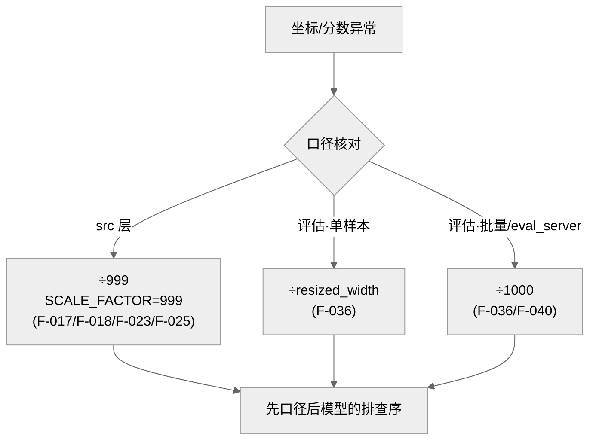

> **提炼自**：Tongyi-MAI mai-ui 坐标归一化复盘 —— 同一语义量在子系统间存在两套并存归一化约定时的登记与分治

# 归一化口径二元并存（Normalization Convention Duality）

## 模式类型

架构模式（数值约定治理 / 跨模块口径分治 / 排障纪律）

## 成熟度

L1 已验证（1 次验证：2026-08-29 Tongyi-MAI mai-ui 源码学习，src 两文件与评估端三处交叉验证）

## 适用场景

同一语义量（坐标、比例、分数、时间）在系统的不同子系统（应用层 vs 评估层、SDK vs 服务端、客户端 vs 内核）中被归一化/度量时：

- 历史演进产生了两套数值约定且各自内部完全一致
- 两侧子系统分属不同环境/代码库，强行统一成本高于分治
- 复现分数/输出异常需要快速定位是否口径问题

## 问题背景

面对"两处除数不同"（如 999 vs 1000），最常见的两种错误反应：

1. **当笔误"修复"**：把 999 改成 1000（或反之）——破坏该子系统的既有数据兼容性，评估分数与历史结果全部失配。
2. **当同一口径混用**：文档/代码里不加区分地引用两套数字——跨子系统传递坐标时静默产生 1/1000 级偏差，排查极难。

根本矛盾：**理想是全局统一口径，现实是子系统级一致已 embedded 在各自的数据与结果里**。识别"并存约定"与"真笔误"的边界，比强行统一更重要。

## 核心设计

三分法：

1. **一致性判据**：约定是否"各自内部一致"——mai-ui 中 `src/` 两个 Agent 文件一致用 `SCALE_FACTOR = 999`（F-017/F-023），评估管线（单样本按 resize 宽度、批量与 eval-server）一致按 1000（F-036/F-040）。各自一致 = 并存约定（设计现状）；随机混杂 = 真笔误（须修）。
2. **口径对照表**：文档设多列对照表，逐一登记每个子系统的口径与适用范围——mai-ui 为三列：`999`（src 归一化）/ `1000`（评估批量与 eval-server）/ `resized_width`（评估单样本）。
3. **边界显式约定**：把 Agent 接入第三方环境时，除数必须作为显式约定项传递，不可依赖"默认相同"；复现分数异常的排查顺序是**先查归一化口径、再查模型**。

## 实施要点

| 维度 | 做法 | mai-ui 实例 |
|---|---|---|
| 定性流程 | 先跨文件验证一致性，再决定"登记"还是"修复" | src 两文件一致 999 + 评估端一致 1000 → 登记为并存约定（F-017/F-023/F-036/F-040） |
| 文档表达 | 对照表多列呈现，每列注明适用子系统 | 三列：999 / 1000 / resized_width |
| 传递边界 | 跨子系统接口显式传口径参数或文档强制约定 | Agent 接第三方环境必须显式约定除数 |
| 容错分层 | 各层容错语义分别登记，不合并描述 | 解析层非法坐标 raise ValueError（F-018/F-025）、判分层另有 `wrong_format` 标签（F-040），三层语义不同 |
| 排障纪律 | 异常复现先核对口径再怀疑模型 | "先查归一化口径再查模型" |

## 不适用场景与反目标用户

### 不适用场景

- ❌ **两侧可低成本统一**：同库内新代码尚未外发数据时，直接统一到一套口径，别引入分治复杂度。
- ❌ **口径已经引发过实际数据事故且可迁移**：若历史数据可一次性迁移重算，统一优于永久并存。
- ❌ **单一子系统内部**：本模式治理"跨子系统边界"，单模块内的不一致就是 bug，直接修。

### 反目标用户

- 追求"数值洁癖"的架构师：能接受 999 与 1000 并存需要纪律，无法接受者应先做统一迁移再谈其他。

## 反模式

### 反模式1："把并存约定当笔误修"

看到 999 与 1000 并存就"顺手统一"。**正确做法**：先做跨文件一致性验证——各自内部一致即为约定，登记而非修改。

### 反模式2："跨子系统传递坐标不声明口径"

接口间直接传归一化坐标，隐含"对方和我除数相同"。**正确做法**：跨边界传递必须显式约定口径（参数化或文档强制）。

### 反模式3："文档只写单一口径"

文档按"标准做法"只描述一种归一化方式。**正确做法**：并存现状必须对照表完整呈现，缺列即误导。

### 反模式4："分数异常先怀疑模型"

效果不达预期先调参/换模型。**正确做法**：排查序固定为"先口径、再模型"——1/1000 级坐标偏差足以让 grounding 全错且表象酷似模型能力问题。

### 反模式5："容错语义跨层混用"

把解析层的异常（ValueError）与判分层的标签（`wrong_format`）描述成同一种"解析失败"。**正确做法**：分层登记容错语义，各层测试各层验证。

## 失败案例

### 案例："999 疑似笔误"的定性过程（mai-ui 源码学习，2026-08-29）

**背景**：R 阶段发现 `src/mai_grounding_agent.py` 与 `mai_naivigation_agent.py` 均为模块级常量 `SCALE_FACTOR = 999`（F-017/F-023），而评估端归一化除以 1000（F-036/F-040）——999 的取值极易被当成"想要 1000 打错了"。

**发现过程**：没有直接"修正"，而是先做一致性验证：src 侧两个独立文件一致使用 999（含解析与逆变换两处，F-018/F-025），评估侧单样本（resized_width）、批量（固定 1000）、eval_server（`related / 1000.0`）三处口径明确分工——两侧各自内部完全一致，排除随机笔误的可能，定性为**并存约定**并登记。同轮还识别出容错分层差异：解析层对非法坐标 raise ValueError（F-018/F-025），判分层对解析失败另有 `wrong_format` 标签（F-040），语义不可合并。知识包文档据此设置"坐标口径对照表"三列呈现。

**教训**：数值异常的第一反应应是"验证一致性分布"而非"修正数值"——分布一致即约定，零星孤例才是笔误；这个定性结论本身就是知识包的高价值事实（F-017~F-040 共 6 条）。

## 早期预警信号

| 预警信号 | 可能问题 | 建议行动 |
|---|---|---|
| 两处除数/系数不同但各自文件内一致 | 并存约定而非笔误（反模式1） | 登记+对照表，禁止直接统一 |
| 跨接口传坐标/比例但接口签名无口径参数 | 口径未显式约定（反模式2） | 参数化口径或文档强制约定 |
| 文档/教程只出现一种归一化描述 | 口径隐瞒（反模式3） | 补对照表，逐子系统列全 |
| 效果异常但换模型/调参无效 | 口径错位（反模式4） | 先核对两侧除数再查模型 |
| 同一"解析失败"在不同层表现不同 | 容错分层未登记（反模式5） | 分层登记语义与测试 |
| 历史评估分数与新跑分数系统性偏差 | 评估口径变更未声明 | 核对评估端除数与数据版本 |

## 实际案例

Tongyi-MAI mai-ui 坐标归一化（2026-08-29 源码学习）：

| 子系统 | 口径 | 证据 |
|---|---|---|
| src grounding Agent | `SCALE_FACTOR = 999`（归一化与反归一化同源） | F-017/F-018 |
| src navigation Agent | `SCALE_FACTOR = 999`，支持坐标长度 2/4 | F-023/F-025 |
| 评估·单样本 | 除以 `resized_width` | F-036 |
| 评估·批量 | 固定除以 1000 | F-036 |
| eval_server | `related / 1000.0` | F-040 |

## 迁移验证

- **可迁移场景**：经纬度（度 vs 度分秒 vs E7 整数）；时间戳（秒 vs 毫秒）；颜色（0-255 vs 0.0-1.0）；音量/采样率（不同音频栈）；评估基准分数（不同归一化分母）。
- **先例关联**：跨子系统环境分立与 [inference-shell-model-base-decoupling.md](./inference-shell-model-base-decoupling.md) 的"环境分立"同构——src 与评估端本就是两套环境，口径分治是环境分立的数值投影。

## 与其他模式的关系

| 关系模式 | 关系类型 | 说明 |
|---|---|---|
| [normalized-coordinate-abstraction.md](./normalized-coordinate-abstraction.md) | 上游抽象 | 该模式主张用归一化坐标剥离分辨率变量；本模式治理"归一化本身在子系统间分裂"的次生问题 |
| [inference-shell-model-base-decoupling.md](./inference-shell-model-base-decoupling.md) | 同构机制 | "环境分立"（Agent 环境 vs 服务/评估环境）是口径分治的组织成因 |
| [environment-diversity-design.md](./environment-diversity-design.md) | 配套机制 | 多环境并存下的差异显式化纪律，口径对照表是其数值维度实例 |

<!-- changelog -->
- 2026-08-29 | pattern | 初始创建：从 Tongyi-MAI mai-ui 源码学习（洞察4）萃取；证据链 F-017/F-018/F-023/F-025/F-036/F-040，跨文件一致性验证定性
