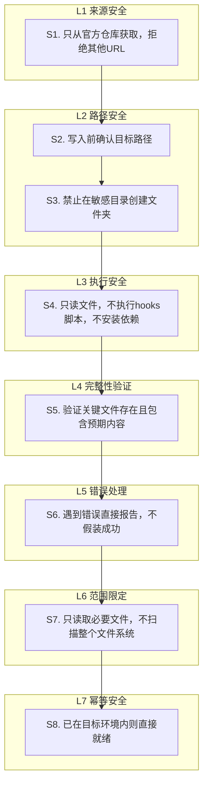

# 提示词分层防御安全模式（Prompt Defense-in-Depth Pattern）

## 模式类型
架构模式（安全设计/提示词工程）

## 成熟度
L2 验证级（2次验证：SpecWeave一句话装载提示词S1-S8安全规则 + Task 0协议定义）

## 问题陈述

当设计提示词让AI自动执行文件操作、命令执行、网络获取等操作时，存在7类典型安全风险：

| 风险类型 | 攻击场景 | 后果 |
|---------|---------|------|
| **供应链攻击** | AI从恶意URL获取项目代码，植入后门 | 系统被入侵，数据泄露 |
| **路径遍历** | AI在用户主目录/系统目录/根目录创建文件 | 污染系统环境，覆盖重要文件 |
| **恶意脚本执行** | 获取的项目中含pre-commit hooks/安装脚本，AI自动执行 | 恶意代码执行，系统被控 |
| **完整性缺失** | 获取到错误仓库/损坏文件，AI不验证就报告成功 | 后续操作基于错误数据，连锁失败 |
| **幻觉错误** | 遇到错误AI假装成功，不报告真实问题 | 用户误以为成功，在错误基础上继续操作 |
| **范围越界** | AI扫描整个文件系统寻找"合适的位置" | 隐私泄露，性能问题，意外修改 |
| **非幂等破坏** | 重复执行时破坏已有环境/重复下载 | 已有工作丢失，环境混乱 |

单一安全规则（如只说"请安全执行"）无法有效防护，需要分层防御体系。

## 解决方案

借鉴网络安全的分层防御（Defense in Depth）思想，为操作类提示词设计7层独立安全规则，每层规则独立可验证：



### 七层安全规则定义

| 层级 | 规则编号 | 规则内容 | 防护目标 | 实现方式 |
|------|---------|---------|---------|---------|
| **L1 来源安全** | S1 | 只从官方仓库/可信来源获取，绝对不接受其他URL | 防供应链攻击 | 提示词中硬编码官方URL，明确列出禁止的来源类型 |
| **L2 路径安全** | S2 | 执行任何写入操作前必须向用户确认目标路径，提供默认值 | 防意外写入 | 强制交互确认步骤，给出合理默认路径 |
| **L2 路径安全** | S3 | 禁止在用户主目录、系统目录、根目录、隐藏目录自动创建文件夹 | 防路径遍历 | 明确列出禁止目录黑名单 |
| **L3 执行安全** | S4 | 自举过程只读文件，不执行任何hooks脚本，不安装pip包，不修改系统配置 | 防恶意代码执行 | 明确禁止的执行操作清单（no-execute原则） |
| **L4 完整性安全** | S5 | 获取完成后必须验证关键文件存在且包含预期关键词 | 防损坏/伪造文件 | 定义关键文件和验证关键词（如AGENTS.md必须含"启动协议"） |
| **L5 错误处理** | S6 | 遇到任何错误直接告诉用户，给出原因和解决方案，不要假装成功 | 防幻觉错误 | 强制错误报告格式要求，禁止静默失败 |
| **L6 范围限定** | S7 | 只读取与装载相关的必要文件，不扫描整个文件系统 | 防隐私泄露/越界访问 | 最小权限原则，明确读取范围 |
| **L7 幂等安全** | S8 | 如果当前已经在有效环境内，跳过获取直接报告就绪 | 防重复执行破坏 | 自举前先检测是否已在目标环境 |

### 提示词模板

设计操作类提示词时，安全规则部分使用以下模板格式：

```
【安全规则-必须遵守】
S1. [来源安全规则内容]
S2. [路径确认规则内容]
S3. [敏感目录防护规则内容]
S4. [执行限制规则内容]
S5. [完整性验证规则内容]
S6. [错误处理规则内容]
S7. [范围限定规则内容]
S8. [幂等性规则内容]
```

规则按防御层级从外到内排列，即使AI跳过某条规则，后续规则仍能提供防护。

### 规则设计原则

1. **独立性**：每条规则独立可执行，不依赖其他规则
2. **明确性**：规则内容具体可操作，避免模糊表述（如"请小心"无效，"禁止在C:/Windows/写入"有效）
3. **可验证**：每条规则都有明确的验证方式（可检查是否遵守）
4. **分层递进**：从来源→路径→执行→完整性→错误→范围→幂等，层层设防
5. **白名单优先**：使用白名单（"只从官方URL获取"）而非黑名单（"不要从恶意URL获取"）

## 适用场景

| 场景 | 适用度 | 说明 |
|------|--------|------|
| AI自动安装/自举提示词 | 核心场景 | 本次验证场景（SpecWeave一句话装载） |
| AI自动执行代码重构 | 核心场景 | 文件写入+代码修改，需要严格防护 |
| AI自动执行数据迁移 | 适用 | 文件操作范围大，路径安全尤其重要 |
| AI辅助配置文件生成 | 适用 | 需防止配置写入错误位置 |
| 纯分析/只读类提示词 | 不适用 | 无文件写入/命令执行操作时不需要此模式 |
| 简单问答/对话提示词 | 不适用 | 无风险操作时过度设计 |

## 反模式警示

| 错误做法 | 后果 | 正确做法 |
|---------|------|---------|
| 只写一句"请注意安全" | AI无法判断什么是"安全"，规则形同虚设 | 明确列出8条具体规则，每条有可操作的判断标准 |
| 安全规则放在提示词末尾 | AI可能在执行过程中已违反规则才看到 | 安全规则放在提示词最开头，标注"必须遵守" |
| 只有来源验证没有完整性验证 | 即使从正确URL获取，也可能获取到损坏/被篡改的文件 | 必须验证关键文件的存在性和内容关键词 |
| 允许AI自动执行安装脚本 | 获取的项目中可能含恶意hooks | 自举阶段只读取，不执行任何脚本 |
| 不要求错误明确报告 | AI遇到错误可能假装成功，用户在错误基础上继续 | 强制要求错误必须报告，给出原因和方案 |
| 没有幂等性检查 | 用户重复发送提示词时重复执行，破坏已有环境 | 先检测是否已在目标环境，幂等执行 |

## 验证来源

- **验证1：SpecWeave一句话装载提示词**（2026-07-13）：8条安全规则（S1-S8）完整实现，在prompt-bootstrap.md中明确定义，覆盖七层防御
- **验证2：工作区发现协议中的就绪检查**（2026-07-13）：S8幂等规则在发现流程中作为第一步检查（如果已在SpecWeave内则直接就绪）

## 关联资源

- 关联模式：[full-process-defense-depth.md](full-process-defense-depth.md)（全过程纵深防御）
- 关联模式：[scenario-based-security-matrix.md](scenario-based-security-matrix.md)（场景化安全矩阵）
- 关联模式：[path-traversal-guard.md](../code-patterns/path-traversal-guard.md)（路径遍历防护代码模式）
- 关联模式：[fine-grained-least-privilege.md](../methodology-patterns/ai-collaboration/fine-grained-least-privilege.md)（细粒度最小权限原则）
- 验证来源：[2026-07-13-task0-workspace-protocols.md](../../2026-07-13-task0-workspace-protocols.md)（复盘报告）
- 协议定义：[prompt-bootstrap.md](../../../../.agents/protocols/prompt-bootstrap.md)（提示词自举协议中的安全规则）
