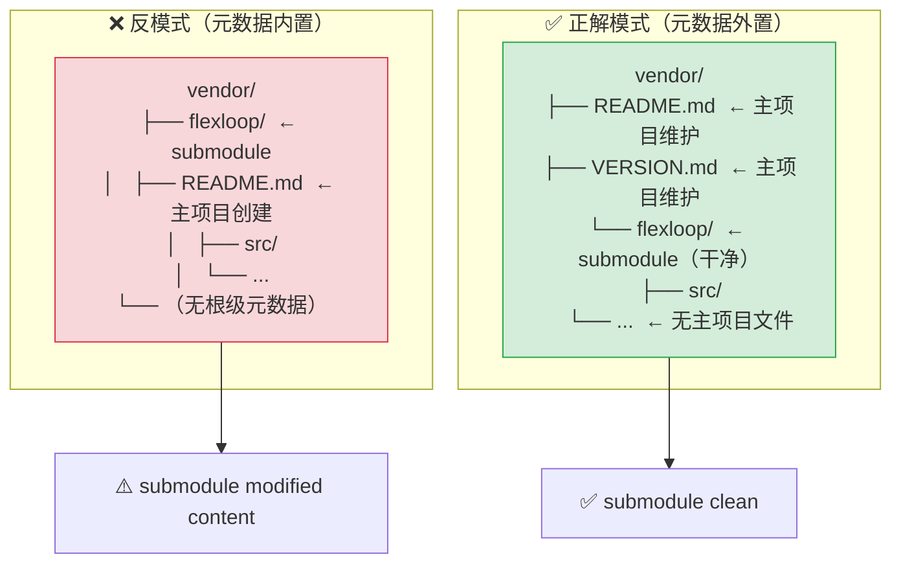

+++
id = "submodule-metadata-externalization"
domain = "architecture"
layer = "architecture"
maturity = "L1"
validation_count = 1
reuse_count = 0
documentation_level = "basic"
source = "docs/retrospective/reports/spec-system/retrospective-vendor-submodule-collaboration-20260629/execution-retrospective.md"

[bindings]
rules = [".agents/protocols/dependency-management.md"]
references = [".agents/VENDOR-INTEGRATION.md#版本控制策略", "vendor/README.md", "vendor/VERSION.md"]
skills = []
+++

# Submodule 元数据外置模式

## 模式概述

Git submodule 的元数据（用途描述、版本信息、许可证、来源等）必须放在 submodule 目录**之外**（如 `vendor/README.md` 和 `vendor/VERSION.md`），不能在 submodule 目录内创建主项目维护的元数据文件。

## 问题

在 submodule 目录（如 `vendor/flexloop/`）内创建主项目维护的 README.md 或其他元数据文件，会导致：

1. **Submodule Dirty 状态**：Git 将 submodule 目录视为外部仓库的工作树，主项目在其中创建的文件会被 git 视为 submodule 的未跟踪修改，导致 `git status` 永久显示 `modified content`
2. **版本控制混乱**：这些文件无法通过主项目正常提交（因为它们在 submodule 的 git 工作树中），也无法通过 submodule 提交（因为主项目不应该向外部仓库推送元数据）
3. **更新冲突**：当 submodule 更新到新版本时，这些文件可能与外部仓库的文件冲突

## 解决方案



## 文件结构规范

### vendor/README.md（依赖总览）
```markdown
# Vendor 第三方依赖

本目录存放项目的外部依赖...

## 依赖清单

| 名称 | 类型 | 用途 |
|------|------|------|
| flexloop | git submodule | AgentForge AI Agent 协作框架（规范参考实现） |
```

### vendor/VERSION.md（版本清单）
```markdown
# Vendor 依赖版本清单

| 名称 | 版本 | 来源 | 引入日期 | 许可证 | 备注 |
|------|------|------|---------|--------|------|
| flexloop | v0.7.1-270-gd618849 (d618849a) | git@gitcode.com:flexloop/flexloop.git | 2026-06-27 | Apache-2.0 | git submodule，固定 commit |
```

### .gitignore 规则
```gitignore
/vendor/*
!/vendor/flexloop/
!/vendor/README.md
!/vendor/VERSION.md
```
- `/vendor/*` 忽略所有内容
- `!/vendor/flexloop/` 保留 submodule 目录（gitlink）
- `!/vendor/README.md` 和 `!/vendor/VERSION.md` 保留元数据文件

## 检测方法

在自动化验证脚本中，通过以下方式检测 submodule 清洁度：

```python
def _check_submodule_clean(project_root, submodule_path):
    # 方法1：git status --porcelain 检查未跟踪/修改文件
    result = subprocess.run(
        ["git", "-C", submodule_path, "status", "--porcelain"],
        capture_output=True, text=True, cwd=project_root
    )
    if result.stdout.strip():
        return False, [f"submodule 内有未提交的变更:\n{result.stdout}"]

    # 方法2：git submodule status 检查前缀
    # ' ' (空格) = clean, '+' = commit 不匹配, '-' = 未初始化, 'U' = 合并冲突
    result2 = subprocess.run(
        ["git", "submodule", "status", submodule_path],
        capture_output=True, text=True, cwd=project_root
    )
    prefix = result2.stdout[0] if result2.stdout else '?'
    if prefix in ('+', '-', 'U'):
        return False, [f"submodule 状态异常（前缀 '{prefix}'）"]

    return True, []
```

## 适用场景

- Git submodule 管理外部参考实现或框架
- Vendored library（复制到 vendor/ 的第三方代码）
- 任何需要在主项目中记录外部依赖信息而不修改外部代码的场景

## 实施检查清单

- [ ] vendor/README.md 存在且记录了所有依赖的用途
- [ ] vendor/VERSION.md 存在且记录了具体 commit 哈希（非占位符）
- [ ] .gitignore 正确配置（忽略 vendor/*，白名单 gitlink 和元数据）
- [ ] `git status` 中 submodule 无 modified content 标记
- [ ] `git submodule status` 前缀为空格（clean）
- [ ] 验证脚本覆盖 submodule 清洁度检查

> 来源：establish-vendor-collaboration-framework Task 1 问题发现与解决
> 关联：[三区域边界模型](../methodology-patterns/governance-strategy/three-zone-boundary-model.md)、[四不原则](../methodology-patterns/governance-strategy/four-negatives-external-dependency.md)
