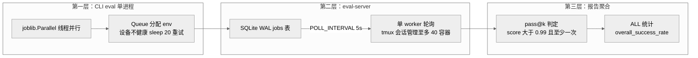

> **提炼自**：Tongyi-MAI mobile-world 评测环境复盘 —— 规模扩张三层渐进：线程并行 → SQLite 队列 + tmux 单 worker → pass@k 报告，而非一步上重型调度器

# 评测编排三层扩张——线程并行→队列+tmux→pass@k 报告（Three-Tier Eval Scaling Orchestration）

## 模式类型

架构模式（评测编排 / 并发扩展 / 批处理管道）

## 成熟度

L1 已验证（1 次验证：2026-08-29 Tongyi-MAI mobile-world 源码学习）

## 适用场景

评测、压测等"独立短任务 × 多环境"批处理要从单机走向规模化：

- 单进程并行已触顶（几十个容器/环境），但尚未需要分布式集群
- 任务相互独立、失败可单独重跑，且需要保留"人能看懂调度器"的可调试性
- 需要统一聚合各任务多轮运行的成功率（pass@k）与总量统计

## 问题背景

评测编排最常见的两种失败：

1. **一步上重型调度器**：任务量刚过百就引入 celery/k8s 全家桶——运维与调试成本压垮评测本身，一个队列参数问题要动用基础设施知识才能排查。
2. **脚本堆叠无上限并发**：shell 循环直接开容器——资源耗尽宿主机卡死，失败任务无迹可循，跑完不知道哪些成功。

根本矛盾：**规模化的工程惯性（"大了就要分布式调度"）与评测场景的真实需求（独立短任务、可复现、可人工排查）不匹配**——多数评测永远到不了需要 celery/k8s 的规模。

## 核心设计

三原则：

1. **三层渐进，每层在上一层触顶时引入**：第一层 CLI eval 单进程内 `joblib.Parallel(backend="threading")` 线程并行 + Queue 分配 env（F-038）；第二层 eval-server 以 SQLite WAL `jobs` 表为队列（F-041）+ 单 worker 以 `POLL_INTERVAL=5` 秒轮询 + tmux 会话管理至多 `MAX_CONTAINERS=40` 容器（F-043）；第三层报告聚合 `generate_pass_k_report` 读 `run_{i}/` 按 pass@k 判定并产出 ALL 统计（F-021/F-022）。不上 celery/k8s。
2. **单 worker 轮询的简单性换可调试性**：大规模评测的"调度器"不是 celery/k8s，而是 tmux 会话（`eval_{job_id}`）+ 5 秒轮询 SQLite 的单 worker——全链路状态落库（jobs 表、uuid id、container_prefix 可预测，F-041），容器上限显式可查（F-043），排队原因肉眼可排查。
3. **判定与发现显式容差、显式边界**：成功阈值是 `score > 0.99` 且至少一次（容浮点误差，F-021）而非 1.0；后端发现显式优先——`aw_urls` 为空才 `discover_backends` 自动发现（F-037）；动作语义对齐（SCROLL 在 /step 分发映射为 swipe 且方向相反，F-034）收敛在服务端分发单点，其前置是 JSONAction 字段校验与方向约定（F-054）。

## 实施要点

| 维度 | 做法 | mobile-world 实例 |
|---|---|---|
| 第一层并发 | 进程内线程并行 + 队列分配环境 | `joblib.Parallel(backend="threading")` + Queue 分配 env（F-038） |
| 单任务主循环 | 生命周期钩子固定顺序 | `get_task_goal` → `agent.initialize` → 循环 predict/execute → `get_task_score` → `tear_down` → `agent.done()`（F-038） |
| 故障重试 | 显式休眠重试而非立即判负 | 设备不健康 `sleep(20)` 后重试（F-038） |
| 第二层队列 | 轻量落库队列而非消息中间件 | SQLite WAL `jobs` 表，`uuid.uuid4().hex[:12]` 生成 id，`container_prefix = f"eval_{job_id}"`（F-041） |
| 第二层执行 | 单 worker 轮询 + tmux 会话 | `POLL_INTERVAL=5`、tmux 会话 `eval_{job_id}`、`MAX_CONTAINERS=40`（F-043） |
| 第三层报告 | 显式容差判定 + 总量统计 | `generate_pass_k_report`：score > 0.99 且至少一次判过（F-021）；ALL 统计 `overall_success_rate` 等字段（F-022） |
| 环境归属 | 显式优先、自动发现兜底 | `aw_urls` 为空时才 `discover_backends`（F-037） |

## 不适用场景与反目标用户

### 不适用场景

- ❌ **任务间存在共享可变状态**：单 worker 串行分发的模型默认任务独立；有依赖关系的任务图应先在上游拆解。
- ❌ **提交速率远超单 worker 吞吐**：5 秒轮询粒度下若任务提交速率极高，队列积压会成为瓶颈——此时才考虑多 worker 或分布式队列。
- ❌ **需要跨机器资源池**：tmux 会话与容器管理绑定单机；跨机器调度属于另一量级问题。

### 反目标用户

- 以"用了 k8s"为架构先进性指标的团队：本模式的调度器就是一个轮询循环加 tmux。
- 追求调度器通用化、支持任意 DAG 依赖的平台建设者：本模式只服务独立短任务。

### 适用边界与前提条件

- 任务独立、失败可单独重跑（任务图依赖应在上游拆解）。
- 跑批前核对容器上限与 Docker 资源（`MAX_CONTAINERS=40`，F-043；`count_running_envs` 上限，F-041）。
- 动作语义对齐（如 SCROLL→swipe 方向相反）已在服务端单点收敛并文档登记（F-034/F-054），编排层不重复实现。
- 团队接受"队列表 + 轮询循环"级别的基础设施复杂度，并为规模升级保留三层路径。

## 反模式

### 反模式1："一步上重型调度器"

单机评测也引入 celery/k8s。后果：运维与调试成本压垮评测本身，排障需要基础设施专家。**正确做法**：三层渐进，规模触顶再升级（线程并行 F-038 → 队列+tmux F-041/F-043 → 报告聚合 F-021/F-022）。

### 反模式2："轮询参数拍脑袋"

POLL_INTERVAL 与容器上限随手写、无文档。后果：过小打爆 SQLite、过大资源闲置，排队原因无从排查。**正确做法**：显式常量并按容器规模校准（`POLL_INTERVAL=5`、`MAX_CONTAINERS=40`，F-043）。

### 反模式3："成功阈值写死 1.0"

score 必须精确等于 1 才算过。后果：浮点误差导致满分任务被判失败。**正确做法**：显式容差阈值——score > 0.99 且至少一次（F-021）。

### 反模式4："语义对齐散落多端"

SCROLL/swipe 等动作语义转换在客户端、编排层、服务端多处各写一份。后果：方向相反（F-034："scroll 的 up/down 与 swipe 相反"）这类对齐细节无人知晓，跨端行为不一致。**正确做法**：语义对齐收敛在服务端分发单点，前置的 JSONAction 字段校验与方向约定显式文档化（F-054）。

### 反模式5："自动发现替代显式配置"

一律依赖 discover_backends 自动抓容器。后果：环境归属混乱，跨任务串扰。**正确做法**：`aw_urls` 显式给出时优先，为空才自动发现（F-037）。

### 反模式6："设备故障立即判负"

环境不健康就直接记任务失败。后果：把基础设施抖动算进模型分数。**正确做法**：显式休眠重试（设备不健康 `sleep(20)` 重试，F-038），并与容器健康探针联动。

## 失败案例

### 案例：按"重型调度器"先验预期 eval-server 架构未果（mobile-world 源码学习，2026-08-29）

**背景**：看到 eval-server 管理至多 40 容器（F-043）时，按"这个规模必然用消息队列/分布式调度"的直觉预期，先检索 celery/k8s/redis 痕迹。

**发现过程**：调度核心是 SQLite WAL `jobs` 表（`uuid.uuid4().hex[:12]` 生成 id、`container_prefix = f"eval_{job_id}"`，F-041）+ `POLL_INTERVAL=5` 的单 worker 轮询 + tmux 会话 `eval_{job_id}`（F-043）。同轮确认两个反直觉细节：成功阈值是 `score > 0.99` 而非 1.0（F-021，容浮点误差）；SCROLL 动作在 `/step` 分发时映射为 swipe 且方向相反（F-034）——语义对齐藏在服务端而非调度层。"40 容器"的规模数字没有导向重型调度器，反而导向了"队列表 + 轮询循环"的极简实现。

**教训**：规模数字不构成重型调度器的充分理由，调度架构的判断应从"实际的队列表与轮询循环"出发；判定阈值与动作语义这类细节必须从源码常量与分发代码核实，不能凭惯例（1.0 分、"scroll 即滚动"）推定。

## 早期预警信号

| 预警信号 | 可能问题 | 建议行动 |
|---|---|---|
| 评测规模上升且多个 cron 脚本互相踩踏 | 第一层单进程并行已到顶 | 升级第二层：SQLite 队列 + tmux 单 worker（F-041/F-043） |
| 排队任务无迹可循、说不清为何卡住 | 上限/轮询参数不可见 | 核对 `MAX_CONTAINERS`/`POLL_INTERVAL`（F-043），用 jobs 表查询任务状态（F-041） |
| 满分任务被判失败 | 阈值无容差（反模式3） | 改用显式容差阈值 score > 0.99（F-021） |
| 同一动作在不同端方向不一致 | 语义对齐散落多端（反模式4） | 对齐逻辑收敛服务端单点并登记方向约定（F-034/F-054） |
| 容器开满后宿主机卡死 | 并发超资源承载 | 跑批前核对 `MAX_CONTAINERS=40` 与 Docker 资源（F-043） |
| 自动发现抓错容器、跨任务串扰 | 过度依赖自动发现（反模式5） | `aw_urls` 显式优先，为空才 `discover_backends`（F-037） |
| 基础设施抖动被算进模型分数 | 设备故障立即判负（反模式6） | 休眠重试（`sleep(20)`，F-038）并与容器健康探针联动 |

## 实际案例

Tongyi-MAI mobile-world 评测编排（2026-08-29 源码学习）：

| 层 | 职责 | 实例 |
|---|---|---|
| 第一层 CLI eval | 单进程线程并行驱动多容器 | `joblib.Parallel(backend="threading")` + Queue 分配 env、设备不健康 `sleep(20)` 重试（F-038） |
| 第二层 eval-server | 落库队列 + 轮询 worker + 会话管理 | SQLite WAL `jobs` 表（F-041）、`MAX_CONTAINERS=40`/`POLL_INTERVAL=5`/tmux `eval_{job_id}`（F-043） |
| 第三层 报告 | 聚合判定与总量统计 | `generate_pass_k_report` score > 0.99 判过（F-021）、ALL 统计 `overall_success_rate`（F-022） |
| 横切：环境归属 | 显式优先、发现兜底 | `aw_urls` 为空时 `discover_backends`（F-037） |
| 横切：语义对齐 | 服务端单点收敛 | `/step` 分发 SCROLL→swipe 方向映射（F-034），前置 JSONAction 校验约定（F-054） |

## 迁移验证

- **可迁移场景**：压测与爬虫调度（进程内线程 → SQLite 队列 → 汇总报告）；CI 批量任务编排（矩阵任务排队 + 结果聚合）；数据回填/批处理规模化（单机并行 → 落库队列 → 报表）。
- **先例关联**：与 [five-stage-batch-pipeline.md](./five-stage-batch-pipeline.md) 同源——单任务主循环（F-038）即批处理管道的单元素投影，本模式在其上加并发与聚合两层；与 [multi-agent-parallel-execution.md](./multi-agent-parallel-execution.md) 互补——后者定并发形态，本模式定规模扩张的分层路径。

## 与其他模式的关系

| 关系模式 | 关系类型 | 说明 |
|---|---|---|
| [five-stage-batch-pipeline.md](./five-stage-batch-pipeline.md) | 同源互补 | 该模式定义单任务批处理阶段；本模式叠加"并发 → 队列 → 报告"的规模扩张层（F-038 主循环是其单元素） |
| [multi-agent-parallel-execution.md](./multi-agent-parallel-execution.md) | 实例特化 | 第一层的 joblib 线程并行 + Queue 分配 env（F-038）是并行执行在容器评测场景的实例 |
| [incremental-regression-verification.md](./incremental-regression-verification.md) | 验证配套 | 第三层 pass@k + ALL 统计（F-021/F-022）为规模化评测提供回归验证的聚合视图 |
| [container-healthcheck-minimal-probe.md](../code-patterns/container-healthcheck-minimal-probe.md) | 依赖协同 | "设备不健康 sleep(20) 重试"（F-038）依赖容器健康状态作为调度信号，健康探针取最小化实现 |

<!-- changelog -->
- 2026-08-29 | pattern | 初始创建：从 Tongyi-MAI mobile-world 源码学习（洞察4）萃取；证据链 F-021/F-022/F-034/F-037/F-038/F-041/F-043/F-054
