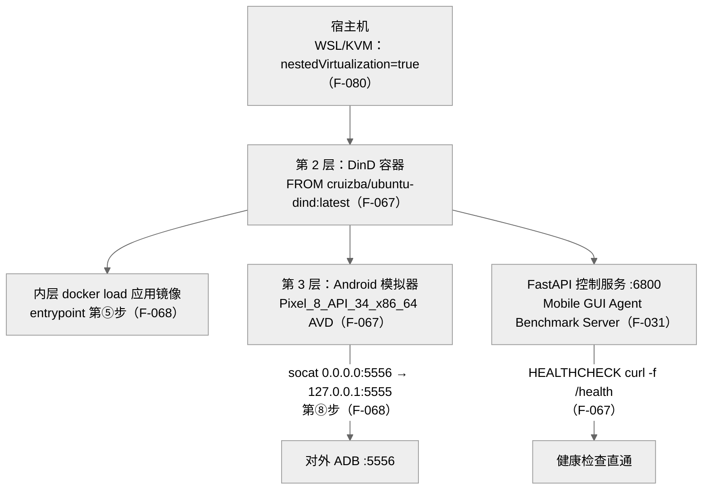

> **提炼自**：Tongyi-MAI mobile-world 环境工程复盘 —— 把"OS+SDK+AVD+应用+控制服务"整体家电化为单镜像，三层虚拟化换一次拉起

# 三层嵌套虚拟化环境家电（Triple-Nested Virtualization Appliance）

## 模式类型

架构模式（容器化环境工程 / 单镜像家电化 / 评测基础设施）

## 成熟度

L1 已验证（1 次验证：2026-08-29 Tongyi-MAI mobile-world Dockerfile 与 entrypoint 源码学习，基础镜像、十步启动序列、端口面与健康检查逐项核对）

## 适用场景

评测/演示环境由多层组件构成、需要原子分发：

- 环境由"操作系统 + SDK + 模拟器 + 一组应用 + 控制服务"叠加而成，手工搭建步骤超过一屏
- 环境要在不同宿主（Windows/WSL、Linux 服务器）间可复制分发，接受"一次拉起、牺牲部分性能"的交换
- 环境内多个端口型服务需要按段规划对外暴露（ADB、Web 控制台、健康检查）

## 问题背景

环境工程最常见的两种失败：

1. **环境文档化而非镜像化**：把搭建步骤写成 README（装 JDK、装 SDK、建 AVD、起服务……），每个使用者现场踩坑，版本漂移导致"我这能跑"。
2. **拆成多个容器自由组装**：模拟器、控制服务、后端应用各自一个容器，网络与依赖关系交给使用者编排——组合爆炸，环境状态不再原子。

根本矛盾：**环境完整性要求组件捆绑原子分发，而容器化直觉是"一容器一进程"**——当"进程"本身是一个带完整 OS 行为的模拟器栈时，单容器单进程教条失效。

## 核心设计

三原则：

1. **整体家电化（appliance）**：OS 工具链（openjdk-17/scrcpy/xvfb/novnc）、Android SDK 34 + 指定 AVD（`Pixel_8_API_34_x86_64`）、内层 `docker load` 的应用镜像、FastAPI 控制服务全部压进一个镜像（F-067/F-068）——使用者 `docker run` 即得完整环境，而非按文档组装；三层虚拟化的性能代价换取环境一次拉起与可复制性。
2. **启动序列编号化**：entrypoint 十步序列固定顺序执行——② 禁用 IPv6（注释引用 Google issue 215231636，否则 SIM 卡不可用）、⑤ `docker load` 应用镜像、⑦ 启动模拟器、⑧ socat 端口中继、⑨ `uv run mobile-world server --port 6800`（F-068）；编号即文档，排障可按步定位。
3. **端到端口分段暴露**：内部服务不全部裸露——ADB 经 socat 从 `127.0.0.1:5555` 中继到 `0.0.0.0:5556`，健康检查直通 `/health`（F-067），服务端口按四组起始端口规划（6800/7860/5800/5556，F-024）。

## 实施要点

| 维度 | 做法 | mobile-world 实例 |
|---|---|---|
| 基础镜像 | 选 DinD 基础镜像承载"容器里再跑 Docker" | `FROM cruizba/ubuntu-dind:latest`（F-067） |
| 工具链固化 | 图形/Java/投屏工具进镜像而非进文档 | 安装 openjdk-17/scrcpy/xvfb/novnc（F-067） |
| 模拟器版本 | SDK 与 AVD 名称显式固定 | Android SDK 34 + `AVD_NAME=Pixel_8_API_34_x86_64`（F-067） |
| 启动序列 | 十步编号、顺序固定、注释留痕 | ② 禁用 IPv6（Google issue 215231636）→ ⑤ `docker load` → ⑦ 启动模拟器 → ⑧ socat 中继 → ⑨ 启动控制服务（F-068） |
| 端口规划 | 服务组各占独立起始端口段 | env run 四组起始端口 6800/7860/5800/5556（F-024） |
| 对外暴露 | 中继隔离内部回环地址 | socat `0.0.0.0:5556→127.0.0.1:5555`（F-068） |
| 健康检查 | 直通最内层控制服务的健康端点 | `HEALTHCHECK ... curl -f http://localhost:6800/health`（F-067） |
| 控制服务 | 单一 FastAPI 服务作环境门面 | FastAPI `title="Mobile GUI Agent Benchmark Server"`（F-031） |
| 宿主前置条件 | 嵌套虚拟化要求写进 quickstart | WSL/KVM 配置 `nestedVirtualization=true`（F-080） |
| 内核兼容 | dockerd 失败自动探测与回退 | 内核 6.x 缺 iptable_nat 致 dockerd 静默失败；v1.2 默认 iptables-nft 并自动回退 legacy + `docker info` 30 秒验证（F-071） |

## 不适用场景与反目标用户

### 不适用场景

- ❌ **性能敏感的持续压测**：三层虚拟化（宿主 → DinD → 模拟器）有实打实的性能代价，长期高频压测应在物理机/原生 KVM 上直跑模拟器。
- ❌ **GPU 直通型图形负载**：模拟器以软件渲染 + xvfb 虚拟显示为主（noVNC 仅是可选项），需要 GPU 加速渲染的场景应另行设计。
- ❌ **组件需要独立扩缩容**：若模拟器/控制服务/后端本就要按不同弹性独立伸缩，家电化的原子性反而是枷锁，应拆分编排。
- ❌ **宿主不支持嵌套虚拟化**：无 KVM/nestedVirtualization 能力的环境（部分共享宿主、某些 CI）根本拉不起内层模拟器。

### 反目标用户

- 追求"每容器恰好一进程"的教条者：本模式的核心就是让单容器承载一整个环境栈。
- 把环境搭建视为一次性成本、从不复用镜像的团队：家电化的收益来自复用与分发。

### 适用边界与前提条件

- 宿主必须支持嵌套虚拟化（Windows 宿主需 WSL/KVM 配置 `nestedVirtualization=true`，F-080）。
- 内层 `docker load` 的应用镜像需在构建期或 entrypoint 期可用（第⑤步，F-068）。
- noVNC/VNC 仅是可选项，不是环境可用性的依赖。
- 内核 6.x 宿主需确认 iptable_nat 可用，或依赖 v1.2 的自动回退与 `docker info` 30 秒验证（F-071）。

## 反模式

### 反模式1："环境步骤写文档、现场手工搭"

README 十步搭建，每使用者现场执行。后果：版本漂移、重复踩坑、环境不可复制。**正确做法**：固化进镜像与 entrypoint，文档只讲镜像内既定序列（F-067/F-068）。

### 反模式2："服务启动顺序随缘"

不固定启动顺序，各组件并发乱起。后果：ADB 未就绪控制服务先起、依赖竞态导致偶发失败。**正确做法**：编号序列固定顺序（② → ⑤ → ⑦ → ⑧ → ⑨，F-068）。

### 反模式3："内部服务全部 0.0.0.0 裸暴露"

ADB/后端直接绑通配地址。后果：攻击面扩大 + 端口冲突难排查。**正确做法**：socat 中继隔离内部回环（F-068），端口按组规划（F-024）。

### 反模式4："禁用 IPv6 这类'迷信配置'随手删"

review 时看到 entrypoint 关 IPv6 以为是历史包袱。后果：SIM 卡不可用、模拟器网络异常且极难定位。**正确做法**：保留并留注释溯源（Google issue 215231636，F-068 ②）。

### 反模式5："健康检查探测深层业务接口"

HEALTHCHECK 去跑一次真实交互。后果：检查成本高、慢启动被误杀。**正确做法**：直通最内层控制服务的轻量 `/health`（F-067）。

### 反模式6："容器起不来只盯应用日志"

dockerd 静默失败时反复重启应用。后果：内核 6.x 缺 iptable_nat 时应用层永远等不到环境。**正确做法**：按 iptables 探测 + `docker info` 30 秒验证清单排查（F-071 v1.2）。

## 失败案例

### 案例："模拟器需要宿主级图形与 KVM"的直觉被 DinD 方案推翻（mobile-world 源码学习，2026-08-29）

**背景**：学习 MobileWorld 环境镜像时，初始预期是 Android 模拟器必须直接跑在具备图形栈与宿主 KVM 的机器上，容器内最多做无头单测。

**发现过程**：Dockerfile 显示 `FROM cruizba/ubuntu-dind:latest`，镜像内安装 openjdk-17/scrcpy/xvfb/novnc、固定 Android SDK 34 与 `Pixel_8_API_34_x86_64` AVD（F-067）；entrypoint 十步序列中第⑤步 `docker load` 应用镜像、第⑦步在 DinD 内启动模拟器、第⑧步用 socat 把 `0.0.0.0:5556` 中继到 `127.0.0.1:5555`（F-068）——形成"宿主 → DinD 容器 → Android 模拟器"的三层虚拟化，VNC 仅是可选项。同轮还发现两个静默失败点：entrypoint ② 特意禁用 IPv6 否则 SIM 卡不可用（F-068，注释引用 Google issue 215231636）；内核 6.x 会因缺 iptable_nat 导致 dockerd 静默失败，v1.2 以默认 iptables-nft + 自动回退 legacy + `docker info` 30 秒验证兜底（F-071）。

**教训**：直觉上"不可能容器化"的重型环境，正确的工程动作是逐层确认依赖（图形 → xvfb/novnc 可选化、KVM → 宿主前置条件显式化，F-080）而非放弃镜像化；静默失败必须配套自动探测与验证清单（F-071），否则排障成本指数放大。

## 早期预警信号

| 预警信号 | 可能问题 | 建议行动 |
|---|---|---|
| `docker info` 30 秒无响应或 dockerd 无日志退出 | 内核 6.x 缺 iptable_nat | 按 v1.2 清单探测 iptables 并回退 legacy（F-071） |
| 模拟器内 SIM 卡/蜂窝网络不可用 | IPv6 未禁用 | 检查 entrypoint ② 是否保留（F-068） |
| 容器内 `docker load` 失败 | 应用镜像未随构建期注入 | 核对第⑤步镜像来源与挂载（F-068） |
| 宿主拉起容器但模拟器始终黑屏 | 宿主缺嵌套虚拟化 | 检查 WSL/KVM `nestedVirtualization=true`（F-080） |
| ADB 从宿主连不上 5555 | 中继方向/地址配错 | 确认 socat `0.0.0.0:5556→127.0.0.1:5555`（F-068） |
| 健康检查频繁误报不健康 | 探测打到未就绪的深层服务 | 健康检查只打 `/health`（F-067），启动竞态回到 entrypoint 顺序排查 |
| 多环境并行时端口互踩 | 端口段未分组规划 | 按 6800/7860/5800/5556 四组起始端口分配（F-024） |

## 实际案例

Tongyi-MAI mobile-world 单镜像环境（2026-08-29 源码学习）：

| 层/面 | 内容 | 证据 |
|---|---|---|
| 第 1 层：宿主 | Windows/WSL 开嵌套虚拟化 | `nestedVirtualization=true`（F-080） |
| 第 2 层：DinD 容器 | ubuntu-dind 基座 + openjdk-17/scrcpy/xvfb/novnc + SDK 34 + AVD + HEALTHCHECK | F-067 |
| 第 3 层：内层栈 | `docker load` 应用镜像 + Android 模拟器 + FastAPI 控制服务（F-031） | F-068 |
| 端口面 | socat ADB 中继 5556、控制服务 6800、四组起始端口 6800/7860/5800/5556 | F-068/F-024 |
| 兜底 | iptables-nft 默认 + legacy 回退 + `docker info` 30 秒验证 | F-071 |

## 迁移验证

- **可迁移场景**：浏览器自动化整体环境（OS + 浏览器 + WebDriver + 控制服务）单镜像家电化；嵌入式交叉编译环境（OS + 工具链 + QEMU 模拟器 + 烧录服务）；ROS 机器人仿真环境（OS + ROS + Gazebo + 指令网关）。
- **先例关联**：与 [container-devtool-seven-layer-stack.md](./container-devtool-seven-layer-stack.md) 同属容器化环境工程谱系——该模式分层组织容器开发工具栈，本模式进一步把运行时模拟器栈也纳入单镜像；[environment-diversity-design.md](./environment-diversity-design.md) 提供多环境差异化设计总纲，本模式是其中"单环境极致原子化"的极端分支。

## 与其他模式的关系

| 关系模式 | 关系类型 | 说明 |
|---|---|---|
| [container-devtool-seven-layer-stack.md](./container-devtool-seven-layer-stack.md) | 同谱系 | 该模式分层组织容器化开发工具栈；本模式把"OS+SDK+模拟器+服务"压成单镜像，是分层容器化向家电化极端的延伸 |
| [environment-diversity-design.md](./environment-diversity-design.md) | 总纲与特例 | 该模式讨论多环境差异化设计；本模式以牺牲性能换取单一环境的最大可复制性 |
| [docker-podman-cross-platform-container.md](../code-patterns/docker-podman-cross-platform-container.md) | 底层机制 | 跨平台容器运行时保证家电镜像在 Windows/Linux 宿主上一致拉起 |
| [container-healthcheck-minimal-probe.md](../code-patterns/container-healthcheck-minimal-probe.md) | 组件规范 | 三层栈的健康检查遵循最小探测原则——HEALTHCHECK 只打内层服务 `/health`（F-067） |

<!-- changelog -->
- 2026-08-29 | pattern | 初始创建：从 Tongyi-MAI mobile-world 源码学习（洞察1）萃取；证据链 F-024/F-031/F-067/F-068/F-071/F-080
