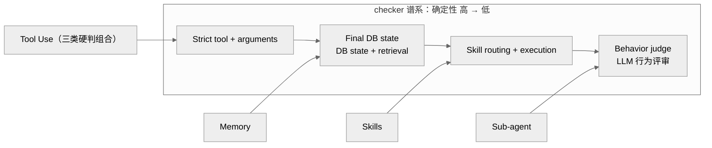

> **提炼自**：Tongyi-MAI mobilepa-bench 判分设计复盘 —— 判分可信度来自任务级预分配的固定验证策略，checker 从精确参数比对到 LLM 行为评审构成谱系

# 固定验证策略与 checker 谱系（Fixed Verification Policy & Checker Spectrum）

## 模式类型

架构模式（评测判分设计 / 验证策略分派 / 分数可解释性）

## 成熟度

L1 已验证（1 次验证：2026-08-29 Tongyi-MAI mobilepa-bench 源码学习，checker 字面量与代表案例核验）

## 适用场景

评测/验收系统需要给异构任务判分，且分数要可解释：

- 基准评测：任务成功定义横跨工具调用、状态变更、检索命中、技能路由、协作行为
- 自动化流水线验收层：不同阶段需要不同强度的检查器组合
- 榜单/报告：需要向读者说明"每个分数用什么方式判出来"

## 问题背景

判分设计最常见的两种失败：

1. **统一 LLM 评审**：所有任务交给一个 judge 自由评——精确工具参数比对被软判，方差大且可被操纵，确定性优势归零。
2. **统一硬断言**：所有任务写死断言——"valid collaboration pattern"这类成功定义无法枚举，行为类任务误判或全错。

根本矛盾：**判分需要确定性，而任务语义从"可精确断言"到"只能行为评审"连续分布**——单一 checker 无法同时覆盖两端。

## 核心设计

四原则：

1. **验证策略任务级预分配**：每个任务绑定固定验证策略（fixed verification policy），判分不是事后自由评审。
2. **成功定义设计期枚举**："成功"可要求 exact tool call、target state transition、prescribed action order 或 valid collaboration pattern（F-007）——先有成功形态清单，才有 checker 档位选择。
3. **维度-checker 映射是设计决策**：Tool Use 三类硬判组合、Memory 用 DB state 组合、Skills 全部 Skill routing + execution、Sub-agent 全部 Behavior judge（F-021）——映射可以反直觉，但必须显式化。
4. **分数可解释的前提是先声明 checker 类型**：Behavior judge 类分数的方差属性与确定性 checker 不同；replay demo 只开放受限 policy（tool_acc = Exact tool + arguments、task_db_acc = Final environment state）并声明 hidden 任务与 ground truth 保持私密（F-023）。

## 实施要点

| 维度 | 做法 | mobilepa-bench 实例 |
|---|---|---|
| 成功定义前置 | 设计期枚举成功形态 | exact tool call / target state transition / prescribed action order / valid collaboration pattern（F-007） |
| 策略预分配 | 每任务绑定固定验证策略，不做统一 LLM 评审 | 站点案例暴露六类 checker 字面量（F-021） |
| 谱系分档 | 按确定性强度从硬判排到软判 | Strict tool + arguments / Final DB state / DB state + retrieval / Skill routing + execution / Behavior judge（F-021） |
| 维度映射 | 维度与 checker 的映射显式设计并文档化 | Tool Use 三类组合 · Memory 用 DB state 组合 · Skills 全部 Skill routing + execution · Sub-agent 全部 Behavior judge（F-021） |
| 演示与隔离 | 只开放受限 policy 演示并声明私密 | replay demo 两场景 tool_acc / task_db_acc，页脚注明 "hidden evaluation tasks and ground truth remain private."（F-023） |
| 案例挂接 | 对照表逐条挂代表案例 | BTU-204 ordered execution · BTU-622 conflict intent（模型反问用户）· MEM-0043 memory update（F-022） |

## 不适用场景与反目标用户

### 不适用场景

- ❌ **任务全部可精确断言**：纯函数式输出用单一断言框架即可，谱系是过度设计。
- ❌ **任务全部开放式生成且无状态可查**：只能行为/人工评审，谱系退化为单档，纪律无处附着。
- ❌ **判分策略需要运行时自适应**：与"任务级预分配、固定不变"直接冲突。
- ❌ **无法承受 LLM 评审成本**：Behavior judge 档位不可用，软判端缺失。

### 反目标用户

- 追求"一个 judge 打所有分"的极简主义者：本模式的价值恰在分档异构。
- 把 checker 映射当实现细节、随手改判分逻辑的团队：映射是设计决策，改动须过文档。

### 适用边界与前提条件

- 前提：任务成功定义可在设计期枚举或分档（F-007 的四类成功形态即档位清单）。
- 前提：hidden 任务与判分凭据可隔离托管，checker 字面量不外泄（F-023 的页脚声明即边界实践）。
- 边界：本模式要求接受软判档位的方差属性并在解读时声明；无法隔离 ground truth 或无法承受评审成本时，谱系只能收缩到硬判端。

## 反模式

### 反模式1："一个 judge 打所有分"

统一 LLM 评审覆盖全部任务。后果：精确工具参数比对被软判，方差与可操纵性上升，硬任务失去确定性优势。**正确做法**：任务级预分配固定验证策略，硬任务用 Strict tool + arguments（F-021）。

### 反模式2："全硬断言覆盖行为任务"

所有判分写死断言。后果：valid collaboration pattern 无法枚举，协作类任务误判或全部判错。**正确做法**：软档交 Behavior judge 承接（F-007 / F-021）。

### 反模式3："按状态化直觉分配 checker"

认为"越有状态越用数据库比对"。后果：忽视 Sub-agent 全软判、Tool Use 全硬判的实际映射，判分设计与任务语义错位。**正确做法**：维度-checker 映射按任务语义显式设计并文档化（F-021）。

### 反模式4："分数不带 checker 标签"

榜单只给数字不声明判分方式。后果：Behavior judge 分数被当确定性分数比较，方差差异被掩盖。**正确做法**：解读分数先问"该维度用什么 checker"，并声明方差属性差异（洞察3 行动）。

### 反模式5："把动作多当做得好"

默认"执行更多工具调用 = 更优"。后果：conflict intent 类任务中强行执行反而判错——BTU-622 的最优行为是识别冲突后反问用户。**正确做法**：判分按任务语义设计，代表案例挂接说明（F-022）。

### 反模式6："演示页泄漏判分全貌"

replay demo 暴露全量策略与判分逻辑。后果：hidden test 可被针对性拟合，保密边界失守。**正确做法**：只开放受限 policy（tool_acc / task_db_acc 两场景）并声明 hidden 任务与 ground truth 保持私密（F-023）。

## 失败案例

### 案例：按"状态化程度选 checker"直觉预期维度映射，被六类字面量推翻（mobilepa-bench 源码学习，2026-08-29）

**背景**：初学判分设计时按直觉预期"越有状态的维度越用数据库状态比对、越需要可信的维度越要硬判"，据此推测维度-checker 映射。

**发现过程**：站点案例暴露六类 checker 字面量（F-021），实际映射恰与直觉相反——Sub-agent 维度统一交由 Behavior judge（LLM 行为评审），Tool Use 反而最"硬"（Strict tool + arguments）；成功定义还包括 prescribed action order 与 valid collaboration pattern（F-007）；代表案例 BTU-622 显示模型的最优行为是识别冲突后反问用户而非强行执行（F-022）；replay demo 只开放 tool_acc（Exact tool + arguments）与 task_db_acc（Final environment state）两场景，页脚声明 "hidden evaluation tasks and ground truth remain private."（F-023）。

**教训**：checker 谱系的检索与解读应从"维度-策略映射实况"出发而非从"状态化直觉"出发；"多执行动作"不等于更优——判分语义（如 conflict intent）决定最优行为形态，解读分数前必须先问该维度用什么 checker。

## 早期预警信号

| 预警信号 | 可能问题 | 建议行动 |
|---|---|---|
| 判分代码里按任务类型 if-else 现场选 checker | 事后自由评审苗头 | 回到任务级预分配策略表 |
| 同一维度不同批次的 checker 口径不一致 | 判分漂移、跨批不可比 | 固定策略并随版本登记 |
| Behavior judge 维度分数被当确定性分数宣传 | 方差属性未声明 | 文档注明 checker 类型与方差差异 |
| 模型"多执行动作"被判错且无法解释 | 成功定义未前置枚举 | 公开成功形态档位并挂接代表案例 |
| 演示页暴露全量判分逻辑 | hidden test 可被拟合 | 只开放受限 policy 并声明私密 |
| 新增维度时未指定 checker 档位 | 谱系缺口 | 先选档位再入库任务 |

## 实际案例

Tongyi-MAI MobilePA-Bench 判分体系（2026-08-29 源码学习）：

| 维度 | 实况 |
|---|---|
| 成功定义 | exact tool call / target state transition / prescribed action order / valid collaboration pattern（F-007） |
| checker 谱系 | Strict tool + arguments / Behavior judge / Final DB state / DB state + retrieval / Skill routing + execution 等六类字面量（F-021） |
| 维度映射 | Tool Use 三类组合 · Memory 用 DB state 组合 · Skills 全部 Skill routing + execution · Sub-agent 全部 Behavior judge（F-021） |
| 演示 policy | tool_acc（Exact tool + arguments）与 task_db_acc（Final environment state）；页脚声明 hidden 任务与 ground truth 保持私密（F-023） |
| 代表案例 | BTU-204 ordered execution · BTU-622 conflict intent（模型反问用户）· MEM-0043 memory update（F-022） |

## 迁移验证

- **可迁移场景**：CI 流水线分级验收（单测/契约测试/人工评审谱系）；数据质量门禁（schema 校验 → 统计剖析 → 抽样人工复核）；RAG 系统评测（检索命中硬判 + 生成质量软判）。
- **先例关联**：与 [full-process-defense-depth.md](./full-process-defense-depth.md) 同源——checker 谱系即判分层的纵深防御，硬判在前挡确定性错误、软判在后评行为合理性；与 [verifiable-knowledge-claim.md](./verifiable-knowledge-claim.md) 互补——分数要成为可验证断言，前提是验证策略先被声明。

## 与其他模式的关系

| 关系模式 | 关系类型 | 说明 |
|---|---|---|
| [five-stage-batch-pipeline.md](./five-stage-batch-pipeline.md) | 阶段衔接 | 五阶段批处理管道的验收阶段可落为本模式的固定验证策略层，checker 档位按阶段任务语义分派 |
| [full-process-defense-depth.md](./full-process-defense-depth.md) | 同源思想 | checker 谱系是纵深防御在判分层的投影：硬判在前、软判在后，各档覆盖不同错误形态 |
| [verifiable-knowledge-claim.md](./verifiable-knowledge-claim.md) | 互补 | 分数作为可验证断言，必须先声明验证策略（checker 类型）与口径才可核查 |
| [weighted-multidimensional-composite-score.md](./weighted-multidimensional-composite-score.md) | 上下游 | 综合分解读纪律要求先问各维 checker 类型——Behavior judge 维度分数的方差属性与确定性 checker 不同 |

<!-- changelog -->
- 2026-08-29 | pattern | 初始创建：从 Tongyi-MAI mobilepa-bench 源码学习（洞察3）萃取；证据链 F-007/F-021/F-022/F-023，checker 字面量与代表案例核验通过