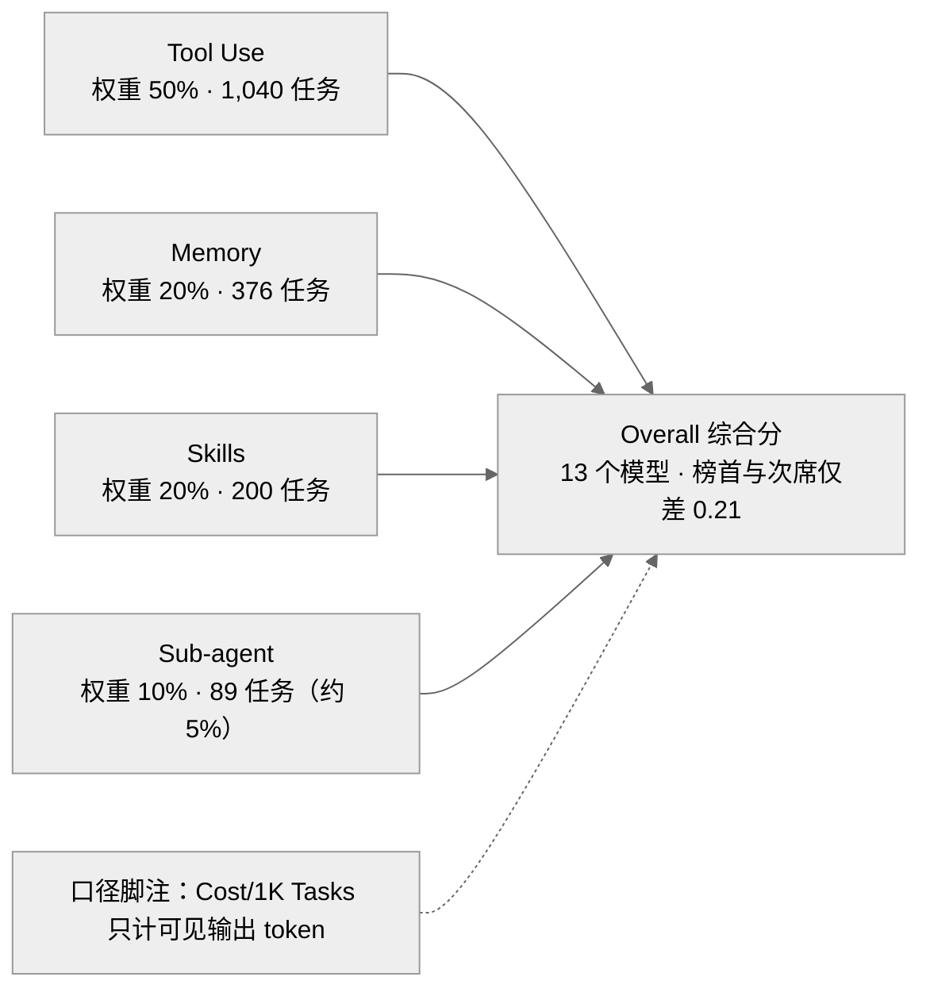

> **提炼自**：Tongyi-MAI mobilepa-bench 榜单设计复盘 —— 综合分是"权重声明"而非能力全景，可解读性 = 权重公式 + 任务分布 + 统计口径脚注

# 多维加权综合分与分维度解读纪律（Weighted Multidimensional Composite Score）

## 模式类型

架构模式（基准评分设计 / 榜单可解释性 / 统计口径治理）

## 成熟度

L1 已验证（1 次验证：2026-08-29 Tongyi-MAI mobilepa-bench 源码学习，leaderboard 数据文件与页面文案双重核验）

## 适用场景

多维能力需要压成一个可排序的综合分，且榜单会被二次传播：

- 模型/智能体评测榜单：按能力域分维度组织任务并加权合成总分
- 产品/工程评分卡：多指标加权发布，统计口径需随数据传播
- 数据文件与展示页分离的静态榜单：口径声明需要双处冗余

## 问题背景

多维综合分发布最常见的两种失败：

1. **只发单一总分**：榜单仅 Overall 一列——Memory/Skills 等维度的模型分化被抹平，读者把权重倾斜误当能力全景。
2. **口径藏在论文里**：权重公式与统计口径只写在论文 PDF，页面与数据文件不自带——二次传播时公式丢失，名次被断章取义。

根本矛盾：**排序必须把多维压成一个标量，而标量一旦离开权重与口径声明就会被过度解读**。

## 核心设计

四原则：

1. **权重公式随数据发布**：代码注释与页面副标题双处声明（F-011 / F-013），数据文件头自述版本与来源（v1.5 / paper_v5 Table 1，F-011）——口径与数据不可分离。
2. **任务分布与权重同构公开**：四维任务量 Tool Use 1,040 / Memory 376 / Skills 200 / Sub-agent 89，合计 1,705（F-018），让读者可自查权重倾斜（Sub-agent 仅约 5% 任务量）。
3. **统计口径脚注随指标走**：Cost/1K Tasks 只计可见输出 token（F-014），跨模型成本比较必须携带该脚注。
4. **解读纪律**：按维度拆列并注明权重公式与版本（v1.5）；引用名次时同时给出四维分；首位差 0.21 属噪声级（F-012）；N=15 Candidate Recall / T=15 Max Steps 是理解任务难度的关键参数（洞察2）。

## 实施要点

| 维度 | 做法 | mobilepa-bench 实例 |
|---|---|---|
| 维度组织 | 按能力域划维度且定义可锚点回查 | Tool Use / Memory / Skills / Sub-agent 四维定义表，每行附站点锚点（F-005） |
| 权重声明 | 数据文件与页面双处声明公式 | leaderboard_data.js 头注释 `Overall = 0.5*Tool + 0.2*Memory + 0.2*Skills + 0.1*SubAgent`（F-011）；页面副标题 `Overall = 50% Tool Use + 20% Memory + 20% Skills + 10% Sub-agent.`（F-013） |
| 版本溯源 | 数据文件头自述版本与来源 | "MobilePA-Bench v1.5 leaderboard data (from paper_v5 Table 1...)"（F-011） |
| 任务分布 | 任务量随维度公开 | 1,040 / 376 / 200 / 89，合计 1,705（F-018） |
| 口径脚注 | 成本指标必须携带统计口径 | "Cost/1K Tasks is estimated from visible output tokens only"（F-014） |
| 差距噪声 | 微小分差不作决定性结论 | 榜首 Claude-Opus-5 75.52 与次席 Claude-Fable-5 75.31 仅差 0.21（F-012） |

## 不适用场景与反目标用户

### 不适用场景

- ❌ **维度间完全同质**：单指标足以刻画，引入权重与拆列只增加解读负担。
- ❌ **维度划分频繁变动**：跨版本不可比，分维度数据的历史价值归零。
- ❌ **口径无法公开**：权重或统计口径涉密，声明纪律无从谈起——先解决口径透明，再谈综合分发布。

### 反目标用户

- 只搬运名次不搬运口径的排行榜转发者：本模式的价值恰在口径随行。
- 追求"一个数字定胜负"的传播者：噪声级差距在本模式下必须被显式声明。

### 适用边界与前提条件

- 前提：维度定义稳定且可锚点化公开（F-005 的站点锚点即此实践）。
- 前提：权重是明确的设计决策，团队愿意公开任务分布接受"权重即价值观"的检视。
- 边界：本模式治理综合分的可解读性，不解决维度划分本身的合理性；维度同质时单指标更诚实。

## 反模式

### 反模式1："只发总分不发维度分"

榜单仅 Overall 一列。后果：Memory/Skills 维度的模型分化被抹平，权重倾斜被误读为能力全景。**正确做法**：按维度拆列（F-005），引用名次同时给出四维分。

### 反模式2："权重公式只活在论文里"

页面与数据文件不注明公式。后果：二次传播中口径丢失，名次被断章取义。**正确做法**：代码注释与页面副标题双处声明（F-011 / F-013）。

### 反模式3："成本指标裸奔"

Cost/1K Tasks 不带口径脚注。后果：input / cached / hidden reasoning token 未计入，跨模型成本比较失真。**正确做法**：随指标附 "estimated from visible output tokens only" 类脚注（F-014）。

### 反模式4："把 0.21 的名次差当结论"

首席与次席的微小分差被写成实质优劣。后果：噪声被放大为选型依据。**正确做法**：声明噪声级差距，结论性引用附四维分与口径（F-012）。

### 反模式5："权重定了就不再解释"

不公开任务分布。后果：名为 planner agents、实则 Sub-agent 仅 10% 权重 / 89 任务（约 5%）的错位无法被读者自查，误读放大。**正确做法**：任务分布与权重同构公开（F-018），版本随文件自述（v1.5，F-011）。

## 失败案例

### 案例：按基准名义预期协作维度主导，被权重公式与任务分布纠正（mobilepa-bench 源码学习，2026-08-29）

**背景**：基准名为 MobilePA-Bench（planner agents），按名义预期"规划与多智能体协作"应是评分主角，初读榜单时直接关注 Overall 排序。

**发现过程**：leaderboard_data.js 头注释给出权重公式 `Overall = 0.5*Tool + 0.2*Memory + 0.2*Skills + 0.1*SubAgent`（F-011），页面副标题同式复述（F-013）；任务分布 Tool Use 1,040 / Memory 376 / Skills 200 / Sub-agent 89（F-018）——Sub-agent 仅约 5% 任务量与 10% 权重；同轮还确认榜首 Claude-Opus-5 75.52 与次席 Claude-Fable-5 75.31 仅差 0.21（F-012）、Cost 口径 "estimated from visible output tokens only"（F-014）。

**教训**：综合分是权重声明而非能力全景；只看 Overall 会抹平 Memory/Skills 维度的分化，跨模型成本比较不带口径脚注必然失真——解读三件套（权重公式 + 任务分布 + 统计口径脚注）缺一不可。

## 早期预警信号

| 预警信号 | 可能问题 | 建议行动 |
|---|---|---|
| 榜单页面只有总分一列 | 维度分化被抹平 | 增加四维拆列，引用名次附维度分 |
| 权重公式只在论文 PDF 可见 | 二次传播口径丢失 | 数据文件注释 + 页面副标题双处声明 |
| 成本列无统计口径脚注 | 跨模型比较失真 | 附 visible-output-only 类脚注 |
| 榜首与次席位差 < 1 被写成结论 | 噪声级差距被放大 | 声明噪声属性，引用时给四维分 |
| 版本升级未随数据标注 | 跨版本名次误比 | 数据文件头自述版本与来源（v1.5 / paper_v5 Table 1） |
| 各维任务量不公开 | 权重倾斜无法自查 | 公布各维任务量与合计（1,705） |

## 实际案例

Tongyi-MAI MobilePA-Bench v1.5 榜单（2026-08-29 源码学习）：

| 维度 | 实况 |
|---|---|
| 维度组织 | Tool Use / Memory / Skills / Sub-agent 四维定义表，每行附站点锚点（F-005） |
| 权重公式 | Overall = 0.5*Tool + 0.2*Memory + 0.2*Skills + 0.1*SubAgent（F-011 代码注释；F-013 页面副标题同式） |
| 任务分布 | 1,040 / 376 / 200 / 89，合计 1,705（F-018） |
| 榜单规模 | 13 个模型；榜首 Claude-Opus-5 75.52、次席 Claude-Fable-5 75.31，差 0.21（F-012） |
| 成本口径 | "Cost/1K Tasks is estimated from visible output tokens only"（F-014） |
| 版本溯源 | leaderboard_data.js 头注释自述 v1.5 / paper_v5 Table 1（F-011） |

## 迁移验证

- **可迁移场景**：模型选型报告（分维度给分 + 权重声明）；产品体验评分卡（多指标加权 + 口径脚注）；工程效能度量（DORA 类指标的分维度发布 + 版本标注）。
- **先例关联**：与 [normalization-convention-duality.md](./normalization-convention-duality.md) 同源——同一权重公式以小数（0.5/0.2/0.1）与百分比（50%/20%/10%）两种记法并存（F-011 / F-013），是"归一化-约定二元性"在评分口径上的投影。

## 与其他模式的关系

| 关系模式 | 关系类型 | 说明 |
|---|---|---|
| [normalization-convention-duality.md](./normalization-convention-duality.md) | 同源投影 | 权重公式的小数与百分比双记法并存（F-011/F-013），是约定-归一二元性在榜单口径上的体现 |
| [trust-first-metadata.md](./trust-first-metadata.md) | 互补 | 权重公式与版本以注释/副标题元数据先行发布（F-011/F-013），先给解读口径再给数据 |
| [provenance-self-contained.md](./provenance-self-contained.md) | 互补 | 数据文件头自述版本与论文表来源（v1.5 / paper_v5 Table 1，F-011），出处随文件自含 |
| [verification-policy-checker-spectrum.md](./verification-policy-checker-spectrum.md) | 上下游 | 综合分解读须下沉到各维 checker 类型——Behavior judge 类分数的方差属性与确定性 checker 不同 |

<!-- changelog -->
- 2026-08-29 | pattern | 初始创建：从 Tongyi-MAI mobilepa-bench 源码学习（洞察2）萃取；证据链 F-005/F-011/F-012/F-013/F-014/F-018，leaderboard 数据文件与页面文案双重核验通过