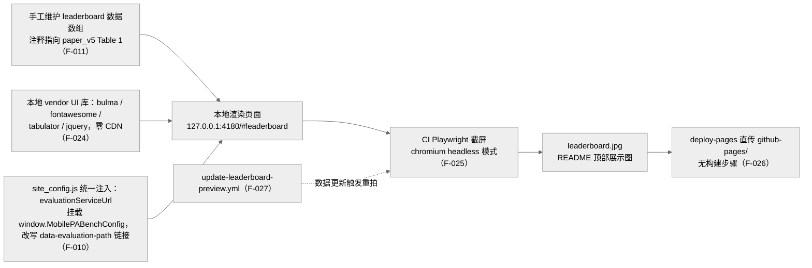

> **提炼自**：Tongyi-MAI mobilepa-bench 项目页工程复盘 —— 展示图即构建产物，数据数组才是 single source of truth

# 零 CDN 纯静态学术站点工程（Zero-CDN Static Site Engineering）

## 模式类型

架构模式（学术项目页 / 前端工程 / 静态站点发布）

## 成熟度

L1 已验证（1 次验证：2026-08-29 Tongyi-MAI mobilepa-bench 源码学习）

## 适用场景

- 学术论文配套项目页/leaderboard：要求"链接永续"——多年后仍能原样打开，无服务器、无运维
- 展示图需随数据更新：leaderboard 等展示图依赖可变数据，人工截屏必然漂移
- 评测/服务入口需运行时可配置：服务地址可能变化（甚至是裸 IP），需要统一注入点

## 问题背景

学术项目页两种最常见的失败做法：

1. **设计稿式截图**：README 顶部的展示图由人工截屏或制图维护，数据更新后图片与数据静默漂移，读者看到的永远是旧账。
2. **CDN 依赖式站点**：UI 库走公网 CDN，链接失效、网络不通或 CDN 版本变更即整站视觉崩坏——学术链接要求永续可达，外部运行时依赖是负资产。

根本矛盾：**学术页面要求长期永续与数据新鲜并存**——永续要求削减依赖，新鲜要求更新自动化；"纯静态 + 本地 vendor + CI 截屏"是同时满足两者的最小工程组合。

## 核心设计

三原则：

1. **展示图即构建产物**：README 顶部的 leaderboard 图不是设计稿，是 CI 中 Playwright 对本地渲染页面自动截屏的结果（F-025）；single source of truth 是手工维护的数据 JS 数组（F-011，注释指向 paper_v5 Table 1），数据更新后图随 workflow 重拍（F-027）。
2. **UI 库全部本地化 vendor 化**：bulma/fontawesome/tabulator/jquery 全部进 vendor，HTML 注释明示 "Local UI dependencies keep the static site independent of external CDNs."（F-024），根目录 .nojekyll 保证静态文件原样发布。
3. **入口配置单点注入 + 部署零构建**：评测入口 URL 由 site_config.js 统一维护（evaluationServiceUrl，F-010），挂载 window.MobilePABenchConfig 后遍历 data-evaluation-path 链接改写 href，地址变更只改一处；deploy-pages workflow 无构建步骤，直接上传 github-pages/ 静态目录（F-026）。

## 实施要点

| 维度 | 做法 | mobilepa-bench 实例 |
|---|---|---|
| 展示图生产 | CI 无头浏览器对本地渲染页面截屏 | capture-leaderboard.mjs 用 chromium.launch({ headless: true }) 打开 http://127.0.0.1:4180/#leaderboard，隐藏 nav 后截 #leaderboard > .inner 存 leaderboard.jpg（F-025） |
| 数据事实源 | 手工维护 JS 数组为唯一事实源 | leaderboard 数据数组注释指向 paper_v5 Table 1（F-011） |
| 图的更新 | 数据更新触发 workflow 重拍 | 专门的 update-leaderboard-preview.yml（F-027） |
| UI 依赖 | 全部本地 vendor 化，零 CDN | vendor 含 bulma/fontawesome/tabulator/jquery，HTML 注释声明独立性，根目录 .nojekyll（F-024） |
| 运行时配置 | 单点配置对象 + 属性选择器批量改写 | site_config.js 的 evaluationServiceUrl 挂载 window.MobilePABenchConfig，遍历 data-evaluation-path 改写 href（F-010） |
| 部署 | 无构建直传静态目录 | deploy-pages workflow 直接上传 github-pages/（F-026） |

## 不适用场景与反目标用户

### 不适用场景

- ❌ **需要服务端渲染或个性化内容**：SSR、登录态、A/B 实验一出现，"纯静态 + 零构建"假设即失效。
- ❌ **数据高频变化且要求实时**：榜单分钟级变动时，"数据数组 + CI 重拍"来不及——实时榜需要 API 支撑而非截屏。
- ❌ **视觉频繁迭代的设计型页面**：营销页/品牌页以视觉稿驱动，"图即构建产物"的纪律反而成为拖累。

### 反目标用户

- 期望"上传截图一键发文"的最省事诉求者：本模式要求维护数据数组与 CI workflow 的纪律，省的是长期漂移，费的是一次性搭建。
- 以视觉效果优先于工程可达性的营销页团队：本模式的优先级是"永续可达"而非"视觉惊艳"。

### 适用边界与前提条件

- 前提一：页面为纯静态内容，交互限于前端脚本，无服务端状态。
- 前提二：展示数据存在明确的、人工审定的唯一事实源（如与论文表格对应的数组）。
- 前提三：接受评测入口使用统一配置注入点，且接受该入口可以是裸 IP——这是保密设计的一部分，不以"域名光鲜"为目标。

## 反模式

### 反模式1："人工截屏当展示图"

README 顶图由人工截屏/制图维护。后果：数据更新后图静默过期，读者看到旧账；整页截图还会混入导航噪音。**正确做法**：CI 无头浏览器截屏，隐藏 nav、只截目标容器（#leaderboard > .inner，F-025），数据更新自动重拍（F-027）。

### 反模式2："UI 库走公网 CDN"

把链接永续性交给第三方。后果：CDN 失效/变更即整站崩坏，学术链接违约。**正确做法**：全部 UI 库 vendor 化本地引用（F-024），零 CDN 依赖。

### 反模式3："服务入口 URL 散落各处硬编码"

评测入口地址写死在多个页面。后果：地址变更需全局搜索替换，漏改即死链。**正确做法**：site_config.js 单点维护 + window 配置对象 + data-evaluation-path 选择器批量改写（F-010）。

### 反模式4："部署链路加构建步骤"

发布前加编译/打包环节。后果：失效面扩大——构建环境、依赖版本都成为发布风险点。**正确做法**：无构建直传静态目录（F-026），仓库内是什么线上就是什么。

### 反模式5："数据数组与论文表格各自维护"

页面数据与论文数据两套账。后果：论文改版后页面数字静默漂移。**正确做法**：数组注释显式指向论文表格（paper_v5 Table 1，F-011），改表先改数组，一源两用。

## 失败案例

### 案例："设计稿先验"与"裸 IP 是疏漏"两个第一印象被源码推翻（mobilepa-bench 源码学习，2026-08-29）

**背景**：初读项目页时按"论文级项目页的展示图应是人工精修的设计资产"预期阅读；同时发现评测按钮指向裸 IP 地址（116.62.42.171）而非域名，直觉判定为工程疏漏，与"论文级严谨"的第一印象相悖。

**发现过程**：回读 capture-leaderboard.mjs（F-025）发现 README 顶部 leaderboard 图由 Playwright 在 CI 中对本地渲染页面自动截屏产生，且存在专门的 update-leaderboard-preview.yml（F-027）——图不是设计稿而是构建产物，数据数组（F-011）更新后图会随 workflow 重拍；再看 site_config.js（F-010），裸 IP 是统一注入的 evaluationServiceUrl 值，单点配置有意为之（洞察将其归为保密设计的一部分），并非散落的硬编码疏漏。两个第一印象均被证据推翻。

**教训**：学术项目页的工程判断必须区分"资产"与"产物"、区分"单点注入"与"硬编码散落"——静态阅读的第一印象（图很精致=人工设计、IP 很粗糙=疏漏）都不可靠，要回读到生成机制（workflow、脚本、配置对象）再定性。

## 早期预警信号

| 预警信号 | 可能问题 | 建议行动 |
|---|---|---|
| README 图片文件更新时间早于数据数组最近修改 | 图与数据漂移（反模式1） | 触发 CI 截屏 workflow 重拍 |
| 页面源码出现公网 CDN 引用的 UI 库 | CDN 依赖回潮（反模式2） | 移入 vendor 本地化 |
| 多个页面各自硬编码服务地址 | 配置散落（反模式3） | 收敛到统一配置对象 + 选择器批量改写 |
| 部署 workflow 出现新的编译环节 | 失效面扩大（反模式4） | 回退为直传静态目录 |
| 页面数据与论文表格数字对不上 | 双源维护漂移（反模式5） | 数组注释指向论文章表，改表先改数组 |
| 截图里混入导航/页脚噪音 | 截屏选择器过宽 | 隐藏 nav 后只截目标容器 |

## 实际案例

mobilepa-bench 项目页（2026-08-29 源码学习）：

| 维度 | 实例 |
|---|---|
| 零 CDN | vendor 含 bulma/fontawesome/tabulator/jquery，HTML 注释声明独立性，根目录 .nojekyll（F-024） |
| 截屏流水线 | chromium headless 打开 127.0.0.1:4180/#leaderboard，隐藏 nav 截 #leaderboard > .inner 存 leaderboard.jpg（F-025） |
| 数据事实源 | 手工维护 leaderboard JS 数组，注释指向 paper_v5 Table 1（F-011） |
| 配置注入 | site_config.js 的 evaluationServiceUrl = "https://116.62.42.171" 挂载 window.MobilePABenchConfig，改写 data-evaluation-path 链接（F-010） |
| 部署与更新 | deploy-pages 无构建直传 github-pages/（F-026）；update-leaderboard-preview.yml 负责重拍（F-027） |

## 迁移验证

- **可迁移场景**：开源库文档首页（特性对比图由 CI 生成）；实验室主页/课程页（成员名单数组 + CI 出图）；任何"链接要求永续 + 图随数据更新"的静态页（发布说明摘要页、快照对比页）。
- **先例关联**：与 [content-hash-build-cache.md](../code-patterns/content-hash-build-cache.md) 同属"产物由源数据派生"思想——后者以内容哈希决定是否重建，本模式以数据数组决定是否重拍；单点配置注入与 zero-config-core-enhancement 的配置收敛是同一纪律在站点维度的投影。

## 与其他模式的关系

| 关系模式 | 关系类型 | 说明 |
|---|---|---|
| [zero-config-core-enhancement.md](./zero-config-core-enhancement.md) | 同源思想 | 零配置核心增强把配置收敛为默认可用；本模式的 site_config.js 注入是"站点版单点配置" |
| [zero-logic-client-desktop-app.md](./zero-logic-client-desktop-app.md) | 零依赖家族 | 桌面端"客户端零业务逻辑"与本模式"站点零外部运行时依赖"同属把失效面从使用侧移除 |
| [zero-update-client-design.md](./zero-update-client-design.md) | 互补 | 零更新客户端解决"软件如何不被打扰地更新"；本模式解决"页面如何永续可达"，共同点是减少使用侧负担 |
| [content-hash-build-cache.md](../code-patterns/content-hash-build-cache.md) | 构建产物思想 | 以内容哈希触发重建与本模式以数据数组触发重拍，同为"展示物是派生产物" |

<!-- changelog -->
- 2026-08-29 | pattern | 初始创建：从 Tongyi-MAI mobilepa-bench 源码学习（洞察5）萃取；证据链 F-010/F-011/F-024/F-025/F-026/F-027
