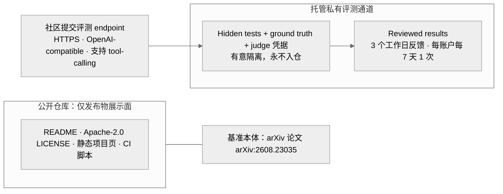

> **提炼自**：Tongyi-MAI mobilepa-bench 仓库形态复盘 —— open repository ≠ open benchmark：仓库只是发布物展示面，评测能力作为托管服务交付

# 零代码仓库的封闭基准发布（Zero-Code Repo for Closed Benchmark）

## 模式类型

架构模式（基准发布形态 / 开放-保密边界 / 托管评测服务）

## 成熟度

L1 已验证（1 次验证：2026-08-29 Tongyi-MAI mobilepa-bench 源码学习，仓库根 Glob 全量核查 + 特性声明核验）

## 适用场景

基准的 ground truth 与 judge 凭据一旦进入公开语料即失效，需要决定发布形态：

- 基准任务与答案具有可泄漏性，防过拟合是生命周期成败的关键
- 团队具备托管私有评测的运维能力（endpoint 接入、排队、审核、反馈）
- 评测协议可标准化为模型无关接口（如 OpenAI-compatible endpoint）

## 问题背景

封闭基准发布最常见的两种失败：

1. **按开源惯例全量开源**：把任务数据、judge prompt、评测 harness 一起入仓——ground truth 迟早混进训练语料，hidden test 退化为 open test，基准一次性报废。
2. **以完全不公开保安全**：连论文、榜单、评测协议都不发布——无公信力也无参与面，基准无人使用。

根本矛盾：**基准的公信力来自公开（论文、榜单），基准的生命周期来自保密（hidden test 不进训练集）**——开放与保密必须在不同层面分别成立。

## 核心设计

三原则：

1. **仓库只是展示面，不是评测载体**：仓库根仅 README / LICENSE / .gitignore / github-pages / .github（F-001），不存在任何任务数据、harness 或实现代码；基准本体以论文形态发布。文档首段即声明该性质，让找 run 脚本的读者在第一屏知难而返。
2. **评测能力即托管服务**：社区唯一参与方式是提交 HTTPS · OpenAI-compatible · 支持 tool-calling 的评测 endpoint（F-008）；ground truth 与 judge 凭据被有意隔离在服务侧（hidden-test integrity，F-009 ②）。
3. **频率与审核是保密设计的组成部分**：3 个工作日反馈 + 每账户每 7 天 1 次的配额抑制对 hidden test 的拟合式提交，Reviewed results 保证上榜结果经审核（F-009）。
4. **保密优先级压倒可复现性传统**：与"开源 harness + Docker 环境 + 本地跑分"路线完全相反，本模式接受"无法下载复现"作为设计代价。

## 实施要点

| 维度 | 做法 | mobilepa-bench 实例 |
|---|---|---|
| 仓库内容 | 只放发布物：说明、许可证、静态页、CI | 仓库根 Glob 全量核查仅 README / LICENSE / .gitignore / github-pages / .github（F-001） |
| 基准本体 | 以论文为唯一公开形态 | arXiv:2608.23035（F-001）；2026-08-24 论文、2026-08-25 仓库开放（F-006） |
| 评测接入 | 标准化 endpoint 提交制 | 要求提交 HTTPS、OpenAI-compatible、支持 tool-calling 的 endpoint（F-008） |
| 保密边界 | ground truth 与 judge 凭据服务侧隔离 | 四条特性之 Confidential by design / Hidden-test integrity（F-009） |
| 反滥用 | 提交配额 + 结果审核 | 3 个工作日反馈 + 每账户每 7 天 1 次；Reviewed results（F-009） |
| 文档口径 | 教程写"如何提交私有评测"而非"如何本地运行" | 概览首段声明封闭性质与 endpoint 要求、频率限制（洞察1 行动） |

## 不适用场景与反目标用户

### 不适用场景

- ❌ **ground truth 无泄漏风险**：任务与答案已是公开知识（如历史题库），保密设计没有收益，直接走开源 harness 路线。
- ❌ **无托管评测运维能力**：接不住 endpoint 接入、排队、审核与反馈 SLA，封闭发布只剩"评测不可用"。
- ❌ **生态型基准需要社区共建**：需要社区贡献任务、harness 与环境的基准，封闭形态与共建目标直接冲突。
- ❌ **目标场景含本地复现/离线研究**：无法下载复现是本模式的固有代价，离线研究诉求下不适用。

### 反目标用户

- 追求"clone 即跑"体验的研究者：本模式不存在 run 脚本可供寻找。
- 以仓库 star/clone/PR 数为传播 KPI 的团队：与展示面形态错位，指标必然失真。

### 适用边界与前提条件

- 前提：存在可持续运维的托管私有评测通道（接入、审核、反馈 SLA）——没有服务侧能力就没有封闭发布资格。
- 前提：评测协议可标准化为模型无关接口，否则"提交 endpoint"无从执行。
- 边界：本模式以放弃"下载即复现"换取防泄漏/防过拟合；保密价值低于可复现收益时，回到开源路线。

## 反模式

### 反模式1："ground truth 与 harness 一起开源"

按"完整可复现"惯例把任务数据、judge prompt、harness 全部入仓。后果：ground truth 进入训练语料，hidden test 退化为 open test，基准一次性报废。**正确做法**：ground truth 与 judge 凭据服务侧有意隔离（F-009 ②），仓库只保留发布物展示面（F-001）。

### 反模式2："封闭基准不说自己封闭"

README 不声明仓库不含评测实现。后果：读者默认存在 run 脚本，在错误路径上检索、提 issue 索要 harness，社区信任受损。**正确做法**：概览首段即声明封闭性质，教程实操章节写"如何提交私有评测"（endpoint 要求与频率限制）（洞察1 行动）。

### 反模式3："评测接口随意化"

接收任意形式的模型访问（邮件传权重、临时 API、截图跑分）。后果：接入成本不可控、结果不可比、judge 无法一致复跑。**正确做法**：统一要求 HTTPS · OpenAI-compatible · 支持 tool-calling 的 endpoint（F-008）。

### 反模式4："无限制提交"

不设频率与审核，随到随测随上榜。后果：高频提交对 hidden test 拟合，榜单被刷、保密边界失守。**正确做法**：3 个工作日反馈 + 每账户每 7 天 1 次配额 + Reviewed results 审核（F-009）。

### 反模式5："用仓库活跃度运营基准"

追 PR / star / clone 数当 KPI。后果：与展示面形态错位——仓库本无代码可贡献，指标失真且误导运营方向。**正确做法**：以论文发布与榜单提交量衡量基准活跃度（时间线上论文先行、仓库随后开放，F-006）。

## 失败案例

### 案例：按"开源基准必有 harness"先验检索复现路径未果（mobilepa-bench 源码学习，2026-08-29）

**背景**：学习 MobilePA-Bench 时沿用"开源基准 = clone + 本地跑分"的惯例预期（对照 MobileWorld 的开源 harness + Docker 环境路线），进入仓库后寻找评测 harness、任务数据与 run 脚本。

**发现过程**：对仓库根做 Glob 全量核查，仅见 README / LICENSE / .gitignore / github-pages / .github，不存在任何基准任务数据、评测 harness、模型或智能体实现代码目录（F-001）；页面特性声明确认 Confidential by design 与 hidden-test integrity——ground truth 与 judge 凭据被有意隔离（F-009 ②），社区唯一参与方式是提交 HTTPS · OpenAI-compatible · 支持 tool-calling 的评测 endpoint（F-008），反馈节奏为 3 个工作日 + 每账户每 7 天 1 次（F-009）。时间线佐证形态意图：2026-08-24 论文发布、2026-08-25 仓库开放（F-006）——仓库开放的只是发布物展示面。

**教训**："open repository" 不等于 "open benchmark"——保密设计（隔离 ground truth 与 judge 凭据）压倒可复现性传统；概览文档必须首段声明该性质、教程实操章节必须写"如何提交私有评测"，否则读者会持续在错误路径上寻找 run 脚本。

## 早期预警信号

| 预警信号 | 可能问题 | 建议行动 |
|---|---|---|
| README 找不到 run/eval 脚本而用户反复询问 | 封闭性质未前置声明 | 首段声明"无法本地复现"并给出 endpoint 提交指引 |
| 评测 endpoint 接口文档含糊 | 接入成本上升、结果不可比 | 明确 HTTPS · OpenAI-compatible · 支持 tool-calling 三项要求 |
| 提交频率无限制 | 高频提交拟合 hidden test | 落实每账户每 7 天 1 次配额 |
| 榜单自动收录未审核结果 | 恶意/错误结果污染榜单 | 启用 Reviewed results 人工审核环节 |
| judge 凭据或 ground truth 出现在仓库历史/CI 日志 | 保密边界失守 | 全量隔离，仓库仅保留 README/LICENSE/静态页/CI |
| 以仓库 PR/star 衡量基准活跃度 | 形态误判 | 改以论文引用与榜单提交量为活跃度指标 |

## 实际案例

Tongyi-MAI MobilePA-Bench（2026-08-29 源码学习）：

| 维度 | 实况 |
|---|---|
| 仓库根内容 | Glob 全量核查仅 README / LICENSE / .gitignore / github-pages / .github（F-001） |
| 代码与数据 | 不存在任何基准任务数据、评测 harness、模型或智能体实现代码目录（F-001） |
| 基准本体 | arXiv:2608.23035 论文；2026-08-24 论文、2026-08-25 仓库开放（F-006） |
| 评测通道 | 提交 HTTPS · OpenAI-compatible · 支持 tool-calling 的 endpoint（F-008） |
| 保密特性 | Confidential by design / Hidden-test integrity / Reviewed results / 3 个工作日 + 每账户每 7 天 1 次（F-009） |

## 迁移验证

- **可迁移场景**：SaaS 产品的"开源 SDK 仓库 + 托管私有服务"形态；CTF/安全评测平台（题目与 flag 隔离、提交制判分）；认证类考试系统（题库保密、考点受理、定期出分）。
- **先例关联**：与 [dual-interface-repository.md](./dual-interface-repository.md) 同源——"仓库接口面与数据面分离"在本模式推向极端：数据面整体外置为托管服务；与 [scenario-based-security-matrix.md](./scenario-based-security-matrix.md) 互补——保密边界按资产场景（ground truth / judge 凭据 / 榜单结果）划分而非一刀切开源。

## 与其他模式的关系

| 关系模式 | 关系类型 | 说明 |
|---|---|---|
| [dual-interface-repository.md](./dual-interface-repository.md) | 同源极端化 | 该模式在仓库内分离"接口面与数据面"；本模式把数据面整体外置为托管私有评测通道，仓库只剩接口展示面 |
| [provenance-driven-trust.md](./provenance-driven-trust.md) | 互补 | 封闭评测的公信力不靠开放复现，靠结果溯源与审核（Reviewed results）建立信任链 |
| [trust-first-metadata.md](./trust-first-metadata.md) | 互补 | 仓库元数据（LICENSE、论文链接、特性声明）先行建立信任，弥补"无代码可查"的信任缺口 |
| [scenario-based-security-matrix.md](./scenario-based-security-matrix.md) | 场景区分 | 保密设计按资产场景矩阵化（任务/答案/凭据/结果各有边界），而非"全开"或"全闭"的一刀切 |

<!-- changelog -->
- 2026-08-29 | pattern | 初始创建：从 Tongyi-MAI mobilepa-bench 源码学习（洞察1）萃取；证据链 F-001/F-006/F-008/F-009，仓库根 Glob 全量核查通过